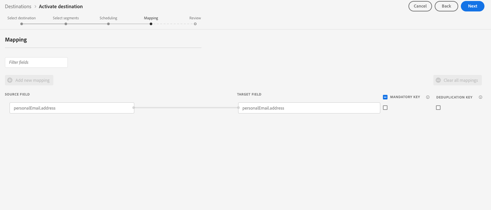

# Configuratie partnerschema

Experience Platform gebruikt schema&#39;s om de gegevensstructuur op een consistente en herbruikbare manier te beschrijven. Wanneer gegevens in Experience Platform worden opgenomen, worden ze gestructureerd volgens een XDM-schema. Voor meer informatie over het model van de schemacompositie, met inbegrip van ontwerpprincipes en beste praktijken, zie de [ grondbeginselen van schemacompositie ](../../../../xdm/schema/composition.md).

Wanneer het bouwen van een bestemming met Destination SDK, kunt u uw eigen partnerschema bepalen dat door uw bestemmingsplatform moet worden gebruikt. Hiermee kunnen gebruikers profielkenmerken van Experience Platform toewijzen aan specifieke velden die uw doelplatform herkent, allemaal in de interface van Experience Platform.

Wanneer het vormen van het partnerschema voor uw bestemming, kunt u de gebiedstoewijzing verfijnen die door uw bestemmingsplatform wordt gesteund, zoals:

* Gebruikers mogen een `phoneNumber` XDM-kenmerk toewijzen aan een `phone` -kenmerk dat door uw doelplatform wordt ondersteund.
* Creeer dynamische partnerschema&#39;s die Experience Platform dynamisch kan roepen om een lijst van alle gesteunde attributen binnen uw bestemming terug te winnen.
* Geef verplichte veldtoewijzingen op die uw doelplatform nodig heeft.

Om te begrijpen waar deze component in een integratie past die met Destination SDK wordt gecreeerd, zie het diagram in de [ configuratieopties ](../configuration-options.md) documentatie of zie de gids op hoe te [ Destination SDK gebruiken om een op dossier-gebaseerde bestemming ](../../guides/configure-file-based-destination-instructions.md#create-server-file-configuration) te vormen.

U kunt uw schemamontages via het `/authoring/destinations` eindpunt vormen. Zie de volgende API verwijzingspagina&#39;s voor gedetailleerde API vraagvoorbeelden waar u de componenten kunt vormen die in deze pagina worden getoond.

* [Een doelconfiguratie maken](../../authoring-api/destination-configuration/create-destination-configuration.md)
* [Een doelconfiguratie bijwerken](../../authoring-api/destination-configuration/update-destination-configuration.md)

Dit artikel beschrijft alle gesteunde opties van de schemaconfiguratie die u voor uw bestemming kunt gebruiken, en toont welke klanten in Experience Platform UI zullen zien.

>[!IMPORTANT]
>
>Alle parameternamen en waarden die door Destination SDK worden gesteund zijn **gevoelig geval**. Om fouten in hoofdlettergevoeligheid te voorkomen, gebruikt u de namen en waarden van parameters exact zoals in de documentatie wordt getoond.

## Ondersteunde integratietypen {#supported-integration-types}

Raadpleeg de onderstaande tabel voor meer informatie over de integratietypen die de op deze pagina beschreven functionaliteit ondersteunen.

| Type integratie | Ondersteunt functionaliteit |
|---|---|
| Integraties in realtime (streaming) | Ja |
| Op bestanden gebaseerde (batch) integratie | Ja |

## Ondersteunde schemaconfiguratie {#supported-schema-types}

Destination SDK ondersteunt meerdere schemeconfiguraties:

* Statische schema&#39;s worden gedefinieerd via de array `profileFields` in de sectie `schemaConfig` . In een statisch schema definieert u elk doelkenmerk dat in de Experience Platform-gebruikersinterface in de `profileFields` -array moet worden weergegeven. Als u uw schema moet bijwerken, moet u [ de bestemmingsconfiguratie ](../../authoring-api/destination-configuration/update-destination-configuration.md) bijwerken.
* De dynamische schema&#39;s gebruiken een extra type van bestemmingsserver, genoemd a [ dynamische schemaserver ](../../authoring-api/destination-server/create-destination-server.md#dynamic-schema-servers), om de gesteunde doelattributen dynamisch terug te winnen en schema&#39;s te produceren die op uw eigen API worden gebaseerd. Dynamische schema&#39;s maken geen gebruik van de array `profileFields` . Als u uw schema moet bijwerken, is er geen behoefte om [ de bestemmingsconfiguratie ](../../authoring-api/destination-configuration/update-destination-configuration.md) bij te werken. In plaats daarvan haalt de dynamische schemaserver het bijgewerkte schema van uw API terug.
* Binnen de schemaconfiguratie, hebt u de optie om vereiste (of vooraf bepaalde) afbeeldingen toe te voegen. Dit zijn toewijzingen die gebruikers kunnen weergeven in de gebruikersinterface van Experience Platform, maar ze kunnen deze niet wijzigen wanneer ze een verbinding met uw doel instellen. U kunt bijvoorbeeld afdwingen dat het veld E-mailadres altijd naar de bestemming wordt verzonden.

De sectie `schemaConfig` gebruikt veelvoudige configuratieparameters, afhankelijk van het type van schema dat u nodig hebt, zoals aangetoond in de hieronder secties.

## Een statisch schema maken {#attributes-schema}

Als u een statisch schema met profielkenmerken wilt maken, definieert u de doelkenmerken in de array `profileFields` , zoals hieronder wordt weergegeven.

```json
"schemaConfig":{
      "profileFields":[
           {
              "name":"phoneNo",
              "title":"phoneNo",
              "description":"This is a fixed attribute on your destination side that customers can map profile attributes to. For example, the mobilePhone.number value in Experience Platform could be phoneNo on your side.",
              "type":"string",
              "isRequired":false,
              "readOnly":false,
              "hidden":false
           },
                      {
              "name":"firstName",
              "title":"firstName",
              "description":"This is a fixed attribute on your destination side that customers can map profile attributes to. For example, the person.name.firstName value in Experience Platform could be firstName on your side.",
              "type":"string",
              "isRequired":false,
              "readOnly":false,
              "hidden":false
           },
                      {
              "name":"lastName",
              "title":"lastName",
              "description":"This is a fixed attribute on your destination side that customers can map profile attributes to. For example, the person.name.lastName value in Experience Platform could be phoneNo on your side.",
              "type":"string",
              "isRequired":false,
              "readOnly":false,
              "hidden":false
           }
        ],
      "useCustomerSchemaForAttributeMapping":false,
      "profileRequired":true,
      "segmentRequired":true,
      "identityRequired":true,
      "segmentNamespaceAllowList": ["someNamespace"],
      "segmentNamespaceDenyList": ["someOtherNamespace"]

}
```

| Parameter | Type | Vereist/optioneel | Beschrijving |
|---------|----------|------|---|
| `profileFields` | Array | Optioneel | Definieert de array met doelkenmerken die door het doelplatform worden geaccepteerd en waaraan klanten hun profielkenmerken kunnen toewijzen. Wanneer u een array `profileFields` gebruikt, kunt u de parameter `useCustomerSchemaForAttributeMapping` volledig weglaten. |
| `useCustomerSchemaForAttributeMapping` | Boolean | Optioneel | Schakelt de toewijzing van kenmerken van het klantschema naar de kenmerken die u in de array `profileFields` definieert in of uit. <ul><li>Indien ingesteld op `true` , zien gebruikers alleen de bronkolom in het toewijzingsveld. `profileFields` is in dit geval niet van toepassing.</li><li>Als de waarde `false` is, kunnen gebruikers bronkenmerken vanuit hun schema toewijzen aan de kenmerken die u in de `profileFields` -array hebt gedefinieerd.</li></ul> De standaardwaarde is `false` . |
| `profileRequired` | Boolean | Optioneel | Gebruik `true` als gebruikers in staat moeten zijn om profielkenmerken van Experience Platform toe te wijzen aan aangepaste kenmerken op uw doelplatform. |
| `segmentRequired` | Boolean | Vereist | Deze parameter wordt vereist door Destination SDK en moet altijd worden ingesteld op `true` . |
| `identityRequired` | Boolean | Vereist | Reeks aan `true` als de gebruikers [ identiteitstypes ](identity-namespace-configuration.md) van Experience Platform aan de attributen zouden moeten kunnen in kaart brengen u in de `profileFields` serie bepaalde. |
| `segmentNamespaceAllowList` | Array | Optioneel | Staat gebruikers toe om slechts publiek van de publieksnamespaces in kaart te brengen die in de serie aan de bestemming worden bepaald. <br><br> Het gebruik van deze parameter wordt in de meeste gevallen afgeraden. Gebruik in plaats daarvan `"segmentNamespaceDenyList":[]` om alle soorten publiek naar uw doel te laten exporteren. <br><br> als zowel `segmentNamespaceAllowList` als `segmentNamespaceDenyList` van uw configuratie ontbreken, zullen de gebruikers slechts publiek uit de [ Dienst van de Segmentatie ](../../../../segmentation/home.md) kunnen uitvoeren. <br><br>`segmentNamespaceAllowList` en `segmentNamespaceDenyList` sluiten elkaar uit. |
| `segmentNamespaceDenyList` | Array | Optioneel | Beperkt gebruikers van het in kaart brengen van publiek van de publiek namespaces die in de serie aan de bestemming worden bepaald. <br><br> Adobe adviseert om de uitvoer van alle publiek, ongeacht de oorsprong, toe te staan door `"segmentNamespaceDenyList":[]` te plaatsen. <br><br> als zowel `segmentNamespaceAllowed` als `segmentNamespaceDenyList` van uw configuratie ontbreken, zullen de gebruikers slechts publiek uit de [ Dienst van de Segmentatie ](../../../../segmentation/home.md) kunnen uitvoeren. <br><br>`segmentNamespaceAllowList` en `segmentNamespaceDenyList` sluiten elkaar uit. |

{style="table-layout:auto"}

De resulterende ervaring met de gebruikersinterface wordt weergegeven in de onderstaande afbeeldingen.

Wanneer gebruikers de doeltoewijzing selecteren, kunnen ze de velden zien die in de array `profileFields` zijn gedefinieerd.


Na het selecteren van de attributen, kunnen zij hen in de kolom van het doelgebied zien.


## Een dynamisch schema maken {#dynamic-schema-configuration}

Destination SDK steunt de verwezenlijking van dynamische partnerschema&#39;s. In tegenstelling tot een statisch schema gebruikt een dynamisch schema geen `profileFields` -array. In plaats daarvan gebruiken dynamische schema&#39;s een dynamische schemaserver die met uw eigen API verbindt van waar het de schemaconfiguratie terugwint.

>[!IMPORTANT]
>
>Alvorens u een dynamisch schema creeert, moet u [ tot een dynamische schemaserver ](../../authoring-api/destination-server/create-destination-server.md#dynamic-schema-servers) leiden.

In een dynamische schemaconfiguratie, wordt de `profileFields` serie vervangen door de `dynamicSchemaConfig` sectie, zoals hieronder getoond.

```json
"schemaConfig":{
   "dynamicSchemaConfig":{
      "dynamicEnum": {
         "authenticationRule":"CUSTOMER_AUTHENTICATION",
         "destinationServerId":"DYNAMIC_SCHEMA_SERVER_ID",
         "value": "Schema Name",
         "responseFormat": "SCHEMA"
      }
   },
   "profileRequired":true,
   "segmentRequired":true,
   "identityRequired":true
}
```

| Parameter | Type | Vereist/optioneel | Beschrijving |
|---------|----------|------|---|
| `dynamicEnum.authenticationRule` | String | Vereist | Geeft aan hoe [!DNL Experience Platform] -klanten verbinding maken met uw doel. Accepteerde waarden zijn `CUSTOMER_AUTHENTICATION` , `PLATFORM_AUTHENTICATION` , `NONE` . <br> <ul><li>Gebruik `CUSTOMER_AUTHENTICATION` als de klanten van Experience Platform zich in uw systeem via om het even welke beschreven authentificatiemethodes [ hier ](customer-authentication.md) registreren. </li><li> Gebruik `PLATFORM_AUTHENTICATION` als er een wereldwijd verificatiesysteem is tussen Adobe en uw bestemming en de klant van [!DNL Experience Platform] geen verificatiereferenties hoeft op te geven om verbinding te maken met uw bestemming. In dit geval, moet u [ een geloofsbrieven tot voorwerp ](../../credentials-api/create-credential-configuration.md) leiden gebruikend geloofsbrieven API. </li><li>Gebruik `NONE` als er geen verificatie vereist is om gegevens naar het doelplatform te verzenden. </li></ul> |
| `dynamicEnum.destinationServerId` | String | Vereist | De `instanceId` van uw dynamische schemaserver. Deze bestemmingsserver omvat het API eindpunt dat Experience Platform zal roepen om het dynamische schema terug te winnen. |
| `dynamicEnum.value` | String | Vereist | De naam van het dynamische schema, zoals die in de dynamische configuratie van de schemaserver wordt bepaald. |
| `dynamicEnum.responseFormat` | String | Vereist | Altijd ingesteld op `SCHEMA` bij het definiëren van een dynamisch schema. |
| `profileRequired` | Boolean | Optioneel | Gebruik `true` als gebruikers in staat moeten zijn om profielkenmerken van Experience Platform toe te wijzen aan aangepaste kenmerken op uw doelplatform. |
| `segmentRequired` | Boolean | Vereist | Deze parameter wordt vereist door Destination SDK en moet altijd worden ingesteld op `true` . |
| `identityRequired` | Boolean | Vereist | Reeks aan `true` als de gebruikers [ identiteitstypes ](identity-namespace-configuration.md) van Experience Platform aan de attributen zouden moeten kunnen in kaart brengen u in de `profileFields` serie bepaalde. |

{style="table-layout:auto"}

## Vereiste toewijzingen {#required-mappings}

Binnen de schemaconfiguratie, naast uw statisch of dynamisch schema, hebt u de optie om vereiste (of vooraf bepaalde) afbeeldingen toe te voegen. Dit zijn toewijzingen die gebruikers kunnen weergeven in de gebruikersinterface van Experience Platform, maar ze kunnen deze niet wijzigen wanneer ze een verbinding met uw doel instellen.

U kunt bijvoorbeeld afdwingen dat het veld E-mailadres altijd naar de bestemming wordt verzonden.

>[!NOTE]
>
>De volgende combinaties van vereiste toewijzingen worden momenteel ondersteund:
>* U kunt een vereist brongebied en een vereist bestemmingsgebied vormen. In dit geval kunnen gebruikers geen van de twee velden bewerken of selecteren en alleen de selectie weergeven.
>* U kunt een vereist bestemmingsgebied slechts vormen. In dit geval kunnen gebruikers een bronveld selecteren om toe te wijzen aan het doel.
>
> Het vormen van een vereist brongebied slechts wordt momenteel *niet* gesteund.

Zie onder twee voorbeelden van een schemaconfiguratie met vereiste afbeeldingen en wat deze in de afbeeldingsstap van [ kijken activeert gegevens aan batch bestemmingen werkschema ](../../../ui/activate-batch-profile-destinations.md).


>[!BEGINTABS]

>[!TAB  Vereiste bron en bestemmingstoewijzingen ]

In het onderstaande voorbeeld ziet u zowel de vereiste bron- als doeltoewijzingen. Wanneer zowel bron- als doelvelden als vereiste toewijzingen zijn opgegeven, kunnen gebruikers geen van de twee velden selecteren of bewerken en alleen de vooraf gedefinieerde selectie weergeven.

```json
"schemaConfig": {
    "requiredMappingsOnly": true,
    "requiredMappings": [
      {
        "sourceType": "text/x.schema-path",
        "source": "personalEmail.address",
        "destination": "personalEmail.address"
      }
    ] 
}
```

| Parameter | Type | Vereist/optioneel | Beschrijving |
|---|---|---|---|
| `requiredMappingsOnly` | Boolean | Optioneel | Wanneer deze waarde is ingesteld op true, kunnen gebruikers geen andere kenmerken en identiteiten in de activeringsstroom toewijzen, behalve de vereiste toewijzingen die u in de array `requiredMappings` definieert. |
| `requiredMappings.sourceType` | String | Vereist | Geeft het type van het veld `source` aan. Ondersteunde waarden: <ul><li>`text/x.schema-path`: gebruik deze waarde wanneer het veld `source` een profielkenmerk is van een XDM-schema.</li><li>`text/x.aep-xl`: gebruik deze waarde wanneer het `source` -veld wordt gedefinieerd door een reguliere expressie. Voorbeeld: `iif(segmentMembership.ups.aep_seg_id.status==\"exited\", \"1\", \"0\")`</li><li>`text/plain`: gebruik deze waarde wanneer het `source` -veld wordt gedefinieerd door een macrosjabloon. Momenteel is de enige ondersteunde macrosjabloon `metadata.segment.alias` .</li></ul> |
| `requiredMappings.source` | String | Vereist | Hiermee wordt de waarde van het bronveld aangegeven. Ondersteunde waardetypen <ul><li>XDM-profielkenmerken. Voorbeeld: `personalEmail.address` . Wanneer uw bronkenmerk een XDM-profielkenmerk is, stelt u de parameter `sourceType` in op `text/x.schema-path` .</li><li>Reguliere expressies. Voorbeeld: `iif(segmentMembership.ups.aep_seg_id.status==\"exited\", \"1\", \"0\")` . Wanneer uw bronkenmerk een reguliere expressie is, stelt u de parameter `sourceType` in op `text/x.aep-xl` .</li><li>Macrosjablonen. Voorbeeld:`metadata.segment.alias`. Wanneer uw bronkenmerk een macrosjabloon is, stelt u de parameter `sourceType` in op `text/plain` . Momenteel is de enige ondersteunde macrosjabloon `metadata.segment.alias` .</li></ul> |
| `requiredMappings.destination` | String | Vereist | Hiermee wordt de waarde van het doelveld aangegeven. Wanneer zowel bron- als doelvelden als vereiste toewijzingen zijn opgegeven, kunnen gebruikers geen van de twee velden selecteren of bewerken en alleen de selectie weergeven. |

{style="table-layout:auto"}

Hierdoor worden zowel de secties **[!UICONTROL Source field]** als **[!UICONTROL Target field]** in de gebruikersinterface van Experience Platform grijs weergegeven.



>[!TAB  Vereiste bestemmingstoewijzing ]

In het onderstaande voorbeeld ziet u een vereiste doeltoewijzing. Als alleen het doelveld naar wens is opgegeven, kunnen gebruikers selecteren welk bronveld ernaar moet worden toegewezen.

```json
"schemaConfig": {
    "requiredMappingsOnly": true,
    "requiredMappings": [
      {
        "destination": "identityMap.ExamplePartner_ID",
        "mandatoryRequired": true,
        "primaryKeyRequired": true
      }
    ] 
}
```

| Parameter | Type | Vereist/optioneel | Beschrijving |
|---|---|---|---|
| `requiredMappingsOnly` | Boolean | Optioneel | Wanneer deze waarde is ingesteld op true, kunnen gebruikers geen andere kenmerken en identiteiten in de activeringsstroom toewijzen, behalve de vereiste toewijzingen die u in de array `requiredMappings` definieert. |
| `requiredMappings.destination` | String | Vereist | Hiermee wordt de waarde van het doelveld aangegeven. Wanneer alleen het doelveld wordt opgegeven, kunnen gebruikers een bronveld selecteren om toe te wijzen aan het doel. |
| `mandatoryRequired` | Boolean | Optioneel | Wijst erop of de afbeelding als a [ verplichte attributen ](../../../ui/activate-batch-profile-destinations.md#mandatory-attributes) zou moeten worden gemerkt. |
| `primaryKeyRequired` | Boolean | Optioneel | Wijst erop of de afbeelding als sleutel van a [ deduplicatie ](../../../ui/activate-batch-profile-destinations.md#deduplication-keys) zou moeten worden gemerkt. |

{style="table-layout:auto"}

Hierdoor wordt de sectie **[!UICONTROL Target field]** in de gebruikersinterface van Experience Platform grijs weergegeven, terwijl de sectie **[!UICONTROL Source field]** actief is en gebruikers ermee kunnen werken. De opties **[!UICONTROL Mandatory key]** en **[!UICONTROL Deduplication key]** zijn actief en gebruikers kunnen deze niet wijzigen.


>[!ENDTABS]

## Ondersteuning voor extern publiek configureren {#external-audiences}

Om uw bestemming te vormen om de activering van [ extern geproduceerd publiek ](../../../../segmentation/ui/audience-portal.md#import-audience) te steunen, omvat het hieronder fragment in de `schemaConfig` sectie.

```json
"schemaConfig": {
  "segmentNamespaceDenyList": [],
  ...
}
```

Zie de bezitsbeschrijvingen in de [ lijst ](#attributes-schema) verder hierboven op deze pagina om meer over de `segmentNamespaceDenyList` functionaliteit te leren.

## Volgende stappen {#next-steps}

Na het lezen van dit artikel hebt u beter inzicht in welke schematypen door Destination SDK worden ondersteund en hoe u uw schema kunt configureren.

Raadpleeg de volgende artikelen voor meer informatie over de andere doelcomponenten:

* [Verificatie door klant](customer-authentication.md)
* [OAuth2-vergunning](oauth2-authorization.md)
* [UI-kenmerken](ui-attributes.md)
* [Gegevensvelden van de klant](customer-data-fields.md)
* [Configuratie naamruimte voor identiteit](identity-namespace-configuration.md)
* [Ondersteunde toewijzingsconfiguraties](supported-mapping-configurations.md)
* [Levering bestemming](destination-delivery.md)
* [Configuratie van metagegevens voor publiek](audience-metadata-configuration.md)
* [Samenvoegingsbeleid](aggregation-policy.md)
* [Batchconfiguratie](batch-configuration.md)
* [Historische profielkwalificaties](historical-profile-qualifications.md)
