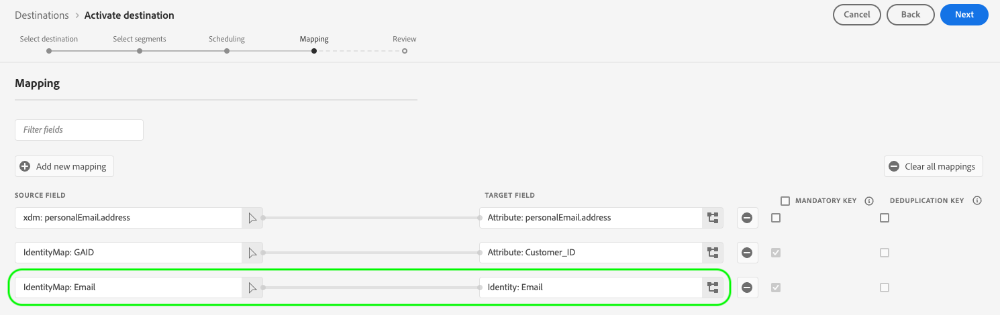

# Ondersteunde toewijzingsconfiguraties

De bestemmingen die met Destination SDK worden gebouwd steunen specifieke identiteit namespace en attributentoewijzingsconfiguraties, die op het bestemmingstype worden gebaseerd.

In dit artikel worden alle ondersteunde toewijzingsconfiguraties beschreven die u kunt gebruiken bij het configureren van uw bestemming.

>[!WARNING]
>
>Elke toewijzingsconfiguratie die niet in dit artikel wordt beschreven, wordt niet ondersteund door Destination SDK.

Wanneer het bouwen van uw bestemming, vorm uw schema en identiteitsnamespaces volgens één van de toewijzingsconfiguraties die in deze pagina worden beschreven.

>[!IMPORTANT]
>
>Alle parameternamen en waarden die door Destination SDK worden gesteund zijn **gevoelig geval**. Om fouten in hoofdlettergevoeligheid te voorkomen, gebruikt u de namen en waarden van parameters exact zoals in de documentatie wordt getoond.

## Ondersteunde toewijzingen voor streamingdoelen {#streaming-mappings}

Real-time (streaming) doelen die met Destination SDK zijn gebouwd, ondersteunen de toewijzingsconfiguraties die in de onderstaande tabel worden beschreven.

| Source-veld | Doelveld |
| --- | --- |
| XDM, kenmerk | Aangepast, kenmerk |
| Naamruimte identiteit | Naamruimte identiteit |

In het onderstaande configuratievoorbeeld kunnen klanten beide toewijzingen in de bovenstaande tabel gebruiken.

```json
"schemaConfig":{
   "profileRequired":true,
   "segmentRequired":true,
   "identityRequired":true
},
"identityNamespaces":{
   "Customer_contact":{
      "acceptsAttributes":false,
      "acceptsCustomNamespaces":true,
      "acceptedGlobalNamespaces":{
         "Email":{
            
         },
         "Phone":{
            
         }
      }
   }
},
```

### XDM-kenmerken toewijzen aan aangepaste kenmerken {#streaming-xdm-to-custom}

Gebruikers kunnen kenmerken van hun XDM-bronprofiel toewijzen aan aangepaste kenmerken aan de zijde van uw bestemming.

Gebruikers moeten de naam van het aangepaste doelkenmerk handmatig invoeren wanneer zij de doelveldtoewijzing selecteren.

{het schermschot van 0} Experience Platform UI die aangepaste attributenselectie toont.

De resulterende ervaring met de gebruikersinterface wordt weergegeven in de onderstaande afbeelding.

{het schermschot van 0} Experience Platform UI die xdm- kenmerkafbeelding aan douanekenmerken voor het stromen bestemmingen toont.

### Identiteitsnaamruimten toewijzen aan naamruimten van partners {#streaming-identity-to-identity}

Gebruikers kunnen aangepaste of algemene naamruimten van Experience Platform toewijzen aan door u gedefinieerde naamruimten.

De resulterende ervaring met de gebruikersinterface wordt weergegeven in de onderstaande afbeelding.

{het schermschot van 0} Experience Platform UI die identiteitstoewijzing aan identiteit voor het stromen bestemmingen toont.

## Ondersteunde toewijzingen voor op bestanden gebaseerde doelen {#batch-mappings}

Bestandsgebaseerde doelen die zijn gebouwd met Destination SDK ondersteunen de toewijzingsconfiguraties die worden beschreven in de onderstaande tabel. Zie de volgende secties voor gedetailleerde toewijzingsvoorbeelden.

| Source-veld | Doelveld |
| --- | --- |
| XDM, kenmerk | Kenmerk/aangepast kenmerk |
| Naamruimte identiteit | Kenmerk/aangepast kenmerk |
| Naamruimte identiteit | Naamruimte identiteit |

In het onderstaande configuratievoorbeeld kunnen klanten alle toewijzingen uit de bovenstaande tabel gebruiken.

```json
"schemaConfig":{
   "profileRequired":true,
   "segmentRequired":true,
   "identityRequired":true
},
"identityNamespaces":{
   "Customer_contact":{
      "acceptsAttributes":false,
      "acceptsCustomNamespaces":true,
      "acceptedGlobalNamespaces":{
         "Email":{
         },
         "Phone":{
         }
      }
   }
},
```

### XDM-kenmerken toewijzen aan aangepaste kenmerken {#batch-xdm-to-custom}

Gebruikers kunnen kenmerken van hun XDM-bronprofiel toewijzen aan aangepaste kenmerken aan de zijde van uw bestemming.

Voor op een bestand gebaseerde doelen wordt het doelveld automatisch gevuld met een standaardkenmerk met dezelfde naam als het bronveld.

De resulterende ervaring met de gebruikersinterface wordt weergegeven in de onderstaande afbeelding.


Gebruikers kunnen de standaardnaam op hun plaats laten of een aangepaste kenmerknaam invoeren in het selectiescherm van het doelveld.

{het schermschot van 0} Experience Platform UI die de selectie van het douanedoelattribuut voor op dossier-gebaseerde bestemmingen toont.

### Naamruimten toewijzen aan aangepaste kenmerken {#batch-identity-to-custom}

Gebruikers kunnen aangepaste of algemene naamruimten van Experience Platform toewijzen aan aangepaste kenmerken aan de zijde van uw bestemming.

Wanneer u een naamruimte van een identiteit als een bronveld selecteert, wordt het doelveld automatisch gevuld met een equivalente naamruimte. Als u het doelveld wilt vervangen door een aangepast kenmerk, moeten gebruikers een aangepaste kenmerknaam invoeren in het selectiescherm van het doelveld.

{het schermschot van 0} Experience Platform UI die de selectie van het douanedoelattribuut voor op dossier-gebaseerde bestemmingen toont.

De resulterende ervaring met de gebruikersinterface wordt weergegeven in de onderstaande afbeelding.

{het schermschot van 0} Experience Platform UI die identiteitstoewijzing aan douanekenmerken voor op dossier-gebaseerde bestemmingen toont.

### Identiteitsnaamruimten toewijzen aan naamruimten van partners {#batch-identity-to-identity}

Gebruikers kunnen aangepaste of algemene naamruimten van Experience Platform toewijzen aan equivalente naamruimten.

Wanneer u een naamruimte van een identiteit als een bronveld selecteert, wordt het doelveld automatisch gevuld met een equivalente naamruimte.

De resulterende ervaring met de gebruikersinterface wordt weergegeven in de onderstaande afbeelding.




## Volgende stappen {#next-steps}

Na het lezen van dit artikel hebt u beter inzicht in welke toewijzingen worden ondersteund door bestemmingen die met Destination SDK zijn gebouwd.

Raadpleeg de volgende artikelen voor meer informatie over de andere doelcomponenten:

* [Verificatie door klant](customer-authentication.md)
* [OAuth2-vergunning](oauth2-authorization.md)
* [Gegevensvelden van de klant](customer-data-fields.md)
* [UI-kenmerken](ui-attributes.md)
* [Schema-configuratie](schema-configuration.md)
* [Configuratie naamruimte voor identiteit](identity-namespace-configuration.md)
* [Levering bestemming](destination-delivery.md)
* [Configuratie van metagegevens voor publiek](audience-metadata-configuration.md)
* [Samenvoegingsbeleid](aggregation-policy.md)
* [Batchconfiguratie](batch-configuration.md)
* [Historische profielkwalificaties](historical-profile-qualifications.md)
