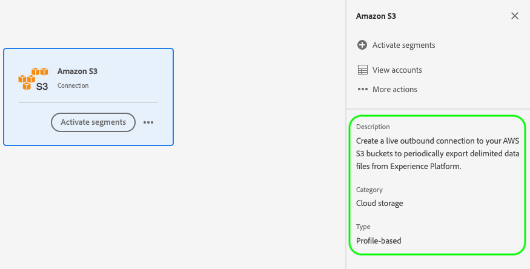
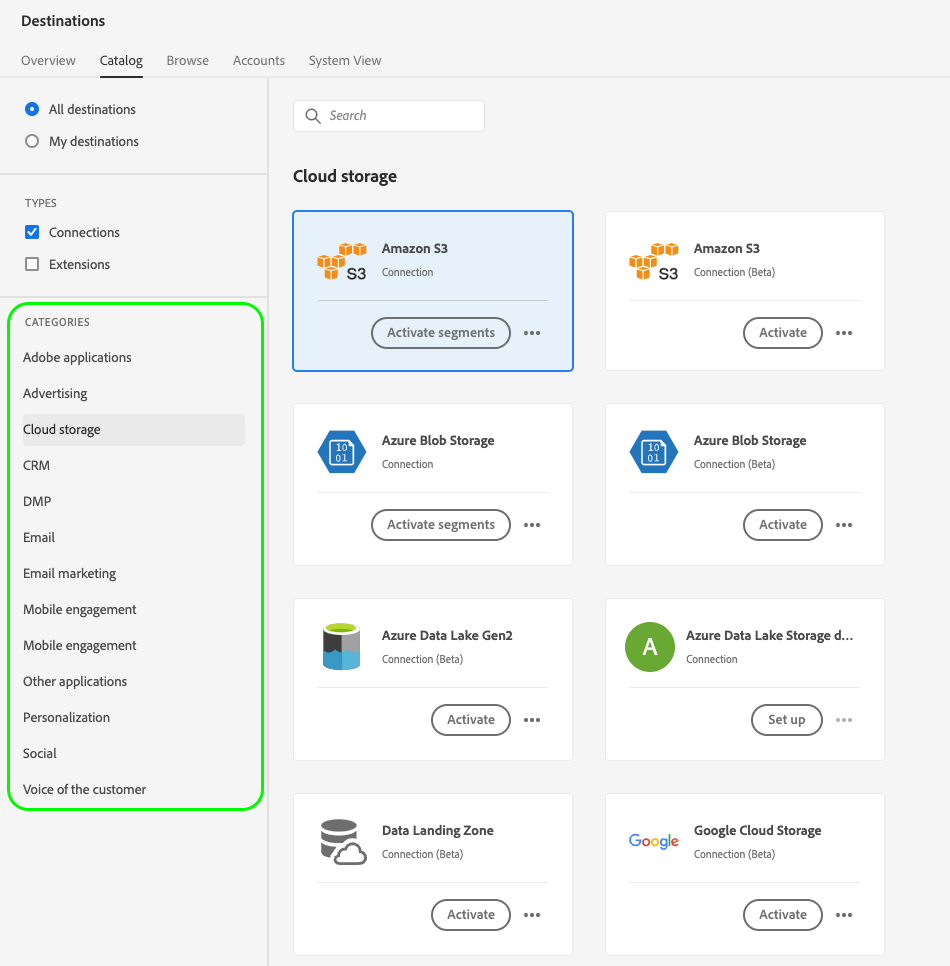

# UI-kenmerken

UI-kenmerken definiëren de visuele elementen die Adobe in de gebruikersinterface van Adobe Experience Platform voor uw doelkaart moet weergeven, zoals een logo, een koppeling naar de documentatiepagina, een doelbeschrijving en de categorie en het type van de doelkaart.

Om te begrijpen waar deze component in een integratie past die met Destination SDK wordt gecreeerd, zie het diagram in de [ documentatie van configuratieopties ](../configuration-options.md) of zie de volgende pagina&#39;s van het overzicht van bestemmingsconfiguratie:

* [Destination SDK gebruiken om een streamingbestemming te configureren](../../guides/configure-destination-instructions.md#create-destination-configuration)
* [Destination SDK gebruiken om een bestandsgebaseerde bestemming te configureren](../../guides/configure-file-based-destination-instructions.md#create-destination-configuration)

Wanneer [ creërend een bestemming ](../../authoring-api/destination-configuration/create-destination-configuration.md) door Destination SDK, bepaalt de `uiAttributes` sectie de volgende visuele eigenschappen van uw bestemmingskaart:

* URL van uw pagina van de bestemmingsdocumentatie in de [ bestemmingscatalogus ](../../../catalog/overview.md).
* De categorie waaronder je bestemming wordt weergegeven in de gebruikersinterface van Experience Platform.
* De gegevensexportfrequentie voor uw bestemming.
* Het verbindingstype van de bestemming, zoals Amazon S3, Azure Blob, enz.
* De URL waar u het pictogram hebt gehost dat in de cataloguskaart van de doelen moet worden weergegeven.

U kunt attributen UI via het `/authoring/destinations` eindpunt vormen. Zie de volgende API verwijzingspagina&#39;s voor gedetailleerde API vraagvoorbeelden waar u de componenten kunt vormen die in deze pagina worden getoond.

* [Een doelconfiguratie maken](../../authoring-api/destination-configuration/create-destination-configuration.md)
* [Een doelconfiguratie bijwerken](../../authoring-api/destination-configuration/update-destination-configuration.md)

In dit artikel worden alle ondersteunde UI-kenmerken beschreven die u voor uw doel kunt gebruiken en wordt aangegeven welke klanten in de gebruikersinterface van Experience Platform kunnen bekijken.

{het schermschot van 0} UI die de attributen UI in de interface van Experience Platform toont 

>[!IMPORTANT]
>
>Alle parameternamen en waarden die door Destination SDK worden gesteund zijn **gevoelig geval**. Om fouten in hoofdlettergevoeligheid te voorkomen, gebruikt u de namen en waarden van parameters exact zoals in de documentatie wordt getoond.

## Ondersteunde integratietypen {#supported-integration-types}

Raadpleeg de onderstaande tabel voor meer informatie over de integratietypen die de op deze pagina beschreven functionaliteit ondersteunen.

| Type integratie | Ondersteunt functionaliteit |
|---|---|
| Integraties in realtime (streaming) | Ja |
| Op bestanden gebaseerde (batch) integratie | Ja |

## Ondersteunde parameters {#supported-parameters}

```json
"uiAttributes":{
      "documentationLink":"http://www.adobe.com/go/YOURDESTINATION-en",
      "category":"cloudStorage",
      "connectionType":"S3",
      "frequency":"batch",
      "isBeta":"true"
   }
```

### `documentationLink` {#documentation-link}

`documentationLink` is een koordparameter die naar de documentatiepagina in de [ Catalogus van Doelen ](../../../catalog/overview.md) voor uw bestemming verwijst. Elke bestemming die in Adobe Experience Platform wordt geproduceerd, moet een bijbehorende documentatiepagina hebben. [ Leer hoe te om een pagina van de bestemmingsdocumentatie ](../../docs-framework/documentation-instructions.md) voor uw bestemming tot stand te brengen. Merk op dat dit niet voor privé/douanebestemmingen wordt vereist.

Gebruik de volgende notatie: `http://www.adobe.com/go/destinations-YOURDESTINATION-en` , waarbij `YOURDESTINATION` de naam van het doel is. Voor een doel met de naam Moviestar gebruikt u `http://www.adobe.com/go/destinations-moviestar-en` .

De gebruikers kunnen uw documentatieverbinding van de pagina van de bestemmingscatalogus in UI zien en bezoeken. Ze moeten naar de doelkaart bladeren, vervolgens **[!UICONTROL More actions]** en **[!UICONTROL View documentation]** selecteren, zoals in de onderstaande afbeelding wordt getoond.


>[!NOTE]
>
>Deze koppeling werkt alleen nadat Adobe uw bestemming live instelt en de documentatie is gepubliceerd.

### `category` {#category}

`category` is een tekenreeksparameter die verwijst naar de categorie die aan uw doel in Adobe Experience Platform is toegewezen. Voor meer informatie, lees [ Categorieën van de Bestemming ](../../../destination-types.md). Gebruik een van de volgende waarden: `adobeSolutions, advertising, analytics, cdp, cloudStorage, crm, customerSuccess, database, dmp, ecommerce, email, emailMarketing, enrichment, livechat, marketingAutomation, mobile, personalization, protocols, social, streaming, subscriptions, surveys, tagManagers, voc, warehouses, payments` .

Gebruikers kunnen de lijst met doelcategorieën aan de linkerkant van het scherm weergeven in de doelcatalogus, zoals in de onderstaande afbeelding wordt getoond.



### `connectionType` {#connection-type}

`connectionType` is een tekenreeksparameter die naar het type verbinding verwijst, afhankelijk van het doel. Ondersteunde waarden: <ul><li>`Server-to-server`</li><li>`Cloud storage`</li><li>`Azure Blob`</li><li>`Azure Data Lake Storage`</li><li>`S3`</li><li>`SFTP`</li><li>`DLZ`</li></ul>

De gebruikers kunnen het type van bestemmingsverbinding in [ zien doorbladert ](../../../ui/destinations-workspace.md#browse) lusje van de bestemmingswerkruimte.


### `frequency` {#frequency}

`frequency` is een tekenreeksparameter die verwijst naar het type gegevensexport dat door uw doel wordt ondersteund. Stel dit in op `Streaming` voor API-gebaseerde integratie of op `Batch` wanneer u bestanden exporteert naar uw doelen.

Gebruikers kunnen het frequentietype op de **[!UICONTROL Dataflow runs]** -pagina van elke doelverbinding zien.


### `isBeta` {#isbeta}

Als de bestemming die u met Destination SDK creeert aan een beperkt aantal klanten beschikbaar zal zijn, zou u de bestemmingskaart van de bestemmingscatalogus als bèta kunnen willen merken.

Hiervoor kunt u de parameter `isBeta: "true"` in de sectie UI-kenmerken van de doelconfiguratie gebruiken om de doelkaart correct te markeren.


### `icon` {#icon}

U kunt een logopictogram aan uw bestemming, zoals aangetoond in het hieronder beeld toevoegen.


Om een embleem aan uw bestemmingskaart toe te voegen, moet u het gewenste beeld met het team van Adobe delen wanneer u [ de bestemming voor overzicht ](../../guides/submit-destination.md#logo) voorlegt.

## Volgende stappen {#next-steps}

Na het lezen van dit artikel, zou u een beter inzicht moeten hebben in welke attributen UI u voor uw bestemming kunt vormen en waar de gebruikers hen in Experience Platform UI zullen zien.

Raadpleeg de volgende artikelen voor meer informatie over de andere doelcomponenten:

* [Verificatie door klant](customer-authentication.md)
* [OAuth2-vergunning](oauth2-authorization.md)
* [Gegevensvelden van de klant](customer-data-fields.md)
* [Schema-configuratie](schema-configuration.md)
* [Configuratie naamruimte voor identiteit](identity-namespace-configuration.md)
* [Levering bestemming](destination-delivery.md)
* [Configuratie van metagegevens voor publiek](audience-metadata-configuration.md)
* [Samenvoegingsbeleid](aggregation-policy.md)
* [Batchconfiguratie](batch-configuration.md)
* [Historische profielkwalificaties](historical-profile-qualifications.md)
