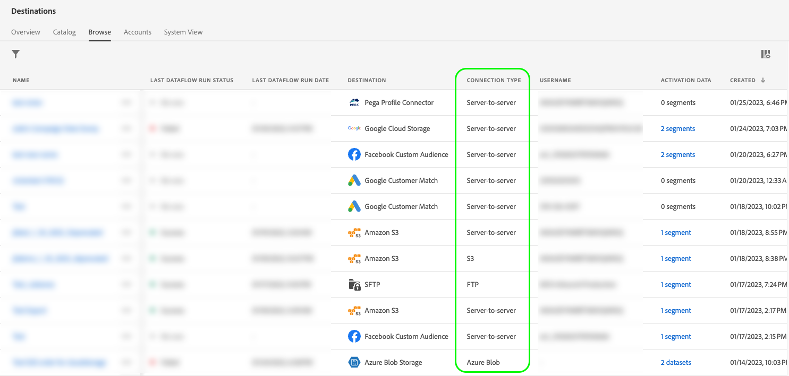

# UI-kenmerken

De attributen UI bepalen de visuele elementen die de Adobe voor uw bestemmingskaart in het gebruikersinterface van Adobe Experience Platform zou moeten tonen, zoals het embleem van het bestemmingsplatform, een verbinding aan de documentatiepagina, een bestemmingsbeschrijving en zijn categorie en type.

Om te begrijpen waar deze component in een integratie past die met Destination SDK wordt gecreeerd, zie het diagram in [configuratieopties](../configuration-options.md) documentatie of zie de volgende pagina&#39;s van het overzicht van bestemmingsconfiguratie:

* [Gebruik Destination SDK om een streamingbestemming te configureren](../../guides/configure-destination-instructions.md#create-destination-configuration)
* [Gebruik Destination SDK om een op een bestand gebaseerde bestemming te configureren](../../guides/configure-file-based-destination-instructions.md#create-destination-configuration)

Wanneer [een doel maken](../../authoring-api/destination-configuration/create-destination-configuration.md) door Destination SDK, de `uiAttributes` de sectie bepaalt de volgende visuele eigenschappen van uw bestemmingskaart:

* De URL van de pagina met doeldocumentatie in het dialoogvenster [doelcatalogus](../../../catalog/overview.md).
* De URL waar u het pictogram hebt gehost dat in de cataloguskaart van de doelen moet worden weergegeven.
* De categorie waaronder uw bestemming in Platform UI zichtbaar zal zijn.
* De gegevensexportfrequentie voor uw bestemming.
* Het verbindingstype van de bestemming, zoals Amazon S3, Azure Blob, enz.

U kunt UI-kenmerken configureren via de `/authoring/destinations` eindpunt. Zie de volgende API verwijzingspagina&#39;s voor gedetailleerde API vraagvoorbeelden waar u de componenten kunt vormen die in deze pagina worden getoond.

* [Een doelconfiguratie maken](../../authoring-api/destination-configuration/create-destination-configuration.md)
* [Een doelconfiguratie bijwerken](../../authoring-api/destination-configuration/update-destination-configuration.md)

Dit artikel beschrijft alle gesteunde attributen UI die u voor uw bestemming kunt gebruiken, en toont welke klanten in het Experience Platform UI zullen zien.


>[!IMPORTANT]
>
>Alle parameternamen en -waarden die door Destination SDK worden ondersteund, zijn **hoofdlettergevoelig**. Om fouten in hoofdlettergevoeligheid te voorkomen, gebruikt u de namen en waarden van parameters exact zoals in de documentatie wordt getoond.

## Ondersteunde integratietypen {#supported-integration-types}

Raadpleeg de onderstaande tabel voor meer informatie over de integratietypen die de op deze pagina beschreven functionaliteit ondersteunen.

| Type integratie | Ondersteunt functionaliteit |
|---|---|
| Integraties in realtime (streaming) | Ja |
| Op bestanden gebaseerde (batch) integratie | Ja |

## Ondersteunde parameters {#supported-parameters}

```json
"uiAttributes":{
      "documentationLink":"http://www.adobe.com/go/YOURDESTINATION-en",
      "category":"cloudStorage",
      "connectionType":"S3",
      "frequency":"batch",
      "isBeta":"true"
   }
```

### `documentationLink` {#documentation-link}

`documentationLink` is een tekenreeksparameter die verwijst naar de documentatiepagina in het gedeelte [Doelcatalogus](../../../catalog/overview.md) voor uw bestemming. Elke bestemming die in Adobe Experience Platform wordt geproduceerd, moet een bijbehorende documentatiepagina hebben. [Leer hoe u een pagina met doeldocumentatie maakt](../../docs-framework/documentation-instructions.md) voor uw bestemming. Merk op dat dit niet voor privé/douanebestemmingen wordt vereist.

Gebruik de volgende indeling: `http://www.adobe.com/go/destinations-YOURDESTINATION-en`, waarbij `YOURDESTINATION` is de naam van uw bestemming. Voor een bestemming genoemd Moviestar, zou u gebruiken `http://www.adobe.com/go/destinations-moviestar-en`.

De gebruikers kunnen uw documentatieverbinding van de pagina van de bestemmingscatalogus in UI zien en bezoeken. Ze moeten naar uw doelkaart bladeren en vervolgens **[!UICONTROL More actions]** en vervolgens **[!UICONTROL View documentation]**, zoals weergegeven in de onderstaande afbeelding.


>[!NOTE]
>
>Deze verbinding werkt slechts nadat de Adobe uw bestemming live plaatst en de documentatie wordt gepubliceerd.

### `category` {#category}

`category` is een tekenreeksparameter die verwijst naar de categorie die aan uw doel in Adobe Experience Platform is toegewezen. Lees voor meer informatie [Doelcategorieën](../../../destination-types.md). Gebruik een van de volgende waarden: `adobeSolutions, advertising, analytics, cdp, cloudStorage, crm, customerSuccess, database, dmp, ecommerce, email, emailMarketing, enrichment, livechat, marketingAutomation, mobile, personalization, protocols, social, streaming, subscriptions, surveys, tagManagers, voc, warehouses, payments`.

Gebruikers kunnen de lijst met doelcategorieën aan de linkerkant van het scherm weergeven in de doelcatalogus, zoals in de onderstaande afbeelding wordt getoond.


<!-- ### `iconUrl` {#icon-url}

`iconUrl` is a string parameter that refers to the URL where you hosted the icon to be displayed in the destinations catalog card. For private custom integrations, this is not required. For productized configurations, you need to share an icon with the Adobe team when you [submit the destination for review](../../guides/submit-destination.md#logo).

Users can see the icon on your destination card, as shown in the image below.

 -->

### `connectionType` {#connection-type}

`connectionType` is een tekenreeksparameter die naar het type verbinding verwijst, afhankelijk van het doel. Ondersteunde waarden: <ul><li>`Server-to-server`</li><li>`Cloud storage`</li><li>`Azure Blob`</li><li>`Azure Data Lake Storage`</li><li>`S3`</li><li>`SFTP`</li><li>`DLZ`</li></ul>

Gebruikers kunnen het verbindingstype voor de bestemming zien in het dialoogvenster [Bladeren](../../../ui/destinations-workspace.md#browse) tabblad van de werkruimte Doelen.



### `frequency` {#frequency}

`frequency` is een tekenreeksparameter die verwijst naar het type gegevensexport dat door uw doel wordt ondersteund. Instellen op `Streaming` voor API-gebaseerde integratie, of `Batch` wanneer u bestanden exporteert naar uw doelen.

Gebruikers kunnen het frequentietype in het dialoogvenster **[!UICONTROL Dataflow runs]** pagina van elke doelverbinding.


### `isBeta` {#isbeta}

Als de bestemming die u met Destination SDK creeert aan een beperkt aantal klanten beschikbaar zal zijn, zou u de bestemmingskaart van de bestemmingscatalogus als bèta kunnen willen merken.

Hiervoor kunt u de opdracht `isBeta: "true"` parameter in de UI attributensectie van de bestemmingsconfiguratie om de bestemmingskaart geschikt te merken.


## Volgende stappen {#next-steps}

Na het lezen van dit artikel, zou u een beter inzicht in moeten hebben welke attributen UI u voor uw bestemming kunt vormen en waar de gebruikers hen in Platform UI zullen zien.

Raadpleeg de volgende artikelen voor meer informatie over de andere doelcomponenten:

* [Verificatie door klant](customer-authentication.md)
* [OAuth2-vergunning](oauth2-authorization.md)
* [Gegevensvelden van de klant](customer-data-fields.md)
* [Schema-configuratie](schema-configuration.md)
* [Configuratie naamruimte voor identiteit](identity-namespace-configuration.md)
* [Levering bestemming](destination-delivery.md)
* [Configuratie van metagegevens voor publiek](audience-metadata-configuration.md)
* [Samenvoegingsbeleid](aggregation-policy.md)
* [Batchconfiguratie](batch-configuration.md)
* [Historische profielkwalificaties](historical-profile-qualifications.md)
