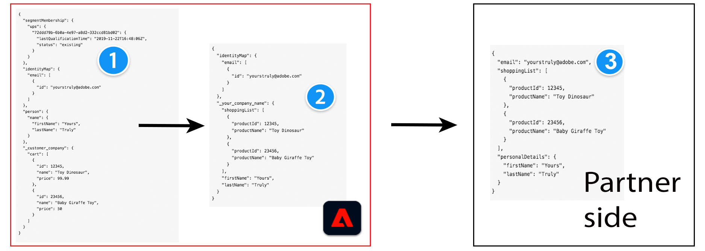

# Berichtindeling

## Voorwaarden - Adobe Experience Platform-concepten {#prerequisites}

Als u het berichtenformaat en de profielconfiguratie en het transformatieproces aan Adobe-zijde wilt begrijpen, moet u vertrouwd zijn met de volgende Experience Platform-concepten:

* **Model van de Gegevens van de Ervaring (XDM)**. [&#x200B; XDM overzicht &#x200B;](../../../../xdm/home.md) en [&#x200B; hoe te om een schema XDM in Adobe Experience Platform &#x200B;](../../../../xdm/tutorials/create-schema-ui.md) tot stand te brengen.
* **Klasse**. [&#x200B; creeer en geef klassen in UI &#x200B;](../../../../xdm/ui/resources/classes.md) uit.
* **IdentityMap**. Het identiteitsoverzicht is een kaart van alle eindgebruikersidentiteiten in Adobe Experience Platform. Verwijs naar `xdm:identityMap` in het [&#x200B; XDM gebiedswoordenboek &#x200B;](../../../../xdm/schema/field-dictionary.md).
* **SegmentMembership**. Het [&#x200B; segmentMembership &#x200B;](../../../../xdm/schema/field-dictionary.md) XDM attribuut deelt mee welk publiek een profiel een lid van is. Voor de drie verschillende waarden op het `status` gebied, lees de documentatie over [&#x200B; het schemagroep van de Details van het Lidmaatschap van de Volheid &#x200B;](../../../../xdm/field-groups/profile/segmentation.md).

>[!IMPORTANT]
>
>Alle parameternamen en waarden die door Destination SDK worden gesteund zijn **gevoelig geval**. Om fouten in hoofdlettergevoeligheid te voorkomen, gebruikt u de namen en waarden van parameters exact zoals in de documentatie wordt getoond.

## Ondersteunde integratietypen {#supported-integration-types}

Raadpleeg de onderstaande tabel voor meer informatie over de integratietypen die de op deze pagina beschreven functionaliteit ondersteunen.

| Type integratie | Ondersteunt functionaliteit |
|---|---|
| Integraties in realtime (streaming) | Ja |
| Op bestanden gebaseerde (batch) integratie | Ja (alleen de stappen 1 en 2 in het onderstaande diagram) |

## Overzicht {#overview}

Deze pagina is gericht op de berichtindeling en de profieltransformatie in gegevens die van Adobe Experience Platform naar bestemmingen worden geëxporteerd.

Adobe Experience Platform exporteert gegevens naar een aanzienlijk aantal bestemmingen, in verschillende gegevensindelingen. Voorbeelden van bestemmingstypen zijn advertentieplatforms (Google), sociale netwerken (Facebook) en cloudopslaglocaties (Amazon S3, Azure Event Hubs).

Experience Platform kan de berichtindeling van geëxporteerde profielen aanpassen aan de verwachte indeling aan uw zijde. Om deze aanpassing te begrijpen, zijn de volgende concepten belangrijk:

* Het XDM-bronschema (1) en doel (2) in Adobe Experience Platform
* Het verwachte berichtformaat aan de partnerkant (3), en
* De transformatielaag tussen het schema XDM en verwacht berichtformaat, dat u kunt bepalen door het malplaatje van de a [&#x200B; berichttransformatie &#x200B;](#using-templating) te creëren.


Experience Platform gebruikt XDM-schema&#39;s om de gegevensstructuur op een consistente en herbruikbare manier te beschrijven.

<!--

Users who want to activate data to your destination need to map the fields in their Experience Platform datasets to a schema that translates to your destination's expected format. Adobe will create a custom field group for your company to add to the target schema. The fields in the field group depend on the profile attribute fields that you can receive.

-->

**Source XDM schema (1)**: Dit punt verwijst naar het schema dat de klanten in Experience Platform gebruiken. In Experience Platform, in de [&#x200B; toewijzingsstap &#x200B;](../../../ui/activate-segment-streaming-destinations.md#mapping) van het activerende bestemmingswerkschema, wijzen de klanten gebieden van hun XDM schema aan het doelschema van uw bestemming (2) toe.

**Doel XDM schema (2)**: Gebaseerd op het JSON standaardschema (3) van het verwachte formaat van uw bestemming en de attributen die uw bestemming kan interpreteren, kunt u profielattributen en identiteiten in uw doelXDM schema bepalen. U kunt dit in de bestemmingsconfiguratie doen, in [&#x200B; schemaConfig &#x200B;](../../functionality/destination-configuration/schema-configuration.md) en [&#x200B; identityNamespaces &#x200B;](../../functionality/destination-configuration/identity-namespace-configuration.md) voorwerpen.

**JSON standaardschema van uw attributen van het bestemmingsprofiel (3)**: Dit voorbeeld vertegenwoordigt a [&#x200B; JSON schema &#x200B;](https://json-schema.org/learn/miscellaneous-examples.html) van alle profielattributen die uw platform en hun types (bijvoorbeeld: voorwerp, koord, serie) steunt. Voorbeelden van velden die uw bestemming mogelijk `firstName`, `lastName`, `gender`, `email`, `phone`, `productId`, `productName` enzovoort ondersteunt. U hebt het malplaatje van de a [&#x200B; berichttransformatie &#x200B;](#using-templating) nodig om de gegevens die uit Experience Platform naar uw verwachte formaat worden uitgevoerd aan te passen.

Gebaseerd op de hierboven beschreven schematransformaties, is hier hoe een profielconfiguratie tussen het bronXDM schema en een steekproefschema op de partnerkant verandert:



## Aan de slag - drie basiskenmerken transformeren {#getting-started}

Om het proces van de profieltransformatie aan te tonen, gebruikt het voorbeeld hieronder drie gemeenschappelijke profielattributen in Adobe Experience Platform: **voornaam**, **achternaam**, en **e-mailadres**.

>[!NOTE]
>
>De klant brengt de attributen van het bronXDM schema aan het partnerXDM schema in Adobe Experience Platform in kaart UI, in de **stap van de Toewijzing** van het [&#x200B; activeren bestemmingswerkschema &#x200B;](../../../ui/activate-segment-streaming-destinations.md#mapping).

Stel dat uw platform een berichtindeling kan ontvangen zoals:

```shell
POST https://YOUR_REST_API_URL/users/
Content-Type: application/json
Authorization: Bearer YOUR_REST_API_KEY

{
  "attributes":
    {
      "first_name": "Yours",
      "last_name": "Truly",
      "external_id": "yourstruly@adobe.com"
    }
}
```

Gezien het berichtformaat, zijn de overeenkomstige transformaties als volgt:

| Attribuut in partner XDM schema op de kant van Adobe | Transformatie | Kenmerk in HTTP-bericht aan uw zijde |
|---------|----------|---------|
| `_your_custom_schema.firstName` | `attributes.first_name` | `first_name` |
| `_your_custom_schema.lastName` | `attributes.last_name` | `last_name` |
| `personalEmail.address` | `attributes.external_id` | `external_id` |

{style="table-layout:auto"}

## Profielstructuur in Experience Platform {#profile-structure}

Om de voorbeelden hieronder op de pagina te begrijpen, is het belangrijk om de structuur van een profiel in Experience Platform te kennen.

Profielen hebben drie secties:

* `segmentMembership` (altijd aanwezig in een profiel)
   * deze sectie bevat alle soorten publiek die in het profiel aanwezig zijn. Het publiek kan een van twee statussen hebben: `realized` of `exited` .
* `identityMap` (altijd aanwezig in een profiel)
   * deze sectie bevat alle identiteiten die in het profiel aanwezig zijn (e-mail, Google GAID, Apple IDFA, enzovoort) en die de gebruiker in kaart heeft gebracht voor exporteren in de activeringsworkflow.
* attributen (afhankelijk van de bestemmingsconfiguratie, zouden deze op het profiel aanwezig kunnen zijn). Er is ook een klein verschil tussen vooraf gedefinieerde kenmerken en vrije-vormkenmerken:
   * voor *vrije vormattributen*, bevatten deze a `.value` weg als de attributen op het profiel (zie `lastName` attributen van voorbeeld 1) aanwezig zijn. Als ze niet aanwezig zijn in het profiel, bevatten ze niet het pad `.value` (zie `firstName` -kenmerk van voorbeeld 1).
   * voor *vooraf bepaalde attributen*, bevatten deze geen weg a `.value`. Alle toegewezen kenmerken die aanwezig zijn in een profiel, worden weergegeven in de kenmerkenkaart. De klassen die niet aanwezig zijn, zijn niet aanwezig (zie voorbeeld 2 - het kenmerk `firstName` bestaat niet in het profiel).

Hieronder vindt u twee voorbeelden van profielen in Experience Platform:

### Voorbeeld 1 met `segmentMembership` , `identityMap` en kenmerken voor vrije-vormkenmerken {#example-1}

```json
{
  "segmentMembership": {
    "ups": {
      "11111111-1111-1111-1111-111111111111": {
        "lastQualificationTime": "2019-04-15T02:41:50.000+0000",
        "status": "realized"
      }
    }
  },
  "identityMap": {
    "mobileIds": [
      {
        "id": "e86fb215-0921-4537-bc77-969ff775752c"
      }
    ]
  },
  "attributes": {
    "firstName": {
    },
    "lastName": {
      "value": "lastName"
    }
  }
}
```

### Voorbeeld 2 met `segmentMembership` , `identityMap` en kenmerken voor vooraf gedefinieerde kenmerken {#example-2}

```json
{
  "segmentMembership": {
    "ups": {
      "11111111-1111-1111-1111-111111111111": {
        "lastQualificationTime": "2019-04-15T02:41:50.000+0000",
        "status": "realized"
      }
    }
  },
  "identityMap": {
    "mobileIds": [
      {
        "id": "e86fb215-0921-4537-bc77-969ff775752c"
      }
    ]
  },
  "attributes": {
    "lastName": "lastName"
  }
}
```

## Een sjabloontaal gebruiken voor de transformaties voor identiteit, kenmerken en publieksleiding {#using-templating}

Adobe gebruikt [&#x200B; Beerbare malplaatjes &#x200B;](https://pebbletemplates.io/), een het malplaatjetaal gelijkend op [&#x200B; Jinja &#x200B;](https://jinja.palletsprojects.com/en/2.11.x/), om de gebieden van het schema van Experience Platform XDM in een formaat om te zetten dat door uw bestemming wordt gesteund.

Deze sectie verstrekt verscheidene voorbeelden van hoe deze transformaties worden gemaakt - van het inputXDM schema, door het malplaatje, en output in ladingsformaten die door uw bestemming worden goedgekeurd. De onderstaande voorbeelden worden als volgt weergegeven door de toenemende complexiteit:

1. Eenvoudige transformatievoorbeelden. Leer hoe het templating werk met eenvoudige transformaties voor [&#x200B; attributen van het Profiel &#x200B;](#attributes), [&#x200B; het lidmaatschap van de Publiek &#x200B;](#segment-membership), en [&#x200B; Identiteit &#x200B;](#identities) gebieden.
2. Verhoogde ingewikkeldheidsvoorbeelden van malplaatjes die de gebieden hierboven combineren: [&#x200B; creeer een malplaatje dat publiek en identiteiten &#x200B;](./message-format.md#segments-and-identities) en [&#x200B; verzendt een malplaatje creëren dat segmenten, identiteiten, en profielattributen &#x200B;](#segments-identities-attributes) verzendt.
3. Sjablonen die de aggregatietoets bevatten. Wanneer u [&#x200B; configureerbare samenvoeging &#x200B;](../../functionality/destination-configuration/aggregation-policy.md#configurable-aggregation) in de bestemmingsconfiguratie gebruikt, groepeert Experience Platform de profielen die naar uw bestemming worden uitgevoerd die op criteria zoals publieksidentiteitskaart, publieksstatus, of identiteit namespaces wordt gebaseerd.

### Profielkenmerken {#attributes}

Als u de profielkenmerken die naar uw doel zijn geëxporteerd, wilt transformeren, raadpleegt u de JSON en de codevoorbeelden hieronder.

>[!IMPORTANT]
>
>Voor een lijst van alle beschikbare profielattributen in Adobe Experience Platform, zie het [&#x200B; XDM gebiedswoordenboek &#x200B;](../../../../xdm/schema/field-dictionary.md).


**Input**

Profiel 1:

```json
{
    "attributes": {
        "firstName": {
            "value": "Hermione"
    },
    "birthDate": {}
  }
}
```

Profiel 2:

```json
{
  "attributes": {
    "firstName": {
      "value": "Harry"
    },
    "birthDate": {
        "value": "1980/07/31"
    }
  }
}
```

**Malplaatje**

>[!IMPORTANT]
>
>Voor alle malplaatjes die u gebruikt, moet u de illegale karakters, zoals dubbele citaten `""` ontsnappen alvorens het [&#x200B; malplaatje &#x200B;](../../functionality/destination-server/templating-specs.md) in de [&#x200B; configuratie van de bestemmingsserver &#x200B;](../../authoring-api/destination-server/create-destination-server.md) op te nemen. Voor meer informatie bij het ontsnappen van dubbele citaten, zie Hoofdstuk 9 in de [&#x200B; norm JSON &#x200B;](https://www.ecma-international.org/publications-and-standards/standards/ecma-404/).

```python
{
    "profiles": [
        
        {
            
            "{{ attribute.key }}":
                
                    null
                
                    "{{ attribute.value.value }}"
                
            ,
            
        },
        
    ]
}
```

**Resultaat**


```json
{
    "profiles": [
        {
            "firstName": "Hermione",
            "birthDate": null
        },
        {
            "firstName": "Harry",
            "birthDate": "1980/07/31"
        }
    ]
}
```

### Publiek lidmaatschap {#audience-membership}

Het [&#x200B; segmentMembership &#x200B;](../../../../xdm/schema/field-dictionary.md) XDM attribuut deelt mee welk publiek een profiel een lid van is.
Voor de drie verschillende waarden op het `status` gebied, lees de documentatie over [&#x200B; het schemagroep van de Details van het Lidmaatschap van de Volheid &#x200B;](../../../../xdm/field-groups/profile/segmentation.md).

**Input**

Profiel 1:

```json
{
  "segmentMembership": {
    "ups": {
      "36a51c13-9dd6-4d2c-8aa3-07d785ea5075": {
        "lastQualificationTime": "2019-11-20T13:15:49Z",
        "status": "realized"
      },
      "788d8874-8007-4253-92b7-ee6b6c20c6f3": {
        "lastQualificationTime": "2019-11-20T13:15:49Z",
        "status": "realized"
      },
      "8f812592-3f06-416b-bd50-e7831848a31a": {
        "lastQualificationTime": "2019-11-20T13:15:49Z",
        "status": "exited"
      }
    }
  }
}
```

Profiel 2:

```json
{
  "segmentMembership": {
    "ups": {
      "32396e4b-16f6-4033-9702-fc69b5e24e7c": {
        "lastQualificationTime": "2021-08-20T17:23:04Z",
        "status": "realized"
      },
      "af854278-894a-4192-a96b-320fbf2623fd": {
        "lastQualificationTime": "2021-08-20T16:44:37Z",
        "status": "realized"
      },
      "66505bf9-bc08-4bac-afbc-8b6706650ea4": {
        "lastQualificationTime": "2019-08-20T17:23:04Z",
        "status": "realized"
      }
    }
  }
}
```

**Malplaatje**

>[!IMPORTANT]
>
>Voor alle malplaatjes die u gebruikt, moet u de illegale karakters, zoals dubbele citaten `""` ontsnappen alvorens het [&#x200B; malplaatje &#x200B;](../../functionality/destination-server/templating-specs.md) in de [&#x200B; configuratie van de bestemmingsserver &#x200B;](../../authoring-api/destination-server/create-destination-server.md) op te nemen. Voor meer informatie bij het ontsnappen van dubbele citaten, zie Hoofdstuk 9 in de [&#x200B; norm JSON &#x200B;](https://www.ecma-international.org/publications-and-standards/standards/ecma-404/).


```python
{
    "profiles": [
        
        {
            "AdobeExperiencePlatformSegments": {
                "add": [
                
                "{{ segment.key }}",
                
                ],
                "remove": [
                {# Alternative syntax for filtering audiences by status: #}
                
                "{{ segment.key }}",
                
                ]
            }
        },
        
    ]
}
```

**Resultaat**

```json
{
    "profiles": [
        {
            "AdobeExperiencePlatformSegments": {
                "add": [
                    "36a51c13-9dd6-4d2c-8aa3-07d785ea5075",
                    "788d8874-8007-4253-92b7-ee6b6c20c6f3"
                ],
                "remove": [
                    "8f812592-3f06-416b-bd50-e7831848a31a"
                ]
            }
        },
        {
            "AdobeExperiencePlatformSegments": {
                "add": [
                    "32396e4b-16f6-4033-9702-fc69b5e24e7c",
                    "af854278-894a-4192-a96b-320fbf2623fd",
                    "66505bf9-bc08-4bac-afbc-8b6706650ea4"
                ],
                "remove": [
                ]
            }
        }
    ]
}
```

### Identiteiten {#identities}

Voor informatie over identiteiten in Experience Platform, zie het [&#x200B; overzicht van identiteitskaart namespace &#x200B;](../../../../identity-service/features/namespaces.md).

**Input**

Profiel 1:

```json
{
    "identityMap": {
        "email": [
            {
                "id": "johndoe@example.com"
            },
            {
                "id": "jd@example.com"
            }
        ],
        "external_id": [
            {
                "id": "123456"
            }
        ]
    }
}
```

Profiel 2:

```json
{
    "identityMap": {
        "email": [
            {
                "id": "jane.doe@example.com"
            }
        ]
    }
}
```

**Malplaatje**

>[!IMPORTANT]
>
>Voor alle malplaatjes die u gebruikt, moet u de illegale karakters, zoals dubbele citaten `""` ontsnappen alvorens het [&#x200B; malplaatje &#x200B;](../../functionality/destination-server/templating-specs.md) in de [&#x200B; configuratie van de bestemmingsserver &#x200B;](../../authoring-api/destination-server/create-destination-server.md) op te nemen. Voor meer informatie bij het ontsnappen van dubbele citaten, zie Hoofdstuk 9 in de [&#x200B; norm JSON &#x200B;](https://www.ecma-international.org/publications-and-standards/standards/ecma-404/).

```python
{
    "profiles": [
        
        {
            "identities": [
                
                {
                    "type": "email",
                    "id": "{{ email.id }}"
                },
                

                {# Add a comma only if you have both emails and external_ids. #}
                
                    ,
                

                
                {
                    "type": "external_id",
                    "id": "{{ external.id }}"
                },
                
            ]
        },
        
    ]
}
```

**Resultaat**

```json
{
    "profiles": [
        {
            "identities": [
                {
                    "type": "email",
                    "id": "johndoe@example.com"
                },
                {
                    "type": "email",
                    "id": "jd@example.com"
                },
                {
                    "type": "external_id",
                    "id": "123456"
                }
            ]
        },
        {
            "identities": [
                {
                    "type": "email",
                    "id": "jane.doe@example.com"
                }
            ]
        }
    ]
}
```

### Een sjabloon maken die het publiek en de identiteiten verstuurt {#segments-and-identities}

Deze sectie verstrekt een voorbeeld van een algemeen gebruikte transformatie tussen het schema van Adobe XDM en het schema van de partnerbestemming.
In het onderstaande voorbeeld ziet u hoe u de indeling voor het publiekslidmaatschap en de identiteiten transformeert en uitvoert naar uw bestemming.

**Input**

Profiel 1:

```json
{
    "identityMap": {
        "email": [
            {
                "id": "johndoe@example.com"
            },
            {
                "id": "jd@example.com"
            }
        ],
        "external_id": [
            {
                "id": "123456"
            }
        ]
    },
    "segmentMembership": {
        "ups": {
            "36a51c13-9dd6-4d2c-8aa3-07d785ea5075": {
                "lastQualificationTime": "2019-11-20T13:15:49Z",
                "status": "realized"
            },
            "788d8874-8007-4253-92b7-ee6b6c20c6f3": {
              "lastQualificationTime": "2019-11-20T13:15:49Z",
              "status": "realized"
            },
            "8f812592-3f06-416b-bd50-e7831848a31a": {
                "lastQualificationTime": "2019-11-20T13:15:49Z",
                "status": "exited"
            }
        }
    }
}
```

Profiel 2:

```json
{
    "identityMap": {
        "email": [
            {
                "id": "jane.doe@example.com"
            }
        ]
    },
    "segmentMembership": {
        "ups": {
            "36a51c13-9dd6-4d2c-8aa3-07d785ea5075": {
                "lastQualificationTime": "2021-08-31T10:01:42Z",
                "status": "realized"
            }
        }
    }
}
```

**Malplaatje**

>[!IMPORTANT]
>
>Voor alle malplaatjes die u gebruikt, moet u de illegale karakters, zoals dubbele citaten `""` ontsnappen alvorens het [&#x200B; malplaatje &#x200B;](../../functionality/destination-server/templating-specs.md) in de [&#x200B; configuratie van de bestemmingsserver &#x200B;](../../authoring-api/destination-server/create-destination-server.md) op te nemen. Voor meer informatie bij het ontsnappen van dubbele citaten, zie Hoofdstuk 9 in de [&#x200B; norm JSON &#x200B;](https://www.ecma-international.org/publications-and-standards/standards/ecma-404/).

```python
{
    "profiles": [
        
        {
            "identities": [
                
                {
                    "type": "email",
                    "id": "{{ email.id }}"
                },
                
                
                {# Add a comma only if you have both emails and external_ids. #}
                
                    ,
                
                
                
                {
                    "type": "external_id",
                    "id": "{{ external.id }}"
                },
                
            ],
            "AdobeExperiencePlatformSegments": {
                "add": [
                    
                    "{{ segment.key }}",
                    
                ],
                "remove": [
                    {# Alternative syntax for filtering audiences by status: #}
                    
                    "{{ segment.key }}",
                    
                ]
            }
        },
        
    ]
}
```

**Resultaat**

In `json` hieronder worden de gegevens weergegeven die uit Adobe Experience Platform zijn geëxporteerd.

```json
{
    "profiles": [
        {
            "identities": [
                {
                    "type": "email",
                    "id": "johndoe@example.com"
                },
                {
                    "type": "email",
                    "id": "jd@example.com"
                },
                {
                    "type": "external_id",
                    "id": "123456"
                }
            ],
            "AdobeExperiencePlatformSegments": {
                "add": [
                    "36a51c13-9dd6-4d2c-8aa3-07d785ea5075",
                    "788d8874-8007-4253-92b7-ee6b6c20c6f3"
                ],
                "remove": [
                    "8f812592-3f06-416b-bd50-e7831848a31a"
                ]
            }
        },
        {
            "identities": [
                {
                    "type": "email",
                    "id": "jane.doe@example.com"
                }
            ],
            "AdobeExperiencePlatformSegments": {
                "add": [
                    "36a51c13-9dd6-4d2c-8aa3-07d785ea5075"
                ],
                "remove": []
            }
        }
    ]
}
```

### Een sjabloon maken die segmenten, identiteiten en profielkenmerken verstuurt {#segments-identities-attributes}

Deze sectie verstrekt een voorbeeld van een algemeen gebruikte transformatie tussen het schema van Adobe XDM en het schema van de partnerbestemming.

Een ander veelvoorkomend geval van gebruik is het uitvoeren van gegevens die publieksleden, identiteiten (bijvoorbeeld: e-mailadres, telefoonaantal, reclame-id), en profielattributen bevatten. Als u gegevens op deze manier wilt exporteren, raadpleegt u het onderstaande voorbeeld:

**Input**

Profiel 1:

```json
{
    "attributes": {
        "firstName": {
            "value": "Hermione"
        },
        "birthDate": {}
    },
    "identityMap": {
        "email": [
            {
                "id": "johndoe@example.com"
            },
            {
                "id": "jd@example.com"
            }
        ],
        "external_id": [
            {
                "id": "123456"
            }
        ]
    },
    "segmentMembership": {
        "ups": {
            "36a51c13-9dd6-4d2c-8aa3-07d785ea5075": {
                "lastQualificationTime": "2019-11-20T13:15:49Z",
                "status": "realized"
            },
            "788d8874-8007-4253-92b7-ee6b6c20c6f3": {
              "lastQualificationTime": "2019-11-20T13:15:49Z",
              "status": "realized"
            },
            "8f812592-3f06-416b-bd50-e7831848a31a": {
                "lastQualificationTime": "2019-11-20T13:15:49Z",
                "status": "exited"
            }
        }
    }
}
```

Profiel 2:

```json
{
    "attributes": {
        "firstName": {
            "value": "Harry"
        },
        "birthDate": {
            "value": "1980/07/31"
        }
    },
    "identityMap": {
        "email": [
            {
                "id": "harry.p@example.com"
            }
        ]
    },
    "segmentMembership": {
        "ups": {
            "36a51c13-9dd6-4d2c-8aa3-07d785ea5075": {
                "lastQualificationTime": "2019-11-20T13:15:49Z",
                "status": "realized"
            }
        }
    }
}
```

**Malplaatje**

>[!IMPORTANT]
>
>Voor alle malplaatjes die u gebruikt, moet u de illegale karakters, zoals dubbele citaten `""` ontsnappen alvorens het [&#x200B; malplaatje &#x200B;](../../functionality/destination-server/templating-specs.md) in de [&#x200B; configuratie van de bestemmingsserver &#x200B;](../../authoring-api/destination-server/create-destination-server.md) op te nemen. Voor meer informatie bij het ontsnappen van dubbele citaten, zie Hoofdstuk 9 in de [&#x200B; norm JSON &#x200B;](https://www.ecma-international.org/publications-and-standards/standards/ecma-404/).

```python
{
    "profiles": [
        
        {
            "attributes": {
            
                "{{ attribute.key }}":
                    
                        null
                    
                        "{{ attribute.value.value }}"
                    
                ,
            
            },
            "identities": [
                
                {
                    "type": "email",
                    "id": "{{ email.id }}"
                },
                

                {# Add a comma only if we have both emails and external_ids. #}
                
                    ,
                

                
                {
                    "type": "external_id",
                    "id": "{{ external.id }}"
                },
                
            ],
            "AdobeExperiencePlatformSegments": {
                "add": [
                
                    "{{ segment.key }}",
                
                ],
                "remove": [
                {# Alternative syntax for filtering audiences by status: #}
                
                    "{{ segment.key }}",
                
                ]
            }
        }
    ]
}
```

**Resultaat**

In `json` hieronder worden de gegevens weergegeven die uit Adobe Experience Platform zijn geëxporteerd.

```json
{
    "profiles": [
        {
            "attributes": {
                "firstName": "Hermione",
                "birthDate": null
            },
            "identities": [
                {
                    "type": "email",
                    "id": "johndoe@example.com"
                },
                {
                    "type": "email",
                    "id": "jd@example.com"
                },
                {
                    "type": "external_id",
                    "id": "123456"
                }
            ],
            "AdobeExperiencePlatformSegments": {
                "add": [
                    "36a51c13-9dd6-4d2c-8aa3-07d785ea5075",
                    "788d8874-8007-4253-92b7-ee6b6c20c6f3"
                ],
                "remove": [
                    "8f812592-3f06-416b-bd50-e7831848a31a"
                ]
            }
        },
        {
            "attributes": {
                "firstName": "Harry",
                "birthDate": "1980/07/21"
            },
            "identities": [
                {
                    "type": "email",
                    "id": "harry.p@example.com"
                }
            ],
            "AdobeExperiencePlatformSegments": {
                "add": [
                    "36a51c13-9dd6-4d2c-8aa3-07d785ea5075"
                ],
                "remove": []
            }
        }
    ]
}
```

### De samenvoegingssleutel in de sjabloon opnemen voor toegang tot geëxporteerde profielen die op verschillende criteria zijn gegroepeerd {#template-aggregation-key}

Wanneer u [&#x200B; configureerbare samenvoeging &#x200B;](../../functionality/destination-configuration/aggregation-policy.md#configurable-aggregation) in de bestemmingsconfiguratie gebruikt, kunt u de profielen groeperen die naar uw bestemming worden uitgevoerd op criteria zoals publieksidentiteitskaart, publieksalias, publiekslidmaatschap, of identiteitsnamespaces worden gebaseerd.

In het malplaatje van de berichttransformatie, kunt u tot de bovengenoemde samenvoegingssleutels toegang hebben, zoals aangetoond in de voorbeelden in de volgende secties. Gebruik aggregatietoetsen om het uit Experience Platform geëxporteerde HTTP-bericht te structureren, zodat dit overeenkomt met de notatie- en tarieflimieten die door de bestemming worden verwacht.

#### Code voor publiek-id in de sjabloon gebruiken {#aggregation-key-segment-id}

Als u [&#x200B; configureerbare samenvoeging &#x200B;](../../functionality/destination-configuration/aggregation-policy.md#configurable-aggregation) en reeks `includeSegmentId` aan waar gebruikt, worden de profielen in de berichten van HTTP die naar uw bestemming worden uitgevoerd gegroepeerd door publieksidentiteitskaart. Hieronder ziet u hoe u toegang krijgt tot de gebruikers-id in de sjabloon.

**Input**

Houd rekening met de vier onderstaande profielen, waarbij:

* de eerste twee maken deel uit van het publiek met de gebruikers-id `788d8874-8007-4253-92b7-ee6b6c20c6f3`
* het derde profiel maakt deel uit van het publiek met de gebruikers-id `8f812592-3f06-416b-bd50-e7831848a31a`
* het vierde profiel maakt deel uit van beide bovengenoemde doelgroepen .

Profiel 1:

```json
{
   "attributes":{
      "firstName":{
         "value":"Hermione"
      }
   },
   "segmentMembership":{
      "ups":{
         "788d8874-8007-4253-92b7-ee6b6c20c6f3":{
            "lastQualificationTime":"2020-11-20T13:15:49Z",
            "status":"realized"
         }
      }
   }
}
```

Profiel 2:

```json
{
   "attributes":{
      "firstName":{
         "value":"Harry"
      }
   },
   "segmentMembership":{
      "ups":{
         "788d8874-8007-4253-92b7-ee6b6c20c6f3":{
            "lastQualificationTime":"2020-11-20T13:15:49Z",
            "status":"realized"
         }
      }
   }
}
```

Profiel 3:

```json
{
   "attributes":{
      "firstName":{
         "value":"Tom"
      }
   },
   "segmentMembership":{
      "ups":{
         "8f812592-3f06-416b-bd50-e7831848a31a":{
            "lastQualificationTime":"2021-02-20T12:00:00Z",
            "status":"realized"
         }
      }
   }
}
```

Profiel 4:

```json
{
   "attributes":{
      "firstName":{
         "value":"Jerry"
      }
   },
   "segmentMembership":{
      "ups":{
         "8f812592-3f06-416b-bd50-e7831848a31a":{
            "lastQualificationTime":"2021-02-20T12:00:00Z",
            "status":"realized"
         },
         "788d8874-8007-4253-92b7-ee6b6c20c6f3":{
            "lastQualificationTime":"2020-11-20T13:15:49Z",
            "status":"realized"
         }
      }
   }
}
```

**Malplaatje**

>[!IMPORTANT]
>
>Voor alle malplaatjes die u gebruikt, moet u de illegale karakters, zoals dubbele citaten `""` ontsnappen alvorens het [&#x200B; malplaatje &#x200B;](../../functionality/destination-server/templating-specs.md) in de [&#x200B; configuratie van de bestemmingsserver &#x200B;](../../authoring-api/destination-server/create-destination-server.md) op te nemen. Voor meer informatie bij het ontsnappen van dubbele citaten, zie Hoofdstuk 9 in de [&#x200B; norm JSON &#x200B;](https://www.ecma-international.org/publications-and-standards/standards/ecma-404/).

Hieronder ziet u hoe `audienceId` in de sjabloon wordt gebruikt voor toegang tot gebruikers-id&#39;s. In dit voorbeeld wordt ervan uitgegaan dat u `audienceId` gebruikt voor publiekslidmaatschap in uw doeltaxonomie. U kunt in plaats daarvan elke andere veldnaam gebruiken, afhankelijk van uw eigen taxonomie.

```python
{
    "audienceId": "{{ input.aggregationKey.segmentId }}",
    "profiles": [
        
        {
            "first_name": "{{ profile.attributes.firstName.value }}"
        },
        
    ]
}
```

**Resultaat**

Als de profielen naar uw bestemming worden geëxporteerd, worden ze in twee groepen gesplitst op basis van hun gebruikers-id.

```json
{
   "audienceId":"788d8874-8007-4253-92b7-ee6b6c20c6f3",
   "profiles":[
      {
         "firstName":"Hermione"
      },
      {
         "firstName":"Harry"
      },
      {
         "firstName":"Jerry"
      }
   ]
}
```

```json
{
   "audienceId":"8f812592-3f06-416b-bd50-e7831848a31a",
   "profiles":[
      {
         "firstName":"Tom"
      },
      {
         "firstName":"Jerry"
      }
   ]
}
```

#### Aliasaggregatietoets voor het publiek gebruiken in de sjabloon {#aggregation-key-segment-alias}

Als u [&#x200B; configureerbare samenvoeging &#x200B;](../../functionality/destination-configuration/aggregation-policy.md#configurable-aggregation) en reeks `includeSegmentId` aan waar gebruikt, kunt u tot publiek alias in het malplaatje ook toegang hebben.

Voeg de onderstaande regel toe aan de sjabloon voor toegang tot de geëxporteerde profielen die zijn gegroepeerd op publieksalias.

```python
customerList={{input.aggregationKey.segmentAlias}}
```

#### De aggregatietoets voor de status van het publiek gebruiken in de sjabloon {#aggregation-key-segment-status}

Als u [&#x200B; configureerbare samenvoeging &#x200B;](../../functionality/destination-configuration/aggregation-policy.md#configurable-aggregation) en reeks `includeSegmentId` en `includeSegmentStatus` aan waar gebruikt, kunt u tot de publieksstatus in het malplaatje toegang hebben. Op deze manier kunt u profielen groeperen in de HTTP-berichten die naar uw bestemming worden geëxporteerd, op basis van het feit of de profielen moeten worden toegevoegd of verwijderd uit segmenten.

Mogelijke waarden zijn:

* gereed
* bestaand
* verlaten

Voeg op basis van de bovenstaande waarden de onderstaande regel toe aan de sjabloon om profielen toe te voegen aan of te verwijderen uit segmenten:

```python
action=REMOVEADD
```

#### Naamruimteaggregatietoets gebruiken in de sjabloon {#aggregation-key-identity}

Hieronder is een voorbeeld waar de [&#x200B; configureerbare samenvoeging &#x200B;](../../functionality/destination-configuration/aggregation-policy.md#configurable-aggregation) in de bestemmingsconfiguratie aan gezamenlijke uitgevoerde profielen door identiteitsnamespaces, in de vorm `"namespaces": ["email", "phone"]` en `"namespaces": ["GAID", "IDFA"]` wordt geplaatst. Verwijs naar de `groups` parameter in [&#x200B; creeer bestemmingsconfiguratie &#x200B;](../../authoring-api/destination-configuration/create-destination-configuration.md) documentatie voor meer details over het groeperen.

**Input**

Profiel 1:

```json
{
   "identityMap":{
      "email":[
         {
            "id":"e1@example.com"
         },
         {
            "id":"e2@example.com"
         }
      ],
      "phone":[
         {
            "id":"+40744111222"
         }
      ],
      "IDFA":[
         {
            "id":"AEBE52E7-03EE-455A-B3C4-E57283966239"
         }
      ],
      "GAID":[
         {
            "id":"e4fe9bde-caa0-47b6-908d-ffba3fa184f2"
         }
      ]
   }
}
```

Profiel 2:

```json
{
   "identityMap":{
      "email":[
         {
            "id":"e3@example.com"
         }
      ],
      "phone":[
         {
            "id":"+40744333444"
         },
         {
            "id":"+40744555666"
         }
      ],
      "IDFA":[
         {
            "id":"134GHU45-34HH-GHJ7-K0H8-LHN665998NN0"
         }
      ],
      "GAID":[
         {
            "id":"47bh00i9-8jv6-334n-lll8-nb7f24sghg76"
         }
      ]
   }
}
```

**Malplaatje**

>[!IMPORTANT]
>
>Voor alle malplaatjes die u gebruikt, moet u de illegale karakters, zoals dubbele citaten `""` ontsnappen alvorens het [&#x200B; malplaatje &#x200B;](../../functionality/destination-server/templating-specs.md) in de [&#x200B; configuratie van de bestemmingsserver &#x200B;](../../authoring-api/destination-server/create-destination-server.md) op te nemen. Voor meer informatie bij het ontsnappen van dubbele citaten, zie Hoofdstuk 9 in de [&#x200B; norm JSON &#x200B;](https://www.ecma-international.org/publications-and-standards/standards/ecma-404/).

`input.aggregationKey.identityNamespaces` wordt gebruikt in de onderstaande sjabloon

```python
{
            "profiles": [
            
            {
                
                "{{ns}}": [
                    
                    "{{id.id}}",
                    
                ],
                
            },
            
        ]
}
```

**Resultaat**

Als de profielen naar uw bestemming worden geëxporteerd, worden ze in twee groepen gesplitst op basis van hun naamruimten. E-mail en telefoon zijn in één groep, terwijl GAID en IDFA in een andere zijn.

```json
{
   "profiles":[
      {
         "email":[
            "e1@example.com",
            "e2@example.com"
         ],
         "phone":[
            "+40744111222"
         ]
      },
      {
         "email":[
            "e3@example.com"
         ],
         "phone":[
            "+40744333444",
            "+40744555666"
         ]
      }
   ]
}
```

```json
{
   "profiles":[
      {
         "IDFA":[
            "AEBE52E7-03EE-455A-B3C4-E57283966239"
         ],
         "GAID":[
            "e4fe9bde-caa0-47b6-908d-ffba3fa184f2"
         ]
      },
      {
         "IDFA":[
            "134GHU45-34HH-GHJ7-K0H8-LHN665998NN0"
         ],
         "GAID":[
            "47bh00i9-8jv6-334n-lll8-nb7f24sghg76"
         ]
      }
   ]
}
```

#### De aggregatietoets in een URL-sjabloon gebruiken {#aggregation-key-url-template}

Afhankelijk van het gebruik kunt u ook de hier in een URL beschreven aggregatietoetsen gebruiken, zoals hieronder wordt getoond:

```python
https://api.example.com/audience/{{input.aggregationKey.segmentId}}
```

### Referentie: Context en functies die worden gebruikt in de transformatiesjablonen {#reference}

De context die aan de sjabloon wordt aangeboden, bevat `input` (de profielen/gegevens die in deze aanroep worden geëxporteerd) en `destination` (gegevens over het doel waarnaar Adobe gegevens verzendt, geldig voor alle profielen).

In de onderstaande tabel vindt u een beschrijving van de functies in de bovenstaande voorbeelden.

| Functie | Beschrijving | Voorbeeld |
|---------|----------|----------|
| `input.profile` | Het profiel, dat als a [&#x200B; JsonNode &#x200B;](https://fasterxml.github.io/jackson-databind/javadoc/2.11/com/fasterxml/jackson/databind/node/JsonNodeType.html) wordt vertegenwoordigd. Volgt het partnerXDM schema dat hierboven verder op deze pagina wordt vermeld. |  |
| `hasSegments` | Deze functie neemt een kaart van namespace publiek IDs als parameter. De functie retourneert `true` wanneer ten minste één publiek op de kaart aanwezig is (ongeacht de status), en anders `false` . U kunt deze functie gebruiken om te beslissen of u een overzicht van het publiek doorloopt of niet. | `hasSegments(input.profile.segmentMembership)` |
| `destination.namespaceSegmentAliases` | Wijs van publiek-id&#39;s in een specifieke Adobe Experience Platform-naamruimte toe aan publiekalias in het systeem van de partner. | `destination.namespaceSegmentAliases["ups"]["seg-id-1"]` |
| `destination.namespaceSegmentNames` | Wijs van publieksnamen in specifieke Adobe Experience Platform namespaces aan publieksnamen in het systeem van de partner toe. | `destination.namespaceSegmentNames["ups"]["seg-name-1"]` |
| `destination.namespaceSegmentTimestamps` | Retourneert de tijd waarop een publiek in UNIX-tijdstempelindeling is gemaakt, bijgewerkt of geactiveerd. | <ul><li>`destination.namespaceSegmentTimestamps["ups"]["seg-id-1"].createdAt`: retourneert de tijd dat het segment met de id `seg-id-1` , vanuit de naamruimte `ups` , is gemaakt in UNIX-tijdstempelindeling.</li><li>`destination.namespaceSegmentTimestamps["ups"]["seg-id-1"].updatedAt`: geeft de tijd weer waarop het publiek met de id `seg-id-1` , vanuit de naamruimte `ups` , is bijgewerkt in de UNIX-tijdstempelindeling.</li><li>`destination.namespaceSegmentTimestamps["ups"]["seg-id-1"].mappingCreatedAt`: geeft de tijd weer waarop het publiek met de id `seg-id-1` , vanuit de naamruimte `ups` , in UNIX-tijdstempelindeling naar het doel is geactiveerd.</li><li>`destination.namespaceSegmentTimestamps["ups"]["seg-id-1"].mappingUpdatedAt`: retourneert de tijd waarop de publieksactivering op de bestemming is bijgewerkt, in UNIX-tijdstempelindeling.</li></ul> |
| `addedSegments(mapOfNamespacedSegmentIds)` | Retourneert alleen het publiek met de status `realized` voor alle naamruimten. | `addedSegments(input.profile.segmentMembership)` |
| `removedSegments(mapOfNamespacedSegmentIds)` | Retourneert alleen het publiek met de status `exited` voor alle naamruimten. | `removedSegments(input.profile.segmentMembership)` |
| `destination.segmentAliases` | **Vervangen. Vervangen door`destination.namespaceSegmentAliases`** <br><br> Toewijzen van gebruikers-id&#39;s in de Adobe Experience Platform-naamruimte aan publieksaliassen in het systeem van de partner. | `destination.segmentAliases["seg-id-1"]` |
| `destination.segmentNames` | **Vervangen. Vervangen door`destination.namespaceSegmentNames`** <br><br> Toewijzen van publieksnamen in de Adobe Experience Platform-naamruimte aan publieksnamen in het systeem van de partner. | `destination.segmentNames["seg-name-1"]` |
| `destination.segmentTimestamps` | **Vervangen. Vervangen door`destination.namespaceSegmentTimestamps`** <br><br> Retourneert de tijd waarop een publiek in UNIX-tijdstempelindeling is gemaakt, bijgewerkt of geactiveerd. | <ul><li>`destination.segmentTimestamps["seg-id-1"].createdAt`: retourneert de tijd dat het publiek met de id `seg-id-1` is gemaakt, in UNIX-tijdstempelindeling.</li><li>`destination.segmentTimestamps["seg-id-1"].updatedAt`: retourneert de tijd dat het publiek met de id `seg-id-1` is bijgewerkt, in UNIX-tijdstempelindeling.</li><li>`destination.segmentTimestamps["seg-id-1"].mappingCreatedAt`: retourneert de tijd dat het publiek met de id `seg-id-1` op de bestemming is geactiveerd, in UNIX-tijdstempelindeling.</li><li>`destination.segmentTimestamps["seg-id-1"].mappingUpdatedAt`: retourneert de tijd waarop de publieksactivering op de bestemming is bijgewerkt, in UNIX-tijdstempelindeling.</li></ul> |

{style="table-layout:auto"}

## Volgende stappen {#next-steps}

Nadat u dit document hebt gelezen, weet u nu hoe uit Experience Platform geëxporteerde gegevens worden getransformeerd. Lees vervolgens de volgende pagina&#39;s om uw kennis over het maken van sjablonen voor berichttransformatie voor uw doel te voltooien:

* [Een sjabloon voor berichttransformatie maken en testen](../../testing-api/streaming-destinations/create-template.md)
* [API-bewerkingen voor sjablonen renderen](../../testing-api/streaming-destinations/render-template-api.md)
* [Ondersteunde transformatiefuncties in Destination SDK](../destination-server/supported-functions.md)

Raadpleeg de volgende artikelen voor meer informatie over de andere componenten van de doelserver:

* [Serverspecificaties voor doelen die met Destination SDK zijn gemaakt](server-specs.md)
* [Sjabloonspecificaties](templating-specs.md)
* [Configuratie bestandsindeling](file-formatting.md)
