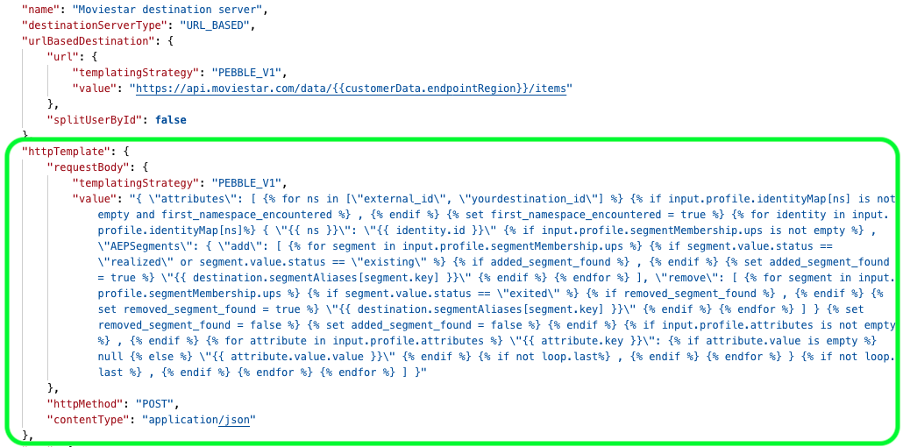

# Sjabloonspecificaties voor bestemmingen die zijn gemaakt met Destination SDK

Gebruik het malplaatjespecifieke deel van de configuratie van de bestemmingsserver om te vormen hoe te om de HTTP- verzoeken te formatteren die naar uw bestemming worden verzonden.

In een sjabloonspecificatie kunt u definiëren hoe u profielkenmerkvelden transformeert tussen het XDM-schema en de indeling die uw platform ondersteunt.

Sjabloonspecificaties maken deel uit van de configuratie van de doelserver voor realtime (streaming) doelen.

Om te begrijpen waar deze component in een integratie past die met Destination SDK wordt gecreeerd, zie het diagram in de [ configuratieopties ](../configuration-options.md) documentatie of zie de gids op hoe te [ Destination SDK gebruiken om een het stromen bestemming ](../../guides/configure-destination-instructions.md#create-server-template-configuration) te vormen.

U kunt de malplaatjespecs voor uw bestemming via het `/authoring/destination-servers` eindpunt vormen. Zie de volgende API verwijzingspagina&#39;s voor gedetailleerde API vraagvoorbeelden waar u de componenten kunt vormen die in deze pagina worden getoond.

* [Een doelserverconfiguratie maken](../../authoring-api/destination-server/create-destination-server.md)
* [Een doelserverconfiguratie bijwerken](../../authoring-api/destination-server/update-destination-server.md)

>[!IMPORTANT]
>
>Alle parameternamen en waarden die door Destination SDK worden gesteund zijn **gevoelig geval**. Om fouten in hoofdlettergevoeligheid te voorkomen, gebruikt u de namen en waarden van parameters exact zoals in de documentatie wordt getoond.

## Ondersteunde integratietypen {#supported-integration-types}

Raadpleeg de onderstaande tabel voor meer informatie over de integratietypen die de op deze pagina beschreven functionaliteit ondersteunen.

| Type integratie | Ondersteunt functionaliteit |
|---|---|
| Integraties in realtime (streaming) | Ja |
| Op bestanden gebaseerde (batch) integratie | Nee |

## Een sjabloonspecificatie configureren {#configure-template-spec}

Adobe gebruikt een malplaatjetaal gelijkend op [ Jinja ](https://jinja.palletsprojects.com/en/2.11.x/) om de gebieden van het schema XDM in een formaat om te zetten dat door uw bestemming wordt gesteund.



Ga voor meer informatie over de transformatie naar de onderstaande koppelingen:

* [Berichtindeling](message-format.md)
* [Een sjabloontaal gebruiken voor de transformaties voor identiteit, kenmerken en publieksleiding](message-format.md#using-templating)

>[!TIP]
>
>Adobe biedt het hulpmiddel van de a [ ontwikkelaar ](../../testing-api/streaming-destinations/create-template.md) aan dat u helpt een malplaatje van de berichttransformatie creëren en testen.

Zie onder een voorbeeld van een HTTP-aanvraagsjabloon, samen met beschrijvingen van elke individuele parameter.

```json
{
   "httpTemplate":{
      "httpMethod":"POST",
      "requestBody":{
         "templatingStrategy":"PEBBLE_V1",
         "value":"{ \"attributes\": [   ,    { \"{{ ns }}\": \"{{ identity.id }}\"  , \"AEPSegments\": { \"add\": [    ,   \"{{ destination.segmentAliases[segment.key] }}\"   ], \"remove\": [    ,   \"{{ destination.segmentAliases[segment.key] }}\"   ] }     ,   \"{{ attribute.key }}\":  null  \"{{ attribute.value.value }}\"   ,   }  ,    ] }"
      },
      "contentType":"application/json"
   }
}
```

| Parameter | Type | Beschrijving |
|---|---|---|
| `httpMethod` | String | *Vereist.* De methode die Adobe gebruikt voor aanroepen van uw server. Ondersteunde methoden: `GET`, `PUT`, `POST`, `DELETE`, `PATCH` . |
| `templatingStrategy` | String | *Vereist.* Gebruik `PEBBLE_V1` . |
| `value` | String | *Vereist.* Deze tekenreeks is de tekenescapeversie van de sjabloon die de HTTP-aanvragen die door Experience Platform worden verzonden opmaakt in de indeling die door uw doel wordt verwacht. <br> voor informatie over hoe te om het malplaatje te schrijven, lees de sectie op [ gebruikend het templating ](message-format.md#using-templating). <br> voor meer informatie over karakter het ontsnappen, verwijs naar de [ norm RFC JSON, sectie zeven ](https://tools.ietf.org/html/rfc8259#section-7). <br> Voor een voorbeeld van een eenvoudige transformatie, verwijs naar de [ profielattributen ](message-format.md#attributes) transformatie. |
| `contentType` | String | *Vereist.* Het inhoudstype dat uw server accepteert. Afhankelijk van welk type van output uw transformatiemalplaatje produceert, kan dit om het even welke gesteunde [ types van de toepassingsinhoud van HTTP ](https://www.iana.org/assignments/media-types/media-types.xhtml#application) zijn. In de meeste gevallen moet deze waarde worden ingesteld op `application/json` . |

{style="table-layout:auto"}

## Volgende stappen {#next-steps}

Na het lezen van dit artikel, zou u een beter inzicht in moeten hebben wat een malplaatjespecificatie is, en hoe u het kunt vormen.

Raadpleeg de volgende artikelen voor meer informatie over de andere componenten van de doelserver:

* [Serverspecificaties voor doelen die met Destination SDK zijn gemaakt](server-specs.md)
* [Berichtindeling](message-format.md)
* [Configuratie bestandsindeling](file-formatting.md)
