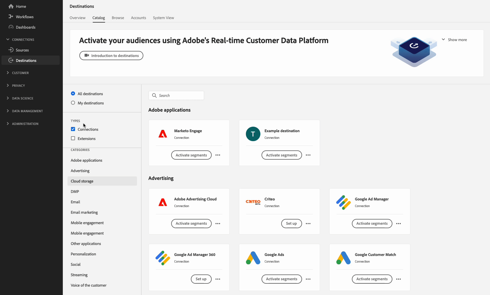

# Een [!DNL Amazon S3] doel met vooraf gedefinieerde opties voor bestandsindeling en aangepaste configuratie van bestandsnaam

## Overzicht {#overview}

Op deze pagina wordt beschreven hoe u Destination SDK kunt gebruiken om een Amazon S3-bestemming te configureren met vooraf gedefinieerde, standaard [opties voor bestandsindeling](../../server-and-file-configuration.md#file-configuration) en een aangepaste [bestandsnaamconfiguratie](../../file-based-destination-configuration.md#file-name-configuration).

Op deze pagina worden alle configuratieopties weergegeven die beschikbaar zijn voor [!DNL Amazon S3] bestemmingen. U kunt de configuraties bewerken die in de onderstaande stappen worden weergegeven, of u kunt desgewenst bepaalde onderdelen van de configuraties verwijderen.

## Vereisten {#prerequisites}

Lees de [Aan de slag met Destination SDK](../../getting-started.md) pagina voor informatie over het verkrijgen van de vereiste autorisatiegeloofsbrieven van de Adobe I/O en andere eerste vereisten om met Destination SDK APIs te werken.

## Stap 1: Een server- en bestandsconfiguratie maken {#create-server-file-configuration}

Begin met het gebruik van de `/destination-server` eindpunt om een server en dossierconfiguratie tot stand te brengen. Voor gedetailleerde beschrijvingen van de parameters in het HTTP- verzoek, lees [server- en bestandsconfiguratiespecificaties voor op bestanden gebaseerde doelen](../../server-and-file-configuration.md#s3-example) en de bijbehorende [bestandsindelingen, configuraties](../../server-and-file-configuration.md#file-configuration).

**API-indeling**

```http
POST platform.adobe.io/data/core/activation/authoring/destination-servers
```

**Verzoek**

Het volgende verzoek leidt tot een nieuwe configuratie van de bestemmingsserver, die door de parameters wordt gevormd die in de lading worden verstrekt.
De onderstaande lading bevat een algemeen [!DNL Amazon S3] configuratie, met vooraf gedefinieerd, standaard [CSV-bestandsindeling](../../server-and-file-configuration.md#file-configuration) configuratieparameters die de gebruikers in de UI van het Experience Platform kunnen bepalen.

```shell
curl -X POST https://platform.adobe.io/data/core/activation/authoring/destination-server \
 -H 'Authorization: Bearer {ACCESS_TOKEN}' \
 -H 'Content-Type: application/json' \
 -H 'x-gw-ims-org-id: {ORG_ID}' \
 -H 'x-api-key: {API_KEY}' \
 -H 'x-sandbox-name: {SANDBOX_NAME}' \
 -d '
{
    "name": "Amazon S3 destination server with predefined default CSV options",
    "destinationServerType": "FILE_BASED_S3",
    "fileBasedS3Destination": {
        "bucket": {
            "templatingStrategy": "PEBBLE_V1",
            "value": "{{customerData.bucket}}"
        },
        "path": {
            "templatingStrategy": "PEBBLE_V1",
            "value": "{{customerData.path}}"
        }
    },
    "fileConfigurations": {
        "compression": {
            "templatingStrategy": "PEBBLE_V1",
            "value": "{{customerData.compression}}"
        },
        "fileType": {
            "templatingStrategy": "PEBBLE_V1",
            "value": "{{customerData.fileType}}"
        },
        "csvOptions": {
            "quote": {
                "templatingStrategy": "NONE",
                "value": "\""
            },
            "quoteAll": {
                "templatingStrategy": "NONE",
                "value": "false"
            },
            "escape": {
                "templatingStrategy": "NONE",
                "value": "\\"
            },
            "escapeQuotes": {
                "templatingStrategy": "NONE",
                "value": "true"
            },
            "header": {
                "templatingStrategy": "NONE",
                "value": "true"
            },
            "ignoreLeadingWhiteSpace": {
                "templatingStrategy": "NONE",
                "value": "true"
            },
            "ignoreTrailingWhiteSpace": {
                "templatingStrategy": "NONE",
                "value": "true"
            },
            "nullValue": {
                "templatingStrategy": "NONE",
                "value": ""
            },
            "dateFormat": {
                "templatingStrategy": "NONE",
                "value": "yyyy-MM-dd"
            },
            "timestampFormat": {
                "templatingStrategy": "NONE",
                "value": "yyyy-MM-dd'T':mm:ss[.SSS][XXX]"
            },
            "charToEscapeQuoteEscaping": {
                "templatingStrategy": "NONE",
                "value": "\\"
            },
            "emptyValue": {
                "templatingStrategy": "NONE",
                "value": ""
            }
        }
    }
}'
```

Een succesvolle reactie keert de nieuwe configuratie van de bestemmingsserver, met inbegrip van het unieke herkenningsteken terug (`instanceId`) van de configuratie. Sla deze waarde op zoals deze in de volgende stap wordt vereist.

## Stap 2: Doelconfiguratie maken {#create-destination-configuration}

Nadat u in de vorige stap de configuratie voor de doelserver en bestandsindeling hebt gemaakt, kunt u nu de opdracht `/destinations` API eindpunt om een bestemmingsconfiguratie tot stand te brengen.

Als u verbinding wilt maken met de serverconfiguratie in [stap 1](#create-server-file-configuration) aan deze bestemmingsconfiguratie, vervang `destinationServerId` waarde in de API-aanvraag hieronder met de `instanceId` waarde verkregen bij het maken van uw doelserver in [stap 1](#create-server-file-configuration).

Zie de volgende pagina&#39;s voor een gedetailleerde beschrijving van de hieronder gebruikte parameters:

* [Verificatieconfiguratie](../../authentication-configuration.md#s3)
* [Batchdoelconfiguratie](../../file-based-destination-configuration.md#batch-configuration)
* [API-bewerkingen voor doelconfiguratie op basis van bestanden](../../destination-configuration-api.md#create-file-based)

**API-indeling**

```http
POST platform.adobe.io/data/core/activation/authoring/destinations
```

**Verzoek**

```shell
curl -X POST https://platform.adobe.io/data/core/activation/authoring/destinations \
 -H 'Authorization: Bearer {ACCESS_TOKEN}' \
 -H 'Content-Type: application/json' \
 -H 'x-gw-ims-org-id: {ORG_ID}' \
 -H 'x-api-key: {API_KEY}' \
 -H 'x-sandbox-name: {SANDBOX_NAME}' \
 -d '
{
   "name":"Amazon S3 destination with predefined CSV formatting options",
   "description":"Amazon S3 destination with predefined CSV formatting options",
   "releaseNotes":"Amazon S3 destination with predefined CSV formatting options",
   "status":"TEST",
   "customerAuthenticationConfigurations":[
      {
         "authType":"S3"
      }
   ],
   "customerEncryptionConfigurations":[
       
   ],
   "customerDataFields":[
      {
         "name":"bucket",
         "title":"Enter the name of your Amazon S3 bucket",
         "description":"Amazon S3 bucket name",
         "type":"string",
         "isRequired":true,
         "readOnly":false,
         "hidden":false
      },
      {
         "name":"path",
         "title":"Enter the path to your S3 bucket folder",
         "description":"Enter the path to your S3 bucket folder",
         "type":"string",
         "isRequired":true,
         "pattern":"^[A-Za-z]+$",
         "readOnly":false,
         "hidden":false
      },
      {
         "name":"compression",
         "title":"Compression format",
         "description":"Select the desired file compression format.",
         "type":"string",
         "isRequired":true,
         "readOnly":false,
         "enum":[
            "SNAPPY",
            "GZIP",
            "DEFLATE",
            "NONE"
         ]
      },
      {
         "name":"fileType",
         "title":"File type",
         "description":"Select the exported file type.",
         "type":"string",
         "isRequired":true,
         "readOnly":false,
         "hidden":false,
         "enum":[
            "csv",
            "json",
            "parquet"
         ],
         "default":"csv"
      }
   ],
   "uiAttributes":{
      "documentationLink":"https://www.adobe.com/go/destinations-amazon-s3-en",
      "category":"cloudStorage",
      "icon":{
         "key":"amazonS3"
      },
      "connectionType":"S3",
      "flowRunsSupported":true,
      "monitoringSupported":true,
      "frequency":"Batch"
   },
   "destinationDelivery":[
      {
         "deliveryMatchers":[
            {
               "type":"SOURCE",
               "value":[
                  "batch"
               ]
            }
         ],
         "authenticationRule":"CUSTOMER_AUTHENTICATION",
         "destinationServerId":"{{destinationServerId}}"
      }
   ],
   "schemaConfig":{
      "profileRequired":true,
      "segmentRequired":true,
      "identityRequired":true
   },
   "batchConfig":{
      "allowMandatoryFieldSelection":true,
      "allowDedupeKeyFieldSelection":true,
      "defaultExportMode":"DAILY_FULL_EXPORT",
      "allowedExportMode":[
         "DAILY_FULL_EXPORT",
         "FIRST_FULL_THEN_INCREMENTAL"
      ],
      "allowedScheduleFrequency":[
         "DAILY",
         "EVERY_3_HOURS",
         "EVERY_6_HOURS",
         "EVERY_8_HOURS",
         "EVERY_12_HOURS",
         "ONCE"
      ],
      "defaultFrequency":"DAILY",
      "defaultStartTime":"00:00",
      "filenameConfig":{
         "allowedFilenameAppendOptions":[
            "SEGMENT_NAME",
            "DESTINATION_INSTANCE_ID",
            "DESTINATION_INSTANCE_NAME",
            "ORGANIZATION_NAME",
            "SANDBOX_NAME",
            "DATETIME",
            "CUSTOM_TEXT"
         ],
         "defaultFilenameAppendOptions":[
            "DATETIME"
         ],
         "defaultFilename":"%DESTINATION%_%SEGMENT_ID%"
      },
      "backfillHistoricalProfileData":true
   }
}'
```

Een succesvolle reactie keert de nieuwe bestemmingsconfiguratie, met inbegrip van uniek herkenningsteken terug (`instanceId`) van de configuratie. Sla deze waarde op zoals nodig is als u meer HTTP-aanvragen moet indienen om de doelconfiguratie bij te werken.

## Stap 3: De gebruikersinterface van het Experience Platform controleren {#verify-ui}

Op basis van de bovenstaande configuraties wordt in de catalogus met Experience Platforms nu een nieuwe persoonlijke doelkaart weergegeven die u kunt gebruiken.



Houd in de onderstaande afbeeldingen en opnamen rekening met de opties in het dialoogvenster [activeringsworkflow voor op bestanden gebaseerde doelen](/help/destinations/ui/activate-batch-profile-destinations.md) passen de opties aan die u in de bestemmingsconfiguratie selecteerde.

Wanneer u details over de bestemming invult, ziet u hoe de velden omringd zijn de aangepaste gegevensvelden die u instelt in de configuratie.

>[!TIP]
>
>De orde waarin u de gebieden van douanegegevens aan de bestemmingsconfiguratie toevoegt wordt niet weerspiegeld in UI. De gegevensvelden van de klant worden altijd weergegeven in de volgorde die hieronder in de schermopname wordt weergegeven.


Wanneer u exportintervallen instelt, ziet u hoe de velden die u ziet, de velden zijn die u instelt in het dialoogvenster `batchConfig` configuratie.


Als u de opties voor bestandsnaamconfiguratie weergeeft, ziet u hoe de velden worden weergegeven in de `filenameConfig` opties die u instelt in de configuratie.


Als u een van de bovenstaande velden wilt aanpassen, herhaalt u [stap één](#create-server-file-configuration) en [twee](#create-destination-configuration) om de configuraties aan uw behoeften aan te passen.

## Stap 4: (Optioneel) Uw doel publiceren {#publish-destination}

>[!NOTE]
>
>Deze stap wordt niet vereist als u een privé bestemming voor uw eigen gebruik creeert, en kijkt niet om het in de catalogus van bestemmingen voor andere te gebruiken klanten te publiceren.

Na het vormen van uw bestemming, gebruik [doel-publicatie-API](../../destination-publish-api.md) om uw configuratie ter controle naar Adobe te verzenden.

## Stap 5: (Optioneel) De bestemming documenteren {#document-destination}

>[!NOTE]
>
>Deze stap wordt niet vereist als u een privé bestemming voor uw eigen gebruik creeert, en kijkt niet om het in de catalogus van bestemmingen voor andere te gebruiken klanten te publiceren.

Als u een Onafhankelijke Verkoper van de Software (ISV) of Integrator van het Systeem (SI) creeert [productievere integratie](../../overview.md#productized-custom-integrations), gebruikt u de [zelfbedieningsdocumentatie](../../docs-framework/documentation-instructions.md) om een pagina van de productdocumentatie voor uw bestemming in te stellen in [Catalogus Experience Platform doelen](../../../catalog/overview.md).

## Volgende stappen {#next-steps}

Door dit artikel te lezen, weet u nu hoe u een aangepaste versie kunt maken [!DNL Amazon S3] doel met behulp van Destination SDK. Vervolgens kan uw team de opdracht [activeringsworkflow voor op bestanden gebaseerde doelen](../../../ui/activate-batch-profile-destinations.md) om gegevens naar het doel te exporteren.
