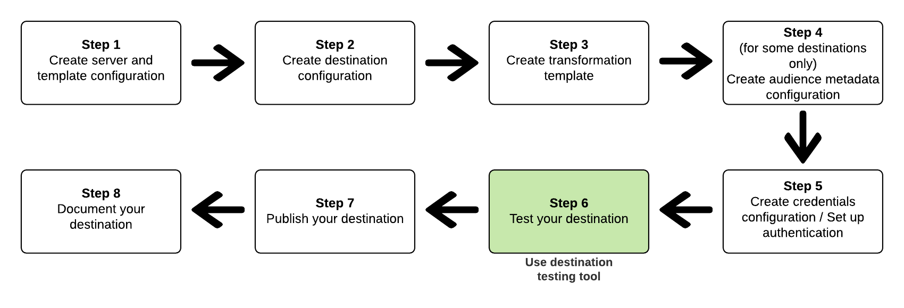

# Overzicht van de API voor streaming-doeltests

Als deel van Destination SDK, verstrekt de Adobe ontwikkelaarshulpmiddelen om u in het vormen van en het testen van uw bestemming te helpen. Deze pagina beschrijft hoe te om uw bestemmingsconfiguratie te testen. Voor informatie over hoe te om een malplaatje van de berichttransformatie tot stand te brengen, lees [ creeer en test een malplaatje van de berichttransformatie ](../../testing-api/streaming-destinations/create-template.md).

Om **te testen als uw bestemming correct wordt gevormd en om de integriteit van gegevensstromen aan uw gevormde bestemming** te verifiëren, gebruik het *testende hulpmiddel van de Bestemming*. Met dit hulpmiddel, kunt u uw bestemmingsconfiguratie testen door berichten naar uw REST API eindpunt te verzenden.

Illustreerde hieronder is hoe het testen van uw bestemming in het [ werkschema van de bestemmingsconfiguratie ](../../guides/configure-destination-instructions.md) in Destination SDK past:

 past

## Gereedschap voor het testen van de bestemming - Doel en voorwaarden {#destination-testing-tool}

Gebruik het bestemmings testende hulpmiddel om uw bestemmingsconfiguratie te testen door berichten naar het partnereindpunt te verzenden u in de [ serverconfiguratie ](../../authoring-api/destination-server/create-destination-server.md) verstrekte.

Controleer voordat u het gereedschap gebruikt of:
* Vorm uw bestemming door de stappen te volgen die in het [ werkschema van de bestemmingsconfiguratie ](../../authoring-api/destination-configuration/create-destination-configuration.md) worden geschetst en
* Vestig een verbinding aan uw bestemming, zoals gedetailleerd in [ hoe te om identiteitskaart van de bestemmingsinstantie ](../../testing-api/streaming-destinations/destination-testing-api.md#get-destination-instance-id) te krijgen.

Met dit hulpmiddel, na het vormen van uw bestemming, kunt u:
* Test of uw bestemming correct wordt gevormd;
* Verifieer de integriteit van gegevensstromen aan uw gevormde bestemming.

### Hoe wordt het gebruikt {#how-to-use}

>[!NOTE]
>
>Voor volledige API verwijzingsdocumentatie, lees [ het testen van de Bestemming API verrichtingen ](../../testing-api/streaming-destinations/destination-testing-api.md).

U kunt vraag aan het bestemmings het testen API eindpunt met of zonder profielen op het verzoek toe te voegen.

Als u geen profielen aan het verzoek toevoegt, zal de Adobe die intern voor u produceren en hen toevoegen aan het verzoek. Als u profielen wilt produceren om in dit verzoek te gebruiken, verwijs naar de [ Bron van de profielgeneratie API van de Steekproef verwijzing ](../../testing-api/streaming-destinations/sample-profile-generation-api.md). U moet profielen produceren die op het bronXDM schema, zoals aangetoond in de [ API verwijzing ](../../testing-api/streaming-destinations/sample-profile-generation-api.md#generate-sample-profiles-source-schema) worden gebaseerd. Merk op dat het bronschema het [ verenigingsschema ](../../../../profile/ui/union-schema.md) van de zandbak is die u gebruikt.

De reactie bevat het resultaat van de verwerking van het bestemmingsverzoek. Het verzoek omvat drie belangrijke onderdelen:
* Het verzoek dat door Adobe voor de bestemming wordt geproduceerd.
* De reactie die van uw bestemming wordt ontvangen.
* De lijst van profielen die in het verzoek worden verzonden, of de profielen [ door u in het verzoek ](../../testing-api/streaming-destinations/destination-testing-api.md#test-with-added-profiles) werden toegevoegd, of door Adobe werden geproduceerd als [ het lichaam van het bestemmings testende verzoek leeg ](../../testing-api/streaming-destinations/destination-testing-api.md#test-without-adding-profiles) was.

>[!NOTE]
>
>Adobe kan veelvoudige verzoek en reactieparen produceren. Als u bijvoorbeeld 10 profielen verzendt naar een doel met een `maxUsersPerRequest` waarde van 7, is er één aanvraag met 7 profielen en een andere aanvraag met 3 profielen.

**verzoek van de Steekproef met profielparameter in het lichaam**

```shell
curl --location --request POST 'https://platform.adobe.io/data/core/activation/authoring/testing/destinationInstance/3e0ac39c-ef14-4101-9fd9-cf0909814510' \
--header 'Content-Type: application/json' \
--header 'Accept: application/json' \
--header 'x-api-key: {API_KEY}' \
--header 'Authorization: Bearer {ACCESS_TOKEN}' \
--header 'x-gw-ims-org-id: {ORG_ID}' \
--header 'x-sandbox-name: {SANDBOX_NAME}' \
--data-raw '{
   "profiles":[
      {
         "segmentMembership":{
            "ups":{
               "374a9a6c-c719-4cdb-a660-155a2838e6d6":{
                  "lastQualificationTime":"2021-05-13T12:16:27.248585Z",
                  "status":"realized"
               },
               "896f8776-9498-47b4-b994-51cb3f61c2c5":{
                  "lastQualificationTime":"2021-05-13T12:16:27.248605Z",
                  "status":"realized"
               }
            }
         },
         "identityMap":{
            "Email":[
               {
                  "id":"Email-iIyJc"
               }
            ],
            "IDFA":[
               {
                  "id":"IDFA-viPAW"
               }
            ],
            "GAID":[
               {
                  "id":"GAID-Bc6LE"
               }
            ],
            "Email_LC_SHA256":[
               {
                  "id":"Email_LC_SHA256-gEOdj"
               }
            ]
         },
         "attributes":{
            "key":{
               "value":"string"
            }
         }
      }
   ]
}'
```

**verzoek van de steekproef zonder profielparameter in het lichaam**


```shell
curl --location --request POST 'https://platform.adobe.io/data/core/activation/authoring/testing/destinationInstance/3e0ac39c-ef14-4101-9fd9-cf0909814510' \
--header 'Content-Type: application/json' \
--header 'Accept: application/json' \
--header 'x-api-key: {API_KEY}' \
--header 'Authorization: Bearer {ACCESS_TOKEN}' \
--header 'x-gw-ims-org-id: {ORG_ID}' \
--header 'x-sandbox-name: {SANDBOX_NAME}' \
--data-raw ''
```

**de reactie van de Steekproef**

De inhoud van de parameter `results.httpCalls` is specifiek voor uw REST API.

```json
{
   "results":[
      {
         "aggregationKey":{
            "destinationInstanceId":"string",
            "segmentId":"string",
            "segmentStatus":"realized",
            "identityNamespaces":[
               [
                  "email",
                  "phone"
               ]
            ]
         },
         "httpCalls":[
            {
               "traceId":"a06fec2d-a886-4219-8975-4e4b7ed26539",
               "request":{
                  "body":"{ \"attributes\": [  { \"external_id\": \"external_id-h29Fq\"  , \"AdobeExperiencePlatformSegments\": { \"add\": [  \"Nirvana fans\" ,  \"RHCP fans\"   ], \"remove\": [  ] }  ,  \"key\":  \"string\"    }  ] }",
                  "headers":[
                     {
                        "Content-Type":"application/json"
                     }
                  ],
                  "method":"POST",
                  "uri":"https://api.moviestar.com/users/track"
               },
               "response":{
                  "body":"{\"status\": \"success\"}",
                  "code":"200",
                  "headers":[
                     {
                        "Connection":"keep-alive"
                     },
                     {
                        "Content-Type":"application/json"
                     },
                     {
                        "Server":"nginx"
                     },
                     {
                        "Vary":"Origin,Accept-Encoding"
                     },
                     {
                        "transfer-encoding":"chunked"
                     }
                  ]
               }
            }
         ]
      }
   ],
   "inputProfiles":[
      {
         "segmentMembership":{
            "ups":{
               "03fb9938-8537-4b4c-87f9-9c4d413a0ee5":{
                  "lastQualificationTime":"2021-06-17T12:25:12.872039Z",
                  "status":"realized"
               },
               "27e05542-d6a3-46c7-9c8e-d59d50229530":{
                  "lastQualificationTime":"2021-06-17T12:25:12.872042Z",
                  "status":"realized"
               }
            }
         },
         "personalEmail":{
            "address":"john.smith@abc.com"
         },
         "identityMap":{
            "Email":[
               {
                  "id":"Email-iIyJc"
               }
            ],
            "IDFA":[
               {
                  "id":"IDFA-viPAW"
               }
            ],
            "GAID":[
               {
                  "id":"GAID-Bc6LE"
               }
            ],
            "Email_LC_SHA256":[
               {
                  "id":"Email_LC_SHA256-gEOdj"
               }
            ]
         },
         "person":{
            "name":{
               "firstName":"string"
            }
         }
      }
   ]
}
```

Voor beschrijvingen van de verzoek en reactieparameters, verwijs naar [ het testen van de Bestemming API verrichtingen ](../../testing-api/streaming-destinations/destination-testing-api.md).

## Volgende stappen

Na het testen van uw bestemming en het bevestigen dat het correct wordt gevormd, gebruik [ bestemmings het publiceren API ](../../publishing-api/create-publishing-request.md) om uw configuratie aan Adobe voor overzicht voor te leggen.
