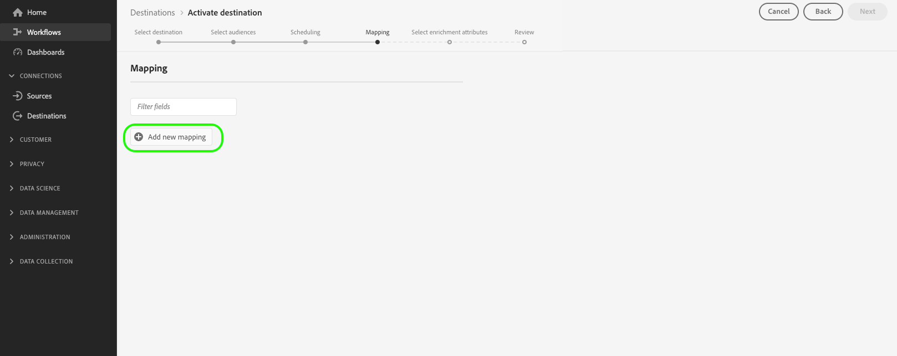

# Soorten publiek activeren om exportdoelen voor batchprofielen te gebruiken

>[!IMPORTANT]
> 
>* Om publiek te activeren en de [&#x200B; toewijzingsstap &#x200B;](#mapping) van het werkschema toe te laten, hebt u **[!UICONTROL View Destinations]**, **[!UICONTROL Activate Destinations]**, **[!UICONTROL View Profiles]**, en **[!UICONTROL View Segments]** [&#x200B; toegangsbeheertoestemmingen &#x200B;](/help/access-control/home.md#permissions) nodig.
>* Om publiek te activeren zonder door de [&#x200B; toewijzingsstap &#x200B;](#mapping) van het werkschema te gaan, hebt u **[!UICONTROL View Destinations]**, **[!UICONTROL Activate Segment without Mapping]**, **[!UICONTROL View Profiles]**, en **[!UICONTROL View Segments]** [&#x200B; toegangsbeheertoestemmingen &#x200B;](/help/access-control/home.md#permissions) nodig.
>* Om *identiteiten* uit te voeren, hebt u de **[!UICONTROL View Identity Graph]** [&#x200B; toegangsbeheertoestemming &#x200B;](/help/access-control/home.md#permissions) nodig. <br> {width="100" zoomable="yes"}
> 
> Lees het [&#x200B; overzicht van de toegangscontrole &#x200B;](/help/access-control/ui/overview.md) of contacteer uw productbeheerder om de vereiste toestemmingen te verkrijgen.

## Overzicht {#overview}

In dit artikel wordt uitgelegd welke workflow wordt vereist om het publiek in Adobe Experience Platform te activeren voor batchbestanddoelen, zoals cloudopslag en marketingdoelen voor e-mail.

## Vereisten {#prerequisites}

Om publiek aan bestemmingen te activeren, moet u met succes [&#x200B; verbonden aan een bestemming &#x200B;](./connect-destination.md) hebben. Als u dit niet reeds hebt gedaan, ga naar de [&#x200B; bestemmingscatalogus &#x200B;](../catalog/overview.md), doorblader de gesteunde bestemmingen, en vorm de bestemming die u wilt gebruiken.

## Ondersteunde bestandsindelingen voor export {#supported-file-formats-export}

De volgende bestandsindelingen worden ondersteund bij het exporteren van soorten publiek:

* CSV
* JSON
* Parquet

Houd er rekening mee dat u bij het exporteren van CSV-bestanden flexibeler kunt omgaan met de structuur die u aan geëxporteerde bestanden wilt geven. Lees meer over [&#x200B; dossier het formatteren configuratie voor Csv- dossiers &#x200B;](/help/destinations/ui/batch-destinations-file-formatting-options.md#file-configuration).

Selecteer uw gewenste dossierformaat voor de uitvoer wanneer [&#x200B; creërend een verbinding aan de op dossier-gebaseerde bestemming &#x200B;](/help/destinations/ui/connect-destination.md).

## Kies uw bestemming {#select-destination}

1. Ga naar **[!UICONTROL Connections > Destinations]** en selecteer de tab **[!UICONTROL Catalog]** .

   

1. Selecteer **[!UICONTROL Activate audiences]** op de kaart die overeenkomt met het doel waarvoor u het publiek wilt activeren, zoals in de onderstaande afbeelding wordt getoond.

   

1. Selecteer de doelverbinding die u wilt gebruiken om uw publiek te activeren en selecteer vervolgens **[!UICONTROL Next]** .

   

1. De beweging aan de volgende sectie aan [&#x200B; selecteert uw publiek &#x200B;](#select-audiences).

## Uw publiek selecteren {#select-audiences}

Als u het publiek dat u wilt activeren naar het doel wilt selecteren, schakelt u de selectievakjes links van de publieksnamen in en selecteert u **[!UICONTROL Next]** .

U kunt kiezen uit meerdere soorten publiek, afhankelijk van de oorsprong:

* **[!UICONTROL Segmentation Service]**: publiek dat in Experience Platform wordt gegenereerd door de Segmentation Service. Zie de [&#x200B; segmentatiedocumentatie &#x200B;](../../segmentation/ui/overview.md) voor meer details.
* **[!UICONTROL Custom upload]**: buiten Experience Platform gegenereerde soorten publiek die als CSV-bestanden naar Experience Platform worden geüpload. Meer over extern publiek leren, zie de documentatie bij [&#x200B; het invoeren van een publiek &#x200B;](../../segmentation/ui/audience-portal.md#import-audience). Het selecteren van publiek uit **[!UICONTROL Custom uploads]** laat automatisch de [&#x200B; Uitgezochte verrijkingsattributen &#x200B;](#select-enrichment-attributes) stap toe.
* Andere soorten publiek, afkomstig van andere Adobe-oplossingen, zoals [!DNL Audience Manager] .

>[!IMPORTANT]
>
>Wanneer u een aangepast uploadpubliek activeert naar bestemmingen die zijn gebaseerd op batchbestanden, geldt een limiet van 10 dergelijke doelgroepen die u in een gegevensstroom kunt activeren.


>[!TIP]
>
>Als u het publiek wilt verwijderen uit bestaande activeringsstromen, gebruikt u de pagina **[!UICONTROL Activation data]** . Lees de sectie op hoe te [&#x200B; om veelvoudige publiek uit activeringsstromen &#x200B;](../ui/destination-details-page.md#bulk-remove) voor details te verwijderen.

## Het exporteren van publiek plannen {#scheduling}

>[!CONTEXTUALHELP]
>id="platform_destinations_activate_schedule"
>title="Schema"
>abstract="Gebruik het potloodpictogram om het bestandstype (volledige bestanden of incrementele bestanden) en de exportfrequentie in te stellen."

>[!CONTEXTUALHELP]
>id="platform_destinations_activate_schedule_weekly_messaging"
>title="Wekelijkse uitvoer"
>abstract="<sup>* </sup> Selecteer de begindatum en de volgende uitvoer zal op die dag van de week tot de geselecteerde einddatum voorkomen."

>[!CONTEXTUALHELP]
>id="platform_destinations_activate_schedule_monthly_messaging"
>title="Maandelijkse uitvoer"
>abstract="<sup>* </sup> Selecteer de begindatum en de volgende uitvoer zal op die datum van de maand tot de geselecteerde einddatum voorkomen. Voor maanden met minder dan 30 of 31 dagen vindt de uitvoer plaats op de laatste dag van de maand."

[!DNL Adobe Experience Platform] exporteert gegevens voor e-mailmarketing en de bestemmingen van de wolkenopslag als [&#x200B; verschillende dossiertypes &#x200B;](#supported-file-formats-export). Op de pagina **[!UICONTROL Scheduling]** kunt u het schema en de bestandsnamen configureren voor elk publiek dat u exporteert.

Experience Platform stelt automatisch een standaardschema in voor elke bestandsuitvoer. U kunt het standaardschema aan uw behoeften aanpassen, door het potloodpictogram naast elk programma te selecteren, en een douaneschema te bepalen.


Als u meerdere schema&#39;s tegelijk wilt bewerken, selecteert u het publiek met de selectievakjes aan de linkerkant van het scherm en selecteert u vervolgens **[!UICONTROL Edit schedule]** . Het schema u vormt zal dan op alle uitgevoerde dossiers voor het geselecteerde publiek worden toegepast.


>[!TIP]
>
>U kunt de activeringsschema&#39;s voor het publiek voor bestaande activeringsstromen bewerken via de pagina **[!UICONTROL Activation data]** . Zie de documentatie op [&#x200B; bulkhet uitgeven activeringsprogramma&#39;s &#x200B;](../ui/destination-details-page.md#bulk-edit-schedule) voor details.

>[!IMPORTANT]
>
>[!DNL Adobe Experience Platform] splitst de exportbestanden automatisch op 5 miljoen records (rijen) per bestand. Elke rij vertegenwoordigt één profiel.
>
>Namen van gesplitste bestanden worden toegevoegd met een getal dat aangeeft dat het bestand deel uitmaakt van een grotere exportbewerking: `filename.csv` , `filename_2.csv` , `filename_3.csv` .

### Volledige bestanden exporteren {#export-full-files}

>[!CONTEXTUALHELP]
>id="platform_destinations_activate_exportoptions"
>title="Exportopties voor bestanden"
>abstract="Selecteer **de Uitvoer volledige dossiers** om een volledige momentopname van alle profielen uit te voeren die voor het publiek kwalificeren. Selecteer **de Incrementele dossiers van de Uitvoer** om slechts de profielen uit te voeren die voor het publiek sinds de laatste uitvoer kwalificeerden. <br> De eerste incrementele bestandsuitvoer bevat alle profielen die in aanmerking komen voor het publiek en die fungeren als backfill. Toekomstige incrementele bestanden bevatten alleen de profielen die voor het publiek in aanmerking zijn gekomen sinds de eerste incrementele bestandsexport."
>additional-url="https://experienceleague.adobe.com/docs/experience-platform/destinations/ui/activate/activate-batch-profile-destinations.html?lang=nl-NL#export-incremental-files" text="Incrementele bestanden exporteren"

>[!CONTEXTUALHELP]
>id="platform_destinations_activationchaining_aftersegmentevaluation"
>title="Activeren na publieksevaluatie"
>abstract="<p>De activering wordt onmiddellijk uitgevoerd nadat de dagelijkse segmentatietaak is voltooid. Zo weet u zeker dat de meest actuele profielen worden geëxporteerd.</p><p>De optie om profielen na publieksevaluatie uit te voeren is <i> niet </i> beschikbaar voor de wekelijkse en maandelijkse uitvoerfrequentie.</p>"

>[!CONTEXTUALHELP]
>id="platform_destinations_activationchaining_scheduled"
>title="Geplande activering"
>abstract="De activering wordt uitgevoerd op een vast tijdstip van de dag."

Selecteer **[!UICONTROL Export full files]** om het exporteren van een bestand met een volledige opname van alle profielkwalificaties voor het geselecteerde publiek te starten.


1. Gebruik de kiezer **[!UICONTROL Frequency]** om de exportfrequentie te selecteren:

   * **[!UICONTROL Once]**: plant een eenmalige volledige bestandsexport.
   * **[!UICONTROL Daily]**: plant de volledige bestandsexport eenmaal per dag, elke dag, op het opgegeven tijdstip.
   * **[!UICONTROL Weekly]**: selecteer de begindatum en de volgende exportbewerkingen vinden plaats op die dag van de week tot de geselecteerde einddatum.
   * **[!UICONTROL Monthly]**: selecteer de begindatum en de volgende exportbewerkingen vinden plaats op die datum van de maand tot de geselecteerde einddatum. Voor maanden met minder dan 30 of 31 dagen vindt de uitvoer plaats op de laatste dag van de maand.

   >[!NOTE]
   >
   > Wekelijks en maandelijks die opties plannen worden momenteel gesteund slechts voor de volgende op dossier-gebaseerde bestemmingen van de wolkenopslag, en slechts wanneer het activeren van [&#x200B; mensen publiek &#x200B;](../../segmentation/types/overview.md#people-audience) en [&#x200B; perspectiefpubliek &#x200B;](../../segmentation/types/overview.md#prospect-audience).
   > 
   > * [Amazon S3](../catalog/cloud-storage/amazon-s3.md)
   > * [&#x200B; Azure Blob Storage &#x200B;](../catalog/cloud-storage/azure-blob.md)
   > * [&#x200B; Gegevens die Zone &#x200B;](../catalog/cloud-storage/data-landing-zone.md) aanvoeren
   > * [&#x200B; Google Cloud Storage &#x200B;](../catalog/cloud-storage/google-cloud-storage.md)
   > * [SFTP](../catalog/cloud-storage/sftp.md)
   > 
   > Wekelijks en maandelijks zijn het plannen opties niet beschikbaar voor andere bestemmingstypes.

2. Gebruik de schakeloptie **[!UICONTROL Time]** om te bepalen of het exporteren direct na de publieksevaluatie of op een geplande basis op een bepaald tijdstip moet plaatsvinden. Wanneer u de optie **[!UICONTROL Scheduled]** selecteert, kunt u met de kiezer de tijd van de dag kiezen, in [!DNL UTC] -indeling, waarop het exporteren moet plaatsvinden.

   Gebruik de optie **[!UICONTROL After segment evaluation]** om de activeringstaak direct uit te voeren nadat de dagelijkse segmentatietaak van de Experience Platform-batch is voltooid. Met deze optie zorgt u ervoor dat de meest actuele profielen naar uw bestemming worden geëxporteerd wanneer de activeringstaak wordt uitgevoerd. Hierdoor kan een publiek meerdere keren per dag worden geëxporteerd, op basis van uw acties.

   >[!IMPORTANT]
   >
   >Als u [flexibele doelgroepevaluatie](../../segmentation/ui/audience-portal.md#flexible-audience-evaluation) uitvoert op doelgroepen die al zijn ingesteld om te worden geactiveerd na segmentevaluatie, worden de doelgroepen geactiveerd zodra de flexibele doelgroepevaluatietaak is voltooid, ongeacht eventuele eerdere dagelijkse activeringstaken. Dit kan ertoe leiden dat een publiek meerdere keren per dag wordt geëxporteerd, op basis van uw handelingen.

   <!-- Batch segmentation currently runs at {{insert time of day}} and lasts for an average {{x hours}}. Adobe reserves the right to modify this schedule. -->

   
Gebruik de optie **[!UICONTROL Scheduled]** om de activeringstaak op een vast tijdstip uit te voeren. Deze optie zorgt ervoor dat Experience Platform-profielgegevens elke dag op hetzelfde tijdstip worden geëxporteerd. De profielen die u exporteert, zijn echter mogelijk niet de meest actuele, afhankelijk van het feit of de batchsegmentatietaak is voltooid voordat de activeringstaak wordt uitgeschakeld.

   

   Wanneer het in kaart brengen van een publiek dat binnen de laatste 24 uren werd gecreeerd en door [&#x200B; partijsegmentatie &#x200B;](../../segmentation/methods/batch-segmentation.md) geëvalueerd, plaats uw dagelijkse uitvoerschema om de volgende dag bij het vroegst te beginnen. Zo weet u zeker dat de dagelijkse batchevaluatietaak eerst wordt uitgevoerd en dat u volledige publieksgegevens exporteert.

   Wanneer het vormen van uitvoerprogramma&#39;s, plaats de begintijd minstens **1 uur** na de voltooiing van de activeringsstroom. De activeringen van het publiek kunnen tot 1 uur duren om door het systeem te verspreiden. Als u een exportbewerking eerder dan 1 uur na activering wilt uitvoeren, is het mogelijk dat de geplande exportbewerking wordt gemist.

3. Gebruik de kiezer van **[!UICONTROL Date]** om de dag of het interval te kiezen waarop het exporteren moet plaatsvinden. Voor dagelijkse exportbewerkingen kunt u het beste uw begin- en einddatum instellen zodat deze aansluiten op de duur van uw campagnes op de downstreamplatforms.

   >[!IMPORTANT]
   >
   > Wanneer u een exportinterval selecteert, wordt de laatste dag van het interval niet in de exportbewerking opgenomen. Als u bijvoorbeeld een interval van 4-11 januari selecteert, wordt het laatste bestand op 10 januari geëxporteerd.

4. Selecteer **[!UICONTROL Create]** om het schema op te slaan.

### Incrementele bestanden exporteren

>[!CONTEXTUALHELP]
>id="platform_destinations_activate_something"
>title="Bestandsnaam configureren"
>abstract="Voor op een bestand gebaseerde doelen wordt een unieke bestandsnaam per publiek gegenereerd. Met de bestandsnaameditor kunt u een unieke bestandsnaam maken en bewerken of de standaardnaam behouden."

Selecteer **[!UICONTROL Export incremental files]** om een exportbewerking te starten waarbij het eerste bestand een volledige opname is van alle profielkwalificaties voor het geselecteerde publiek en volgende bestanden zijn incrementele profielkwalificaties sinds de vorige exportbewerking.

>[!IMPORTANT]
>
>Het eerste geëxporteerde incrementele bestand bevat alle profielen die in aanmerking komen voor een publiek en die als backfill functioneren.


1. Gebruik de kiezer **[!UICONTROL Frequency]** om de exportfrequentie te selecteren:

   * **[!UICONTROL Daily]**: plant de incrementele bestandsexport eenmaal per dag, elke dag, op het opgegeven tijdstip.
   * **[!UICONTROL Hourly]**: plant het incrementele exporteren van bestanden om de 3, 6, 8 of 12 uur.


2. Gebruik de kiezer van **[!UICONTROL Time]** om in [!DNL UTC] -indeling de tijd van de dag te kiezen waarop het exporteren moet plaatsvinden.

3. Gebruik de kiezer van **[!UICONTROL Date]** om het interval te kiezen waarin het exporteren moet plaatsvinden. De beste manier is om uw begin- en einddatum in te stellen op de duur van uw campagnes op uw downstreamplatforms.

   >[!IMPORTANT]
   >
   >De laatste dag van het interval wordt niet in de uitvoer opgenomen. Als u bijvoorbeeld een interval van 4-11 januari selecteert, wordt het laatste bestand op 10 januari geëxporteerd.

4. Selecteer **[!UICONTROL Create]** om het schema op te slaan.

### Bestandsnamen configureren {#configure-file-names}

>[!CONTEXTUALHELP]
>id="platform_destinations_activate_filename"
>title="Bestandsnaam configureren"
>abstract="Voor op een bestand gebaseerde doelen wordt een unieke bestandsnaam per publiek gegenereerd. Met de bestandsnaameditor kunt u een unieke bestandsnaam maken en bewerken of de standaardnaam behouden."

Voor de meeste bestemmingen, bestaan de standaarddossiernamen uit bestemmingsnaam, publiek-identiteitskaart, en een datum en tijdindicator. U kunt bijvoorbeeld uw geëxporteerde bestandsnamen bewerken om onderscheid te maken tussen verschillende campagnes of om de exporttijd van de gegevens aan de bestanden toe te voegen. Merk op dat sommige bestemmingsontwikkelaars zouden kunnen selecteren om verschillende standaard dossier te hebben toevoegt opties voor hun bestemmingen worden getoond.

Als u een modaal venster wilt openen en de bestandsnamen wilt bewerken, selecteert u het potloodpictogram. Bestandsnamen mogen maximaal 255 tekens bevatten.

>[!NOTE]
>
>In de onderstaande afbeelding ziet u hoe bestandsnamen kunnen worden bewerkt voor [!DNL Amazon S3] -doelen, maar het proces is identiek voor alle batchbestemmingen (bijvoorbeeld SFTP, [!DNL Azure Blob Storage] of [!DNL Google Cloud Storage] ).


In de bestandsnaameditor kunt u verschillende componenten selecteren om aan de bestandsnaam toe te voegen.


De doelnaam en de gebruikers-id kunnen niet uit bestandsnamen worden verwijderd. Naast deze opties kunt u de volgende opties toevoegen:

| Bestandsnaam, optie | Beschrijving |
|---------|----------|
| **[!UICONTROL Audience name]** | De naam van het geëxporteerde publiek. |
| **[!UICONTROL Date and time]** | U kunt kiezen tussen het toevoegen van een `MMDDYYYY_HHMMSS` -indeling of een UNIX 10-cijferig tijdstempel van het tijdstip waarop de bestanden worden gegenereerd. Kies een van deze opties als u voor de bestanden een dynamische bestandsnaam wilt genereren bij elke incrementele exportbewerking. |
| **[!UICONTROL Custom text]** | Alle aangepaste tekst die u aan de bestandsnamen wilt toevoegen. |
| **[!UICONTROL Destination ID]** | De id van de doelgegevensstroom die u gebruikt om het publiek te exporteren. |
| **[!UICONTROL Destination name]** | De naam van de bestemmingsgegevensstroom u gebruikt om het publiek uit te voeren. |
| **[!UICONTROL Organization name]** | Uw organisatienaam in Experience Platform. |
| **[!UICONTROL Sandbox name]** | De id van de sandbox die u gebruikt om het publiek te exporteren. |

{style="table-layout:auto"}

Als u meerdere bestandsnamen tegelijk wilt bewerken, selecteert u het publiek met de selectievakjes aan de linkerkant van het scherm en selecteert u vervolgens **[!UICONTROL Edit file name]** . De bestandsnaamopties die u configureert, worden vervolgens toegepast op alle geëxporteerde bestanden voor het geselecteerde publiek.


Selecteer **[!UICONTROL Apply changes]** om uw selectie te bevestigen.

>[!IMPORTANT]
> 
>Als u de component **[!UICONTROL Date and Time]** niet selecteert, zijn de bestandsnamen statisch en overschrijft het nieuwe geëxporteerde bestand het vorige bestand op uw opslaglocatie met elke exportbewerking. Als u een terugkerende importtaak uitvoert vanaf een opslaglocatie naar een e-mailmarketingplatform, is dit de aanbevolen optie.

Nadat u alle soorten publiek hebt geconfigureerd, selecteert u **[!UICONTROL Next]** om door te gaan.

## Toewijzing {#mapping}

In deze stap moet u de profielkenmerken selecteren die u wilt toevoegen aan de bestanden die naar de doelbestemming zijn geëxporteerd. Profielkenmerken en -identiteiten selecteren voor exporteren:

1. Selecteer **[!UICONTROL Mapping]** op de pagina **[!UICONTROL Add new mapping]** .

   

1. Selecteer de pijl rechts van de **[!UICONTROL Source field]** -vermelding.

   

1. Selecteer op de pagina **[!UICONTROL Select source field]** de profielkenmerken en -identiteiten die u wilt opnemen in de geëxporteerde bestanden naar de bestemming en kies vervolgens **[!UICONTROL Select]** .

   >[!TIP]
   > 
   >U kunt het zoekveld gebruiken om de selectie te verkleinen, zoals in de onderstaande afbeelding wordt getoond.

   Met de schakeloptie **[!UICONTROL Show only fields with data]** kunt u alleen schemavelden weergeven die zijn gevuld met waarden. Standaard worden alleen gevulde schemavelden weergegeven.

   

   Gebruik de schakeloptie **[!UICONTROL Show display names for fields]** om de vriendelijke namen voor velden weer te geven in plaats van de schemaveldnamen.

   

1. Het veld dat u hebt geselecteerd voor export, wordt nu weergegeven in de toewijzingsweergave. Desgewenst kunt u de naam van de koptekst in het geëxporteerde bestand bewerken. Selecteer hiertoe het pictogram in het doelveld.

   >[!NOTE]
   >
   >Stippen (`.`) worden niet ondersteund in veldnamen in geëxporteerde bestanden. Als een veldnaam stippen bevat (zoals `person.name.firstName` ), wordt elke stip vervangen door een onderstrepingsteken (`_` ) in de geëxporteerde kolomnaam. `person.name.firstName` wordt bijvoorbeeld `person_name_firstName` in het geëxporteerde bestand.

   

1. Typ op de pagina **[!UICONTROL Select target field]** de gewenste naam van de koptekst in het geëxporteerde bestand en kies vervolgens **[!UICONTROL Select]** .

   

1. Het veld dat u hebt geselecteerd voor export, verschijnt nu in de toewijzingsweergave en toont de bewerkte koptekst in het geëxporteerde bestand.

   

1. (Optioneel) De volgorde van de toegewezen velden in de gebruikersinterface is afhankelijk van de volgorde van de kolommen in het geëxporteerde CSV-bestand, van boven naar beneden, waarbij de bovenste rij de meest linkse kolom in het CSV-bestand is. U kunt de volgorde van de toegewezen velden op elke gewenste manier wijzigen door de toewijzingsrijen te slepen en neer te zetten, zoals hieronder wordt weergegeven.

   >[!NOTE]
   >
   >Deze functie is in bètaversie beschikbaar voor bepaalde klanten. Neem contact op met uw Adobe-vertegenwoordiger als u toegang tot deze functie wilt aanvragen.

   

1. (Optioneel) U kunt uw geëxporteerde veld selecteren om a [&#x200B; verplichte sleutel &#x200B;](#mandatory-keys) of a [&#x200B; deduplicatietoets &#x200B;](#deduplication-keys) te zijn.

   

1. Herhaal bovenstaande stappen om meer velden voor exporteren toe te voegen.

### Verplichte kenmerken {#mandatory-attributes}

>[!CONTEXTUALHELP]
>id="platform_destinations_activate_mandatorykey"
>title="Verplichte kenmerken"
>abstract="Selecteer de XDM-schemakenmerken die alle geëxporteerde profielen moeten bevatten. Profielen zonder de verplichte sleutel worden niet naar de bestemming geëxporteerd. Als u geen verplichte sleutel selecteert, worden alle gekwalificeerde profielen niet geëxporteerd, ongeacht de kenmerken ervan."

Een verplicht kenmerk is een selectievakje dat door de gebruiker wordt ingeschakeld en dat ervoor zorgt dat alle profielrecords het geselecteerde kenmerk bevatten. Alle geëxporteerde profielen bevatten bijvoorbeeld een e-mailadres. &#x200B;

U kunt kenmerken als verplicht markeren om ervoor te zorgen dat [!DNL Experience Platform] alleen de profielen exporteert die het specifieke kenmerk bevatten. Het resultaat is dat het kan worden gebruikt als extra filtermethode. Het merken van een attribuut als verplicht is **niet** vereist.

Als u geen verplicht kenmerk selecteert, worden alle gekwalificeerde profielen geëxporteerd, ongeacht de kenmerken ervan.

Men adviseert dat één van de attributen a [&#x200B; uniek herkenningsteken &#x200B;](../../destinations/catalog/email-marketing/overview.md#identity) van uw schema is. Voor meer informatie over verplichte attributen, zie de identiteitssectie in de [&#x200B; E-mail marketing bestemmingen &#x200B;](../../destinations/catalog/email-marketing/overview.md#identity) documentatie.

### Deduplicatietoetsen {#deduplication-keys}

>[!CONTEXTUALHELP]
>id="platform_destinations_activate_deduplicationkey"
>title="Deduplicatietoetsen"
>abstract="U kunt meerdere records van hetzelfde profiel uit de exportbestanden verwijderen door een deduplicatietoets te selecteren. Selecteer één naamruimte of maximaal twee XDM-schemakenmerken als een deduplicatietoets. Als u geen deduplicatietoets selecteert, kan dit leiden tot dubbele profielvermeldingen in de exportbestanden."

Een deduplicatiesleutel is een door de gebruiker gedefinieerde primaire sleutel waarmee de identiteit wordt bepaald waarmee gebruikers hun profielen willen dedupliceren. &#x200B;

Deduplicatietoetsen maken het onmogelijk meerdere records van hetzelfde profiel in één exportbestand te hebben.

Er zijn drie manieren waarop u deduplicatietoetsen kunt gebruiken in [!DNL Experience Platform] :

* Eén naamruimte voor identiteit gebruiken als een [!UICONTROL deduplication key]
* Eén profielkenmerk van een [!DNL XDM] -profiel gebruiken als [!UICONTROL deduplication key]
* Een combinatie van twee profielkenmerken van een [!DNL XDM] -profiel gebruiken als een samengestelde sleutel

>[!IMPORTANT]
>
> U kunt één naamruimte voor identiteit exporteren naar een doel en de naamruimte wordt automatisch ingesteld als deduplicatietoets. Het verzenden van meerdere naamruimten naar een doel wordt niet ondersteund.
> 
> U kunt geen combinatie van naamruimten en profielkenmerken gebruiken als deduplicatietoetsen.

### Voorbeeld van deduplicatie {#deduplication-example}

Dit voorbeeld illustreert hoe deduplicatie werkt, afhankelijk van de geselecteerde deduplicatietoetsen.

Laten we eens kijken naar de volgende twee profielen.

**Profiel A**

```json
{
  "identityMap": {
    "Email": [
      {
        "id": "johndoe@example.com"
      },
      {
        "id": "doejohn_1@example.com"
      }
    ]
  },
  "segmentMembership": {
    "ups": {
      "fa5c4622-6847-4199-8dd4-8b7c7c7ed1d6": {
        "status": "realized",
        "lastQualificationTime": "2021-03-10 10:03:08"
      }
    }
  },
  "person": {
    "name": {
      "lastName": "Doe",
      "firstName": "John"
    }
  },
  "personalEmail": {
    "address": "johndoe@example.com"
  }
}
```

**Profiel B**

```json
{
  "identityMap": {
    "Email": [
      {
        "id": "johndoe@example.com"
      },
      {
        "id": "doejohn_2@example.com"
      }
    ]
  },
  "segmentMembership": {
    "ups": {
      "fa5c4622-6847-4199-8dd4-8b7c7c7ed1d6": {
        "status": "realized",
        "lastQualificationTime": "2021-04-10 11:33:28"
      }
    }
  },
  "person": {
    "name": {
      "lastName": "D",
      "firstName": "John"
    }
  },
  "personalEmail": {
    "address": "johndoe@example.com"
  }
}
```

### Gebruiksscenario voor deduplicatie 1: geen deduplicatie {#deduplication-use-case-1}

Als u geen deduplicatie gebruikt, bevat het exportbestand de volgende items.

| PersonalEmail | firstName | lastName |
|---|---|---|
| johndoe@example.com | John | Doe |
| johndoe@example.com | John | D |


### Gebruiksscenario voor deduplicatie 2: deduplicatie gebaseerd op naamruimte voor identiteit {#deduplication-use-case-2}

Als deduplicatie wordt verondersteld door de naamruimte [!DNL Email] , bevat het exportbestand de volgende items. Profiel B is het meest recente profiel dat in aanmerking komt voor het publiek. Het is dus de enige profiel dat wordt geëxporteerd.

| E-mail* | PersonalEmail | firstName | lastName |
|---|---|---|---|
| johndoe@example.com | johndoe@example.com | John | D |
| doejohn_2@example.com | johndoe@example.com | John | D |

### Gebruiksscenario voor deduplicatie 3: deduplicatie op basis van één profielkenmerk {#deduplication-use-case-3}

Als deduplicatie wordt verondersteld door het kenmerk `personal Email` , bevat het exportbestand de volgende vermelding. Profiel B is het meest recente profiel dat in aanmerking komt voor het publiek. Het is dus de enige profiel dat wordt geëxporteerd.

| PersonalEmail* | firstName | lastName |
|---|---|---|
| johndoe@example.com | John | D |


### Gebruiksscenario deduplicatie 4: deduplicatie op basis van twee profielkenmerken {#deduplication-use-case-4}

Als deduplicatie wordt verondersteld met de samengestelde sleutel `personalEmail + lastName` , bevat het exportbestand de volgende items.

| PersonalEmail* | lastName* | firstName |
|---|---|---|
| johndoe@example.com | D | John |
| johndoe@example.com | Doe | John |

Adobe raadt u aan een naamruimte voor identiteiten, zoals een [!DNL CRM ID] - of e-mailadres, te selecteren als deduplicatietoets om ervoor te zorgen dat alle profielrecords op unieke wijze worden geïdentificeerd.

### Gedrag van deduplicatie voor profielen met dezelfde tijdstempel {#deduplication-same-timestamp}

Wanneer u profielen exporteert naar bestandsgebaseerde bestemmingen en meerdere profielen dezelfde deduplicatiesleutel en dezelfde referentietijdstempel hebben, zorgt deduplicatie ervoor dat er slechts één profiel wordt geëxporteerd. Deze tijdstempel geeft aan op welk moment het publiekslidmaatschap of de identiteitsgrafiek van een profiel voor het laatst is bijgewerkt. Voor meer informatie over hoe de profielen worden bijgewerkt en worden uitgevoerd, zie het [&#x200B; document van de profieluitvoer &#x200B;](https://experienceleague.adobe.com/nl/docs/experience-platform/destinations/how-destinations-work/profile-export-behavior#what-determines-a-data-export-and-what-is-included-in-the-export-2).

#### Belangrijkste overwegingen

* **Deterministische selectie**: Wanneer de veelvoudige profielen identieke deduplicatietoetsen en zelfde verwijzingstimestamp hebben, bepaalt de deduplicatielogica welk profiel aan uitvoer door de waarden van andere geselecteerde kolommen (exclusief complexe types zoals series, kaarten, of voorwerpen) te sorteren. De gesorteerde waarden worden in lexicografische volgorde geëvalueerd en het eerste profiel wordt geselecteerd.

* **scenario van het Voorbeeld**

Bekijk de volgende gegevens, waarbij de deduplicatietoets de `Email` -kolom is:

| E-mail* | first_name | last_name | tijdstempel |
|---|---|---|---|  
| `test1@test.com` | John | Morris | 2024-10-12T09 :50 |
| `test1@test.com` | John | Doe | 2024-10-12T09 :50 |
| `test2@test.com` | Frank | Smith | 2024-10-12T09 :50 |

{style="table-layout:auto"}

Na deduplicatie bevat het exportbestand:

| E-mail* | first_name | last_name | tijdstempel |
|---|---|---|---|  
| `test1@test.com` | John | Doe | 2024-10-12T09 :50 |
| `test2@test.com` | Frank | Smith | 2024-10-12T09 :50 |

{style="table-layout:auto"}

**Verklaring**: Voor `test1@test.com`, delen beide profielen de zelfde deduplicatiesleutel en timestamp. De algoritme sorteert de kolomwaarden `first_name` en `last_name` lexicografisch. Aangezien de voornamen identiek zijn, wordt de tijd opgelost met behulp van de kolom `last_name` , waarbij &quot;Doe&quot; voor &quot;Morris&quot; komt.

**Verbeterde betrouwbaarheid**: Dit bijgewerkte deduplicatieproces zorgt ervoor dat de opeenvolgende looppas met de zelfde coördinaten altijd de zelfde resultaten zal veroorzaken, verbeterend consistentie.

### Transformaties van gegevens uitvoeren via berekende velden {#calculated-fields}

U kunt de [&#x200B; Berekende gebieden &#x200B;](/help/destinations/ui/data-transformations-calculated-fields.md) controle gebruiken om diverse gegevenstransformaties op de gegevens uit te voeren die naar op dossier-gebaseerde bestemmingen worden uitgevoerd.

### Bekende beperkingen {#known-limitations}

De nieuwe **[!UICONTROL Mapping]** pagina heeft de volgende bekende beperkingen:

#### Het kenmerk Publiek-lidmaatschap kan niet worden geselecteerd via de toewijzingsworkflow

Vanwege een bekende beperking kunt u momenteel het venster **[!UICONTROL Select field]** niet gebruiken om `segmentMembership.seg_namespace.seg_id.status` toe te voegen aan het exporteren van bestanden. In plaats daarvan moet u de waarde `xdm: segmentMembership.seg_namespace.seg_id.status` handmatig in het schemaveld plakken, zoals hieronder wordt weergegeven.


>[!NOTE]
>
>Voor de bestemmingen van de wolkenopslag, worden de volgende attributen toegevoegd aan de afbeelding door gebrek:
>
>* `segmentMembership.seg_namespace.seg_id.status`
>* `segmentMembership.seg_namespace.seg_id.lastQualificationTime`

Het exporteren van bestanden kan op de volgende manieren variëren, afhankelijk van het feit of `segmentMembership.seg_namespace.seg_id.status` is geselecteerd:

* Als het veld `segmentMembership.seg_namespace.seg_id.status` is geselecteerd, bevatten geëxporteerde bestanden **[!UICONTROL Active]** leden in de eerste volledige momentopname en nieuwe **[!UICONTROL Active]** en **[!UICONTROL Expired]** leden in volgende incrementele exportbewerkingen.
* Als het veld `segmentMembership.seg_namespace.seg_id.status` niet is geselecteerd, bevatten geëxporteerde bestanden alleen **[!UICONTROL Active]** -leden in de eerste volledige momentopname en in volgende incrementele exportbewerkingen.

Lees meer over [&#x200B; het gedrag van de profieluitvoer voor op dossier-gebaseerde bestemmingen &#x200B;](/help/destinations/how-destinations-work/profile-export-behavior.md#file-based-destinations).

#### Naamruimten kunnen momenteel niet worden geselecteerd voor exporteren

Het selecteren van naamruimten voor exporteren, zoals wordt weergegeven in de onderstaande afbeelding, wordt momenteel niet ondersteund. Als u naamruimten selecteert die u wilt exporteren, wordt een foutbericht weergegeven in de stap **[!UICONTROL Review]** .


Als tijdelijke oplossing kunt u:

* Gebruik de oude opslagdoelen van de cloud voor de dataflows waar u naamruimten wilt opnemen in de exportbewerkingen
* Upload identiteiten als kenmerken naar Experience Platform en exporteer ze vervolgens naar de opslaglocaties van uw cloud.

## Profielkenmerken selecteren {#select-attributes}

>[!IMPORTANT]
> 
>Alle bestemmingen voor cloudopslag in de catalogus kunnen een verbeterde [[!UICONTROL Mapping] stap &#x200B;](#mapping) weergeven die de stap **[!UICONTROL Select attributes]** vervangt die in deze sectie wordt beschreven.
>
>Deze **[!UICONTROL Select attributes]** -stap wordt nog steeds weergegeven voor de e-mailmarketingdoelen Adobe Campaign, Oracle Responsys, Oracle Eloqua en Salesforce Marketing Cloud.

Voor op profiel gebaseerde bestemmingen, moet u de profielattributen selecteren die u naar de doelbestemming wilt verzenden.

1. Selecteer **[!UICONTROL Select attributes]** op de pagina **[!UICONTROL Add new field]** .

   

2. Selecteer de pijl rechts van de **[!UICONTROL Schema field]** -vermelding.

   

3. Selecteer op de pagina **[!UICONTROL Select field]** de XDM-kenmerken of naamruimten die u naar het doel wilt verzenden en kies vervolgens **[!UICONTROL Select]** .

   

4. Herhaal stap 1 tot en met 3 om meer toewijzingen toe te voegen.

>[!NOTE]
>
> Adobe Experience Platform vult uw selectie voor met vier aanbevolen, veelgebruikte kenmerken uit uw schema: `person.name.firstName` , `person.name.lastName` , `personalEmail.address` , `segmentMembership.seg_namespace.seg_id.status` .


>[!IMPORTANT]
>
>Vanwege een bekende beperking kunt u momenteel het venster **[!UICONTROL Select field]** niet gebruiken om `segmentMembership.seg_namespace.seg_id.status` toe te voegen aan het exporteren van bestanden. In plaats daarvan moet u de waarde `xdm: segmentMembership.seg_namespace.seg_id.status` handmatig in het schemaveld plakken, zoals hieronder wordt weergegeven.
>
>

Het exporteren van bestanden kan op de volgende manieren variëren, afhankelijk van het feit of `segmentMembership.seg_namespace.seg_id.status` is geselecteerd:

* Als het veld `segmentMembership.seg_namespace.seg_id.status` is geselecteerd, bevatten geëxporteerde bestanden **[!UICONTROL Active]** leden in de eerste volledige momentopname en **[!UICONTROL Active]** en **[!UICONTROL Expired]** leden in volgende incrementele exportbewerkingen.
* Als het veld `segmentMembership.seg_namespace.seg_id.status` niet is geselecteerd, bevatten geëxporteerde bestanden alleen **[!UICONTROL Active]** -leden in de eerste volledige momentopname en in volgende incrementele exportbewerkingen.

## Verrijkingskenmerken selecteren {#select-enrichment-attributes}

>[!CONTEXTUALHELP]
>id="platform_destinations_activate_exclude_enrichment_attributes"
>title="Verrijkingskenmerken uitsluiten"
>abstract="Schakel deze optie in om de profielen van het geselecteerde aangepaste geüploade publiek naar uw bestemming te exporteren, zonder alle kenmerken ervan uit te sluiten."

>[!IMPORTANT]
>
>Deze stap wordt getoond slechts als u **[!UICONTROL Custom upload]** publiek tijdens de [&#x200B; stap van de publieksselectie &#x200B;](#select-audiences) selecteerde.

Verrijkingskenmerken komen overeen met het aangepaste geüploade publiek dat in Experience Platform wordt opgenomen als **[!UICONTROL Custom uploads]** . In deze stap kunt u voor elk geselecteerd extern publiek selecteren welke kenmerken u wilt exporteren naar uw doel.


Voer de onderstaande stappen uit om verrijkingskenmerken voor elk extern publiek te selecteren:

1. In de **[!UICONTROL Enrichment attributes]** kolom, selecteer  (geef uit) knoop.
1. Selecteer **[!UICONTROL Add enrichment attribute]**. Er wordt een nieuw leeg schemaveld weergegeven.
   
1. Selecteer de knop rechts van het lege veld om het selectiescherm van het veld te openen.
1. Selecteer de kenmerken die u voor het publiek wilt exporteren.
   
1. Nadat u alle kenmerken hebt toegevoegd die u wilt exporteren, selecteert u **[!UICONTROL Save and close]** .
1. Herhaal deze stappen voor elk extern publiek.

Als u een extern publiek naar uw doelen wilt activeren zonder kenmerken te exporteren, schakelt u de schakeloptie **[!UICONTROL Exclude enrichment attributes]** in. Met deze optie exporteert u de profielen van het externe publiek, maar de bijbehorende kenmerken worden niet naar uw bestemming verzonden.

{het beeld van 0} UI die de knoop toont van de attributen van de exclusief verrijking.

Selecteer **[!UICONTROL Next]** om aan de [&#x200B; 2&rbrace; stap van het Overzicht &lbrace;te bewegen.](#review)

## Controleren {#review}

>[!NOTE]
> 
>Als er labels voor gegevensgebruik zijn toegepast op bepaalde velden in een gegevensset (in plaats van op de gehele gegevensset), wordt de toepassing van die labels op veldniveau bij activering uitgevoerd onder de volgende voorwaarden:
>
>* De velden worden gebruikt in de definitie van het publiek.
>* De velden worden geconfigureerd als geprojecteerde kenmerken voor de doelbestemming.
>
> Als het veld `person.name.firstName` bijvoorbeeld bepaalde labels voor gegevensgebruik heeft die conflicteren met de marketingactie van de bestemming, wordt in de revisiestap een schending van het gegevensgebruiksbeleid weergegeven. Voor meer informatie, zie [&#x200B; de Governance van Gegevens in Adobe Experience Platform &#x200B;](../../rtcdp/privacy/data-governance-overview.md#destinations).

Op de pagina **[!UICONTROL Review]** ziet u een overzicht van uw selectie. Selecteer **[!UICONTROL Cancel]** om de stroom te verbreken, **[!UICONTROL Back]** om uw instellingen te wijzigen of **[!UICONTROL Finish]** om uw selectie te bevestigen en gegevens naar de bestemming te verzenden.


### Goedkeuring van het beleid {#consent-policy-evaluation}

>[!CONTEXTUALHELP]
>id="platform_governance_policies_viewApplicableConsentPolicies"
>title="Toepasselijk toestemmingsbeleid weergeven"
>abstract="Als uw organisatie **het Schild van de Gezondheidszorg van Adobe** of **de Privacy &amp; het Schild van de Veiligheid van Adobe** kocht, selecteer **[!UICONTROL View applicable consent policies]** om te zien welk toestemmingsbeleid wordt toegepast en hoeveel profielen in de activering als resultaat van hen inbegrepen zijn. Deze controle is gehandicapt als uw bedrijf geen toegang tot hierboven vermelde SKUs heeft."

Als uw organisatie **het Schild van de Gezondheidszorg van Adobe** of **de Privacy &amp; het Schild van de Veiligheid van Adobe** kocht, selecteer **[!UICONTROL View applicable consent policies]** om te zien welk toestemmingsbeleid wordt toegepast en hoeveel profielen in de activering als resultaat van hen inbegrepen zijn. Lees over [&#x200B; evaluatie van het toestemmingsbeleid &#x200B;](/help/data-governance/enforcement/auto-enforcement.md#consent-policy-evaluation) voor meer informatie.

### Controle van het gegevensgebruiksbeleid {#data-usage-policy-checks}

In de stap **[!UICONTROL Review]** controleert Experience Platform ook op overtredingen van het gegevensgebruiksbeleid. Hieronder ziet u een voorbeeld waarin een beleid wordt overtreden. U kunt de workflow voor publieksactivering pas voltooien nadat u de schending hebt opgelost. Voor informatie over hoe te om beleidsschendingen op te lossen, lees over [&#x200B; schendingen van het beleid van het gegevensgebruik &#x200B;](/help/data-governance/enforcement/auto-enforcement.md#data-usage-violation) in de de documentatiesectie van het gegevensbeheer.


### Filter publiek {#filter-audiences}

In deze stap kunt u ook de beschikbare filters op de pagina gebruiken om alleen de doelgroepen weer te geven waarvan het schema of de toewijzing is bijgewerkt als onderdeel van deze workflow. U kunt ook schakelen welke tabelkolommen u wilt zien.


Als u tevreden bent met de selectie en er zijn geen beleidsovertredingen vastgesteld, selecteert u **[!UICONTROL Finish]** om uw selectie te bevestigen en gegevens naar de bestemming te verzenden.

## Activering van publiek controleren {#verify}

Bij het exporteren van soorten publiek naar opslaglocaties in de cloud maakt Adobe Experience Platform een bestand `.csv` , `.json` of `.parquet` in de opslaglocatie die u hebt opgegeven. Er wordt een nieuw bestand verwacht dat op uw opslaglocatie wordt gemaakt volgens het schema dat u instelt in de workflow. Het standaarddossierformaat wordt getoond hieronder, maar u kunt [&#x200B; de componenten van het dossier uitgeven - naam &#x200B;](#configure-file-names):
`<destinationName>_segment<segmentID>_<timestamp-yyyymmddhhmmss>.csv`

Als u bijvoorbeeld een dagelijkse exportfrequentie selecteert, kunnen de bestanden die u op drie opeenvolgende dagen ontvangt er als volgt uitzien:

```console
Salesforce_Marketing_Cloud_segment12341e18-abcd-49c2-836d-123c88e76c39_20200408061804.csv
Salesforce_Marketing_Cloud_segment12341e18-abcd-49c2-836d-123c88e76c39_20200409052200.csv
Salesforce_Marketing_Cloud_segment12341e18-abcd-49c2-836d-123c88e76c39_20200410061130.csv
```

De aanwezigheid van deze bestanden op de opslaglocatie bevestigt dat de activering is gelukt. Om te begrijpen hoe de uitgevoerde dossiers gestructureerd zijn, kunt u [&#x200B; een steekproef.csv- dossier &#x200B;](../assets/common/sample_export_file_segment12341e18-abcd-49c2-836d-123c88e76c39_20200408061804.csv) downloaden. Dit voorbeeldbestand bevat de profielkenmerken `person.firstname` , `person.lastname` , `person.gender` , `person.birthyear` en `personalEmail.address` .
