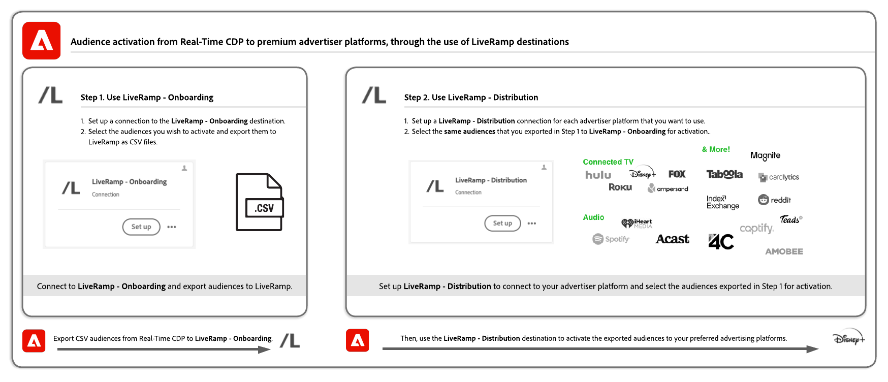

# Het publiek activeren op gekrulde doelen op basis van LiveRamp-id&#39;s

De Adobe Real-Time CDP-integratie gebruiken met [!DNL LiveRamp] om het publiek te activeren naar een gekrulde lijst met bestemmingen die [!DNL [LiveRamp RampID]](https://docs.liveramp.com/connect/en/interpreting-rampid,-liveramp-s-people-based-identifier.html) voor activering, met inbegrip van aangesloten tv- en audiobestemmingen, zoals de hieronder vermelde.

>[!IMPORTANT]
>
>U hoeft geen gegevens in te voeren of op enigerlei wijze met LiveRamp RampID&#39;s in de interface van het Experience Platform te werken.
>
> U kunt identiteiten vanuit Real-Time CDP exporteren, zoals op PII gebaseerde id&#39;s, bekende id&#39;s en aangepaste id&#39;s, zoals wordt beschreven in het dialoogvenster [LiveRamp-documentatie](https://docs.liveramp.com/connect/en/identity-and-identifier-terms-and-concepts.html#known-identifiers). Deze identiteiten komen dan overeen met [!DNL LiveRamp RampIDs] verder in de loop van het activeringsproces.

* [[!DNL 4C Insights]](#insights)
* [[!DNL Acast]](#acast)
* [[!DNL Ampersand.tv]](#ampersand-tv)
* [[!DNL Captify]](#captify)
* [[!DNL Cardlytics]](#cardlytics)
* [[!DNL Disney (Hulu/ESPN/ABC)]](#disney)
* [[!DNL iHeartMedia]](#iheartmedia)
* [[!DNL Index Exchange]](#index-exchange)
* [[!DNL Magnite CTV Platform]](#magnite)
* [[!DNL Magnite DV+ (Rubicon Project)]](#magnite-dv)
* [[!DNL Nexxen]](#nexxen)
* [[!DNL One Fox]](#fox)
* [[!DNL Pandora]](#pandora)
* [[!DNL Reddit]](#reddit)
* [[!DNL Roku]](#roku)
* [[!DNL Spotify]](#spotify)
* [[!DNL Taboola]](#taboola)
* [[!DNL TargetSpot]](#targetspot)
* [[!DNL Teads]](#teads)
* [[!DNL WB Discovery]](#wb-discovery)

In dit artikel wordt uitgelegd welke workflow nodig is om het publiek vanuit Real-Time CDP rechtstreeks vanuit de gebruikersinterface van Real-Time CDP naar de hierboven vermelde doelen te activeren.

## Workflow voor activering {#workflow}

U activeert het publiek naar verbonden tv- en audiodoelen door een proces in twee stappen te doorlopen en door het [LiveRamp - Onboarding](../catalog/advertising/liveramp-onboarding.md) en de [LiveRamp - Distributie](../catalog/advertising/liveramp-distribution.md) doelen, zoals weergegeven in de onderstaande afbeelding.

{width="1920" zoomable="yes"}

Eerst exporteert u uw publiek van Real-Time CDP naar de [[!DNL LiveRamp - Onboarding]](../catalog/advertising/liveramp-onboarding.md) doel, als CSV-bestanden.

Nadat u uw publiek hebt geëxporteerd, activeert u deze via het dialoogvenster [[!DNL LiveRamp - Distribution]](../catalog/advertising/liveramp-distribution.md) bestemming.

>[!TIP]
>
>Met dit proces kunt u uw publiek activeren naar doelen als [[!DNL Roku]](../catalog/advertising/liveramp-distribution.md#roku), [[!DNL Disney]](../catalog/advertising/liveramp-distribution.md#disney)en meer, rechtstreeks vanuit de gebruikersinterface van Real-Time CDP, zonder dat u zich hoeft aan te melden bij [!DNL LiveRamp] account voor activering.

### Videotutorial {#video}

Bekijk de onderstaande video voor een end-to-end uitleg van de workflow die in deze pagina wordt beschreven.

>[!VIDEO](https://video.tv.adobe.com/v/3425367)

### Stap 1: verzend uw publiek van Experience Platform naar LiveRamp, door [!DNL LiveRamp - Onboarding] doel {#onboarding}

Het eerste wat u moet doen om uw publiek te activeren naar gekromde doelen op basis van LiveRamp-id&#39;s is: **Uw publiek exporteren van Experience Platform naar[!DNL LiveRamp]**.

U doet dit met de **[!DNL LiveRamp - Onboarding]** bestemming.

Leren hoe te om te vormen [!DNL LiveRamp - Onboarding] doel en exporteer uw publiek vanuit het Experience Platform, lees de [[!DNL LiveRamp - Onboarding]](../catalog/advertising/liveramp-onboarding.md) doeldocumentatie.

>[!IMPORTANT]
>
>Wanneer u bestanden exporteert naar de [!DNL LiveRamp - Onboarding] doel, Platform genereert één CSV-bestand voor elk [beleids-id samenvoegen](../../profile/merge-policies/overview.md). Zie de [[!DNL LiveRamp - Onboarding]](../catalog/advertising/liveramp-onboarding.md) doeldocumentatie voor gedetailleerde informatie over hoe u de gegevensexport naar LiveRamp kunt valideren.

Nadat u uw publiek naar LiveRamp hebt geëxporteerd, kunt u doorgaan [stap 2](#distribution).

>[!TIP]
>
>Voor de overgang naar [stap 2](#distribution), [validate](../catalog/advertising/liveramp-onboarding.md#exported-data) dat uw publiek is geëxporteerd naar LiveRamp. Zie de documentatie op [bewaking van doelgegevens](../../dataflows/ui/monitor-destinations.md#dataflow-runs-for-batch-destinations) en lees de specifieke monitoringgegevens voor [[!DNL LiveRamp - Onboarding]](../catalog/advertising/liveramp-onboarding.md#exported-data).

### Stap 2: Activeer het publiek aan boord van de computer naar aangesloten tv- en audiodoelen via de [!DNL LiveRamp - Distribution] doel {#distribution}

Nadat u [gevalideerd](../catalog/advertising/liveramp-onboarding.md#exported-data) dat uw publiek is geëxporteerd naar LiveRamp, is het tijd om het publiek te activeren naar uw voorkeursdoelen, zoals [[!DNL Roku]](../catalog/advertising/liveramp-distribution.md#roku), [[!DNL Disney]](../catalog/advertising/liveramp-distribution.md#disney)en meer.

U activeert het publiek (geëxporteerd in [stap 1](#onboarding)) door de **[!DNL LiveRamp - Distribution]** bestemming.

Leren hoe te om te vormen **[!DNL LiveRamp - Distribution]** doel en activeer het publiek waarin u hebt geëxporteerd [stap 1](#onboarding), lees de [[!DNL LiveRamp - Distribution]](../catalog/advertising/liveramp-distribution.md) doeldocumentatie.

>[!IMPORTANT]
>
>In de **doelselectie** van de **[!DNL LiveRamp - Distribution]** doel, moet u selecteren *exact hetzelfde publiek* die u naar [LiveRamp - Onboarding](../catalog/advertising/liveramp-onboarding.md) bestemming in [stap 1](#onboarding).

Wanneer u vormt **[!DNL LiveRamp - Distribution]** doel, moet u een specifieke verbinding voor elke stroomafwaartse bestemming tot stand brengen die u (Roku, Disney, etc.) wilt gebruiken.

>[!TIP]
>
>Bij de naam van het doel raadt de Adobe u aan deze notatie te volgen: `LiveRamp - Downstream Destination Name`. Met dit naamgevingspatroon kunt u snel uw doelen identificeren in het dialoogvenster [Bladeren](../ui/destinations-workspace.md#browse) tabblad van de werkruimte Doelen.
> 
>Voorbeeld: `LiveRamp - Roku`.

## Geëxporteerde gegevens/Gegevens valideren bij exporteren {#exported-data}

Om de succesvolle uitvoer van uw publiek naar te bevestigen [[!DNL LiveRamp - Onboarding]](../catalog/advertising/liveramp-onboarding.md) doel, zie de documentatie op [bewaking van doelgegevens](../../dataflows/ui/monitor-destinations.md#dataflow-runs-for-batch-destinations) en lees de specifieke monitoringgegevens voor [[!DNL LiveRamp - Onboarding]](../catalog/advertising/liveramp-onboarding.md#exported-data).

Als u wilt controleren of uw publiek correct is geactiveerd voor uw favoriete advertentieplatform (zoals Roku, Disney en anderen), meldt u zich aan bij uw account voor het doelplatform en controleert u de activeringswaarden.
