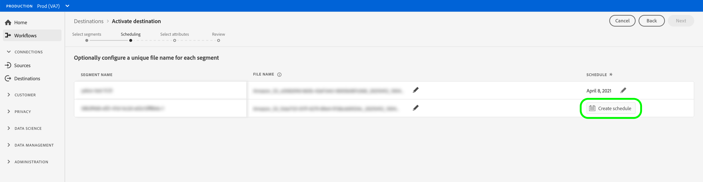
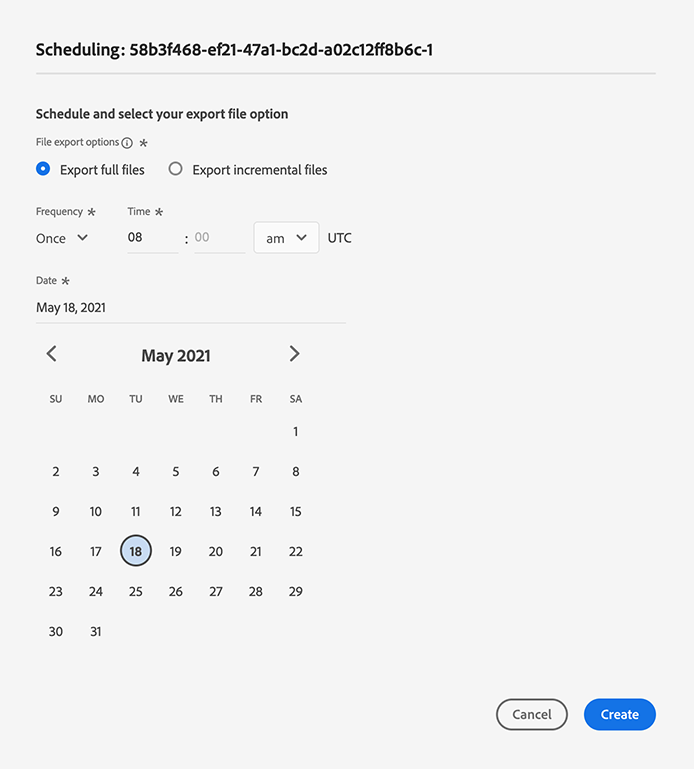

# Profielen en segmenten naar een doel activeren

## Overzicht {#overview}

Activeer de gegevens in [!DNL Adobe Experience Platform] door segmenten aan bestemmingen toe te wijzen. Volg onderstaande stappen om dit te bereiken.

## Vereisten {#prerequisites}

Om gegevens aan bestemmingen te activeren, moet u met succes [een bestemming](./connect-destination.md) hebben aangesloten. Als u dit niet reeds hebt gedaan, ga naar [doelcatalogus](../catalog/overview.md), doorblader de gesteunde bestemmingen, en opstelling één of meerdere bestemmingen.

## Gegevens {#activate-data} activeren

De stappen in de activeringswerkstroom variëren enigszins per doeltype. De volledige werkstroom voor alle bestemmingstypes wordt hieronder geschetst.

## Selecteer welk doel om gegevens te activeren naar {#select-destination}

Van toepassing op: Alle bestemmingen

Navigeer in de Adobe Experience Platform-gebruikersinterface naar **[!UICONTROL Destinations]** > **[!UICONTROL Browse]** en klik op de **[!UICONTROL Activate]**-knop die correspondeert met het doel waar u de segmenten wilt activeren, zoals in de onderstaande afbeelding wordt getoond.


Voer de stappen in de volgende sectie uit om de segmenten te selecteren die u wilt activeren.

## [!UICONTROL Select Segments] stap  {#select-segments}

Van toepassing op: Alle bestemmingen


Selecteer in de **[!UICONTROL Activate destination]**-workflow op de **[!UICONTROL Select Segments]**-pagina een of meer segmenten die u wilt activeren op de bestemming. Selecteer **[!UICONTROL Next]** om naar de volgende stap te gaan.


## [!UICONTROL Mapping] stap {#mapping}

>[!CONTEXTUALHELP]
>id="platform_destinations_activate_applytransformation"
>title="Transformatie toepassen"
>abstract="Schakel deze optie in als u niet-gehashte bronvelden gebruikt, zodat Adobe Experience Platform deze automatisch verbergt bij activering."

Van toepassing op: sociale bestemmingen en Google Customer Match-advertentiebestemming


Voor sociale bestemmingen, moet u bronattributen of identiteitsnamespaces selecteren om als doelidentiteiten in de bestemming in kaart te brengen.

## Voorbeeld: publieksgegevens activeren in [!DNL Facebook Custom Audience] {#example-facebook}

Hieronder ziet u een voorbeeld van correcte identiteitstoewijzing bij het activeren van publieksgegevens in [!DNL Facebook].

Bronvelden selecteren:

* Selecteer de naamruimte `Email` als bronidentiteit als de e-mailadressen die u gebruikt geen hashed zijn.
* Selecteer de naamruimte `Email_LC_SHA256` als bronidentiteit als u de e-mailadressen van de klant bij het invoeren van gegevens hebt gewijzigd in [!DNL Platform], volgens [!DNL Facebook] [e-mailhashingvereisten](../catalog/social/facebook.md#email-hashing-requirements).
* Selecteer `PHONE_E.164` namespace als bronidentiteit als uw gegevens uit niet-gehakte telefoonaantallen bestaan. [!DNL Platform] hash de telefoonnummers om aan de  [!DNL Facebook] vereisten te voldoen.
* Selecteer `Phone_SHA256` namespace als bronidentiteit als u telefoonaantallen op gegevensinvoer in [!DNL Platform], volgens [!DNL Facebook] [de vereisten van de het hakken van het telefoonaantal ](../catalog/social/facebook.md#phone-number-hashing-requirements) hakt.
* Selecteer `IDFA` namespace als bronidentiteit als uw gegevens uit [!DNL Apple] apparaat IDs bestaan.
* Selecteer `GAID` namespace als bronidentiteit als uw gegevens uit [!DNL Android] apparaat IDs bestaan.
* Selecteer `Custom` namespace als bronidentiteit als uw gegevens uit ander type herkenningstekens bestaan.

Doelvelden selecteren:

* Selecteer `Email_LC_SHA256` namespace als doelidentiteit wanneer uw bronnamespaces of `Email` of `Email_LC_SHA256` zijn.
* Selecteer `Phone_SHA256` namespace als doelidentiteit wanneer uw bronnamespaces of `PHONE_E.164` of `Phone_SHA256` zijn.
* Selecteer `IDFA` of `GAID` namespaces als doelidentiteit wanneer uw bronnamespaces `IDFA` of `GAID` zijn.
* Selecteer de naamruimte `Extern_ID` als doelidentiteit wanneer uw bronnaamruimte een aangepaste naamruimte is.


Gegevens uit naamruimten zonder hashing worden na activering automatisch gehasht door [!DNL Platform].

Kenmerkbrongegevens worden niet automatisch gehasht. Wanneer het bronveld hashingkenmerken bevat, schakelt u de optie **[!UICONTROL Apply transformation]** in om [!DNL Platform] de gegevens automatisch te laten hashen bij activering.


 

## Voorbeeld: publieksgegevens activeren in [!DNL Google Customer Match] {#example-gcm}

Dit is een voorbeeld van correcte identiteitstoewijzing wanneer het activeren van publieksgegevens in [!DNL Google Customer Match].

Bronvelden selecteren:

* Selecteer de naamruimte `Email` als bronidentiteit als de e-mailadressen die u gebruikt geen hashed zijn.
* Selecteer de naamruimte `Email_LC_SHA256` als bronidentiteit als u de e-mailadressen van de klant bij het invoeren van gegevens hebt gewijzigd in [!DNL Platform], volgens [!DNL Google Customer Match] [e-mailhashingvereisten](../catalog/social/../advertising/google-customer-match.md).
* Selecteer `PHONE_E.164` namespace als bronidentiteit als uw gegevens uit niet-gehakte telefoonaantallen bestaan. [!DNL Platform] hash de telefoonnummers om aan de  [!DNL Google Customer Match] vereisten te voldoen.
* Selecteer `Phone_SHA256_E.164` namespace als bronidentiteit als u telefoonaantallen op gegevensinvoer in [!DNL Platform], volgens [!DNL Facebook] [de vereisten van de het hakken van het telefoonaantal ](../catalog/social/../advertising/google-customer-match.md) hakt.
* Selecteer `IDFA` namespace als bronidentiteit als uw gegevens uit [!DNL Apple] apparaat IDs bestaan.
* Selecteer `GAID` namespace als bronidentiteit als uw gegevens uit [!DNL Android] apparaat IDs bestaan.
* Selecteer `Custom` namespace als bronidentiteit als uw gegevens uit ander type herkenningstekens bestaan.

Doelvelden selecteren:

* Selecteer `Email_LC_SHA256` namespace als doelidentiteit wanneer uw bronnamespaces of `Email` of `Email_LC_SHA256` zijn.
* Selecteer `Phone_SHA256_E.164` namespace als doelidentiteit wanneer uw bronnamespaces of `PHONE_E.164` of `Phone_SHA256_E.164` zijn.
* Selecteer `IDFA` of `GAID` namespaces als doelidentiteit wanneer uw bronnamespaces `IDFA` of `GAID` zijn.
* Selecteer de naamruimte `User_ID` als doelidentiteit wanneer uw bronnaamruimte een aangepaste naamruimte is.


Gegevens uit naamruimten zonder hashing worden na activering automatisch gehasht door [!DNL Platform].

Kenmerkbrongegevens worden niet automatisch gehasht. Wanneer het bronveld hashingkenmerken bevat, schakelt u de optie **[!UICONTROL Apply transformation]** in om [!DNL Platform] de gegevens automatisch te laten hashen bij activering.


## **[!UICONTROL Scheduling]** stap {#scheduling}

Van toepassing op: E-mailmarketingbestemmingen en cloudopslagbestemmingen


[!DNL Adobe Experience Platform] Hiermee exporteert u gegevens voor e-mailmarketing en cloudopslagbestemmingen in de vorm van  [!DNL CSV] bestanden. In de stap **[!UICONTROL Scheduling]**, kunt u het programma en de dossiernamen voor elk segment vormen u uitvoert. Het is verplicht het schema te configureren, maar het configureren van de bestandsnaam is optioneel.

>[!IMPORTANT]
> 
>[!DNL Adobe Experience Platform] Hiermee worden de exportbestanden automatisch gesplitst op 5 miljoen records (rijen) per bestand. Elke rij vertegenwoordigt één profiel.
>
>Namen van gesplitste bestanden worden toegevoegd met een getal dat aangeeft dat het bestand deel uitmaakt van een grotere exportbewerking, als zodanig: `filename.csv`, `filename_2.csv`, `filename_3.csv`.

Selecteer **[!UICONTROL Create schedule]** knoop die aan het segment beantwoordt dat u naar uw bestemming wilt verzenden.



### Volledige bestanden exporteren {#export-full-files}

Selecteer **[!UICONTROL Export full files]** om uw uitgevoerde dossiers een volledige momentopname van alle profielen te hebben die voor dat segment kwalificeren.



1. Met de kiezer **[!UICONTROL Frequency]** kunt u kiezen tussen één keer (**[!UICONTROL Once]**) of **[!UICONTROL Daily]** exporteren. Wanneer u een volledig bestand **[!UICONTROL Daily]** exporteert, wordt het bestand elke dag geëxporteerd van de begindatum tot de einddatum om 12:00 uur UTC (7:00 uur EST).
2. Gebruik de kiezer **[!UICONTROL Time]** om het tijdstip van de dag in [!DNL UTC]-indeling te kiezen wanneer het exporteren moet plaatsvinden. Wanneer u een bestand **[!UICONTROL Daily]** exporteert, wordt het bestand elke dag geëxporteerd van de begindatum tot de einddatum op het moment dat u selecteert.

   >[!IMPORTANT]
   >
   >De optie om bestanden op een bepaald tijdstip te exporteren bevindt zich momenteel in de bètaversie en is alleen beschikbaar voor een geselecteerd aantal klanten.

3. Gebruik de kiezer **[!UICONTROL Date]** om de dag of het interval te kiezen waarop het exporteren moet plaatsvinden.
4. Selecteer **[!UICONTROL Create]** om het schema op te slaan.

### Incrementele bestanden {#export-incremental-files} exporteren

Selecteer **[!UICONTROL Export incremental files]** als u wilt dat uw geëxporteerde bestanden alleen de profielen bevatten die voor dat segment zijn gekwalificeerd sinds de laatste exportbewerking.

>[!IMPORTANT]
>
>Het eerste geëxporteerde incrementele bestand bevat alle profielen die in aanmerking komen voor een segment en die als backfill werken.


1. Met de kiezer **[!UICONTROL Frequency]** kunt u kiezen tussen **[!UICONTROL Daily]** of **[!UICONTROL Hourly]** exporteren. Wanneer u een incrementeel bestand **[!UICONTROL Daily]** exporteert, wordt het bestand elke dag geëxporteerd van de begindatum tot de einddatum om 12:00 uur UTC (7:00 uur EST).
   * Wanneer u **[!UICONTROL Hourly]** selecteert, gebruikt u de **[!UICONTROL Every]**-kiezer om te kiezen tussen de uuropties **[!UICONTROL 3]**, **[!UICONTROL 6]**, **[!UICONTROL 8]** en **[!UICONTROL 12]**.

      >[!IMPORTANT]
      >
      >De optie om incrementele bestanden om de 3, 6, 8 of 12 uur te exporteren, bevindt zich momenteel in de bètaversie en is alleen beschikbaar voor een geselecteerd aantal klanten. Klanten die geen bètaversie zijn, kunnen incrementele bestanden eenmaal per dag exporteren.

2. Gebruik de kiezer **[!UICONTROL Time]** om het tijdstip van de dag in [!DNL UTC]-indeling te kiezen wanneer het exporteren moet plaatsvinden.

   >[!IMPORTANT]
   >
   >De optie om de tijd van de dag voor de uitvoer te selecteren is slechts beschikbaar aan een geselecteerd aantal klanten. Klanten die geen bèta zijn, kunnen incrementele bestanden eenmaal per dag om 12:00 uur UTC (7:00 UUR EST) exporteren.

3. Gebruik de kiezer **[!UICONTROL Date]** om de dag of het interval te kiezen waarop het exporteren moet plaatsvinden.
4. Selecteer **[!UICONTROL Create]** om het schema op te slaan.

### Bestandsnamen {#file-names} configureren

De standaardbestandsnamen bestaan uit een doelnaam, segment-id en een datum- en tijdindicator. U kunt bijvoorbeeld uw geëxporteerde bestandsnamen bewerken om onderscheid te maken tussen verschillende campagnes of om de exporttijd van de gegevens aan de bestanden toe te voegen.

Selecteer het potloodpictogram om een modaal venster te openen en de bestandsnamen te bewerken. Bestandsnamen mogen maximaal 255 tekens bevatten.


In de bestandsnaameditor kunt u verschillende componenten selecteren om aan de bestandsnaam toe te voegen.


De doelnaam en segment-id kunnen niet uit bestandsnamen worden verwijderd. Naast deze, kunt u het volgende toevoegen:

* **[!UICONTROL Segment name]**: U kunt de segmentnaam aan de bestandsnaam toevoegen.
* **[!UICONTROL Date and time]**: U kunt kiezen tussen het toevoegen van een  `MMDDYYYY_HHMMSS` indeling of een Unix 10-cijferige tijdstempel van het tijdstip waarop de bestanden worden gegenereerd. Kies een van deze opties als u voor de bestanden een dynamische bestandsnaam wilt genereren bij elke incrementele exportbewerking.
* **[!UICONTROL Custom text]**: Voeg aangepaste tekst toe aan de bestandsnamen.

Selecteer **[!UICONTROL Apply changes]** om uw selectie te bevestigen.

>[!IMPORTANT]
> 
>Als u de component **[!UICONTROL Date and Time]** niet selecteert, zijn de bestandsnamen statisch en overschrijft het nieuwe geëxporteerde bestand het vorige bestand op uw opslaglocatie met elke exportbewerking. Als u een terugkerende importtaak uitvoert vanaf een opslaglocatie naar een e-mailmarketingplatform, is dit de aanbevolen optie.

Nadat u alle segmenten hebt geconfigureerd, selecteert u **[!UICONTROL Next]** om door te gaan.

## **[!UICONTROL Segment schedule]** stap  {#segment-schedule}

Van toepassing op: reclamebestemmingen, sociale bestemmingen


Op **[!UICONTROL Segment schedule]** pagina, kunt u de begindatum voor het verzenden van gegevens naar de bestemming, en de frequentie plaatsen om gegevens naar de bestemming te verzenden.

>[!IMPORTANT]
>
>Voor sociale bestemmingen, moet u de oorsprong van uw publiek in deze stap selecteren. U kunt pas verdergaan met de volgende stap nadat u een van de opties in de onderstaande afbeelding hebt geselecteerd.


>[!IMPORTANT]
>
>Voor Google Customer Match moet u [!UICONTROL App ID] in deze stap opgeven wanneer u [!DNL IDFA] of [!DNL GAID] segmenten activeert.


## **[!UICONTROL Select attributes]** stap  {#select-attributes}

Van toepassing op: e-mailmarketingdoelen en cloudopslagdoelen


Selecteer **[!UICONTROL Select attributes]** op de pagina en kies de kenmerken die u naar de bestemming wilt verzenden.**[!UICONTROL Add new field]**

>[!NOTE]
>
> Adobe Experience Platform vult uw selectie voor met vier aanbevolen, veelgebruikte kenmerken uit uw schema: `person.name.firstName`, `person.name.lastName`, `personalEmail.address`, `segmentMembership.status`.

Het exporteren van bestanden kan op de volgende manieren variëren, afhankelijk van het feit of `segmentMembership.status` is geselecteerd:
* Als het veld `segmentMembership.status` is geselecteerd, bevatten geëxporteerde bestanden **[!UICONTROL Active]** leden in de eerste volledige momentopname en **[!UICONTROL Active]** en **[!UICONTROL Expired]** leden in volgende incrementele exportbewerkingen.
* Als het veld `segmentMembership.status` niet is geselecteerd, nemen geëxporteerde bestanden alleen **[!UICONTROL Active]** leden op in de eerste volledige momentopname en in volgende incrementele exportbewerkingen.


### Verplichte kenmerken {#mandatory-attributes}

>[!CONTEXTUALHELP]
>id="platform_destinations_activate_mandatorykey"
>title="Verplichte kenmerken"
>abstract="Selecteer de XDM-schemakenmerken die alle geëxporteerde profielen moeten bevatten. Profielen zonder de verplichte sleutel worden niet naar de bestemming geëxporteerd. Als u geen verplichte sleutel selecteert, worden alle gekwalificeerde profielen geëxporteerd, ongeacht hun kenmerken."
>additional-url="http://www.adobe.com/go/destinations-mandatory-attributes-en" text="Meer informatie in documentatie"

U kunt kenmerken als verplicht markeren om ervoor te zorgen dat [!DNL Platform] alleen de profielen exporteert die het specifieke kenmerk bevatten. Het resultaat is dat het kan worden gebruikt als extra filtermethode. Het markeren van een kenmerk als verplicht is **niet** vereist.

Als u geen verplicht kenmerk selecteert, worden alle gekwalificeerde profielen geëxporteerd, ongeacht de kenmerken ervan.

Men adviseert dat één van de attributen een [unieke herkenningsteken](../../destinations/catalog/email-marketing/overview.md#identity) van uw schema is. Raadpleeg de identiteitssectie in de documentatie [E-mailmarketingdoelen](../../destinations/catalog/email-marketing/overview.md#identity) voor meer informatie over verplichte kenmerken.

### Deduplicatietoetsen {#deduplication-keys}

>[!CONTEXTUALHELP]
>id="platform_destinations_activate_deduplicationkey"
>title="Deduplicatietoetsen"
>abstract="U kunt meerdere records van hetzelfde profiel uit de exportbestanden verwijderen door een deduplicatietoets te selecteren. Selecteer één naamruimte of maximaal twee XDM-schemakenmerken als een deduplicatietoets. Als u geen deduplicatietoets selecteert, kan dit leiden tot dubbele profielvermeldingen in de exportbestanden."
>additional-url="http://www.adobe.com/go/destinations-deduplication-keys-en" text="Meer informatie in documentatie"

>[!IMPORTANT]
>
>De optie om deduplicatietoetsen te gebruiken is momenteel in bèta en is alleen beschikbaar voor een beperkt aantal klanten.

Deduplicatietoetsen maken het onmogelijk meerdere records van hetzelfde profiel in één exportbestand te hebben.

Er zijn drie manieren u deduplicatietoetsen in [!DNL Platform] kunt gebruiken:

* Eén naamruimte voor identiteit gebruiken als een [!UICONTROL deduplication key]
* Eén profielkenmerk van een [!DNL XDM]-profiel gebruiken als [!UICONTROL deduplication key]
* Een combinatie gebruiken van twee profielkenmerken van een [!DNL XDM] profiel als samengestelde sleutel

>[!IMPORTANT]
>
> U kunt één naamruimte voor identiteit exporteren naar een doel en de naamruimte wordt automatisch ingesteld als deduplicatietoets. Het verzenden van meerdere naamruimten naar een doel wordt niet ondersteund.
> 
> U kunt geen combinatie van naamruimten en profielkenmerken gebruiken als deduplicatietoetsen.

### Voorbeeld van deduplicatie {#deduplication-example}

Dit voorbeeld illustreert hoe deduplicatie werkt, afhankelijk van de geselecteerde deduplicatietoetsen.

Laten we eens kijken naar de volgende twee profielen.

**Profiel A**

```json
{
  "identityMap": {
    "Email": [
      {
        "id": "johndoe_1@example.com"
      },
      {
        "id": "johndoe_2@example.com"
      }
    ]
  },
  "segmentMembership": {
    "ups": {
      "fa5c4622-6847-4199-8dd4-8b7c7c7ed1d6": {
        "status": "existing",
        "lastQualificationTime": "2021-03-10 10:03:08"
      }
    }
  },
  "person": {
    "name": {
      "lastName": "Doe",
      "firstName": "John"
    }
  },
  "personalEmail": {
    "address": "johndoe@example.com"
  }
}
```

**Profiel B**

```json
{
  "identityMap": {
    "Email": [
      {
        "id": "johndoe_1@example.com"
      },
      {
        "id": "johndoe_2@example.com"
      }
    ]
  },
  "segmentMembership": {
    "ups": {
      "fa5c4622-6847-4199-8dd4-8b7c7c7ed1d6": {
        "status": "existing",
        "lastQualificationTime": "2021-04-10 11:33:28"
      }
    }
  },
  "person": {
    "name": {
      "lastName": "D",
      "firstName": "John"
    }
  },
  "personalEmail": {
    "address": "johndoe@example.com"
  }
}
```

### Gebruiksscenario voor deduplicatie 1: geen deduplicatie

Als u geen deduplicatie gebruikt, bevat het exportbestand de volgende items.

| PersonalEmail | firstName | lastName |
|---|---|---|
| johndoe@example.com | John | Doe |
| johndoe@example.com | John | D |


### Gebruiksscenario 2 van deduplicatie: deduplicatie op basis van naamruimte van identiteit

Als deduplicatie wordt verondersteld door de naamruimte [!DNL Email], bevat het exportbestand de volgende items. Profiel B is het meest recente profiel dat in aanmerking komt voor het segment. Het is dus de enige die wordt geëxporteerd.

| Email* | PersonalEmail | firstName | lastName |
|---|---|---|---|
| johndoe_1@example.com | johndoe@example.com | John | D |
| johndoe_2@example.com | johndoe@example.com | John | D |

### Gebruiksscenario voor deduplicatie 3: deduplicatie op basis van één profielkenmerk

Ervan uitgaande dat het kenmerk `personal Email` deduplicatie bevat, bevat het exportbestand de volgende vermelding. Profiel B is het meest recente profiel dat in aanmerking komt voor het segment. Het is dus de enige die wordt geëxporteerd.

| PersonalEmail* | firstName | lastName |
|---|---|---|
| johndoe@example.com | John | D |


### Gebruiksscenario voor deduplicatie 4: deduplicatie op basis van twee profielkenmerken (samengestelde deduplicatietoets)

Als deduplicatie wordt verondersteld met de samengestelde sleutel `personalEmail + lastName`, bevat het exportbestand de volgende items.

| PersonalEmail* | lastName* | firstName |
|---|---|---|
| johndoe@example.com | D | John |
| johndoe@example.com | Doe | John |


Adobe raadt u aan een naamruimte voor identiteiten, zoals een [!DNL CRM ID]- of e-mailadres, te selecteren als deduplicatietoets om ervoor te zorgen dat alle profielrecords op unieke wijze worden geïdentificeerd.

>[!NOTE]
> 
>Als er labels voor gegevensgebruik zijn toegepast op bepaalde velden in een gegevensset (in plaats van op de gehele gegevensset), wordt de toepassing van die labels op veldniveau bij activering uitgevoerd onder de volgende voorwaarden:
>
>* De velden worden gebruikt in de segmentdefinitie.
>* De velden worden geconfigureerd als geprojecteerde kenmerken voor de doelbestemming.

>
> 
Bijvoorbeeld, als het gebied `person.name.firstName` bepaalde etiketten van het gegevensgebruik heeft die met de marketing van de bestemming actie in conflict brengen, zou u een schending van het beleid van het gegevensgebruik in de overzichtsstap worden getoond. Zie [Gegevensbeheer in Adobe Experience Platform](../../rtcdp/privacy/data-governance-overview.md#destinations) voor meer informatie.

## **[!UICONTROL Review]** stap {#review}

Van toepassing op: alle bestemmingen


Op de **[!UICONTROL Review]** pagina, kunt u een samenvatting van uw selectie zien. Selecteer **[!UICONTROL Cancel]** om de stroom te verbreken, **[!UICONTROL Back]** om uw montages te wijzigen, of **[!UICONTROL Finish]** om uw selectie te bevestigen en te beginnen gegevens naar de bestemming te verzenden.

>[!IMPORTANT]
>
>In deze stap controleert Adobe Experience Platform op overtredingen van het gegevensgebruiksbeleid. Hieronder ziet u een voorbeeld waarin een beleid wordt overtreden. U kunt de workflow voor segmentactivering pas voltooien nadat u de schending hebt opgelost. Voor informatie over hoe te om beleidsschendingen op te lossen, zie [Beleidshandhaving](../../rtcdp/privacy/data-governance-overview.md#enforcement) in de sectie van de documentatie van het gegevensbeheer.


Als er geen beleidsovertredingen zijn vastgesteld, selecteert u **[!UICONTROL Finish]** om uw selectie te bevestigen en gegevens naar de bestemming te verzenden.


## Controleren of segmentactivering is gelukt {#verify-activation}

### E-mailmarketingdoelen en cloudopslagdoelen {#esp-and-cloud-storage}

Voor marketingdoelen en opslagdoelen voor de cloud maakt Adobe Experience Platform een door tabs gescheiden `.csv`-bestand op de opslaglocatie die u hebt opgegeven. Verwacht dat er elke dag een nieuw bestand op uw opslaglocatie wordt gemaakt. De standaardbestandsindeling is:
`<destinationName>_segment<segmentID>_<timestamp-yyyymmddhhmmss>.csv`

De bestanden die u op drie opeenvolgende dagen ontvangt, kunnen er als volgt uitzien:

```console
Salesforce_Marketing_Cloud_segment12341e18-abcd-49c2-836d-123c88e76c39_20200408061804.csv
Salesforce_Marketing_Cloud_segment12341e18-abcd-49c2-836d-123c88e76c39_20200409052200.csv
Salesforce_Marketing_Cloud_segment12341e18-abcd-49c2-836d-123c88e76c39_20200410061130.csv
```

De aanwezigheid van deze bestanden op de opslaglocatie bevestigt dat de activering is gelukt. Als u wilt weten hoe de geëxporteerde bestanden zijn gestructureerd, kunt u [een voorbeeld-CSV-bestand](../assets/common/sample_export_file_segment12341e18-abcd-49c2-836d-123c88e76c39_20200408061804.csv) downloaden. Dit voorbeeldbestand bevat de profielkenmerken `person.firstname`, `person.lastname`, `person.gender`, `person.birthyear` en `personalEmail.address`.

## Reclamebestemmingen

Controleer je account in de advertentiebestemming waarnaar je gegevens activeert. Als de activering is gelukt, worden de doelgroepen in uw advertentieplatform ingevuld.

## Sociale bestemmingen

Voor [!DNL Facebook], betekent een succesvolle activering dat een [!DNL Facebook] douanepubliek programmatically in [[!UICONTROL Facebook Ads Manager]](https://www.facebook.com/adsmanager/manage/) zou worden gecreeerd. Het lidmaatschap van een segment in het publiek zou worden toegevoegd en verwijderd aangezien de gebruikers voor de geactiveerde segmenten worden gekwalificeerd of worden uitgesloten.

>[!TIP]
>
>De integratie tussen Adobe Experience Platform en [!DNL Facebook] steunt historische publieksbackfills. Alle historische segmentkwalificaties worden naar [!DNL Facebook] verzonden wanneer u de segmenten naar de bestemming activeert.

## Activering {#disable-activation} uitschakelen

Volg onderstaande stappen om een bestaande activeringsstroom uit te schakelen:

1. Selecteer **[!UICONTROL Destinations]** in de linkernavigatiebar, dan klik **[!UICONTROL Browse]** tabel, en klik de bestemmingsnaam.
2. Klik op het besturingselement **[!UICONTROL Enabled]** in de rechterrail om de activeringsstatus te wijzigen.
3. Selecteer **Bevestigen** in het venster **Gegevensstroomstatus bijwerken** om de activeringsstroom uit te schakelen.
