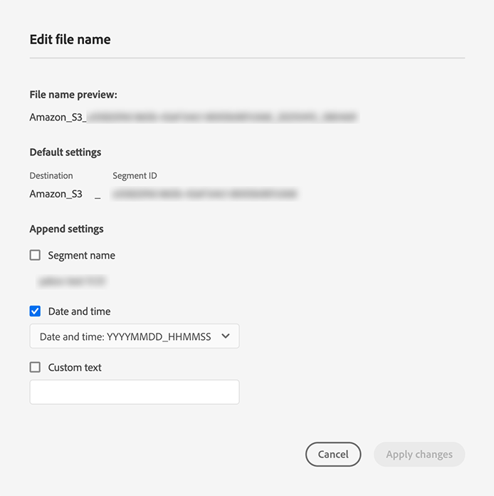

# Profielen en segmenten naar een doel activeren

Activeer de gegevens in [!DNL Adobe Experience Platform] door segmenten aan bestemmingen toe te wijzen. Volg onderstaande stappen om dit te bereiken.

## Vereisten {#prerequisites}

Om gegevens aan bestemmingen te activeren, moet u met succes [een bestemming](./connect-destination.md) hebben aangesloten. Als u dit niet reeds hebt gedaan, ga naar [doelcatalogus](../catalog/overview.md), doorblader de gesteunde bestemmingen, en opstelling één of meerdere bestemmingen.

## Gegevens {#activate-data} activeren

De stappen in de activeringswerkstroom variëren enigszins per doeltype. De volledige werkstroom voor alle bestemmingstypes wordt hieronder geschetst.

### Selecteer welk doel om gegevens te activeren naar {#select-destination}

Van toepassing op: Alle bestemmingen

Navigeer in de Adobe Experience Platform-gebruikersinterface naar **[!UICONTROL Doelen]** > **[!UICONTROL Bladeren]** en druk op de knop **[!UICONTROL Activeren]** die correspondeert met de bestemming waar u de segmenten wilt activeren, zoals in de onderstaande afbeelding wordt getoond.


Voer de stappen in de volgende sectie uit om de segmenten te selecteren die u wilt activeren.

### [!UICONTROL Segmentsstap ] selecteren  {#select-segments}

Van toepassing op: Alle bestemmingen


In **[!UICONTROL activeer bestemming]** werkschema, op **[!UICONTROL Selecteer Segmenten]** pagina, selecteer één of meerdere segmenten om aan de bestemming te activeren. Selecteer **[!UICONTROL Volgende]** om naar de volgende stap te gaan.


### [!UICONTROL Naamtoewijzing ] stap  {#identity-mapping}

Van toepassing op: sociale bestemmingen en Google Customer Match-advertentiebestemming


Voor sociale bestemmingen, moet u bronattributen of identiteitsnamespaces selecteren om als doelidentiteiten in de bestemming in kaart te brengen.

#### Voorbeeld: publieksgegevens activeren in [!DNL Facebook Custom Audience] {#example-facebook}

Hieronder ziet u een voorbeeld van correcte identiteitstoewijzing bij het activeren van publieksgegevens in [!DNL Facebook].

Bronvelden selecteren:

* Selecteer de naamruimte `Email` als bronidentiteit als de e-mailadressen die u gebruikt geen hashed zijn.
* Selecteer de naamruimte `Email_LC_SHA256` als bronidentiteit als u de e-mailadressen van de klant bij het invoeren van gegevens hebt gewijzigd in [!DNL Platform], volgens [!DNL Facebook] [e-mailhashingvereisten](../catalog/social/facebook.md#email-hashing-requirements).
* Selecteer `PHONE_E.164` namespace als bronidentiteit als uw gegevens uit niet-gehakte telefoonaantallen bestaan. [!DNL Platform] hash de telefoonnummers om aan de  [!DNL Facebook] vereisten te voldoen.
* Selecteer `Phone_SHA256` namespace als bronidentiteit als u telefoonaantallen op gegevensinvoer in [!DNL Platform], volgens [!DNL Facebook] [de vereisten van de het hakken van het telefoonaantal ](../catalog/social/facebook.md#phone-number-hashing-requirements) hakt.
* Selecteer `IDFA` namespace als bronidentiteit als uw gegevens uit [!DNL Apple] apparaat IDs bestaan.
* Selecteer `GAID` namespace als bronidentiteit als uw gegevens uit [!DNL Android] apparaat IDs bestaan.
* Selecteer `Custom` namespace als bronidentiteit als uw gegevens uit ander type herkenningstekens bestaan.

Doelvelden selecteren:

* Selecteer `Email_LC_SHA256` namespace als doelidentiteit wanneer uw bronnamespaces of `Email` of `Email_LC_SHA256` zijn.
* Selecteer `Phone_SHA256` namespace als doelidentiteit wanneer uw bronnamespaces of `PHONE_E.164` of `Phone_SHA256` zijn.
* Selecteer `IDFA` of `GAID` namespaces als doelidentiteit wanneer uw bronnamespaces `IDFA` of `GAID` zijn.
* Selecteer de naamruimte `Extern_ID` als doelidentiteit wanneer uw bronnaamruimte een aangepaste naamruimte is.


Gegevens uit naamruimten zonder hashing worden na activering automatisch gehasht door [!DNL Platform].

Kenmerkbrongegevens worden niet automatisch gehasht. Wanneer het bronveld niet-gehashte kenmerken bevat, schakelt u de optie **[!UICONTROL Transformatie toepassen]** in om [!DNL Platform] automatisch te laten hashen bij de activering.


 

#### Voorbeeld: publieksgegevens activeren in [!DNL Google Customer Match] {#example-gcm}

Dit is een voorbeeld van correcte identiteitstoewijzing wanneer het activeren van publieksgegevens in [!DNL Google Customer Match].

Bronvelden selecteren:

* Selecteer de naamruimte `Email` als bronidentiteit als de e-mailadressen die u gebruikt geen hashed zijn.
* Selecteer de naamruimte `Email_LC_SHA256` als bronidentiteit als u de e-mailadressen van de klant bij het invoeren van gegevens hebt gewijzigd in [!DNL Platform], volgens [!DNL Google Customer Match] [e-mailhashingvereisten](../catalog/social/../advertising/google-customer-match.md).
* Selecteer `PHONE_E.164` namespace als bronidentiteit als uw gegevens uit niet-gehakte telefoonaantallen bestaan. [!DNL Platform] hash de telefoonnummers om aan de  [!DNL Google Customer Match] vereisten te voldoen.
* Selecteer `Phone_SHA256_E.164` namespace als bronidentiteit als u telefoonaantallen op gegevensinvoer in [!DNL Platform], volgens [!DNL Facebook] [de vereisten van de het hakken van het telefoonaantal ](../catalog/social/../advertising/google-customer-match.md) hakt.
* Selecteer `IDFA` namespace als bronidentiteit als uw gegevens uit [!DNL Apple] apparaat IDs bestaan.
* Selecteer `GAID` namespace als bronidentiteit als uw gegevens uit [!DNL Android] apparaat IDs bestaan.
* Selecteer `Custom` namespace als bronidentiteit als uw gegevens uit ander type herkenningstekens bestaan.

Doelvelden selecteren:

* Selecteer `Email_LC_SHA256` namespace als doelidentiteit wanneer uw bronnamespaces of `Email` of `Email_LC_SHA256` zijn.
* Selecteer `Phone_SHA256_E.164` namespace als doelidentiteit wanneer uw bronnamespaces of `PHONE_E.164` of `Phone_SHA256_E.164` zijn.
* Selecteer `IDFA` of `GAID` namespaces als doelidentiteit wanneer uw bronnamespaces `IDFA` of `GAID` zijn.
* Selecteer de naamruimte `User_ID` als doelidentiteit wanneer uw bronnaamruimte een aangepaste naamruimte is.


Gegevens uit naamruimten zonder hashing worden na activering automatisch gehasht door [!DNL Platform].

Kenmerkbrongegevens worden niet automatisch gehasht. Wanneer het bronveld niet-gehashte kenmerken bevat, schakelt u de optie **[!UICONTROL Transformatie toepassen]** in om [!DNL Platform] automatisch te laten hashen bij de activering.


<!-- 
`IDFA` IDs will be mapped to:

* [MADID](https://developers.facebook.com/docs/marketing-api/audiences/guides/custom-audiences#hash) if you are activating audiences in [[!DNL Facebook]](../../destinations/catalog/social/facebook.md).
* [mobileId](https://developers.google.com/adwords/api/docs/reference/v201809/AdwordsUserListService.Member#mobileid) if you are activating audiences in [[!DNL Google Customer Match]](../../destinations/catalog/advertising/google-customer-match.md).

Select `GAID` as target identity if your data consists of Android device IDs. `GAID` IDs will be mapped to:

* [MADID](https://developers.facebook.com/docs/marketing-api/audiences/guides/custom-audiences#hash) if you are activating audiences in [[!DNL Facebook]](../../destinations/catalog/social/facebook.md).
* [mobileId](https://developers.google.com/adwords/api/docs/reference/v201809/AdwordsUserListService.Member#mobileid) if you are activating audiences in [[!DNL Google Customer Match]](../../destinations/catalog/advertising/google-customer-match.md).

If you are using another ID, such as "Rewards ID" or "Loyalty ID", as primary identity in your schema, you need to map it to the following target identities:

* [EXTERN_ID](https://developers.facebook.com/docs/marketing-api/audiences/guides/custom-audiences#external_identifiers) if you are activating audiences in [[!DNL Facebook]](../../destinations/catalog/social/facebook.md).
* [USER_ID](https://developers.google.com/adwords/api/docs/reference/v201809/AdwordsUserListService.Member#userid) if you are activating audiences in [[!DNL Google Customer Match]](../../destinations/catalog/advertising/google-customer-match.md). -->

### **** Configurestep  {#configure}

Van toepassing op: E-mailmarketingbestemmingen en cloudopslagbestemmingen


[!DNL Adobe Experience Platform] Hiermee exporteert u gegevens voor e-mailmarketing en cloudopslagbestemmingen in de vorm van  [!DNL CSV] bestanden. In **[!UICONTROL vorm]** stap, kunt u het programma en de dossiernamen voor elk segment vormen u uitvoert. Het is verplicht het schema te configureren, maar het configureren van de bestandsnaam is optioneel.

>[!IMPORTANT]
> 
>[!DNL Adobe Experience Platform] Hiermee worden de exportbestanden automatisch gesplitst op 5 miljoen records (rijen) per bestand. Elke rij vertegenwoordigt één profiel.
>
>Namen van gesplitste bestanden worden toegevoegd met een getal dat aangeeft dat het bestand deel uitmaakt van een grotere exportbewerking, als zodanig: `filename.csv`, `filename_2.csv`, `filename_3.csv`.


Om een programma voor het segment toe te voegen, uitgezocht **[!UICONTROL creeer programma]**.


Er wordt een dialoogvenster weergegeven met opties voor het maken van het segmentschema.

* **Bestand exporteren**: U kunt volledige of incrementele bestanden exporteren. Wanneer u een volledig bestand exporteert, wordt een volledige momentopname gepubliceerd van alle profielen die voor dat segment in aanmerking komen. Wanneer u een incrementeel bestand exporteert, wordt de delta gepubliceerd van profielen die voor dat segment in aanmerking komen sinds de laatste exportbewerking.
* **Frequentie**: Als  **[!UICONTROL Volledige]** bestanden exporteren is geselecteerd, kunt u de optie  **** Eenmaal of  **[!UICONTROL Dagelijks]** exporteren kiezen. Als **[!UICONTROL Incrementele bestanden exporteren]** is geselecteerd, kunt u alleen **[!UICONTROL Dagelijks]** exporteren. Als u een bestand **[!UICONTROL Once]** exporteert, wordt het bestand één keer geëxporteerd. Als u een bestand **[!UICONTROL Dagelijks]** exporteert, wordt het bestand elke dag geëxporteerd van de begindatum tot de einddatum om 12:00 uur UTC (7:00 uur EST) als er volledige bestanden zijn geselecteerd en 12:00 uur UTC (7:00 uur EST) als er incrementele bestanden zijn geselecteerd.
* **Datum**: Als  **** Zodra is geselecteerd, kunt u de datum voor de eenmalige export selecteren. Als **[!UICONTROL Dagelijks]** wordt geselecteerd, kunt u de begin en einddata voor de uitvoer selecteren.


De standaardbestandsnamen bestaan uit een doelnaam, segment-id en een datum- en tijdindicator. U kunt bijvoorbeeld uw geëxporteerde bestandsnamen bewerken om onderscheid te maken tussen verschillende campagnes of om de exporttijd van de gegevens aan de bestanden toe te voegen.

Selecteer het potloodpictogram om een modaal venster te openen en de bestandsnamen te bewerken. Bestandsnamen mogen maximaal 255 tekens bevatten.


In de bestandsnaameditor kunt u verschillende componenten selecteren om aan de bestandsnaam toe te voegen. De doelnaam en segment-id kunnen niet uit bestandsnamen worden verwijderd. Naast deze, kunt u het volgende toevoegen:

* **[!UICONTROL Segmentnaam]**: U kunt de segmentnaam aan de bestandsnaam toevoegen.
* **[!UICONTROL Datum en tijd]**: U kunt kiezen tussen het toevoegen van een  `MMDDYYYY_HHMMSS` indeling of een Unix 10-cijferige tijdstempel van het tijdstip waarop de bestanden worden gegenereerd. Kies een van deze opties als u voor de bestanden een dynamische bestandsnaam wilt genereren bij elke incrementele exportbewerking.
* **[!UICONTROL Aangepaste tekst]**: Voeg aangepaste tekst toe aan de bestandsnamen.

Selecteer **[!UICONTROL Wijzigingen toepassen]** om uw selectie te bevestigen.

>[!IMPORTANT]
> 
>Als u de **[!UICONTROL Datum en Tijd]** component niet selecteert, zullen de dossiernamen statisch zijn en het nieuwe uitgevoerde dossier zal het vorige dossier in uw opslagplaats met elke uitvoer beschrijven. Als u een terugkerende importtaak uitvoert vanaf een opslaglocatie naar een e-mailmarketingplatform, is dit de aanbevolen optie.



Nadat u alle segmenten hebt geconfigureerd, selecteert u **[!UICONTROL Volgende]** om door te gaan.

### **[!UICONTROL Segment]** planning  {#segment-schedule}

Van toepassing op: reclamebestemmingen, sociale bestemmingen


Op **[!UICONTROL Segmentprogramma]** pagina, kunt u de begindatum voor het verzenden van gegevens naar de bestemming, en de frequentie plaatsen om gegevens naar de bestemming te verzenden.

>[!IMPORTANT]
>
>Voor sociale bestemmingen, moet u de oorsprong van uw publiek in deze stap selecteren. U kunt pas verdergaan met de volgende stap nadat u een van de opties in de onderstaande afbeelding hebt geselecteerd.


>[!IMPORTANT]
>
>Voor Google Customer Match moet u [!UICONTROL App ID] in deze stap opgeven wanneer u [!DNL IDFA] of [!DNL GAID] segmenten activeert.


### **[!UICONTROL Stap]** plannen  {#scheduling}

Van toepassing op: e-mailmarketingdoelen en cloudopslagdoelen


Op **[!UICONTROL Plannend]** pagina, kunt u de begindatum voor het verzenden van gegevens naar de bestemming evenals de frequentie zien om gegevens naar de bestemming te verzenden. Deze waarden kunnen niet worden bewerkt.

### **[!UICONTROL Selecteer]** kenmerkstap  {#select-attributes}

Van toepassing op: e-mailmarketingdoelen en cloudopslagdoelen


Selecteer **[!UICONTROL Nieuw veld toevoegen]** op de pagina **[!UICONTROL Kenmerken selecteren]** en kies de kenmerken die u naar het doel wilt verzenden.

>[!NOTE]
>
> Adobe Experience Platform vult uw selectie voor met vier aanbevolen, veelgebruikte kenmerken uit uw schema: `person.name.firstName`, `person.name.lastName`, `personalEmail.address`, `segmentMembership.status`.

Het exporteren van bestanden kan op de volgende manieren variëren, afhankelijk van het feit of `segmentMembership.status` is geselecteerd:
* Als het `segmentMembership.status` gebied wordt geselecteerd, omvatten de uitgevoerde dossiers **[!UICONTROL Actieve]** leden in de aanvankelijke volledige momentopname en **[!UICONTROL Actieve]** en **[!UICONTROL Verlopen]** leden in verdere stijgende uitvoer.
* Als het `segmentMembership.status` gebied niet wordt geselecteerd, omvatten de uitgevoerde dossiers slechts **[!UICONTROL Actieve]** leden in de aanvankelijke volledige momentopname en in verdere stijgende uitvoer.


Bovendien kunt u verschillende kenmerken als verplicht markeren. Als u een kenmerk als verplicht markeert, moet het worden gemarkeerd zodat het geëxporteerde segment dat kenmerk moet bevatten. Het resultaat is dat het kan worden gebruikt als extra filtermethode. Het markeren van een kenmerk als verplicht is **niet** vereist.

Men adviseert dat één van de attributen een [unieke herkenningsteken](../../destinations/catalog/email-marketing/overview.md#identity) van uw schema is. Raadpleeg de identiteitssectie in de documentatie [E-mailmarketingdoelen](../../destinations/catalog/email-marketing/overview.md#identity) voor meer informatie over verplichte kenmerken.

>[!NOTE]
> 
>Als er labels voor gegevensgebruik zijn toegepast op bepaalde velden in een gegevensset (in plaats van op de gehele gegevensset), wordt de toepassing van die labels op veldniveau bij activering uitgevoerd onder de volgende voorwaarden:
>* De velden worden gebruikt in de segmentdefinitie.
>* De velden worden geconfigureerd als geprojecteerde kenmerken voor de doelbestemming.

>
> 
Bijvoorbeeld, als het gebied `person.name.firstName` bepaalde etiketten van het gegevensgebruik heeft die met de marketing van de bestemming actie in conflict brengen, zou u een schending van het beleid van het gegevensgebruik in de overzichtsstap worden getoond. Zie [Gegevensbeheer in Adobe Experience Platform](../../rtcdp/privacy/data-governance-overview.md#destinations) voor meer informatie.

### **** Revisiestap  {#review}

Van toepassing op: alle bestemmingen


Op de **[!UICONTROL pagina van het Overzicht]**, kunt u een samenvatting van uw selectie zien. Selecteer **[!UICONTROL Annuleren]** om de stroom te verbreken, **[!UICONTROL Terug]** om uw instellingen te wijzigen of **[!UICONTROL Voltooien]** om uw selectie te bevestigen en gegevens naar de bestemming te verzenden.

>[!IMPORTANT]
>
>In deze stap controleert Adobe Experience Platform op overtredingen van het gegevensgebruiksbeleid. Hieronder ziet u een voorbeeld waarin een beleid wordt overtreden. U kunt de workflow voor segmentactivering pas voltooien nadat u de schending hebt opgelost. Voor informatie over hoe te om beleidsschendingen op te lossen, zie [Beleidshandhaving](../../rtcdp/privacy/data-governance-overview.md#enforcement) in de sectie van de documentatie van het gegevensbeheer.


Als er geen beleidsovertredingen zijn vastgesteld, selecteert u **[!UICONTROL Voltooien]** om uw selectie te bevestigen en gegevens naar de bestemming te verzenden.


## Activering {#edit-activation} bewerken

Voer de onderstaande stappen uit om bestaande activeringsstromen in Adobe Experience Platform te bewerken:

1. Selecteer **[!UICONTROL Doelen]** in de linkernavigatiebalk en klik vervolgens op het tabblad **[!UICONTROL Bladeren]** en klik op de doelnaam.
2. Selecteer **[!UICONTROL Activering bewerken]** in de rechtertrack om te wijzigen welke segmenten naar de bestemming moeten worden verzonden.

## Controleren of segmentactivering is gelukt {#verify-activation}

### E-mailmarketingdoelen en cloudopslagdoelen {#esp-and-cloud-storage}

Voor marketingdoelen en opslagdoelen voor de cloud maakt Adobe Experience Platform een door tabs gescheiden `.csv` of `.txt` bestand op de opslaglocatie die u hebt opgegeven. Verwacht dat er elke dag een nieuw bestand op uw opslaglocatie wordt gemaakt. De standaardbestandsindeling is:
`<destinationName>_segment<segmentID>_<timestamp-yyyymmddhhmmss>.csv|txt`

U kunt de bestandsindeling bewerken. Voor meer informatie, ga naar [vorm](#configure) stap voor de bestemmingen van de wolkenopslag en e-mailmarketing bestemmingen.

Met de standaardbestandsindeling kunnen de bestanden die u op drie opeenvolgende dagen ontvangt er als volgt uitzien:

```console
Salesforce_Marketing_Cloud_segment12341e18-abcd-49c2-836d-123c88e76c39_20200408061804.csv
Salesforce_Marketing_Cloud_segment12341e18-abcd-49c2-836d-123c88e76c39_20200409052200.csv
Salesforce_Marketing_Cloud_segment12341e18-abcd-49c2-836d-123c88e76c39_20200410061130.csv
```

De aanwezigheid van deze bestanden op de opslaglocatie bevestigt dat de activering is gelukt. Als u wilt weten hoe de geëxporteerde bestanden zijn gestructureerd, kunt u [een voorbeeld-CSV-bestand](../assets/common/sample_export_file_segment12341e18-abcd-49c2-836d-123c88e76c39_20200408061804.csv) downloaden. Dit voorbeeldbestand bevat de profielkenmerken `person.firstname`, `person.lastname`, `person.gender`, `person.birthyear` en `personalEmail.address`.

### Reclamebestemmingen

Controleer je account in de advertentiebestemming waarnaar je gegevens activeert. Als de activering is gelukt, worden de doelgroepen in uw advertentieplatform ingevuld.

### Sociale netwerkbestemmingen

Voor [!DNL Facebook] betekent een geslaagde activering dat een [!DNL Facebook] aangepast publiek programmatically in [[!UICONTROL Facebook Advertentiebeheer]](https://www.facebook.com/adsmanager/manage/) zou worden gecreeerd. Het lidmaatschap van een segment in het publiek zou worden toegevoegd en verwijderd aangezien de gebruikers voor de geactiveerde segmenten worden gekwalificeerd of worden uitgesloten.

>[!TIP]
>
>De integratie tussen Adobe Experience Platform en [!DNL Facebook] steunt historische publieksbackfills. Alle historische segmentkwalificaties worden naar [!DNL Facebook] verzonden wanneer u de segmenten naar de bestemming activeert.

## Activering {#disable-activation} uitschakelen

Volg onderstaande stappen om een bestaande activeringsstroom uit te schakelen:

1. Selecteer **[!UICONTROL Doelen]** in de linkernavigatiebalk en klik vervolgens op het tabblad **[!UICONTROL Bladeren]** en klik op de doelnaam.
2. Klik op het besturingselement **[!UICONTROL Ingeschakeld]** in de rechterrail om de activeringsstatus te wijzigen.
3. Selecteer **Bevestigen** in het venster **Gegevensstroomstatus bijwerken** om de activeringsstroom uit te schakelen.
