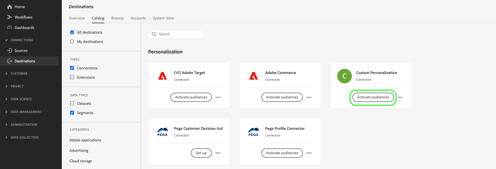

# Het publiek activeren voor verpersoonlijkingsdoelen van randen

## Overzicht {#overview}

Adobe Experience Platform gebruikt [ randsegmentatie ](../../segmentation/ui/edge-segmentation.md) samen met [ randbestemmingen ](/help/destinations/destination-types.md#edge-personalization-destinations) om klanten toe te laten om publiek tot stand te brengen en te richten op hoge schaal, in echt - tijd. Met deze functie kunt u gebruiksgevallen voor personalisatie op dezelfde pagina en op de volgende pagina configureren.

De voorbeelden van randbestemmingen zijn [ Adobe Target ](../../destinations/catalog/personalization/adobe-target-connection.md) en [ de verpersoonlijkings ](../../destinations/catalog/personalization/custom-personalization.md) verbindingen van de Douane.

>[!NOTE]
>
>Wanneer [ vormend de verbinding van Adobe Target ](../catalog/personalization/adobe-target-connection.md) *zonder* gebruikend een gegevensstroom identiteitskaart, worden de gebruiksgevallen die in dit artikel worden beschreven niet gesteund. Alleen de volgende-sessiegebruikstoepassingen worden ondersteund bij gebrek aan een gegevensstroom.

>[!IMPORTANT]
> 
> * Om gegevens te activeren en de [ toewijzingsstap ](#mapping) van het werkschema toe te laten, hebt u **[!UICONTROL View Destinations]**, **[!UICONTROL Activate Destinations]**, **[!UICONTROL View Profiles]**, en **[!UICONTROL View Segments]** [ toegangsbeheertoestemmingen ](/help/access-control/home.md#permissions) nodig.
> * Om gegevens te activeren zonder door de [ toewijzingsstap ](#mapping) van het werkschema te gaan, hebt u **[!UICONTROL View Destinations]**, **[!UICONTROL Activate Segment without Mapping]**, **[!UICONTROL View Profiles]**, en **[!UICONTROL View Segments]** [ toegangsbeheertoestemmingen ](/help/access-control/home.md#permissions) nodig.
>* Om *identiteiten* uit te voeren, hebt u de **[!UICONTROL View Identity Graph]** [ toegangsbeheertoestemming ](/help/access-control/home.md#permissions) nodig.   {width="100" zoomable="yes"}
> 
> Lees het [ overzicht van de toegangscontrole ](/help/access-control/ui/overview.md) of contacteer uw productbeheerder om de vereiste toestemmingen te verkrijgen.

In dit artikel wordt uitgelegd welke workflow is vereist om het publiek naar Adobe Experience Platform Edge-doelen te activeren. Wanneer gebruikt samen met [ de segmentatie van de rand ](../../segmentation/ui/edge-segmentation.md) en de facultatieve [ afbeelding van profielattributen ](#mapping), laten deze bestemmingen zelfde-pagina en volgende-pagina verpersoonlijkingsgebruiksgevallen op uw Web en mobiele eigenschappen toe.

Bekijk de onderstaande video voor een kort overzicht van het configureren van de Adobe Target-verbinding voor &#39;edge personalization&#39;.

>[!NOTE]
>
>De gebruikersinterface van het Experience Platform wordt vaak bijgewerkt en kan sinds de opname van deze video zijn veranderd. Raadpleeg de configuratiestappen in de onderstaande secties voor de meest actuele informatie.

>[!VIDEO](https://video.tv.adobe.com/v/3418799/?quality=12&learn=on)

Bekijk de onderstaande video voor een kort overzicht van hoe u doelgroepen en profielkenmerken kunt delen met Adobe Target en aangepaste verpersoonlijkingsdoelen.

>[!VIDEO](https://video.tv.adobe.com/v/3419036/?quality=12&learn=on)

## Gebruiksscenario’s {#use-cases}

De oplossingen van de verpersoonlijking van de Adobe, zoals Adobe Target, of uw eigen platforms van de verpersoonlijkingspartner van het gebruik (bijvoorbeeld, [!DNL Optimizely], [!DNL Pega]), evenals merkgebonden systemen (bijvoorbeeld, in-huis CMS) om een diepere klantenverpersoonlijkingservaring via de [ 3} bestemming van de Douane van Personalization {aan te drijven. ](../catalog/personalization/custom-personalization.md) Dit alles terwijl ook de gegevensverzameling en segmenteringsmogelijkheden van de Edge Network van het Experience Platform worden gebruikt.

De hieronder beschreven gebruiksgevallen omvatten zowel personalisatie van de site als gerichte on-site reclame.

Om deze gebruiksgevallen toe te laten, hebben de klanten een snelle, gestroomlijnde manier nodig om zowel publiek als profielkenmerkinformatie van Experience Platform terug te winnen, en deze informatie te verzenden naar of [ Adobe Target ](../catalog/personalization/adobe-target-connection.md) of de [ Aangepaste Personalization ](../catalog/personalization/custom-personalization.md) verbindingen in Experience Platform UI.

### Zelfde paginagrootte {#same-page}

Een gebruiker bezoekt een pagina van uw website. U kunt de huidige informatie van het paginabezoek (bijvoorbeeld verwijzend URL, browser taal, ingebedde productinfo) gebruiken om de volgende actie of besluit (bijvoorbeeld, verpersoonlijking) te selecteren, gebruikend de ](../catalog/personalization/custom-personalization.md) verbinding van de Aangepaste verpersoonlijking [ voor niet-Adobe platforms (bijvoorbeeld, [!DNL Pega], [!DNL Optimizely] of anderen.).

### Aanpassing van volgende pagina {#next-page}

Een gebruiker bezoekt pagina A op uw website. Gebaseerd op deze interactie, heeft de gebruiker voor een reeks publiek gekwalificeerd. De gebruiker klikt vervolgens op een koppeling die deze van pagina A naar pagina B verplaatst. Het publiek waarvoor de gebruiker tijdens de vorige interactie op pagina A in aanmerking was gekomen, samen met de profielupdates die door het huidige websitebezoek werden bepaald, zal worden gebruikt om de volgende actie of beslissing aan te sturen (bijvoorbeeld welke advertentiebanner aan de bezoeker moet worden getoond, of, in het geval van A/B-tests, welke versie van de pagina aan vertoning).

### Aanpassing van volgende sessie {#next-session}

Een gebruiker bezoekt verschillende pagina&#39;s op uw website. Op basis van deze interacties heeft de gebruiker zich gekwalificeerd voor een aantal soorten publiek. De gebruiker beëindigt dan de huidige het doorbladeren zitting.

De volgende dag keert de gebruiker terug naar dezelfde klantenwebsite. Het publiek waarvoor zij tijdens de vorige interactie met alle bezochte websitepagina&#39;s in aanmerking kwamen, samen met de profielupdates die door het huidige websitebezoek werden bepaald, zal worden gebruikt om de volgende actie/beslissing te selecteren (bijvoorbeeld welke advertentiebanner aan de bezoeker moet worden getoond, of, in het geval van A/B-tests, welke versie van de pagina moet worden getoond).

### Een banner voor een homepage aanpassen {#home-page-banner}

Een huisverhuurbedrijf en verkoopbedrijf willen hun homepage met een banner personaliseren, op basis van publiekskwalificaties in Adobe Experience Platform. Het bedrijf kan selecteren welk publiek een persoonlijke ervaring zou moeten krijgen en deze doelgroepen naar Adobe Target sturen als criteria voor hun Target-aanbieding.

## Vereisten {#prerequisites}

### Een gegevensstroom configureren in de gebruikersinterface voor gegevensverzameling {#configure-datastream}

De eerste stap in vestiging moet uw verpersoonlijkingsbestemming een gegevensstroom voor het Web SDK van het Experience Platform vormen. Dit wordt gedaan in de Inzameling UI van Gegevens.

Wanneer u de gegevensstroom configureert, moet u onder **[!UICONTROL Adobe Experience Platform]** ervoor zorgen dat zowel **[!UICONTROL Edge Segmentation]** als **[!UICONTROL Personalization Destinations]** zijn geselecteerd.

>[!TIP]
>
>Beginnend met de versie van April 2024, wordt u niet vereist om checkbox van de Segmentatie van Edge te selecteren wanneer [ het vormen van de verbinding aan Adobe Target ](/help/destinations/catalog/personalization/adobe-target-connection.md). In dit geval, [ volgende-zittingsverpersoonlijking ](#next-session) is het enige beschikbare geval van het verpersoonlijkingsgebruik.

Voor meer details op hoe te opstelling volgt een datastream, de instructies die in de [ documentatie van SDK van het Web van het Platform ](../../datastreams/configure.md#aep) worden beschreven.

### Een [!DNL Active-On-Edge] samenvoegbeleid maken {#create-merge-policy}

Nadat u de doelverbinding hebt gemaakt, moet u een [!DNL Active-On-Edge] samenvoegbeleid maken. Het [!DNL Active-On-Edge] fusiebeleid zorgt ervoor dat het publiek constant [ op de rand ](../../segmentation/ui/edge-segmentation.md) wordt geëvalueerd en voor het gebruiksgeval van het de verpersoonlijking in real time en volgende-pagina beschikbaar is.

>[!IMPORTANT]
>
>Momenteel, steunen de randbestemmingen slechts de activering van publiek dat het [ actief-op-Edge Beleid van de Fusie ](../../segmentation/ui/segment-builder.md#merge-policies) gebruikt dat als gebrek wordt geplaatst. Als u publiek in kaart brengt die een verschillend samenvoegbeleid aan randbestemmingen gebruiken, zullen die publiek niet worden geëvalueerd.

Volg de instructies op [ creërend een fusiebeleid ](../../profile/merge-policies/ui-guide.md#create-a-merge-policy), en zorg ervoor om **[!UICONTROL Active-On-Edge Merge Policy]** knevel toe te laten.

### Nieuw publiek maken in platform {#create-audience}

Nadat u het samenvoegbeleid van [!DNL Active-On-Edge] hebt gemaakt, moet u een nieuw publiek in Platform creëren.

Volg de [ gids van de publieksbouwer ](../../segmentation/ui/segment-builder.md) om uw nieuw publiek tot stand te brengen, en zorg ervoor [ het ](../../segmentation/ui/segment-builder.md#merge-policies) toe te wijzen [!DNL Active-On-Edge] samenvoegingsbeleid dat u in de vorige stap creeerde.

### Een doelverbinding maken {#connect-destination}

Nadat u uw gegevensstroom hebt gevormd, kunt u beginnen uw verpersoonlijkingsbestemming te vormen.

Volg het [ leerprogramma van de de schepping van de bestemmingsverbinding ](../ui/connect-destination.md) voor gedetailleerde instructies op hoe te om een nieuwe bestemmingsverbinding tot stand te brengen.

Afhankelijk van de bestemming die u vormt, verwijs naar de volgende artikelen voor bestemmings-specifieke eerste vereisten en verwante informatie:

* [Adobe Target-verbinding](../catalog/personalization/adobe-target-connection.md#parameters)
* [Aangepaste verpersoonlijkingsverbinding](../catalog/personalization/custom-personalization.md#parameters)

## Kies uw bestemming {#select-destination}

Nadat u de eerste vereisten hebt voltooid, kunt u nu de verpersoonlijkingsbestemming voor de aanpassing van dezelfde pagina en van de volgende pagina selecteren.

1. Ga naar **[!UICONTROL Connections > Destinations]** en selecteer de tab **[!UICONTROL Catalog]** .

   

1. Selecteer **[!UICONTROL Activate audiences]** op de kaart die overeenkomt met de personalisatiebestemming waar u uw publiek wilt activeren, zoals in de onderstaande afbeelding wordt getoond.

   

1. Selecteer de doelverbinding die u wilt gebruiken om uw publiek te activeren en selecteer vervolgens **[!UICONTROL Next]** .

   

1. De beweging aan de volgende sectie aan [ selecteert uw publiek ](#select-audiences).

## Uw publiek selecteren {#select-audiences}

Gebruik de selectievakjes links van de publieksnamen om het publiek te selecteren dat u wilt activeren naar het doel en selecteer vervolgens **[!UICONTROL Next]** .

Als u het publiek dat u wilt activeren naar het doel wilt selecteren, gebruikt u de selectievakjes links van de publieksnamen en selecteert u vervolgens **[!UICONTROL Next]** .

U kunt kiezen uit meerdere soorten publiek, afhankelijk van de oorsprong:

* **[!UICONTROL Segmentation Service]**: publiek dat binnen Experience Platform door de Segmenteringsdienst wordt geproduceerd. Zie de [ segmentatiedocumentatie ](../../segmentation/ui/overview.md) voor meer details.
* **[!UICONTROL Custom upload]**: buiten het Experience Platform gegenereerde soorten publiek die als CSV-bestanden naar Platform worden geüpload. Meer over extern publiek leren, zie de documentatie bij [ het invoeren van een publiek ](../../segmentation/ui/audience-portal.md#import-audience).
* Andere soorten publiek, afkomstig van andere oplossingen voor Adobe, zoals [!DNL Audience Manager] .

## Kenmerken Kaart {#mapping}

>[!IMPORTANT]
>
>Profielkenmerken kunnen vertrouwelijke gegevens bevatten. Om dit gegeven te beschermen, vereist de **[!UICONTROL Custom Personalization]** bestemming u om de [ Server API van de Edge Network te gebruiken ](../../server-api/overview.md) wanneer het vormen van de bestemming voor op attribuut-gebaseerde verpersoonlijking. Alle Server API vraag moet in een [ voor authentiek verklaarde context ](../../server-api/authentication.md) worden gemaakt.
>
>  als u reeds SDK van het Web of Mobiele SDK voor uw integratie gebruikt, kunt u attributen via de Server API terugwinnen door een server-zijintegratie toe te voegen.
>
>  als u niet de hierboven vereisten volgt, zal de verpersoonlijking op publiekslidmaatschap slechts gebaseerd zijn.

Selecteer de kenmerken op basis waarvan u gebruiksgevallen voor personalisatie voor uw gebruikers wilt inschakelen. Dit betekent dat als de waarde van een attribuut verandert of als een attribuut aan een profiel wordt toegevoegd, dat profiel een lid van het publiek zal worden en aan de verpersoonlijkingsbestemming zal worden geactiveerd.

Het toevoegen van kenmerken is optioneel en u kunt doorgaan naar de volgende stap en personalisatie op dezelfde pagina en op de volgende pagina inschakelen zonder kenmerken te selecteren. Als u in deze stap geen kenmerken toevoegt, vindt er nog steeds personalisatie plaats op basis van het lidmaatschap van het publiek en de kwalificaties van het identiteitsoverzicht voor profielen.

### Bronkenmerken selecteren {#select-source-attributes}

Als u bronkenmerken wilt toevoegen, selecteert u het besturingselement **[!UICONTROL Add new field]** in de kolom **[!UICONTROL Source field]** en zoekt of navigeert u naar het gewenste veld voor XDM-kenmerken, zoals hieronder wordt weergegeven.

### Doelkenmerken selecteren {#select-target-attributes}

Als u doelkenmerken wilt toevoegen, selecteert u het besturingselement **[!UICONTROL Add new field]** in de kolom **[!UICONTROL Target field]** en typt u de naam van het aangepaste kenmerk waaraan u het bronkenmerk wilt toewijzen.

>[!NOTE]
>
>De selectie van doelattributen is slechts op het [ de activeringswerkschema van Personalization van de Douane ](../catalog/personalization/custom-personalization.md) van toepassing, om vriendschappelijke-naamgebiedafbeelding in het bestemmingsplatform te steunen.

## Het exporteren van publiek plannen {#scheduling}

Standaard geeft de pagina [!UICONTROL Audience schedule] alleen het zojuist geselecteerde publiek weer dat u hebt gekozen in de huidige activeringsstroom.

Als u wilt zien welk publiek wordt geactiveerd voor uw doel, gebruikt u de filteroptie en schakelt u het filter **[!UICONTROL Show new audiences only]** uit.

Selecteer elk publiek op de pagina **[!UICONTROL Audience schedule]** en gebruik vervolgens de kiezers **[!UICONTROL Start date]** en **[!UICONTROL End date]** om het tijdsinterval voor het verzenden van gegevens naar uw bestemming te configureren.

Selecteer **[!UICONTROL Next]** om naar de pagina van [!UICONTROL Review] te gaan.

## Controleren {#review}

Op de pagina **[!UICONTROL Review]** ziet u een overzicht van uw selectie. Selecteer **[!UICONTROL Cancel]** om de stroom te verbreken, **[!UICONTROL Back]** om uw instellingen te wijzigen of **[!UICONTROL Finish]** om uw selectie te bevestigen en gegevens naar de bestemming te verzenden.

### Goedkeuring van het beleid {#consent-policy-evaluation}

Als uw organisatie **het Schild van de Gezondheidszorg van de Adobe** of **de Privacy &amp; het Schild van de Veiligheid van de Adobe** kocht, selecteer **[!UICONTROL View applicable consent policies]** om te zien welk toestemmingsbeleid wordt toegepast en hoeveel profielen in de activering als resultaat van hen inbegrepen zijn. Lees over [ evaluatie van het toestemmingsbeleid ](/help/data-governance/enforcement/auto-enforcement.md#consent-policy-evaluation) voor meer informatie.

### Controle van het gegevensgebruiksbeleid {#data-usage-policy-checks}

In de stap **[!UICONTROL Review]** controleert het Experience Platform ook op overtredingen van het gegevensgebruiksbeleid. Hieronder ziet u een voorbeeld waarin een beleid wordt overtreden. U kunt de workflow voor publieksactivering pas voltooien nadat u de schending hebt opgelost. Voor informatie over hoe te om beleidsschendingen op te lossen, lees over [ schendingen van het beleid van het gegevensgebruik ](/help/data-governance/enforcement/auto-enforcement.md#data-usage-violation) in de de documentatiesectie van het gegevensbeheer.

### Filter publiek {#filter-audiences}

In deze stap kunt u de beschikbare filters op de pagina gebruiken om alleen de doelgroepen weer te geven waarvan het schema of de toewijzing is bijgewerkt als onderdeel van deze workflow. U kunt ook schakelen welke tabelkolommen u wilt zien.

Als u tevreden bent met de selectie en er zijn geen beleidsovertredingen vastgesteld, selecteert u **[!UICONTROL Finish]** om uw selectie te bevestigen en gegevens naar de bestemming te verzenden.

<!--

Commenting out this part since destination monitoring is not available currently for the Adobe Target and Custom Personalization destinations.

## Verify audience activation {#verify}

Check the [destination monitoring documentation](../../dataflows/ui/monitor-destinations.md) for detailed information on how to monitor the flow of data to your destinations.

-->
