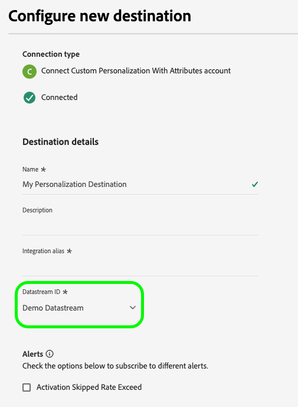
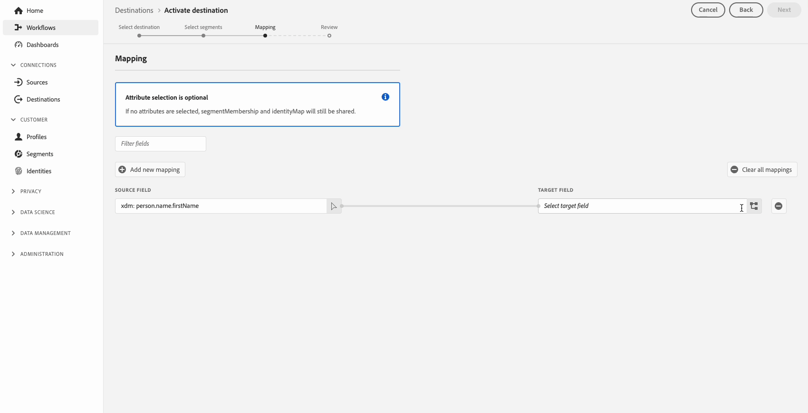

# Profielkenmerken aan de rand in real-time opzoeken

Adobe Experience Platform gebruikt het [ Real-Time Profiel van de Klant ](../../profile/home.md) als enige bron van waarheid voor alle profielgegevens. Voor snelle, real time gegevensherwinning, gebruikt het [ randprofielen ](../../profile/edge-profiles.md), die lichtgewichtprofielen zijn die door [ Edge Network ](../../collection/home.md#edge) worden verdeeld. Dit maakt het mogelijk snel en realtime gebruik te maken van personalisatie.

## Gebruiksscenario’s {#use-cases}

Hieronder vindt u twee gebruiksgevallen waarbij het opzoeken van het randprofiel kan helpen.

* **Echte - tijd Personalization**: wint snel profielinformatie van het randprofiel terug om de ervaring van een gebruiker op uw website te personaliseren.
* **de Steun van de Klant**: Haal profielinformatie in real time terug wanneer een klant een agent van het steuncentrum roept.

Deze pagina beschrijft de stappen die u moet volgen om de gegevens van het randprofiel in real time op te zoeken, verpersoonlijkingservaringen te leveren of besluitvormingsregels door stroomafwaartse toepassingen te informeren.

## Terminologie en voorwaarden {#prerequisites}

Wanneer het vormen van het gebruiksgeval in deze pagina wordt beschreven, zult u de volgende componenten van het Platform gebruiken:

* [ Datastreams ](../../datastreams/overview.md): Een gegevensstroom ontvangt inkomende gebeurtenisgegevens van het Web SDK en antwoordt met de gegevens van het randprofiel.
* [ het Beleid van de Fusie ](../../segmentation/ui/segment-builder.md#merge-policies): U zult een [!UICONTROL Active-On-Edge] fusiebeleid creëren om ervoor te zorgen dat de randprofielen de correcte profielgegevens gebruiken.
* [ de verbinding van Personalization van de Douane ](../catalog/personalization/custom-personalization.md): U zult een nieuwe verbinding van de douaneverpersoonlijking vormen die de profielattributen naar Edge Network zal verzenden.
* [ Edge Network API ](../../server-api/overview.md): U zult de Edge Network API [ interactieve functionaliteit van de gegevensinzameling ](../../server-api/interactive-data-collection.md) gebruiken om profielattributen van de randprofielen snel terug te winnen.

## Prestatiegerichten {#guardrails}

Voor het opzoeken van Edge-profielen gelden de specifieke prestatieaanwijzingen die in de onderstaande tabel worden beschreven. Voor meer details betreffende de handleidingen van Edge Network API, zie de guardrails [ documentatiepagina ](https://developer.adobe.com/data-collection-apis/docs/getting-started/guardrails/).

| Edge Network Service | Edge-segmentatie | Verzoeken per seconde |
|---------|----------|---------|
| [ de verpersoonlijkingsbestemming van de Douane ](../catalog/personalization/custom-personalization.md) via [ Edge Network API ](https://developer.adobe.com/data-collection-apis/docs/api/) | Ja | 1500 |
| [ de verpersoonlijkingsbestemming van de Douane ](../catalog/personalization/custom-personalization.md) via [ Edge Network API ](https://developer.adobe.com/data-collection-apis/docs/api/) | Nee | 1500 |

## Stap 1: Een gegevensstroom maken en configureren {#create-datastream}

Volg de stappen in de ](../../datastreams/configure.md#create-a-datastream) documentatie van de 0} gegevensstroomconfiguratie {om een nieuwe gegevensstroom met de volgende **[!UICONTROL Service]** montages tot stand te brengen:[

* **[!UICONTROL Service]**: [!UICONTROL Adobe Experience Platform]
* **[!UICONTROL Personalization Destinations]**: Enabled
* **[!UICONTROL Edge Segmentation]**: Schakel deze optie in als u segmentatie van de randen nodig hebt. Als u alleen geïnteresseerd bent in het opzoeken van profielkenmerken aan de rand, maar geen segmentatie wilt uitvoeren op basis van de randprofielen, laat u deze optie uitgeschakeld.


  <!-- >[!IMPORTANT]
    >
    >Enabling edge segmentation limits the maximum number of lookup requests to 1500 request per second. If you need a higher request throughput, disable edge segmentation for your datastream. See the [guardrails documentation](../guardrails.md#edge-destinations-activation) for detailed information. -->

  


## Stap 2: Vorm uw publiek voor randevaluatie {#audience-edge-evaluation}

Wanneer u profielkenmerken op de rand wilt opzoeken, moet uw publiek zijn geconfigureerd voor randevaluatie.

Zorg ervoor het publiek dat u van plan bent te activeren heeft het [ actief-op-Edge Beleid van de Fusie ](../../segmentation/ui/segment-builder.md#merge-policies) geplaatst als gebrek. Het [!DNL Active-On-Edge] fusiebeleid zorgt ervoor dat het publiek constant [ op de rand ](../../segmentation/methods/edge-segmentation.md) wordt geëvalueerd en beschikbaar voor de gevallen van het verpersoonlijkingsgebruik in real time is.

Volg de instructies op [ creërend een fusiebeleid ](../../profile/merge-policies/ui-guide.md#create-a-merge-policy), en zorg ervoor om **[!UICONTROL Active-On-Edge Merge Policy]** knevel toe te laten.

>[!IMPORTANT]
>
>Als uw publiek een ander samenvoegbeleid gebruikt, kunt u geen profielkenmerken van de rand ophalen en kunt u het zoeken van het randprofiel niet uitvoeren.

## Stap 3: gegevens van profielkenmerken naar de Edge Network verzenden{#configure-custom-personalization-connection}

Als u Edge-profielen, waaronder kenmerken en lidmaatschapsgegevens voor het publiek, in real-time wilt opzoeken, moeten de gegevens op de Edge Network beschikbaar worden gesteld. Hiertoe moet u een verbinding met een **[!UICONTROL Custom Personalization With Attributes]** -doel maken en het publiek activeren, inclusief de kenmerken die u wilt opzoeken in de randprofielen.

+++ Een aangepaste Personalization met kenmerkverbinding configureren

Volg het [ leerprogramma van de de schepping van de bestemmingsverbinding ](../ui/connect-destination.md) voor gedetailleerde instructies op hoe te om een nieuwe bestemmingsverbinding tot stand te brengen.

Wanneer het vormen van de nieuwe bestemming, selecteer de gegevensstroom die u in [ stap 1 ](#create-datastream) op het **[!UICONTROL Datastream ID]** gebied creeerde. Voor **[!UICONTROL Integration alias]** kunt u elke waarde gebruiken die u helpt deze doelverbinding in de toekomst te identificeren, zoals de doelnaam.



+++

+++Activeer uw publiek naar de aangepaste Personalization met kenmerkverbinding

Nadat u een **[!UICONTROL Custom Personalization With Attributes]** -verbinding hebt gemaakt, kunt u nu profielgegevens naar de Edge Network verzenden.

>[!IMPORTANT]
> 
> * Om gegevens te activeren en de [ toewijzingsstap ](#mapping) van het werkschema toe te laten, hebt u **[!UICONTROL View Destinations]**, **[!UICONTROL Activate Destinations]**, **[!UICONTROL View Profiles]**, en **[!UICONTROL View Segments]** [ toegangsbeheertoestemmingen ](/help/access-control/home.md#permissions) nodig.
> 
> Lees het [ overzicht van de toegangscontrole ](/help/access-control/ui/overview.md) of contacteer uw productbeheerder om de vereiste toestemmingen te verkrijgen.

1. Ga naar **[!UICONTROL Connections > Destinations]** en selecteer de tab **[!UICONTROL Catalog]** .

   

1. Zoek de **[!UICONTROL Custom Personalization With Attributes]** doelkaart en selecteer vervolgens **[!UICONTROL Activate audiences]** , zoals in de onderstaande afbeelding wordt getoond.

   

1. Selecteer de doelverbinding die u eerder hebt geconfigureerd en selecteer vervolgens **[!UICONTROL Next]** .

   

1. Selecteer uw publiek. Gebruik de selectievakjes links van de publieksnamen om het publiek te selecteren dat u wilt activeren naar het doel en selecteer vervolgens **[!UICONTROL Next]** .

   U kunt kiezen uit meerdere soorten publiek, afhankelijk van de oorsprong:

   * **[!UICONTROL Segmentation Service]**: publiek dat in Experience Platform wordt gegenereerd door de Segmentation Service. Zie de [ segmentatiedocumentatie ](../../segmentation/ui/overview.md) voor meer details.
   * **[!UICONTROL Custom upload]**: buiten Experience Platform gegenereerde soorten publiek die als CSV-bestanden in Platform worden geüpload. Meer over extern publiek leren, zie de documentatie bij [ het invoeren van een publiek ](../../segmentation/ui/overview.md#import-audience).
   * Andere soorten publiek, afkomstig van andere Adobe-oplossingen, zoals [!DNL Audience Manager] .

     

1. Selecteer de profielkenmerken die u beschikbaar wilt maken voor de randprofielen.

   * **Uitgezochte bronattributen**. Als u bronkenmerken wilt toevoegen, selecteert u het besturingselement **[!UICONTROL Add new field]** in de kolom **[!UICONTROL Source field]** en zoekt of navigeert u naar het gewenste veld voor XDM-kenmerken, zoals hieronder wordt weergegeven.

     

   * **Uitgezochte doelattributen**. Als u doelkenmerken wilt toevoegen, selecteert u het besturingselement **[!UICONTROL Add new field]** in de kolom **[!UICONTROL Target field]** en typt u de naam van het aangepaste kenmerk waaraan u het bronkenmerk wilt toewijzen.

     


Selecteer **[!UICONTROL Next]** wanneer u de kenmerken van het toewijzingsprofiel hebt voltooid.

Op de pagina **[!UICONTROL Review]** ziet u een overzicht van uw selectie. Selecteer **[!UICONTROL Cancel]** om de stroom te verbreken, **[!UICONTROL Back]** om uw instellingen te wijzigen of **[!UICONTROL Finish]** om uw selectie te bevestigen en profielgegevens naar de Edge Network te verzenden.


+++

+++Beleidsevaluatie met instemming

Als uw organisatie **het Schild van de Gezondheidszorg van Adobe** of **de Privacy &amp; het Schild van de Veiligheid van Adobe** kocht, selecteer **[!UICONTROL View applicable consent policies]** om te zien welk toestemmingsbeleid wordt toegepast en hoeveel profielen in de activering als resultaat van hen inbegrepen zijn. Lees over [ evaluatie van het toestemmingsbeleid ](/help/data-governance/enforcement/auto-enforcement.md#consent-policy-evaluation) voor meer informatie.

**de controles van het het gebruiksbeleid van Gegevens**

In de stap **[!UICONTROL Review]** controleert Experience Platform ook op overtredingen van het gegevensgebruiksbeleid. Hieronder ziet u een voorbeeld waarin een beleid wordt overtreden. U kunt de workflow voor publieksactivering pas voltooien nadat u de schending hebt opgelost. Voor informatie over hoe te om beleidsschendingen op te lossen, lees over [ schendingen van het beleid van het gegevensgebruik ](/help/data-governance/enforcement/auto-enforcement.md#data-usage-violation) in de de documentatiesectie van het gegevensbeheer.


+++

+++Filter publiek

In de stap **[!UICONTROL Review]** kunt u de beschikbare filters op de pagina gebruiken om alleen het publiek weer te geven waarvan het schema of de toewijzing is bijgewerkt als onderdeel van deze workflow. U kunt ook schakelen welke tabelkolommen u wilt zien.


Als u tevreden bent met de selectie en er zijn geen beleidsovertredingen gevonden, selecteert u **[!UICONTROL Finish]** om uw selectie te bevestigen.

+++

## Stap 4: De profielkenmerken van de rand opzoeken {#configure-edge-profile-lookup}

Tegen nu zou u [ het vormen van uw datastream ](#create-datastream) moeten gebeëindigd hebben, hebt u [ een nieuwe Personalization van de Douane met de bestemmingsverbinding van Attributen ](#configure-destination) gecreeerd, en u hebt deze verbinding gebruikt [ de profielattributen ](#activate-audiences) te verzenden die u aan Edge Network zult kunnen opzoeken.

De volgende stap bestaat uit het configureren van uw personalisatieoplossing om profielkenmerken op te halen uit de randprofielen.

>[!IMPORTANT]
>
>Profielkenmerken kunnen vertrouwelijke gegevens bevatten. Om deze gegevens te beschermen, moet u de profielattributen door [ Edge Network API ](../../server-api/overview.md) terugwinnen. Voorts moet u de profielattributen via het Edge Network API [ interactieve eindpunt van de gegevensinzameling ](../../server-api/interactive-data-collection.md) terugwinnen, opdat de API vraag voor authentiek wordt verklaard.
><br>Als u de bovenstaande vereisten niet opvolgt, wordt de personalisatie alleen gebaseerd op het lidmaatschap van het publiek en zijn de profielkenmerken niet beschikbaar voor u.

De gegevensstroom die u in [ stap 1 ](#create-datastream) vormde is nu klaar om inkomende gebeurtenisgegevens goed te keuren en met de informatie van het randprofiel te antwoorden.

Configureer uw integratie om de gegevens van het randprofiel op te halen, zoals in de onderstaande voorbeelden wordt getoond.

### Verzoek {#request}

Als u de gegevens van het randprofiel wilt ophalen, verzendt u een lege `POST` -aanroep naar het `/interact` -eindpunt, met de primaire identiteit waarvoor u de profielkenmerken in de gebeurtenis opzoekt, zoals hieronder wordt weergegeven.

```shell
curl -X POST "https://server.adobedc.net/ee/v2/interact?dataStreamId={DATASTREAM_ID}" 
-H "Authorization: Bearer {TOKEN}" 
-H "x-gw-ims-org-id: {ORG_ID}" 
-H "x-api-key: {API_KEY}" 
-H "Content-Type: application/json" 
-d '{
    "event":
    {
        "xdm": {
            "identityMap": {
                "Email": [
                    {  
                        "id":"test123@adobetest.com",
                        "primary":true
                    }
                ]
            }
        }
    }
    
}'
```

| Parameter | Type | Vereist | Beschrijving |
| --- | --- | --- | --- |
| `dataStreamId` | `String` | Ja. | Identiteitskaart van de gegevensstroom van de gegevensstroom die u in [ stap 1 ](#create-datastream) creeerde. |

### Antwoord {#response}

Een geslaagde reactie retourneert de HTTP-status `200 OK` , met een `Handle` -object dat soortgelijke informatie bevat als de voorbeelden in de onderstaande tabbladen, afhankelijk van het feit of het profiel aan de rand wordt gevonden of niet.

>[!NOTE]
>
>De API-reacties zijn modulair en het `handle` -object kan meerdere `payload` -objecten van verschillende typen bevatten. De informatie over het opzoeken van het randprofiel wordt gegroepeerd onder het object `payload` met `"type": "activation:pull"` ,

>[!BEGINTABS]

>[!TAB  Profiel bestaat op de rand ]

Als het profiel aan de rand bestaat, kunt u, afhankelijk van de profielkenmerken en het publiek dat aan de rand wordt geactiveerd, een reactie verwachten met kenmerken en publieksleden die vergelijkbaar zijn met de onderstaande kenmerken.

```json
{
  "requestId": "3c600138-d785-42ca-a025-bb725f4b5da9",
  "handle": [
    {
      "payload": [
        {
          "type": "profileLookup",
          "destinationId": "9218b727-ec59-4a46-b8b9-05503f138c5d",
          "alias": "rk-demo-custom-personalization-XXXX",
          "attributes": {
            "zip": {
              "value": "19000"
            },
            "firstName": {
              "value": "Test"
            },
            "lastName": {
              "value": "User123"
            },
            "gender": {
              "value": "male"
            },
            "city": {
              "value": "Philadelphia"
            },
            "state": {
              "value": "PA"
            },
            "email": {
              "value": "test123@adobetest.com"
            }
          },
          "segments": [
            {
              "id": "85018bd8-7ad1-4e17-ae30-8389c04bd3c0",
              "namespace": "ups"
            },
            {
              "id": "d09a8159-8b30-4178-b2f2-7a8c5e3168d9",
              "namespace": "ups"
            }
          ]
        }
      ],
      "type": "activation:pull",
      "eventIndex": 0
    }
  ]
}
```

Het `handle` -object biedt de informatie die in de onderstaande tabel wordt beschreven.

| Parameter | Beschrijving |
|---------|----------|
| `payload` | Het `payload` -object dat de opzoekgegevens voor de randen bevat. De reactie kan meerdere aanvullende `payload` -objecten bevatten, die geen verband houden met het opzoeken van randen. |
| `type` | De ladingen worden gegroepeerd in de reactie door hun type. Het ladingstype voor de raadpleging van het randprofiel wordt altijd geplaatst aan `profileLookup`. |
| `destinationId` | Identiteitskaart van de **[!UICONTROL Custom Personalization]** verbindingsinstantie die u in [ stap 3 ](#configure-custom-personalization-connection) creeerde. |
| `alias` | De alias van de bestemmingsverbinding, die door de gebruiker wordt gevormd wanneer zij de [ de bestemmingsverbinding van de Personalization van de Douane ](../catalog/personalization/custom-personalization.md) creëren. |
| `attributes` | Deze serie omvat de attributen van het randprofiel van het publiek dat u in [ stap 3 ](#configure-custom-personalization-connection) activeerde. |
| `segments` | Deze serie omvat het publiek dat u in [ stap 3 ](#configure-custom-personalization-connection) activeerde. |
| `type` | `handle` -objecten worden gegroepeerd op type. Voor het opzoeken van randprofielen is het type van het `handle` -object altijd `activation:pull` . |
| `eventIndex` | De Edge Network ontvangt gebeurtenissen van de client in de vorm van arrays. De volgorde van de gebeurtenissen in de array blijft behouden tijdens de verwerking en wordt door deze index weerspiegeld. De indexering van gebeurtenissen begint met `0` . |

>[!TAB  Profiel bestaat niet op de rand ]

Als het profiel niet aan de rand bestaat, is het antwoord vergelijkbaar met het onderstaande.

```json
{
  "requestId": "531b541a-4541-419e-ac99-fd7e452f0c0f",
  "handle": [
    {
      "payload": [],
      "type": "activation:pull",
      "eventIndex": 0
    }
  ]
}
```

Het `handle` -object biedt de informatie die in de onderstaande tabel wordt beschreven.

| Parameter | Beschrijving |
|---------|----------|
| `payload` | Wanneer het profiel niet aanwezig is op de rand, is het object `payload` leeg. |
| `type` | `payload` -objecten worden gegroepeerd op type. Voor het opzoeken van randprofielen is het type van het `payload` -object altijd `activation:pull` . |
| `eventIndex` | De Edge Network ontvangt gebeurtenissen van de client in de vorm van arrays. De volgorde van de gebeurtenissen in de array blijft behouden tijdens de verwerking en wordt door deze index weerspiegeld. De indexering van gebeurtenissen begint met `0` . |

>[!ENDTABS]

>[!SUCCESS]
>
>Als u de integratie correct hebt gevormd, hebt u nu toegang tot de gegevens van het randprofiel en u kunt de attributen en het publiekslidmaatschap van uw randprofielen gebruiken om verpersoonlijking in real time in uw stroomafwaartse verpersoonlijkingsmotor teweeg te brengen.

## Conclusie {#conclusion}

Door de bovenstaande stappen te volgen, kunt u de attributen van het randprofiel in real time efficiënt opzoeken, toelatend gepersonaliseerde ervaringen en geïnformeerde besluitvorming door stroomafwaartse toepassingen.
