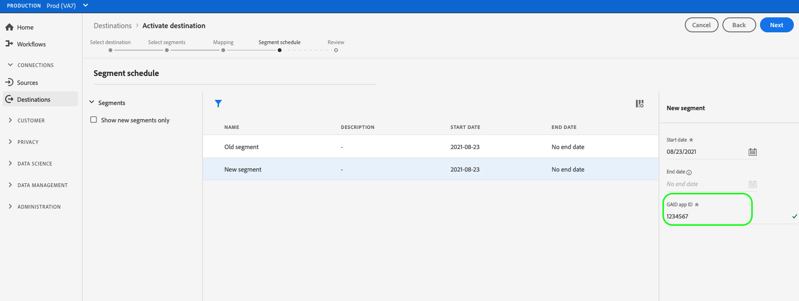

# Stimulansen voor het publiek naar streamingdoelen activeren

>[!IMPORTANT]
> 
> * Om publiek te activeren en de [&#x200B; toewijzingsstap &#x200B;](#mapping) van het werkschema toe te laten, hebt u **[!UICONTROL View Destinations]**, **[!UICONTROL Activate Destinations]**, **[!UICONTROL View Profiles]**, en **[!UICONTROL View Segments]** [&#x200B; toegangsbeheertoestemmingen &#x200B;](/help/access-control/home.md#permissions) nodig.
> * Om publiek te activeren zonder door de [&#x200B; toewijzingsstap &#x200B;](#mapping) van het werkschema te gaan, hebt u **[!UICONTROL View Destinations]**, **[!UICONTROL Activate Segment without Mapping]**, **[!UICONTROL View Profiles]**, en **[!UICONTROL View Segments]** [&#x200B; toegangsbeheertoestemmingen &#x200B;](/help/access-control/home.md#permissions) nodig.
> * Om *identiteiten* uit te voeren, hebt u de **[!UICONTROL View Identity Graph]** [&#x200B; toegangsbeheertoestemming &#x200B;](/help/access-control/home.md#permissions) nodig.   {width="100" zoomable="yes"}
> 
> Lees het [&#x200B; overzicht van de toegangscontrole &#x200B;](/help/access-control/ui/overview.md) of contacteer uw productbeheerder om de vereiste toestemmingen te verkrijgen.

## Overzicht {#overview}

In dit artikel wordt uitgelegd welke workflow is vereist om het publiek in Adobe Experience Platform-streaming doelen te activeren.

## Vereisten {#prerequisites}

Om publiek aan bestemmingen te activeren, moet u met succes [&#x200B; verbonden aan een bestemming &#x200B;](./connect-destination.md) hebben. Als u dit niet reeds hebt gedaan, ga naar de [&#x200B; bestemmingscatalogus &#x200B;](../catalog/overview.md), doorblader de gesteunde bestemmingen, en vorm de bestemming die u wilt gebruiken.

## Kies uw bestemming {#select-destination}

1. Ga naar **[!UICONTROL Connections > Destinations]** en selecteer de tab **[!UICONTROL Catalog]** .

   

1. Selecteer **[!UICONTROL Activate audiences]** op de kaart die overeenkomt met het doel waarvoor u het publiek wilt activeren, zoals in de onderstaande afbeelding wordt getoond.

   

1. Selecteer de doelverbinding die u wilt gebruiken om uw publiek te activeren en selecteer vervolgens **[!UICONTROL Next]** .

   

1. De beweging aan de volgende sectie aan [&#x200B; selecteert uw publiek &#x200B;](#select-audiences).

## Uw publiek selecteren {#select-audiences}

Als u het publiek dat u wilt activeren naar het doel wilt selecteren, schakelt u de selectievakjes links van de publieksnamen in en selecteert u **[!UICONTROL Next]** .

U kunt kiezen uit meerdere soorten publiek, afhankelijk van de oorsprong:

* **[!UICONTROL Segmentation Service]**: publiek dat in Experience Platform wordt gegenereerd door de Segmentation Service. Zie de [&#x200B; segmentatiedocumentatie &#x200B;](../../segmentation/ui/overview.md) voor meer details.
* **[!UICONTROL Custom upload]**: buiten Experience Platform gegenereerde soorten publiek die als CSV-bestanden naar Experience Platform worden geüpload. Meer over extern publiek leren, zie de documentatie bij [&#x200B; het invoeren van een publiek &#x200B;](../../segmentation/ui/audience-portal.md#import-audience).
* Andere soorten publiek, afkomstig van andere Adobe-oplossingen, zoals [!DNL Audience Manager] .

## Kenmerken en identiteiten toewijzen {#mapping}

>[!IMPORTANT]
>
>Deze stap is alleen van toepassing op bepaalde streamingdoelen voor het publiek. Als uw bestemming geen a **[!UICONTROL Mapping]** stap heeft, overslaan aan [&#x200B; publiek dat &#x200B;](#scheduling) plant.
>
>Wanneer het activeren van publiek aan het stromen bestemmingen, moet u *minstens één doelidentiteit ook in kaart brengen namespace*, naast de attributen van het doelprofiel. Anders wordt het publiek niet geactiveerd naar het doelplatform.
>  {zoomable="yes"}

Voor sommige doelstreamingdoelen voor het publiek moet u bronkenmerken of naamruimten selecteren om toe te wijzen als doelidentiteiten in de bestemming.

1. Selecteer **[!UICONTROL Mapping]** op de pagina **[!UICONTROL Add new mapping]** .

   

1. Selecteer de pijl rechts van de **[!UICONTROL Source field]** -vermelding.

   

1. Gebruik op de pagina **[!UICONTROL Select source field]** de opties **[!UICONTROL Select attributes]** of **[!UICONTROL Select identity namespace]** om te schakelen tussen de twee categorieën beschikbare bronvelden. Selecteer in de beschikbare [!DNL XDM] profielkenmerken en naamruimten de kenmerken die u aan het doel wilt toewijzen en kies vervolgens **[!UICONTROL Select]** .

   Met de schakeloptie **[!UICONTROL Show only fields with data]** kunt u alleen schemavelden weergeven die zijn gevuld met waarden. Standaard worden alleen gevulde schemavelden weergegeven.

   

   Gebruik de schakeloptie **[!UICONTROL Show display names for fields]** om de vriendelijke namen voor velden weer te geven in plaats van de schemaveldnamen.

   

1. Selecteer de knop rechts van de **[!UICONTROL Target field]** -vermelding.

   

1. Selecteer op de pagina **[!UICONTROL Select target field]** de naamruimte voor de doelidentiteit waaraan u het bronveld wilt toewijzen en kies **[!UICONTROL Select]** .

   

1. Herhaal stap 1 tot en met 5 om meer toewijzingen toe te voegen.

### Transformatie toepassen {#apply-transformation}

>[!CONTEXTUALHELP]
>id="platform_destinations_activate_applytransformation"
>title="Transformatie toepassen"
>abstract="Schakel deze optie in als u niet-gehashte bronvelden gebruikt, zodat Adobe Experience Platform deze automatisch verbergt bij activering."

Wanneer u ongehakte bronattributen aan doelattributen in kaart brengt die de bestemming (bijvoorbeeld: `email_lc_sha256` of `phone_sha256`) verwacht worden gehakt, controleer **transformatie** optie toepassen om Adobe Experience Platform automatisch te hebben de bronattributen bij activering hakt.

## Het exporteren van publiek plannen {#scheduling}

>[!CONTEXTUALHELP]
>id="platform_destinations_activate_enddate"
>title="Einddatum"
>abstract="Het toevoegen van een einddatum voor het publieksprogramma is niet beschikbaar."

Standaard geeft de pagina **[!UICONTROL Audience schedule]** alleen het zojuist geselecteerde publiek weer dat u hebt gekozen in de huidige activeringsstroom.

Als u wilt zien welk publiek wordt geactiveerd voor uw doel, gebruikt u de filteroptie en schakelt u het filter **[!UICONTROL Show new audiences only]** uit.

1. Selecteer elk publiek op de pagina **[!UICONTROL Audience schedule]** en gebruik vervolgens de kiezers **[!UICONTROL Start date]** en **[!UICONTROL End date]** om het tijdsinterval voor het verzenden van gegevens naar uw bestemming te configureren.

   

   * Voor sommige doelen moet u **[!UICONTROL Origin of audience]** voor elk publiek selecteren via het vervolgkeuzemenu onder de kalenderkiezers. Als deze kiezer niet in uw doel is opgenomen, slaat u deze stap over.

     

   * Voor sommige doelen moet u het publiek [!DNL Experience Platform] handmatig toewijzen aan de tegenhanger in het doeldoel. Om dit te doen, selecteer elk publiek, dan ga overeenkomstige publiekidentiteitskaart van het bestemmingsplatform op het **[!UICONTROL Mapping ID]** gebied in. Sla deze stap over als dit veld niet in uw bestemming is opgenomen.

     

   * Voor sommige doelen moet u een **[!UICONTROL App ID]** invoeren wanneer u [!DNL IDFA] of [!DNL GAID] publiek activeert. Sla deze stap over als dit veld niet in uw bestemming is opgenomen.

     

1. Selecteer **[!UICONTROL Next]** om naar de pagina van [!UICONTROL Review] te gaan.

## Controleren {#review}

Op de pagina **[!UICONTROL Review]** ziet u een overzicht van uw selectie. Selecteer **[!UICONTROL Cancel]** om de stroom te verbreken, **[!UICONTROL Back]** om uw instellingen te wijzigen of **[!UICONTROL Finish]** om uw selectie te bevestigen en gegevens naar de bestemming te verzenden.

### Goedkeuring van het beleid {#consent-policy-evaluation}

Als uw organisatie **het Schild van de Gezondheidszorg van Adobe** of **de Privacy &amp; het Schild van de Veiligheid van Adobe** kocht, selecteer **[!UICONTROL View applicable consent policies]** om te zien welk toestemmingsbeleid wordt toegepast en hoeveel profielen in de activering als resultaat van hen inbegrepen zijn. Lees over [&#x200B; evaluatie van het toestemmingsbeleid &#x200B;](/help/data-governance/enforcement/auto-enforcement.md#consent-policy-evaluation) voor meer informatie.

### Controle van het gegevensgebruiksbeleid {#data-usage-policy-checks}

In de stap **[!UICONTROL Review]** controleert Experience Platform ook op overtredingen van het gegevensgebruiksbeleid. Hieronder ziet u een voorbeeld waarin een beleid wordt overtreden. U kunt de workflow voor publieksactivering pas voltooien nadat u de schending hebt opgelost. Voor informatie over hoe te om beleidsschendingen op te lossen, lees over [&#x200B; schendingen van het beleid van het gegevensgebruik &#x200B;](/help/data-governance/enforcement/auto-enforcement.md#data-usage-violation) in de de documentatiesectie van het gegevensbeheer.

### Filter publiek {#filter-audiences}

In deze stap kunt u ook de beschikbare filters op de pagina gebruiken om alleen de doelgroepen weer te geven waarvan het schema of de toewijzing is bijgewerkt als onderdeel van deze workflow. U kunt ook schakelen welke tabelkolommen u wilt zien.

Als u tevreden bent met de selectie en er zijn geen beleidsovertredingen vastgesteld, selecteert u **[!UICONTROL Finish]** om uw selectie te bevestigen en gegevens naar de bestemming te verzenden.

## Activering van publiek controleren {#verify}

Controleer de [&#x200B; documentatie van de bestemmings controle &#x200B;](../../dataflows/ui/monitor-destinations.md) voor gedetailleerde informatie over hoe te om de stroom van gegevens aan uw bestemmingen te controleren.

<!-- 
For [!DNL Facebook Custom Audience], a successful activation means that a [!DNL Facebook] custom audience would be created programmatically in [[!UICONTROL Facebook Ads Manager]](https://www.facebook.com/adsmanager/manage/). Audience membership in the audience would be added and removed as users are qualified or disqualified for the activated audiences.

>[!TIP]
>
>The integration between Adobe Experience Platform and [!DNL Facebook] supports historical audience backfills. All historical audience qualifications are sent to [!DNL Facebook] when you activate the audiences to the destination.
-->
