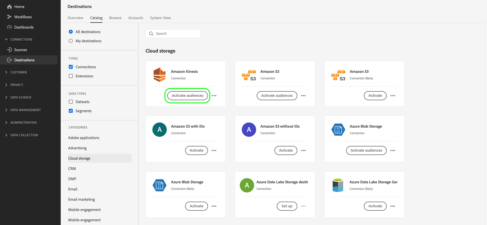

# Stimulansen voor het streamen van exportdoelen voor profielen activeren

>[!IMPORTANT]
> 
> * Om gegevens te activeren en de [&#x200B; toewijzingsstap &#x200B;](#mapping) van het werkschema toe te laten, hebt u **[!UICONTROL View Destinations]**, **[!UICONTROL Activate Destinations]**, **[!UICONTROL View Profiles]**, en **[!UICONTROL View Segments]** [&#x200B; toegangsbeheertoestemmingen &#x200B;](/help/access-control/home.md#permissions) nodig.
> * Om gegevens te activeren zonder door de [&#x200B; toewijzingsstap &#x200B;](#mapping) van het werkschema te gaan, hebt u **[!UICONTROL View Destinations]**, **[!UICONTROL Activate Segment without Mapping]**, **[!UICONTROL View Profiles]**, en **[!UICONTROL View Segments]** [&#x200B; toegangsbeheertoestemmingen &#x200B;](/help/access-control/home.md#permissions) nodig.
> 
> Lees het [&#x200B; overzicht van de toegangscontrole &#x200B;](/help/access-control/ui/overview.md) of contacteer uw productbeheerder om de vereiste toestemmingen te verkrijgen.

## Overzicht {#overview}

Dit artikel verklaart het werkschema dat wordt vereist om publieksgegevens in Adobe Experience Platform aan het stromen op profiel-gebaseerde bestemmingen (die ook als [&#x200B; ondernemingsbestemmingen &#x200B;](/help/destinations/destination-types.md#advanced-enterprise-destinations) worden bedoeld) te activeren.

Dit artikel is van toepassing op de volgende drie bestemmingen:

* [Amazon Kinesis](/help/destinations/catalog/cloud-storage/amazon-kinesis.md)
* [Azure Event Hubs](/help/destinations/catalog/cloud-storage/azure-event-hubs.md)
* [&#x200B; HTTP API bestemming &#x200B;](/help/destinations/catalog/streaming/http-destination.md).

## Vereisten {#prerequisites}

Om gegevens aan bestemmingen te activeren, moet u met succes [&#x200B; verbonden aan een bestemming &#x200B;](./connect-destination.md) hebben. Als u dit niet reeds hebt gedaan, ga naar de [&#x200B; bestemmingscatalogus &#x200B;](../catalog/overview.md), doorblader de gesteunde bestemmingen, en vorm de bestemming die u wilt gebruiken.

## Kies uw bestemming {#select-destination}

1. Ga naar **[!UICONTROL Connections > Destinations]** en selecteer de tab **[!UICONTROL Catalog]** .

   

1. Selecteer **[!UICONTROL Activate audiences]** op de kaart die overeenkomt met het doel waarvoor u het publiek wilt activeren, zoals in de onderstaande afbeelding wordt getoond.

   

1. Selecteer de doelverbinding die u wilt gebruiken om uw publiek te activeren en selecteer vervolgens **[!UICONTROL Next]** .

   

1. De beweging aan de volgende sectie aan [&#x200B; selecteert uw publiek &#x200B;](#select-audiences).

## Uw publiek selecteren {#select-audiences}

Als u het publiek dat u wilt activeren naar het doel wilt selecteren, schakelt u de selectievakjes links van de publieksnamen in en selecteert u **[!UICONTROL Next]** .

U kunt kiezen uit meerdere soorten publiek, afhankelijk van de oorsprong:

* **[!UICONTROL Segmentation Service]**: publiek dat in Experience Platform wordt gegenereerd door de Segmentation Service. Zie de [&#x200B; documentatie van het Portaal van de Poorten van de Poorten van het Publiek &#x200B;](../../segmentation/ui/audience-portal.md) voor meer details.
* **[!UICONTROL Custom upload]**: buiten Experience Platform gegenereerde soorten publiek die als CSV-bestanden naar Experience Platform worden geüpload. Meer over extern publiek leren, zie de documentatie bij [&#x200B; het invoeren van een publiek &#x200B;](../../segmentation/ui/audience-portal.md#import-audience).
* Andere soorten publiek, afkomstig van andere Adobe-oplossingen, zoals [!DNL Audience Manager] .


## Profielkenmerken selecteren {#select-attributes}

Selecteer in de stap **[!UICONTROL Mapping]** de profielkenmerken die u naar de doelbestemming wilt verzenden.

1. Selecteer **[!UICONTROL Select attributes]** op de pagina **[!UICONTROL Add new field]** .

   

1. Selecteer de pijl rechts van de **[!UICONTROL Schema field]** -vermelding.

   

1. Selecteer op de pagina **[!UICONTROL Select source field]** de XDM-kenmerken die u naar het doel wilt verzenden en kies vervolgens **[!UICONTROL Save]** .

   

   Met de schakeloptie **[!UICONTROL Show only fields with data]** kunt u alleen schemavelden weergeven die zijn gevuld met waarden. Standaard worden alleen gevulde schemavelden weergegeven.

   Gebruik de schakeloptie **[!UICONTROL Show display names for fields]** om de vriendelijke namen voor velden weer te geven in plaats van de schemaveldnamen.

   

1. Als u meer velden wilt toevoegen, herhaalt u stap 1 tot en met 3 en selecteert u **[!UICONTROL Next]** .

## Controleren {#review}

Op de pagina **[!UICONTROL Review]** ziet u een overzicht van uw selectie. Selecteer **[!UICONTROL Cancel]** om de stroom te verbreken, **[!UICONTROL Back]** om uw instellingen te wijzigen of **[!UICONTROL Finish]** om uw selectie te bevestigen en gegevens naar de bestemming te verzenden.


### Goedkeuring van het beleid {#consent-policy-evaluation}

[&#x200B; de beleidsevaluatie van de Goedkeuring &#x200B;](/help/data-governance/enforcement/auto-enforcement.md#consent-policy-evaluation) wordt momenteel niet gesteund in de uitvoer naar de drie ondernemingsbestemmingen - Amazon Kinesis, Azure Event Hubs, en HTTP API.

Dit betekent dat de profielen die niet aan het worden gericht *zijn inbegrepen* in de uitvoer naar deze drie bestemmingen zijn.

<!--

If your organization purchased **Adobe Healthcare Shield** or **Adobe Privacy & Security Shield**, select **[!UICONTROL View applicable consent policies]** to see which consent policies are applied and how many profiles are included in the activation as a result of them. Read about [consent policy evaluation](/help/data-governance/enforcement/auto-enforcement.md#consent-policy-evaluation) for more information.

-->

### Controle van het gegevensgebruiksbeleid {#data-usage-policy-checks}

In de stap **[!UICONTROL Review]** controleert Experience Platform ook op overtredingen van het gegevensgebruiksbeleid. Hieronder ziet u een voorbeeld waarin een beleid wordt overtreden. U kunt de workflow voor publieksactivering pas voltooien nadat u de schending hebt opgelost. Voor informatie over hoe te om beleidsschendingen op te lossen, lees over [&#x200B; schendingen van het beleid van het gegevensgebruik &#x200B;](/help/data-governance/enforcement/auto-enforcement.md#data-usage-violation) in de de documentatiesectie van het gegevensbeheer.


### Filter publiek {#filter-audiences}

In deze stap kunt u ook de beschikbare filters op de pagina gebruiken om alleen de doelgroepen weer te geven waarvan het schema of de toewijzing is bijgewerkt als onderdeel van deze workflow.


Als u tevreden bent met de selectie en er zijn geen beleidsovertredingen vastgesteld, selecteert u **[!UICONTROL Finish]** om uw selectie te bevestigen en gegevens naar de bestemming te verzenden.

## Activering van publiek controleren {#verify}

De geëxporteerde [!DNL Experience Platform] gegevens worden in JSON-indeling in uw doelbestemming geplaatst. De gebeurtenis hieronder bevat bijvoorbeeld het kenmerk E-mailadres van een profiel dat voor een bepaald publiek is gekwalificeerd en dat een ander publiek heeft verlaten. De identiteiten voor dit vooruitzicht zijn `ECID` en `email_lc_sha256` .

```json
{
  "person": {
    "email": "yourstruly@adobe.com"
  },
  "segmentMembership": {
    "ups": {
      "7841ba61-23c1-4bb3-a495-00d3g5fe1e93": {
        "lastQualificationTime": "2020-05-25T21:24:39Z",
        "status": "exited"
      },
      "59bd2fkd-3c48-4b18-bf56-4f5c5e6967ae": {
        "lastQualificationTime": "2020-05-25T23:37:33Z",
        "status": "realized"
      }
    }
  },
  "identityMap": {
    "ecid": [
      {
        "id": "14575006536349286404619648085736425115"
      },
      {
        "id": "66478888669296734530114754794777368480"
      }
    ],
    "email_lc_sha256": [
      {
        "id": "655332b5fa2aea4498bf7a290cff017cb4"
      },
      {
        "id": "66baf76ef9de8b42df8903f00e0e3dc0b7"
      }
    ]
  }
}
```
