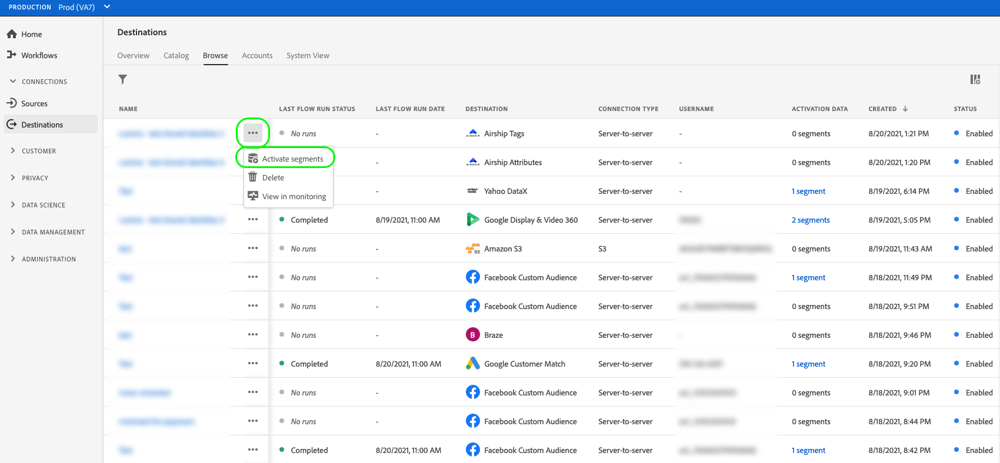

# Overzicht van activering

>[!IMPORTANT]
> 
>Als u gegevens wilt activeren, hebt u de opdracht **[!UICONTROL Manage Destinations]**, **[!UICONTROL Activate Destinations]**, **[!UICONTROL View Profiles]**, en **[!UICONTROL View Segments]** [toegangsbeheermachtigingen](/help/access-control/home.md#permissions). Lees de [toegangsbeheeroverzicht](/help/access-control/ui/overview.md) of neem contact op met de productbeheerder om de vereiste machtigingen te verkrijgen.

Adobe Experience Platform ondersteunt een groot aantal bestemmingen. De workflow voor publiekactivering varieert per bestemming, op basis van het type publieksgegevens dat door de gebruikers wordt ondersteund en de frequentie waarmee de gegevens worden geëxporteerd.

## Activeringsmethoden {#activation-methods}

Na u [vorm uw bestemming](connect-destination.md)kunt u publiekssegmenten op meerdere manieren activeren:

### Soorten publiek vanuit de catalogus met doelen activeren

Zie de volgende gidsen voor gedetailleerde informatie over het activeren van publiek aan uw bestemming van de catalogus van bestemmingen:

* [De publieksgegevens van de activering aan het stromen segment de uitvoerbestemmingen](activate-segment-streaming-destinations.md)
* [De publieksgegevens van de activering aan het stromen profiel de uitvoerbestemmingen](activate-streaming-profile-destinations.md)
* [Gebruikersgegevens activeren om exportdoelen voor batchprofielen te maken](activate-batch-profile-destinations.md)

### Soorten publiek vanuit de [!UICONTROL Browse] page

Voer de onderstaande stappen uit om gegevens vanuit de **[!UICONTROL Browse]** pagina.

1. Ga naar **[!UICONTROL Connections > Destinations]** en selecteert u de **[!UICONTROL Browse]** tab.

   

1. Zoek de doelverbinding die u wilt gebruiken om uw segmenten te activeren, selecteer de drie stippen in het dialoogvenster [!UICONTROL Name] kolom, selecteer dan **[!UICONTROL Activate segments]**.

   

1. Voer afhankelijk van de geselecteerde bestemming de stappen uit die in de onderstaande artikelen worden beschreven, te beginnen met de **[!UICONTROL Select segments]** stap, om de activeringsworkflow te voltooien:

   * [De publieksgegevens van de activering aan het stromen segment de uitvoerbestemmingen](activate-segment-streaming-destinations.md)
   * [De publieksgegevens van de activering aan het stromen profiel de uitvoerbestemmingen](activate-streaming-profile-destinations.md)
   * [Gebruikersgegevens activeren om exportdoelen voor batchprofielen te maken](activate-batch-profile-destinations.md)

### Het publiek activeren vanaf de pagina met segmentdetails {#activate-segment-details}

U kunt segmenten naar doelen activeren vanaf de pagina met segmentdetails. Zie [Segmentdetails](../../segmentation/ui/overview.md#segment-details) voor meer informatie .

Voer afhankelijk van de geselecteerde bestemming de stappen uit die in de onderstaande artikelen worden beschreven om de activeringsworkflow te voltooien:

* [De publieksgegevens van de activering aan het stromen segment de uitvoerbestemmingen](activate-segment-streaming-destinations.md)
* [De publieksgegevens van de activering aan het stromen profiel de uitvoerbestemmingen](activate-streaming-profile-destinations.md)
* [Gebruikersgegevens activeren om exportdoelen voor batchprofielen te maken](activate-batch-profile-destinations.md)
