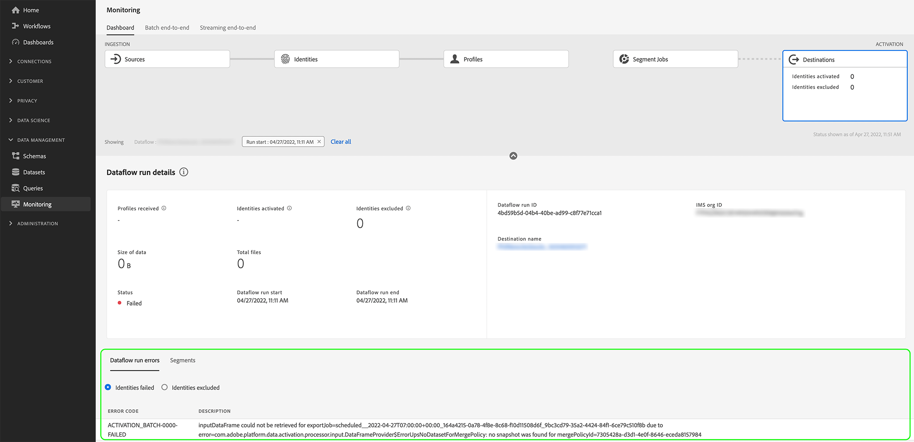

# Abonneren op in-context-bestemmingswaarschuwingen

Met Adobe Experience Platform kunt u zich abonneren op waarschuwingen voor gebeurtenissen met betrekking tot Adobe Experience Platform-activiteiten. Waarschuwingen verminderen of elimineren de noodzaak om de [[!DNL Observability Insights] API](../../observability/api/overview.md) om na te gaan of een baan heeft voltooid, of een bepaalde mijlpaal in een werkstroom is bereikt of of er fouten zijn opgetreden.

U kunt zich op alarm abonneren wanneer het creëren van een gegevensstroom om waakzame berichten betreffende de status, het succes, of het mislukken van uw looppas te ontvangen.

In dit document worden de stappen beschreven voor de manier waarop u zich abonneert op waarschuwingsberichten voor uw doelgegevens.

## Aan de slag

Voor dit document is een goed begrip van de volgende Adobe Experience Platform-componenten vereist:

* [Doelen](../home.md): Vooraf gebouwde integratie met doelplatforms die een naadloze activering van gegevens van Adobe Experience Platform mogelijk maken. U kunt bestemmingen gebruiken om uw bekende en onbekende gegevens voor kanaalmarketing campagnes, e-mailcampagnes, gerichte reclame, en vele andere gebruiksgevallen te activeren.
* [Waarneming](../../observability/home.md): [!DNL Observability Insights] kunt u de activiteiten van Platforms volgen door statistische gegevens en gebeurtenismeldingen te gebruiken.
   * [Waarschuwingen](../../observability/alerts/overview.md): Wanneer een bepaalde reeks voorwaarden in uw verrichtingen van het Platform wordt bereikt (zoals een potentieel probleem wanneer het systeem een drempel) schendt, kan het Platform waakzame berichten aan om het even welke gebruikers in uw organisatie leveren die aan hen hebben ingetekend.

## Abonneren op waarschuwingen in de gebruikersinterface {#subscribe-destination-alerts}

>[!CONTEXTUALHELP]
>id="platform_destination_alerts_subscribe"
>title="Abonneren op bestemmingswaarschuwingen"
>abstract="Met waarschuwingen kunt u meldingen ontvangen op basis van de status van uw doelgegevens. U kunt waarschuwingsmeldingen instellen om updates op te halen als uw gegevensstroom is gestart, is gelukt, is mislukt of geen gegevens naar uw bestemming heeft verzonden."
>text="Learn more in documentation"

>[!IMPORTANT]
>
>U moet directe meldingen van e-mails voor uw Platform-account inschakelen om e-mailmeldingen voor uw gegevensstromen te ontvangen.

U kunt waarschuwingen inschakelen voor uw gegevensstromen tijdens de [!UICONTROL Configure new destination] de [doelverbinding](connect-destination.md) workflow.

Selecteer de waarschuwingen waarop u zich wilt abonneren en selecteer **[!UICONTROL Next]** om uw gegevensstroom te bekijken en te voltooien.

De waarschuwingen die beschikbaar zijn voor bestemmingsgegevensstromen worden beschreven in de onderstaande tabel.

* Voor streamingdoelen worden alleen de [!DNL Activation Skipped Rate Exceeded] Er is een waarschuwing beschikbaar.
* Voor op een bestand gebaseerde doelen zijn alle waarschuwingen beschikbaar.

| Waarschuwingen | Beschrijving |
| --- | --- |
| Uitvoervertraging bestemming | Deze waarschuwing brengt u op de hoogte wanneer een looppas van de bestemmingsstroom langer dan 150 minuten duurt om een segment te activeren. |
| Uitvoerfout bestemming | Deze waarschuwing brengt u op de hoogte wanneer een fout voorkomt terwijl het activeren van een segment aan een bestemming. |
| Uitvoersucces bestemming | Deze waarschuwing brengt u op de hoogte wanneer een segment met succes aan een bestemming wordt geactiveerd. |
| Start stroom bestemming | Deze waarschuwing brengt u op de hoogte wanneer een looppas van de bestemmingsstroom begint een segment te activeren. |
| Overgeslagen activeringssnelheid overschreden | Deze waarschuwing geeft een melding wanneer de activeringsfrequentie hoger is dan 1% van de totale activeringen. De identiteiten worden overgeslagen tijdens activering wanneer ze ontbrekende kenmerken of een schending van de toestemming hebben. |

## Ontvangen van waarschuwingen {#receiving-alerts}

Zodra uw doelgegevensstroom loopt, kunt u alarm door UI of door e-mail ontvangen.

### Waarschuwingen ontvangen in de gebruikersinterface {#receiving-alerts-in-ui}

Waarschuwingen worden in de gebruikersinterface vertegenwoordigd door een meldingspictogram in de bovenste koptekst van de gebruikersinterface van het Platform. Selecteer het berichtpictogram om specifieke waakzame berichten betreffende uw gegevens te zien.

Het deelvenster met meldingen wordt weergegeven met een lijst met statusupdates in de gegevensstroom die u hebt gemaakt.

U kunt de muisaanwijzer op een waarschuwingsbericht plaatsen om deze als gelezen te markeren of u kunt het klokpictogram selecteren om toekomstige herinneringen op de status van uw gegevensstroom in te stellen.

Selecteer het waakzame bericht om specifieke informatie op uw gegevensstroom te zien.

De [!UICONTROL Dataflow run details] wordt weergegeven. In de bovenste helft van het scherm wordt een overzicht van uw gegevensstroom weergegeven, inclusief informatie over de kenmerken, de bijbehorende id voor de uitvoering van de gegevensstroom en het overzicht van de fouten op hoog niveau.

In de onderste helft van de pagina worden alle [!UICONTROL Dataflow run errors] die zijn uitgevoerd tijdens het werkgebied voor gegevensstroom. Hier kunt u een voorvertoning van de foutdiagnostiek bekijken of de [[!DNL Data Access] API](https://www.adobe.io/experience-platform-apis/references/data-access/) om foutdiagnostiek te downloaden of het bestandmanifest die overeenkomt met uw gegevensstroom.

Zie de handleiding voor meer informatie over het verwerken van dataflow-fouten [de gegevens van controlebestemmingen in UI](../../dataflows/ui/monitor-destinations.md).

### Waarschuwingen ontvangen per e-mail {#receiving-alerts-by-email}

Waarschuwingen voor uw gegevensstromen worden ook via e-mail aan u verzonden. Selecteer de naam van de gegevensstroom in de hoofdtekst van de e-mail om meer informatie over uw gegevensstroom te zien.

Net als de gebruikersinterface-waarschuwing worden de [!UICONTROL Dataflow run overview] wordt weergegeven, zodat u een interface hebt waarmee u eventuele fouten kunt onderzoeken die aan uw gegevensstroom zijn gekoppeld.

## Abonneren op waarschuwingen en je abonnement opzeggen {#subscribe-and-unsubscribe}

U kunt zich abonneren op meer waarschuwingen of uw abonnement op bestaande waarschuwingen opzeggen voor een bestaande doelgegevensstroom op de doelen [!UICONTROL Browse] pagina.

Zoek de doelverbinding waarvoor u waarschuwingen wilt ontvangen en selecteer de ovalen (`...`) om een vervolgkeuzemenu met opties weer te geven. Selecteer vervolgens **[!UICONTROL Subscribe to alerts]** om de waakzame montages van uw bestemmingsgegeven te wijzigen.

Er wordt een pop-upvenster weergegeven met een lijst met doelwaarschuwingen. Selecteer de waarschuwingen waarvan u zich wilt abonneren of hef de selectie van waarschuwingen op. Als u klaar bent, selecteert u **[!UICONTROL Save]**.

## Volgende stappen {#next-steps}

Dit document verstrekte een geleidelijke gids over hoe te om aan in-context alarm voor uw bestemmingsdataflows in te tekenen. Zie voor meer informatie de [UI-hulplijn voor waarschuwingen](../../observability/alerts/ui.md).
