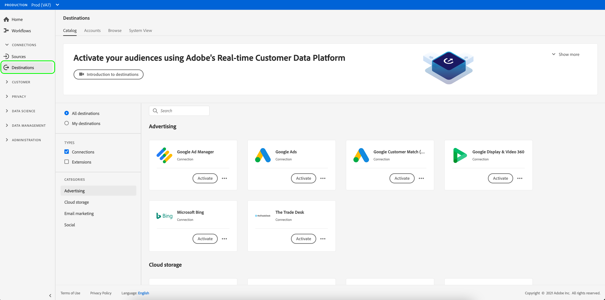

# Verbinding maken met een doel

Voer de onderstaande stappen uit om verbinding te maken met een doel in Adobe Experience Platform:

1. Meld u aan bij [Experience Platform UI](https://platform.adobe.com/) en selecteer **[!UICONTROL Destinations]** in de linkernavigatiebalk.

   

2. Selecteer op het tabblad [[!UICONTROL Catalog]](./destinations-workspace.md#catalog) het doel waarmee u verbinding wilt maken.

3. Selecteer **[!UICONTROL Configure]** om de verbind bestemmingstovenaar te beginnen.

   

   >[!NOTE]
   >
   >Als een verbinding met een bestemming bestaat, kunt u een **[!UICONTROL Activate]** knoop op de bestemmingskaart zien. Raadpleeg voor meer informatie over het verschil tussen **[!UICONTROL Activate]** en **[!UICONTROL Configure]** de sectie [Catalog](../ui/destinations-workspace.md#catalog) van de documentatie van de doelwerkruimte.

4. Zie [Overzicht van de catalogus van Doelen](../catalog/overview.md) voor instructies op hoe te met specifieke types van bestemmingen te verbinden.

5. U kunt de video hieronder optioneel bekijken voor een overzicht van hoe u verbinding kunt maken met een doel en segmenten kunt activeren.

   >[!VIDEO](https://video.tv.adobe.com/v/29710?quality=12)
