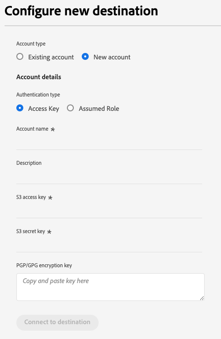
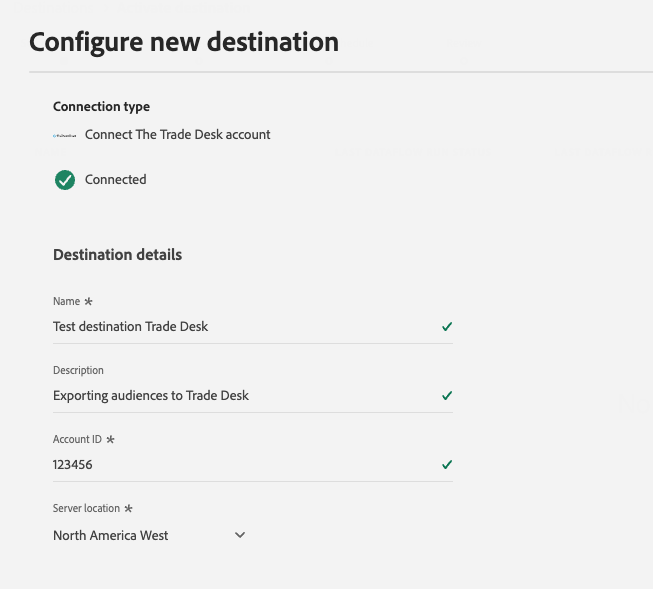

# Een nieuwe doelverbinding maken

>[!IMPORTANT]
> 
>* Om met een bestemming te verbinden, hebt u **[!UICONTROL View Destinations]** en **[!UICONTROL Manage Destinations]** [&#x200B; toegangsbeheertoestemmingen &#x200B;](/help/access-control/home.md#permissions) nodig. Lees het [&#x200B; overzicht van de toegangscontrole &#x200B;](/help/access-control/ui/overview.md) of contacteer uw productbeheerder om de vereiste toestemmingen te verkrijgen.
>* Om met een bestemming te verbinden die dataset uitvoert steunt, hebt u **[!UICONTROL View Destinations]** en **[!UICONTROL Manage and Activate Dataset Destinations]** [&#x200B; toegangsbeheertoestemmingen &#x200B;](/help/access-control/home.md#permissions) nodig. Lees het [&#x200B; overzicht van de toegangscontrole &#x200B;](/help/access-control/ui/overview.md) of contacteer uw productbeheerder om de vereiste toestemmingen te verkrijgen.

## Overzicht {#overview}

Voordat u publieksgegevens naar een bestemming kunt verzenden, moet u een verbinding naar het doelplatform instellen. In dit artikel wordt uitgelegd hoe u een nieuwe doelverbinding instelt, waarop u vervolgens een publiek kunt activeren of gegevenssets kunt exporteren met de gebruikersinterface van Adobe Experience Platform.

## Het gewenste doel in de catalogus zoeken {#setup}

1. Ga naar **[!UICONTROL Connections]** > **[!UICONTROL Destinations]** en selecteer de tab **[!UICONTROL Catalog]** .

   

2. De kaarten van de bestemming in de catalogus zouden verschillende actiecontroles kunnen hebben, afhankelijk van of u een bestaande verbinding aan de bestemming hebt en of de bestemmingen het activeren van publiek, het uitvoeren van datasets, of allebei steunen. U zou om het even welke volgende controles voor bestemmingskaarten kunnen zien:

   * **[!UICONTROL Set up]**. Een verbinding moet eerst opstelling aan deze bestemming zijn alvorens u publiek kunt activeren of datasets uitvoeren.
   * **[!UICONTROL Activate]**. Er is al een verbinding ingesteld met dit doel. Deze bestemming steunt publieksactivering en de uitvoer van datasets.
   * **[!UICONTROL Activate audiences]**. Er is al een verbinding ingesteld met dit doel. Deze bestemming ondersteunt alleen activering van het publiek.

   Voor meer informatie over het verschil tussen deze controles, kunt u ook naar de [&#x200B; sectie van de Catalogus &#x200B;](../ui/destinations-workspace.md#catalog) van de documentatie van de bestemmingswerkruimte verwijzen.

   Selecteer **[!UICONTROL Set up]**, **[!UICONTROL Activate]** of **[!UICONTROL Activate audiences]** , afhankelijk van de besturingselementen die beschikbaar zijn.

   

   

3. Als u **[!UICONTROL Set up]** selecteerde, skip aan de volgende stap, [&#128279;](#authenticate) aan de bestemming voor authentiek verklaren.

   Als u **[!UICONTROL Activate]**, **[!UICONTROL Activate audiences]** of **[!UICONTROL Export datasets]** hebt geselecteerd, wordt nu een lijst met bestaande doelverbindingen weergegeven.

   Selecteer **[!UICONTROL Configure new destination]** om een nieuwe verbinding met het doel tot stand te brengen.

   

## Verifiëren voor bestemming {#authenticate}

>[!CONTEXTUALHELP]
>id="platform_destinations_account_name"
>title="Accountnaam"
>abstract="Voer een naam in waarmee u dit doelaccount in de toekomst gemakkelijk kunt herkennen. Dit is vooral handig als u meerdere verbindingen met hetzelfde doel hebt."

De eerste stap in het verbinden met een bestemming moet aan het bestemmingsplatform voor authentiek verklaren.

Afhankelijk van het doel waarmee u verbinding maakt, kunt u naar de pagina van de bestemmingspartner worden gebracht voor verificatie, of u wordt gevraagd om verificatiegegevens rechtstreeks in te voeren in de Experience Platform-workflow.

Wanneer u een nieuwe doelverbinding instelt, moet u een **[!UICONTROL Account name]** en (optioneel) een **[!UICONTROL Description]** opgeven. Deze velden zijn beschikbaar voor alle doelen.

* **[!UICONTROL Account name]**: voer een naam in die u helpt dit doelaccount in de toekomst gemakkelijk te identificeren. Dit is vooral handig als u meerdere verbindingen met hetzelfde doel hebt.
* **[!UICONTROL Description]** (optioneel): voeg aanvullende gegevens toe die u of uw team helpen onderscheid te maken tussen accounts, zoals het doel van de verbinding of de relevante zakelijke context.

Als u duidelijke en beschrijvende informatie in deze velden opgeeft, kunt u de juiste doelaccount eenvoudiger beheren en selecteren wanneer u een publiek activeert.

Hieronder ziet u een voorbeeld van de vereiste invoer voor verificatie bij een [!DNL Amazon S3] -doel. Gedetailleerde instructies over de vereiste invoer worden gegeven op elke pagina met doeldocumentatie (zie bijvoorbeeld de verificatiesectie voor [[!DNL Amazon S3]](/help/destinations/catalog/cloud-storage/amazon-s3.md#authenticate) en voor [[!DNL Facebook]](/help/destinations/catalog/social/facebook.md#authenticate) ).

**[!DNL Amazon S3]vereiste en optionele verificatieparameters**

## Verbindingsparameters instellen {#set-up-connection-parameters}

Als u al verificatie hebt ingesteld op de bestemming, kunt u doorgaan met het bestaande account of kunt u een nieuw account instellen.

Afhankelijk van het doel waarmee u verbinding maakt, wordt u mogelijk gevraagd verschillende typen verbindingsparameters in te voeren. Wanneer u bijvoorbeeld verbinding maakt met een [!DNL Amazon S3] -doel, wordt u gevraagd gegevens te verstrekken over de naam van de [!DNL Amazon S3] emmertje en het mappad waar bestanden worden gedeponeerd. Hieronder ziet u twee voorbeelden van vereiste invoer voor een [!DNL Amazon S3] -doel en een [!DNL Trade Desk] -doel. Gedetailleerde instructies over de vereiste invoer worden gegeven op elke pagina van de doeldocumentatie.

>[!IMPORTANT]
>
>De onderstaande afbeeldingen worden alleen ter illustratie gebruikt. De details van de bestemmingsverbinding variëren tussen bestemmingen. Voor gedetailleerde informatie over de verbindingsdetails voor uw bestemming, lees **verbind met de bestemmings** sectie in elke [&#x200B; bestemmingscatalogus &#x200B;](../catalog/overview.md) pagina (bijvoorbeeld, [[!DNL Google Customer Match]](../catalog/advertising/google-customer-match.md#connect), [[!DNL Trade Desk]](/help/destinations/catalog/advertising/tradedesk.md#connect), of [[!DNL Amazon S3]](/help/destinations/catalog/cloud-storage/amazon-s3.md#destination-details)).

**[!DNL Amazon S3]vereiste en optionele invoerparameters**

**[!DNL The Trade Desk]vereiste en optionele invoerparameters**

### Opties voor bestandsindeling instellen voor geëxporteerde bestanden {#file-formatting-and-compression-options}

Voor op bestanden gebaseerde doelen kunt u verschillende instellingen configureren die betrekking hebben op de indeling en comprimeren van de geëxporteerde bestanden. Voor meer informatie over alle beschikbare het formatteren en compressieopties, lees [&#x200B; dossier het formatteren opties voor op dossier-gebaseerde bestemmingsleerprogramma &#x200B;](/help/destinations/ui/batch-destinations-file-formatting-options.md).

### De bestemmingsverbinding van de opstelling voor publieksactivering, rekeningsactivering, perspectiefactivering of datasetuitvoer {#segment-activation-or-dataset-exports}

Sommige op dossier-gebaseerde bestemmingen steunen publieksactivering aan bekende klanten, rekeningsklanten, of vooruitzichten, evenals datasetuitvoer. Voor die bestemmingen, kunt u kiezen of om een verbinding tot stand te brengen die u [&#x200B; toelaat om publiek &#x200B;](/help/destinations/ui/activate-batch-profile-destinations.md), [&#x200B; rekeningen &#x200B;](/help/destinations/ui/activate-account-audiences.md), [&#x200B; vooruitzichten &#x200B;](/help/destinations/ui/activate-prospect-audiences.md), of [&#x200B; de uitvoerdatasets &#x200B;](/help/destinations/ui/export-datasets.md) te activeren.

>[!WARNING]
>
>Wanneer u gegevenssets exporteert, ziet u dat het exporteren naar JSON-bestanden alleen in de gecomprimeerde modus wordt ondersteund. Exporteren naar [!DNL Parquet] -bestanden worden ondersteund in een gecomprimeerde en niet-gecomprimeerde modus.

### Doelwaarschuwingen inschakelen {#enable-alerts}

1. (Optioneel) Selecteer de waarschuwingen voor de doelgegevensstroom waarop u zich wilt abonneren. U kunt zich op alarm abonneren wanneer het creëren van een gegevensstroom om waakzame berichten betreffende de status, het succes, of het mislukken van uw looppas te ontvangen. De beschikbare waarschuwingen verschillen afhankelijk van het doeltype (bestandsgebaseerd of streaming) waarmee u verbinding maakt. Lees [&#x200B; Abonneren aan in-context bestemmingsalarm &#x200B;](alerts.md) voor gedetailleerde informatie over bestemmingdataflow alarm.

   

2. Selecteer **[!UICONTROL Next]**.

   

## marketingacties selecteren {#select-marketing-actions}

1. Selecteer de marketingacties die van toepassing zijn op de gegevens die u naar de bestemming wilt exporteren. Marketingsacties geven de intentie aan waarvoor gegevens naar de bestemming worden geëxporteerd. U kunt kiezen uit door Adobe gedefinieerde marketingacties of u kunt uw eigen marketingactie maken. Voor meer informatie over marketing acties, zie de [&#x200B; pagina van het het beleidsoverzicht van het gegevensgebruik &#x200B;](../../data-governance/policies/overview.md).

   

2. Selecteer **[!UICONTROL Save & Exit]** om de bestemmingsconfiguratie te bewaren, of **[!UICONTROL Next]** te selecteren om aan de stroom van de publieksgegevens [&#x200B; activering &#x200B;](activation-overview.md) te werk te gaan.

## Volgende stappen {#next-steps}

Door dit document te lezen, hebt u geleerd hoe u de gebruikersinterface van Experience Platform kunt gebruiken om een verbinding met een doel tot stand te brengen. Ter herinnering, variëren de beschikbare en vereiste verbindingsparameters van bestemming tot bestemming. U zou de pagina van de bestemmingsdocumentatie in de [&#x200B; bestemmingscatalogus &#x200B;](/help/destinations/catalog/overview.md) voor specifieke informatie over de vereiste input en beschikbare opties per bestemmingstype ook moeten raadplegen.

Daarna, kunt u aan [&#x200B; het activeren publiek &#x200B;](/help/destinations/ui/activation-overview.md) of [&#x200B; het uitvoeren datasets &#x200B;](/help/destinations/ui/export-datasets.md) aan uw bestemming te werk gaan.