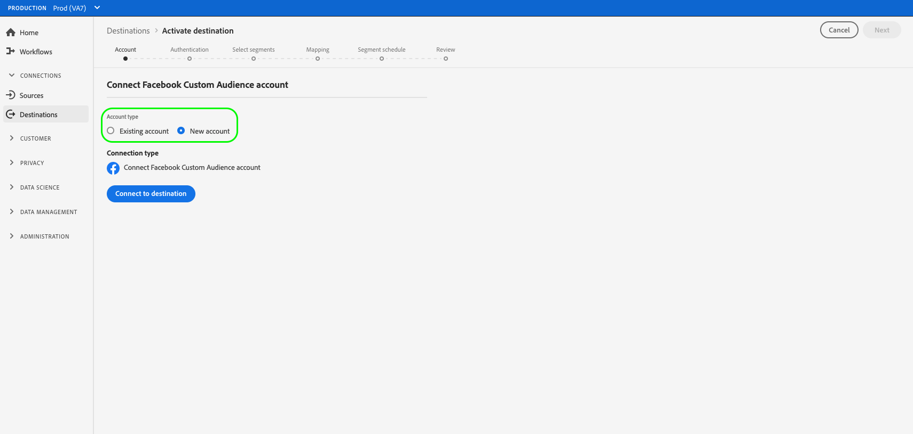

# Een nieuwe doelverbinding maken

## Overzicht {#overview}

Voordat u publieksgegevens naar een bestemming kunt verzenden, moet u een verbinding naar het doelplatform instellen. In dit artikel ziet u hoe u een nieuwe bestemming instelt via de Adobe Experience Platform-gebruikersinterface.

## Een nieuwe doelverbinding maken {#setup}

### Doel selecteren {#select-destination}

1. Ga naar **[!UICONTROL Connections]** > **[!UICONTROL Destinations]** en selecteer het tabblad **[!UICONTROL Catalog]**.

   

1. Afhankelijk van of u een bestaande verbinding aan uw bestemming hebt, kunt u of een **[!UICONTROL Configure]** of een **[!UICONTROL Activate]** knoop op de bestemmingskaart zien. Raadpleeg voor meer informatie over het verschil tussen **[!UICONTROL Activate]** en **[!UICONTROL Configure]** de sectie [Catalog](../ui/destinations-workspace.md#catalog) van de documentatie van de doelwerkruimte. Selecteer **[!UICONTROL Configure]** of **[!UICONTROL Activate]**, afhankelijk van welke knoop aan u beschikbaar is.

   

   

<!-- 1. If you selected **[!UICONTROL Set up]**, skip this step. If you selected **[!UICONTROL Activate segments]**, you can now see a list of the existing destination connections. Select **[!UICONTROL Configure new destination]**.

    -->

### Accountstap {#account}

Selecteer **[!UICONTROL New Account]** om een nieuwe verbinding aan uw bestemming te plaatsen. Of, als u eerder opstelling een verbinding aan uw bestemming hebt, selecteer **[!UICONTROL Existing Account]** en selecteer de bestaande verbinding.

De geloofsbrieven die u in de rekeningsstap moet ingaan variëren door bestemming en authentificatietype.

* Voor cloudopslagbestemmingen, moet u geloofsbrieven verstrekken voor Experience Platform om met uw opslagplaats te verbinden.

   

* Selecteer **[!UICONTROL New account]** en selecteer **[!UICONTROL Connect to destination]** voor Facebook en verschillende andere sociale en advertentiebestemmingen. Dit zal u aan de bestemmings login pagina nemen, zodat kunt u Experience Platform met uw bestemming verbinden.

   

>[!IMPORTANT]
>
>Raadpleeg de sectie **[!UICONTROL Connection parameters]** in elke doelcataloguspagina voor gedetailleerde informatie over de parameters die in deze stap worden vereist ([Azure Blob](../catalog/cloud-storage/azure-blob.md#parameters) vereist bijvoorbeeld een verbindingstekenreeks).

### Verificatiestap {#authentication}

Voer de verbindingsgegevens van het doelplatform in en selecteer **[!UICONTROL Create destination]**.

1. Selecteer de marketingacties die van toepassing zijn op de gegevens die u naar de bestemming wilt exporteren. Marketingsacties geven de intentie aan waarvoor gegevens naar de bestemming worden geëxporteerd. U kunt kiezen uit door Adobe gedefinieerde marketingacties of u kunt uw eigen marketingactie maken. Zie de pagina [Beleid voor gegevensgebruik overzicht](../../data-governance/policies/overview.md) voor meer informatie over marketingacties.

   >[!IMPORTANT]
   >
   >De onderstaande afbeelding wordt alleen ter illustratie gebruikt. De details van de bestemmingsverbinding variëren tussen bestemmingen. Zie de sectie **[!UICONTROL Connection parameters]** in elke [doelcatalogus](../catalog/overview.md)-pagina voor gedetailleerde informatie over de verbindingsdetails voor uw bestemming (bijvoorbeeld [Google Customer Match](../catalog/advertising/google-customer-match.md#parameters)).

   

1. Selecteer **[!UICONTROL Save & Exit]** om de bestemmingsconfiguratie te bewaren, of **[!UICONTROL Next]** te selecteren om aan de publieksgegevens [activeringsstroom](activation-overview.md) te werk te gaan.