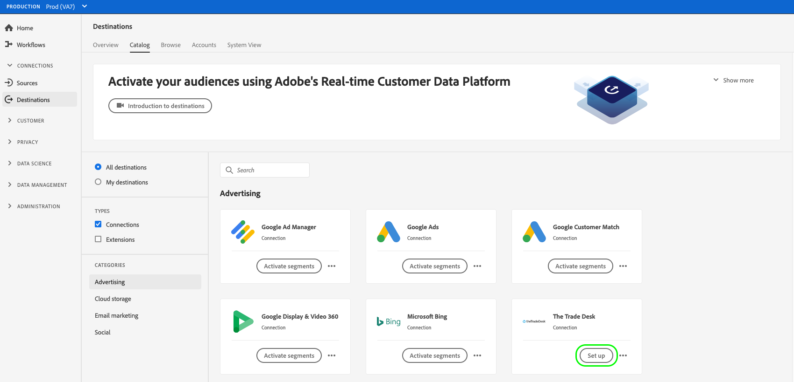

# Een nieuwe doelverbinding maken

## Overzicht {#overview}

Voordat u publieksgegevens naar een bestemming kunt verzenden, moet u een verbinding naar het doelplatform instellen. In dit artikel ziet u hoe u een nieuwe bestemming instelt via de Adobe Experience Platform-gebruikersinterface.

## Een nieuwe doelverbinding maken {#setup}

1. Ga naar **[!UICONTROL Connections]** > **[!UICONTROL Destinations]** en selecteert u de **[!UICONTROL Catalog]** tab.

   

1. Afhankelijk van of u een bestaande verbinding aan uw bestemming hebt, kunt u of zien **[!UICONTROL Set up]** of **[!UICONTROL Activate segments]** op de doelkaart. Voor meer informatie over het verschil tussen **[!UICONTROL Activate segments]** en **[!UICONTROL Set up]**, verwijst u naar de [Catalogus](../ui/destinations-workspace.md#catalog) in de documentatie van de doelwerkruimte.

   Selecteer **[!UICONTROL Set up]** of **[!UICONTROL Activate segments]**, afhankelijk van de knop die voor u beschikbaar is.

   

   

1. Als u **[!UICONTROL Set up]**, gaat u verder met de volgende stap.

   Als u **[!UICONTROL Activate segments]** kunt u nu een lijst met bestaande doelverbindingen zien.

   Selecteer **[!UICONTROL Configure new destination]**.

   

1. Voer de verbindingsgegevens van het doelplatform in en selecteer **[!UICONTROL Connect to destination]**.

   >[!NOTE]
   >
   >De onderstaande afbeelding wordt alleen ter illustratie gebruikt. De details van de bestemmingsverbinding variëren tussen bestemmingen. Voor gedetailleerde informatie over de verbindingsdetails voor uw bestemming, zie **Verbindingsparameters** sectie in elke [doelcatalogus](../catalog/overview.md) pagina (bijvoorbeeld [Google Customer Match](..//catalog/advertising/google-customer-match.md#parameters)).

   

1. (Optioneel) Selecteer de waarschuwingen voor de doelgegevensstroom waarop u zich wilt abonneren. U kunt zich op alarm abonneren wanneer het creëren van een gegevensstroom om waakzame berichten betreffende de status, het succes, of het mislukken van uw looppas te ontvangen. Zie [Abonneren op in-context-bestemmingswaarschuwingen](alerts.md) voor gedetailleerde informatie over waarschuwingen over bestemmingsgegevensstroom.

   

1. Selecteer **[!UICONTROL Next]**.

   

1. Selecteer de marketingacties die van toepassing zijn op de gegevens die u naar de bestemming wilt exporteren. Marketingsacties geven de intentie aan waarvoor gegevens naar de bestemming worden geëxporteerd. U kunt kiezen uit door Adobe gedefinieerde marketingacties of u kunt uw eigen marketingactie maken. Zie voor meer informatie over marketingacties de [overzicht van beleidsregels voor gegevensgebruik](../../data-governance/policies/overview.md) pagina.

   

1. Selecteren **[!UICONTROL Save & Exit]** om de bestemmingsconfiguratie te bewaren, of te selecteren **[!UICONTROL Next]** om door te gaan naar de publieksgegevens [activeringsstroom](activation-overview.md).