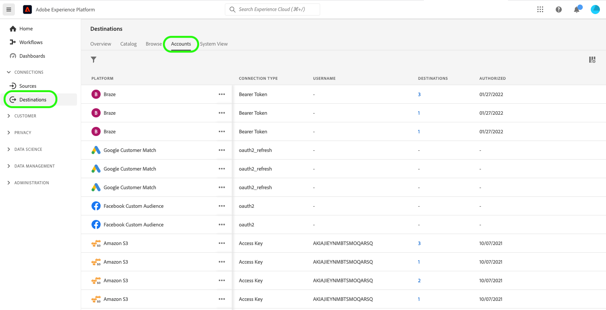
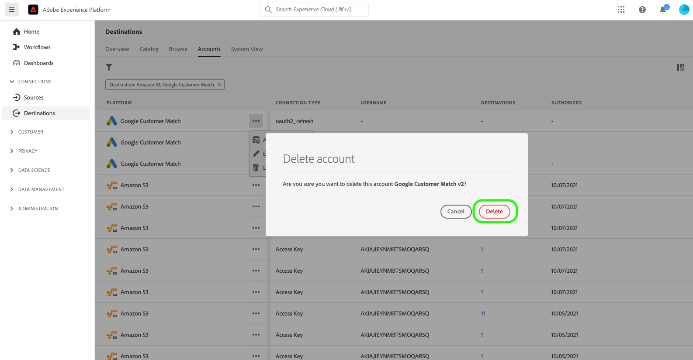

# Doelaccounts verwijderen

## Overzicht {#overview}

Het tabblad **[!UICONTROL Accounts]** bevat details over de verbindingen die u hebt gemaakt met verschillende doelen. Zie het [&#x200B; overzicht van Rekeningen &#x200B;](../ui/destinations-workspace.md#accounts) voor alle informatie beschikbaar voor elke bestemmingsrekening.

Deze zelfstudie behandelt de stappen voor het verwijderen van bestemmingsaccounts die niet meer nodig zijn met de gebruikersinterface van Experience Platform.

## Accounts verwijderen {#delete}

>[!TIP]
>
>Voordat u de doelaccount verwijdert, moet u eerst bestaande gegevensstromen verwijderen die aan de doelaccount zijn gekoppeld. Om bestaande bestemmingsdataflows te schrappen, verwijs naar het leerprogramma bij [&#x200B; het schrappen van bestemmingsdataflows in UI &#x200B;](./delete-destinations.md).

Voer de onderstaande stappen uit om bestaande doelaccounts te verwijderen.

1. Ga naar [&#x200B; UI van Experience Platform &#x200B;](https://platform.adobe.com/) en selecteer **[!UICONTROL Destinations]** van de linkernavigatiebar. Selecteer **[!UICONTROL Accounts]** in de bovenste koptekst om uw bestaande accounts weer te geven.

   

2. Selecteer het filterpictogram  op de bovenkant verlaten om het soortpaneel te lanceren. Het deelvenster Sorteren bevat een lijst met al uw doelen. U kunt meer dan één bestemming van de lijst selecteren om een gefilterde selectie van rekeningen te zien verbonden aan de geselecteerde bestemmingen.

   

3. Selecteer de ovalen (`...`) naast de naam van de account die u wilt verwijderen. Er verschijnt een pop-upvenster met opties voor **[!UICONTROL Activate audiences]** , **[!UICONTROL Edit details]** en **[!UICONTROL Delete]** de account. Selecteer de  **[!UICONTROL Delete]** knoop om de gewenste rekening te schrappen.

   

4. Er wordt een laatste bevestigingsvenster weergegeven. Selecteer **[!UICONTROL Delete]** om het proces te voltooien.

## Volgende stappen {#next-steps}

U hebt met succes de werkruimte van bestemmingen gebruikt om bestaande rekeningen te schrappen.

Voor stappen op hoe te om deze verrichtingen programmatically uit te voeren gebruikend [!DNL Flow Service] API, verwijs naar het leerprogramma op [&#x200B; het schrappen van verbindingen gebruikend de Dienst API van de Stroom &#x200B;](../api/delete-destination-account.md)
