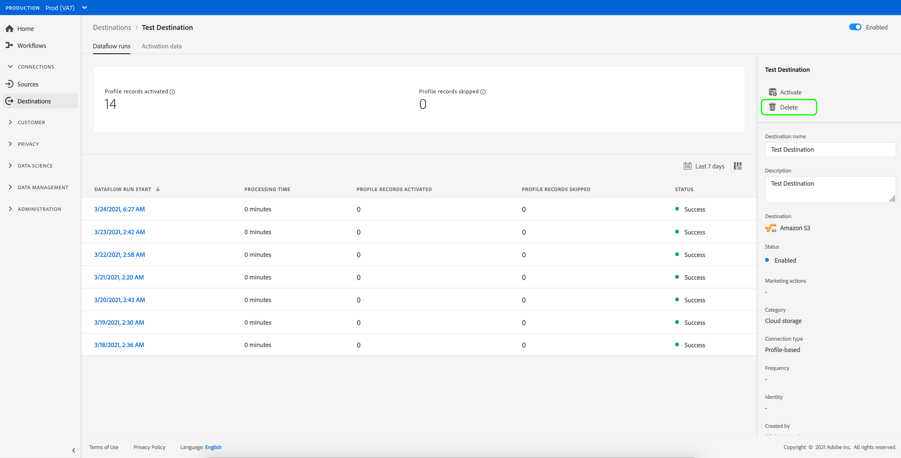

# Doelen {#delete-destinations} verwijderen

## Overzicht {#overview}

In de Adobe Experience Platform-gebruikersinterface kunt u bestaande verbindingen met doelen verwijderen.

Als u een bestemming verwijdert, worden bestaande gegevensstromen naar die bestemming verwijderd. Alle segmenten die aan de bestemmingen worden geactiveerd die u schrapt worden unmapped alvorens dataflow wordt geschrapt.

Er zijn twee manieren u bestemmingen van [!DNL Platform] [!DNL UI] kunt schrappen. U kunt:

* [Doelen van het  [!UICONTROL Browse] tabblad verwijderen](#delete-browse-tab)
* [Doelen verwijderen van de pagina met bestemmingsdetails](#delete-destination-details-page)

## Doelen verwijderen van het tabblad Bladeren{#delete-browse-tab}

Voer de onderstaande stappen uit om een doel te verwijderen uit het tabblad [!UICONTROL Browse].

1. Meld u aan bij [Experience Platform UI](https://platform.adobe.com/) en selecteer **[!UICONTROL Destinations]** in de linkernavigatiebalk. Om uw bestaande bestemmingen te bekijken, selecteer **[!UICONTROL Browse]** van de hoogste kopbal.

   

2. Selecteer het filterpictogram  linksboven om het deelvenster Sorteren te starten. Het deelvenster Sorteren bevat een lijst met al uw doelen. U kunt meer dan één bestemming van de lijst selecteren om een gefilterde selectie van gegevensstromen te zien verbonden aan de geselecteerde bestemming.

   

3. Selecteer de  **[!UICONTROL Delete]** in de kolom **[!UICONTROL Platform]** om een bestaand doel te verwijderen.
   

4. Selecteer **[!UICONTROL Delete]** om de verwijdering van de bestemming te bevestigen.

   

## Doelen verwijderen uit de pagina met doeldetails{#delete-destination-details-page}

Voer de onderstaande stappen uit om een bestemming te verwijderen van de pagina met doeldetails.

1. Meld u aan bij [Experience Platform UI](https://platform.adobe.com/) en selecteer **[!UICONTROL Destinations]** in de linkernavigatiebalk. Om uw bestaande bestemmingen te bekijken, selecteer **[!UICONTROL Browse]** van de hoogste kopbal.

   

2. Selecteer het filterpictogram  linksboven om het deelvenster Sorteren te starten. Het deelvenster Sorteren bevat een lijst met al uw doelen. U kunt meer dan één bestemming van de lijst selecteren om een gefilterde selectie van gegevensstromen te zien verbonden aan de geselecteerde bestemming.

   

3. Selecteer de naam van het doel dat u wilt verwijderen.

   

   * Als de bestemming bestaande gegevensstromen heeft, wordt u genomen aan [!UICONTROL Dataflow runs] tabel.

      

   * Als het doel geen bestaande gegevensstromen heeft, wordt u genomen aan een lege pagina waar u het publiek kunt beginnen te activeren.

      

4. Selecteer **[!UICONTROL Delete]** in het juiste spoor.

   

5. Selecteer **[!UICONTROL Delete]** in de bevestigingsdialoog om de bestemming te verwijderen.

   

   >[!NOTE]
   >
   >Afhankelijk van het laden van de server kan het enkele minuten duren voordat [!DNL Platform] het doel heeft verwijderd.