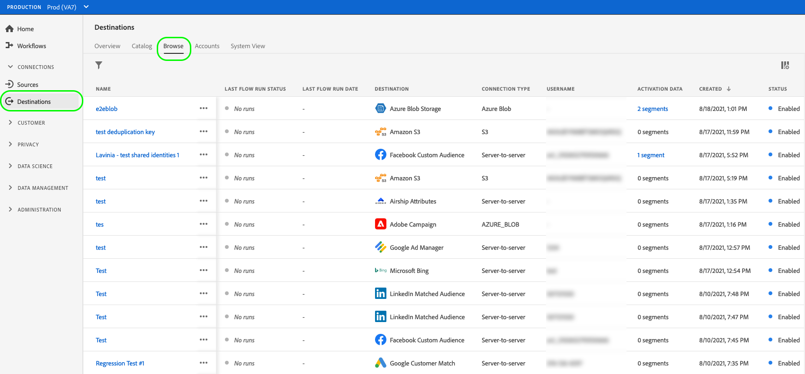

# Doelen verwijderen {#delete-destinations}

## Overzicht {#overview}

In de Adobe Experience Platform-gebruikersinterface kunt u bestaande verbindingen met doelen verwijderen.

Als u een bestemming verwijdert, worden bestaande gegevensstromen naar die bestemming verwijderd. Alle segmenten die aan de bestemmingen worden geactiveerd die u schrapt worden unmapped alvorens dataflow wordt geschrapt.

Er zijn twee manieren u bestemmingen van kunt schrappen [!DNL Platform] [!DNL UI]. U kunt:

* [Doelen verwijderen uit het dialoogvenster [!UICONTROL Browse] tab](#delete-browse-tab)
* [Doelen verwijderen van de pagina met bestemmingsdetails](#delete-destination-details-page)

## Doelen verwijderen op het tabblad Bladeren{#delete-browse-tab}

Voer de onderstaande stappen uit om een doel te verwijderen uit de [!UICONTROL Browse] tab.

1. Aanmelden bij de [UI Experience Platform](https://platform.adobe.com/) en selecteert u **[!UICONTROL Destinations]** in de linkernavigatiebalk. Om uw bestaande bestemmingen te bekijken, selecteer **[!UICONTROL Browse]** in de bovenste koptekst.

   

2. Filterpictogram selecteren  bovenaan links om het deelvenster Sorteren te starten. Het deelvenster Sorteren bevat een lijst met al uw doelen. U kunt meer dan één bestemming van de lijst selecteren om een gefilterde selectie van gegevensstromen te zien verbonden aan de geselecteerde bestemming.

   

3. Selecteer  in de kolom Naam en selecteer vervolgens  **[!UICONTROL Delete]** om een bestaande doelverbinding te verwijderen.
   

4. Selecteren **[!UICONTROL Delete]** om de verwijdering van de bestemmingsverbinding te bevestigen.

   

## Doelen verwijderen van de pagina met bestemmingsdetails{#delete-destination-details-page}

Voer de onderstaande stappen uit om een bestemming te verwijderen van de pagina met doeldetails.

1. Aanmelden bij de [UI Experience Platform](https://platform.adobe.com/) en selecteert u **[!UICONTROL Destinations]** in de linkernavigatiebalk. Om uw bestaande bestemmingen te bekijken, selecteer **[!UICONTROL Browse]** in de bovenste koptekst.

   

2. Filterpictogram selecteren  bovenaan links om het deelvenster Sorteren te starten. Het deelvenster Sorteren bevat een lijst met al uw doelen. U kunt meer dan één bestemming van de lijst selecteren om een gefilterde selectie van gegevensstromen te zien verbonden aan de geselecteerde bestemming.

   

3. Selecteer de naam van het doel dat u wilt verwijderen.

   

   * Als de bestemming bestaande gegevensstromen heeft, wordt u genomen aan [!UICONTROL Dataflow runs] tab.

      

   * Als het doel geen bestaande gegevensstromen heeft, wordt u genomen aan een lege pagina waar u het publiek kunt beginnen te activeren.

      

4. Selecteren **[!UICONTROL Delete]** in het rechterspoor.

   

5. Selecteren **[!UICONTROL Delete]** in het bevestigingsdialoogvenster om het doel te verwijderen.

   

   >[!NOTE]
   >
   >Afhankelijk van het laden van de server kan het enkele minuten duren [!DNL Platform] om het doel te verwijderen.
