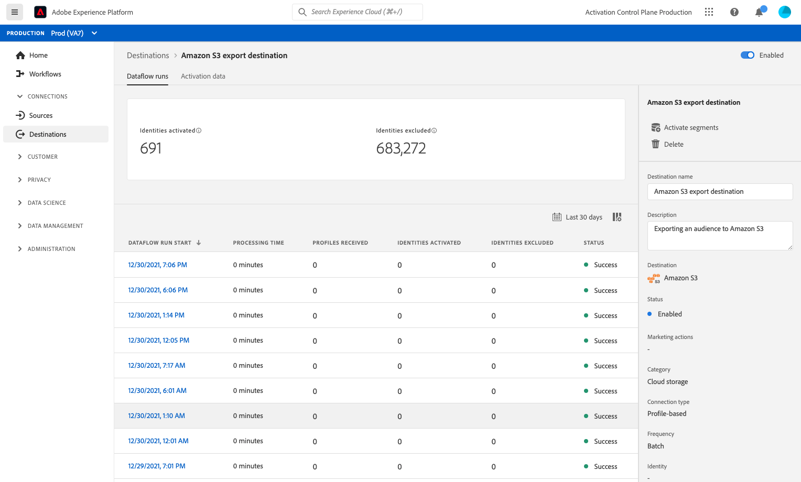

# Doelgegevens weergeven

## Overzicht {#overview}

In de gebruikersinterface van Adobe Experience Platform, kunt u de attributen en de activiteiten van uw bestemmingen bekijken en controleren. Deze details omvatten de naam en identiteitskaart van de bestemming, controles om de bestemmingen te activeren of onbruikbaar te maken, en meer. De details omvatten ook metriek voor geactiveerd profielverslagen, geactiveerde identiteiten, ontbroken, en uitgesloten, en een geschiedenis van dataflow looppas.

>[!NOTE]
>
>De pagina met doeldetails maakt deel uit van de [!UICONTROL Destinations] werkruimte in de [!DNL Platform] [!DNL UI]. Zie de [[!UICONTROL Destinations] werkruimte - overzicht](./destinations-workspace.md) voor meer informatie .

## Doelgegevens weergeven {#view-details}

Voer de onderstaande stappen uit om meer informatie over een bestaand doel weer te geven.

1. Aanmelden bij de [UI Experience Platform](https://platform.adobe.com/) en selecteert u **[!UICONTROL Destinations]** in de linkernavigatiebalk. Selecteren **[!UICONTROL Browse]** van de hoogste kopbal om uw bestaande bestemmingen te bekijken.

   

1. Filterpictogram selecteren  bovenaan links om het deelvenster Sorteren te starten. Het deelvenster Sorteren bevat een lijst met al uw doelen. U kunt meer dan één bestemming van de lijst selecteren om een gefilterde selectie van gegevensstromen te zien verbonden aan de geselecteerde bestemming.

   

1. Selecteer de naam van het doel dat u wilt bekijken.

   

1. De detailspagina voor de bestemming verschijnt, tonend zijn beschikbare controles.

   

## Rechterspoor {#right-rail}

De rechterrails geven de basisinformatie over de geselecteerde bestemming weer.

In de volgende tabel worden de door het rechterspoor verstrekte controles en gegevens vermeld:

| Rechterspoor | Beschrijving |
| --- | --- |
| [!UICONTROL Activate segments] | Selecteer deze controle om uit te geven welke segmenten aan de bestemming worden in kaart gebracht, de uitvoerprogramma&#39;s bij te werken, of toegewezen attributen en identiteiten toe te voegen en te verwijderen. Zie de hulplijnen op [het activeren van publieksgegevens aan segment het stromen bestemmingen](./activate-segment-streaming-destinations.md), [het activeren van publieksgegevens aan batch op profiel-gebaseerde bestemmingen](./activate-batch-profile-destinations.md), en [het activeren van publieksgegevens aan het stromen op profiel-gebaseerde bestemmingen](./activate-streaming-profile-destinations.md) voor meer informatie . |
| [!UICONTROL Delete] | Staat u toe om deze gegevensstroom te schrappen en unmaps de segmenten die eerder werden geactiveerd, als om het even welk bestaan. |
| [!UICONTROL Destination name] | Dit veld kan worden bewerkt om de naam van het doel bij te werken. |
| [!UICONTROL Description] | Dit veld kan worden bewerkt om een optionele beschrijving aan het doel toe te voegen. |
| [!UICONTROL Destination] | Vertegenwoordigt het bestemmingsplatform dat het publiek wordt verzonden naar. Zie de [doelcatalogus](../catalog/overview.md) voor meer informatie . |
| [!UICONTROL Status] | Geeft aan of het doel is in- of uitgeschakeld. |
| [!UICONTROL Marketing actions] | Hiermee worden de marketingacties (gebruiksgevallen) aangegeven die voor deze bestemming gelden voor doeleinden van gegevensbeheer. |
| [!UICONTROL Category] | Geeft het doeltype aan. Zie de [doelcatalogus](../catalog/overview.md) voor meer informatie . |
| [!UICONTROL Connection type] | Hiermee geeft u de vorm aan waarmee uw publiek naar het doel wordt gestuurd. Mogelijke waarden zijn [!UICONTROL Cookie] en [!UICONTROL Profile-based]. |
| [!UICONTROL Frequency] | Geeft aan hoe vaak het publiek naar de bestemming wordt gestuurd. Mogelijke waarden zijn [!UICONTROL Streaming] en [!UICONTROL Batch]. |
| [!UICONTROL Identity] | Vertegenwoordigt de identiteitsnaamruimte die door de bestemming wordt geaccepteerd, zoals `GAID`, `IDFA`, of `email`. Voor meer informatie over geaccepteerde naamruimten raadpleegt u de [Overzicht van naamruimte in identiteit](../../identity-service/namespaces.md). |
| [!UICONTROL Created by] | Geeft de gebruiker aan die deze bestemming heeft gemaakt. |
| [!UICONTROL Created] | Hiermee wordt de UTC-datetime aangegeven waarop deze bestemming is gemaakt. |

{style=&quot;table-layout:auto&quot;}

## [!UICONTROL Enabled]/[!UICONTROL Disabled] schakelen {#enabled-disabled-toggle}

U kunt de **[!UICONTROL Enabled]/[!UICONTROL Disabled]** schakelen om alle gegevens die u exporteert naar de bestemming te starten en pauzeren.

## [!UICONTROL Dataflow runs] {#dataflow-runs}

De [!UICONTROL Dataflow runs] tab bevat metrische gegevens over uw gegevensstroom die naar batch- en streaming doelen worden uitgevoerd. Zie [Dataflows bewaken](monitor-dataflows.md) voor details en metrische definities.

## [!UICONTROL Activation data] {#activation-data}

De [!UICONTROL Activation data] wordt een lijst weergegeven met segmenten die aan de bestemming zijn toegewezen, inclusief de begindatum en einddatum (indien van toepassing) en andere relevante informatie voor de gegevensexport, zoals het exporttype, de planning en de frequentie. Als u de details over een bepaald segment wilt weergeven, selecteert u de naam in de lijst.

>[!TIP]
>
>Selecteer **[!UICONTROL Activate segments]** in de [rechterspoor](#right-rail).

>[!NOTE]
>
>Voor meer informatie over het verkennen van de detailpagina van een segment raadpleegt u de [Overzicht van de segmenteringsinterface](../../segmentation/ui/overview.md#segment-details).
