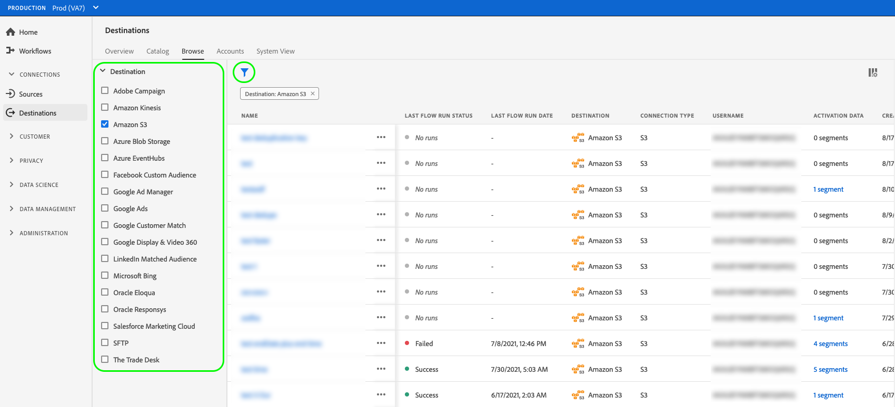

# Doelgegevens weergeven

## Overzicht {#overview}

In de gebruikersinterface van Adobe Experience Platform, kunt u de attributen en de activiteiten van uw bestemmingen bekijken en controleren. Deze details omvatten de naam en identiteitskaart van de bestemming, controles om de bestemmingen te activeren of onbruikbaar te maken, en meer. De details omvatten ook metriek voor geactiveerd profielverslagen, geactiveerde identiteiten, ontbroken, en uitgesloten, en een geschiedenis van dataflow looppas.

>[!NOTE]
>
>De pagina met doeldetails maakt deel uit van de werkruimte [!UICONTROL Destinations] in de [!DNL Platform] [!DNL UI] . Zie het [[!UICONTROL Destinations] overzicht van de werkruimte ](./destinations-workspace.md) voor meer informatie.

## Doelgegevens weergeven {#view-details}

Voer de onderstaande stappen uit om meer informatie over een bestaand doel weer te geven. U kunt doelidentiteitskaart van een bestemming, de gebruiker ontdekken die de bestemming creeerde, toen het werd gecreeerd, en andere informatie.

1. Login aan het [ Experience Platform UI ](https://platform.adobe.com/) en selecteert **[!UICONTROL Destinations]** van de linkernavigatiebar. Selecteer **[!UICONTROL Browse]** in de bovenste koptekst om uw bestaande doelen weer te geven.

   

2. Selecteer het filterpictogram  op de bovenkant verlaten om het soortpaneel te lanceren. Het deelvenster Sorteren bevat een lijst met al uw doelen. U kunt meer dan één bestemming van de lijst selecteren om een gefilterde selectie van gegevensstromen te zien verbonden aan de geselecteerde bestemming.

   

3. Selecteer de rij van de bestemming waarvoor u meer informatie wilt omhoog brengen. Dit brengt omhoog een juiste spoorlijn met informatie over de bestemming, met inbegrip van bestemmingsidentiteitskaart, de gebruiker die de bestemmingsverbinding creeerde, en andere informatie.

   

4. Alternatief, kunt u andere informatie over de bestemming omhoog brengen door *de naam van de bestemming* te selecteren die u wilt bekijken.

   

5. De detailpagina voor de bestemming verschijnt in het juiste spoor, die zijn beschikbare controles toont.

   

## Rechterspoor {#right-rail}

De rechterrails geven de basisinformatie over de geselecteerde bestemming weer.

In de volgende tabel worden de door het rechterspoor verstrekte controles en gegevens vermeld:

| Rechterspoor | Beschrijving |
| --- | --- |
| [!UICONTROL Activate audiences] | Selecteer dit besturingselement om te bewerken welk publiek wordt toegewezen aan het doel, om exportschema&#39;s bij te werken of om toegewezen kenmerken en identiteiten toe te voegen en te verwijderen. Zie de gidsen op [ het activeren van publieksgegevens aan publiek die bestemmingen ](./activate-segment-streaming-destinations.md) stromen, [ publieksgegevens aan batch op profiel-gebaseerde bestemmingen ](./activate-batch-profile-destinations.md) activeren, en [ het activeren van publieksgegevens aan het stromen op profiel-gebaseerde bestemmingen ](./activate-streaming-profile-destinations.md) voor meer informatie. |
| [!UICONTROL Delete] | Hiermee kunt u deze gegevensstroom verwijderen en de toewijzing ongedaan maken van het publiek dat eerder is geactiveerd, indien aanwezig. |
| [!UICONTROL Destination name] | Dit veld kan worden bewerkt om de naam van het doel bij te werken. |
| [!UICONTROL Description] | Dit veld kan worden bewerkt om een optionele beschrijving aan het doel bij te werken of toe te voegen. |
| [!UICONTROL Destination] | Vertegenwoordigt het bestemmingsplatform dat het publiek wordt verzonden naar. Zie de [ catalogus van bestemmingen ](../catalog/overview.md) voor meer informatie. |
| [!UICONTROL Status] | Geeft aan of het doel is in- of uitgeschakeld. |
| [!UICONTROL Marketing actions] | Hiermee worden de marketingacties (gebruiksgevallen) aangegeven die voor deze bestemming gelden voor doeleinden van gegevensbeheer. |
| [!UICONTROL Category] | Geeft het doeltype aan. Zie de [ catalogus van bestemmingen ](../catalog/overview.md) voor meer informatie. |
| [!UICONTROL Connection type] | Hiermee geeft u de vorm aan waarmee uw publiek naar het doel wordt gestuurd. Mogelijke waarden zijn [!UICONTROL Cookie] en [!UICONTROL Profile-based] . |
| [!UICONTROL Frequency] | Geeft aan hoe vaak het publiek naar de bestemming wordt gestuurd. Mogelijke waarden zijn [!UICONTROL Streaming] en [!UICONTROL Batch] . |
| [!UICONTROL Identity] | Vertegenwoordigt de naamruimte voor identiteiten die door het doel wordt geaccepteerd, zoals `GAID` , `IDFA` of `email` . Voor meer informatie over toegelaten identiteit namespaces, zie het [ overzicht van identiteitskaart namespace ](../../identity-service/features/namespaces.md). |
| [!UICONTROL Created by] | Geeft de gebruiker aan die deze bestemming heeft gemaakt. |
| [!UICONTROL Created] | Hiermee wordt de UTC-datetime aangegeven waarop deze bestemming is gemaakt. |

{style="table-layout:auto"}

## [!UICONTROL Enabled]/[!UICONTROL Disabled] schakelen {#enabled-disabled-toggle}

Met de schakeloptie **[!UICONTROL Enabled]/[!UICONTROL Disabled]** kunt u alle gegevens die u exporteert naar het doel, starten en pauzeren.

## [!UICONTROL Dataflow runs] {#dataflow-runs}

Het tabblad [!UICONTROL Dataflow runs] bevat metrische gegevens over uw gegevensstroom die naar batch- en streaming doelen worden uitgevoerd. Verwijs naar [ dataflows van de Monitor ](monitor-dataflows.md) voor details en metrische definities.

>[!NOTE]
>
>* Doelen die functionaliteit controleren wordt momenteel gesteund voor alle bestemmingen in Experience Platform *behalve* [ Adobe Target ](/help/destinations/catalog/personalization/adobe-target-connection.md), [ de verpersoonlijking van de Douane ](/help/destinations/catalog/personalization/custom-personalization.md) en [ het publiek van de Experience Cloud ](/help/destinations/catalog/adobe/experience-cloud-audiences.md) bestemmingen.
>* Voor [ Kinesis van Amazon ](/help/destinations/catalog/cloud-storage/amazon-kinesis.md), [ Azure Gebeurtenis Hubs ](/help/destinations/catalog/cloud-storage/azure-event-hubs.md), en [ HTTP API ](/help/destinations/catalog/streaming/http-destination.md) bestemmingen, worden de metriek met betrekking tot identiteiten uitgesloten, ontbroken, en geactiveerd geschat. Hogere volumes activeringsgegevens leiden tot een hogere nauwkeurigheid van de meetwaarden.

### Runtimeduur gegevensstroom {#dataflow-runs-duration}

Er is een verschil in de getoonde duur van dataflow looppas tussen het stromen en op dossier-gebaseerde bestemmingen.

### Streaming doelen {#streaming}

Hoewel de **[!UICONTROL Processing duration]** die wordt aangegeven voor de meeste streaming gegevensstroom, ongeveer vier uur duurt, zoals in de onderstaande afbeelding wordt getoond, is de werkelijke verwerkingstijd voor elke gegevensstroom veel korter. Dataflow runtime vensters blijven open voor langer in het geval dat het Experience Platform moet opnieuw proberen makend vraag aan de bestemming en ook ervoor zorgen het niet op om het even welk laat aankomen gegevens voor zelfde tijdvenster mist.

Voor meer informatie, lees over [ dataflow looppas aan het stromen bestemmingen ](/help/dataflows/ui/monitor-destinations.md#dataflow-runs-for-streaming-destinations) in de controledocumentatie.

### Bestandsgebaseerde doelen {#file-based}

Voor dataflow wordt uitgevoerd naar op bestanden gebaseerde doelen, is de waarde **[!UICONTROL Processing duration]** afhankelijk van de grootte van de gegevens die worden geëxporteerd en het laden van het systeem. Bericht ook dat de dataflow looppas aan op dossier-gebaseerde bestemmingen uitgesplitst per publiek is.

Voor meer informatie, lees over [ dataflow looppas aan partij (op dossier-gebaseerde) bestemmingen ](/help/dataflows/ui/monitor-destinations.md#dataflow-runs-for-batch-destinations) in de controledocumentatie.

## [!UICONTROL Activation data] {#activation-data}

Op het tabblad [!UICONTROL Activation data] wordt een lijst weergegeven met soorten publiek die aan de bestemming zijn toegewezen, inclusief de begindatum en einddatum (indien van toepassing) en andere relevante informatie voor de gegevensexport, zoals het exporttype, de planning en de frequentie. Als u de details over een bepaald publiek wilt weergeven, selecteert u de naam in de lijst.

>[!TIP]
>
>Om details over de attributen en de identiteiten uit te geven en uit te geven die aan een bestemming worden in kaart gebracht, selecteer **[!UICONTROL Activate audiences]** in de [ juiste spoorstaaf ](#right-rail).

 stromen

### [!BADGE  Beta ] {type=Informative} verwijdert veelvoudige publiek uit activeringsstromen {#bulk-remove}

>[!NOTE]
>
Deze functie is in bètaversie beschikbaar voor bepaalde klanten. Neem contact op met uw Adobe als u toegang tot deze functie wilt aanvragen.

Als u meerdere soorten publiek wilt verwijderen uit bestaande activeringsstromen, selecteert u het gewenste publiek en selecteert u vervolgens **[!UICONTROL Remove audiences]** .

### Meerdere bestanden op aanvraag exporteren naar batchbestemmingen {#bulk-export}

U kunt [ veelvoudige dossiers op bestelling ](../ui/export-file-now.md) van de **[!UICONTROL Activation data]** pagina uitvoeren. Hiervoor selecteert u het publiek waarvoor u bestanden op aanvraag wilt exporteren en selecteert u het besturingselement **[!UICONTROL Export file now]** om een eenmalige export te activeren waarmee een bestand voor elk geselecteerd publiek naar uw batchdoel wordt verzonden.

### Activeringsschema&#39;s bewerken voor meerdere soorten publiek die naar batchbestemmingen worden geëxporteerd {#bulk-edit-schedule}

Als u het bestaande activeringsschema van meerdere soorten publiek tegelijk wilt bewerken, selecteert u het gewenste publiek en selecteert u vervolgens **[!UICONTROL Edit schedule]** . Voor gedetailleerde informatie over hoe te om een de uitvoerprogramma te bepalen of uit te geven, lees de [ sectie van de de uitvoeringshulpmiddelenuitvoer van het programmapubliek ](../ui/activate-batch-profile-destinations.md#scheduling).

>[!NOTE]
>
Voor details bij het onderzoeken van de detailspagina van een publiek, verwijs naar het [ Poortoverzicht van het Poort van het Publiek ](../../segmentation/ui/audience-portal.md#segment-details).
