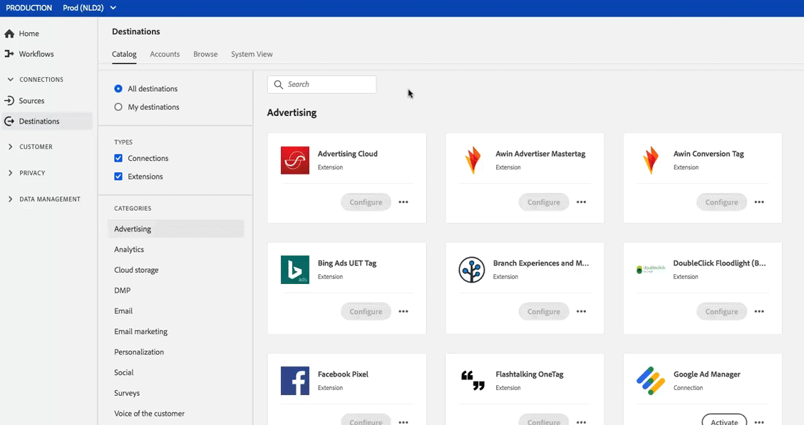

# Werkruimte Doelen {#destinations-workspace}

## Overzicht {#overview}

Selecteer in Adobe Experience Platform **[!UICONTROL Destinations]** in de linkernavigatiebalk om de werkruimte [!UICONTROL Destinations] te openen.

De werkruimte [!UICONTROL Destinations] bestaat uit vier secties, [!UICONTROL Catalog], [!UICONTROL Browse], [!UICONTROL Accounts], en [!UICONTROL System View], die in de hieronder secties worden beschreven.

## [!UICONTROL Catalog] {#catalog}

Het **[!UICONTROL Catalog]** lusje toont een lijst van alle bestemmingen beschikbaar in Platform, dat u gegevens kunt verzenden naar.

De gebruikersinterface van het Platform verstrekt verscheidene onderzoek en filteropties op de pagina van de bestemmingscatalogus:

* Gebruik de zoekfunctionaliteit op de pagina om een specifiek doel te zoeken.
* De bestemmingen van de filter gebruikend [!UICONTROL Categories] controle.
* Schakelen tussen [!UICONTROL All destinations] en [!UICONTROL My destinations]. Wanneer **[!UICONTROL All destinations]** wordt geselecteerd, worden alle beschikbare bestemmingen van het Platform getoond. Wanneer **[!UICONTROL My destinations]** wordt geselecteerd, kunt u slechts de bestemmingen zien waarmee u een verbinding hebt gevestigd.
* Selecteer deze optie om **[!UICONTROL Connections]** en/of **[!UICONTROL Extensions]** weer te geven. Om het verschil tussen de twee categorieën te begrijpen, zie [De Types van Bestemming en Categorieën](../destination-types.md).

De bestemmingskaarten bevatten of een **[!UICONTROL Configure]** of **[!UICONTROL Activate]** controle, en een secundaire controle die meer opties omhoog brengt. Deze besturingselementen worden hieronder beschreven:

| Control | Beschrijving |
---------|----------
| [!UICONTROL Configure] | Hiermee kunt u verbinding maken met het doel. |
| [!UICONTROL Activate] | Nadat u een verbinding met de bestemming hebt gemaakt, kunt u segmenten activeren. |
| [!UICONTROL View account] | Bekijk de accounts waarmee u verbinding hebt gemaakt voor een bestemming. |
| [!UICONTROL View dataflows] | Bekijk de gegevensactiveringsstromen die voor een bestemming bestaan. |
| [!UICONTROL View documentation] | Opent een verbinding aan de documentatiepagina voor die specifieke bestemming, voor meer informatie en om u te helpen opstelling het. |

{style=&quot;table-layout:auto&quot;}

Selecteer een doelkaart in de catalogus om de rechterrail te openen. Hier, kunt u een beschrijving van de bestemming zien. De rechterspoorstaaf bevat dezelfde besturingselementen als in de bovenstaande tabel, alsmede een beschrijving van de bestemming en een aanduiding van de categorie en het type van bestemming.

Zie [Doelcatalogus](../catalog/overview.md) en [Doeltypen en -categorieën](../destination-types.md) voor meer informatie over doelcategorieën en informatie over elke bestemming.

## [!UICONTROL Accounts] {#accounts}

Op het **[!UICONTROL Accounts]** lusje, kunt u meer over de verbindingen leren die u met diverse bestemmingen hebt gevestigd. Zie de tabel hieronder voor alle informatie die u op elke bestemming kunt krijgen:

>[!TIP]
>
>Gebruik de  in de kolom **[!UICONTROL Platform]** om een nieuwe doelverbinding voor die account te maken.

| Element | Beschrijving |
---------|----------
| [!UICONTROL Platform] | Het doel waarvoor u de verbinding hebt ingesteld. |
| [!UICONTROL Connection Type] | Vertegenwoordigt het verbindingstype aan uw opslagemmer of bestemming. <ul><li>Voor e-mailmarketingdoelen: Kan S3 of FTP zijn.</li><li>Voor realtime advertentiebestemmingen: Server-naar-server</li><li>Voor Amazon S3-cloudopslagdoelen: Toegangstoets </li><li>Voor SFTP-cloudopslagdoelen: Basisverificatie voor SFTP</li></ul> |
| [!UICONTROL Username] | De gebruikersnaam die u hebt geselecteerd in [verbind bestemmingstovenaar](../catalog/email-marketing/overview.md#connect-destination). |
| [!UICONTROL Destinations] | Vertegenwoordigt het aantal unieke succesvolle bestemmingsstromen die met basisinformatie worden verbonden die voor een bestemming wordt gecreeerd. |
| [!UICONTROL Authorized] | De datum waarop de verbinding met deze bestemming werd geautoriseerd. |

{style=&quot;table-layout:auto&quot;}

Bovendien kunt u uw accountgegevens bewerken of bijwerken. Selecteer  in de kolom **[!UICONTROL Platform]** om de accountgegevens te bewerken.

Voor accounts die een verbindingstype `OAuth2` gebruiken, kunt u **[!UICONTROL Reconnect OAuth]** selecteren om uw accountgegevens te vernieuwen.

Voor accounts die een verbindingstype `Access Key` of `ConnectionString` gebruiken, kunt u de verificatiegegevens van uw account bewerken, zoals toegang-id, geheime sleutels of verbindingstekenreeksen.

Als u klaar bent met het bewerken van uw accountgegevens, selecteert u **[!UICONTROL Save]** om de update te voltooien.

## [!UICONTROL Browse] {#browse}

Op het tabblad **[!UICONTROL Browse]** worden de doelen weergegeven waarmee u een verbinding hebt gemaakt. Doelen waarvoor de schakeloptie **[!UICONTROL Enabled]** is ingeschakeld, stellen de bestemming in op actief en andersom. U kunt de bestemmingen ook bekijken waar u gegevens door **[!UICONTROL Segments]** > **[!UICONTROL Browse]** te selecteren en een segment te inspecteren hebt. Zie de lijst hieronder voor alle informatie die voor elke bestemming in het Browse lusje wordt verstrekt:

>[!TIP]
>
> * Gebruik  in **[!UICONTROL Name]** kolom om extra segmenten aan die bestemming te activeren.
> * Gebruik  in **[!UICONTROL Name]** om een bestaande verbinding aan een bestemming te schrappen.

| Element | Beschrijving |
---------|----------
| Naam | De naam die u hebt opgegeven voor de activeringsstroom naar dit doel. Dezelfde kolom bevat twee besturingselementen: [!UICONTROL Activate ] en [!UICONTROL Delete destination]. |
| [!UICONTROL Last Flow Run Status] | De status van de laatste gegevensstroom die wordt uitgevoerd. Zie [De bestemmingsdetails van de Mening](destination-details-page.md) voor meer informatie over dataflow looppas. |
| [!UICONTROL Last Flow Run Date] | Tijd en datum waarop de laatste dataflow-run heeft plaatsgevonden. Zie [De bestemmingsdetails van de Mening](destination-details-page.md) voor meer informatie over dataflow looppas. |
| [!UICONTROL Destination] | Het doelplatform dat u hebt geselecteerd voor de activeringsstroom. |
| [!UICONTROL Connection Type] | Vertegenwoordigt het verbindingstype aan uw opslagemmer of bestemming. <ul><li>Voor e-mailmarketingdoelen: Kan S3, FTP of [!DNL Azure Blob] zijn.</li><li>Voor realtime advertentiebestemmingen: Server-naar-server.</li><li>Voor streamingdoelen: Kan [!DNL Azure Event Hubs] of [!DNL Amazon Kinesis] zijn.</li></ul> |
| [!UICONTROL Username] | De accountgegevens die u hebt geselecteerd voor de doelstroom. |
| [!UICONTROL Activation Data] | Geeft het aantal segmenten aan dat op dit doel wordt geactiveerd. Selecteer dit besturingselement voor meer informatie over de geactiveerde segmenten. Raadpleeg [Activeringsgegevens](/help/destinations/ui/destination-details-page.md#activation-data) op de pagina met doeldetails voor meer informatie over de geactiveerde segmenten. |
| [!UICONTROL Created] | De datum en UTC-tijd waarop de activeringsstroom naar het doel is gemaakt. |
| [!UICONTROL Status] | `Active` of `Inactive`. Geeft aan of gegevens op dit doel worden geactiveerd. Zie [Activering uitschakelen](./activate-destinations.md#disable-activation) om de status te bewerken. |

Klik op een doelrij om meer informatie over de bestemming in de juiste spoorstaaf te tonen.

Selecteer de doelnaam om informatie over de segmenten te zien die aan deze bestemming worden geactiveerd. Klik **[!UICONTROL Edit activation]** om te wijzigen of aan de segmenten toe te voegen die naar deze bestemming worden verzonden.

## [!UICONTROL System View] {#system-view}

Het tabblad **[!UICONTROL System View]** geeft een grafische weergave weer van de activeringsstromen die u hebt ingesteld in de Adobe Experience Platform.

Selecteer om het even welke bestemmingen die op de pagina worden getoond en klik **[!UICONTROL View flows]** om informatie over alle verbindingen te zien u opstelling voor elke bestemming hebt.

