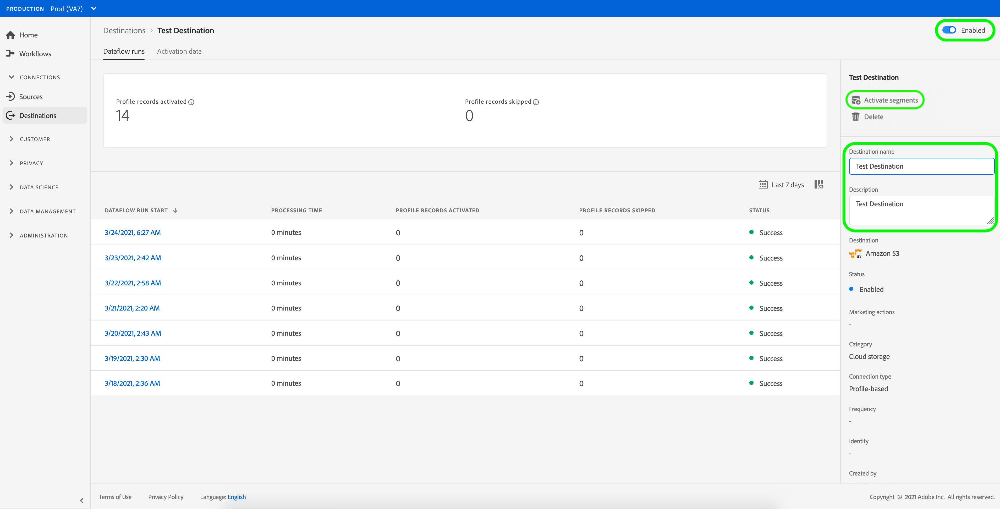

# Activeringsstromen {#edit-activation-flows} bewerken

Voer de onderstaande stappen uit om bestaande activeringsstromen in Adobe Experience Platform te bewerken:

1. Meld u aan bij [Experience Platform UI](https://platform.adobe.com/) en selecteer **[!UICONTROL Destinations]** in de linkernavigatiebalk. Selecteer **[!UICONTROL Browse]** van de hoogste kopbal om uw bestaande bestemmingen te bekijken.

   

2. Selecteer het filterpictogram  linksboven om het deelvenster Sorteren te starten. Het deelvenster Sorteren bevat een lijst met al uw doelen. U kunt meer dan één bestemming van de lijst selecteren om een gefilterde selectie van gegevensstromen te zien verbonden aan de geselecteerde bestemming.

   

3. Selecteer de naam van het doel dat u wilt bewerken.

   

4. De detailspagina voor de bestemming verschijnt, tonend zijn beschikbare controles. Selecteer **[!UICONTROL Activate]** in het juiste spoor om te veranderen welke segmenten om naar de bestemming te verzenden.

   

5. Raadpleeg [Profielen en segmenten activeren naar een doel](activate-destinations.md) voor meer informatie over het activeren van nieuwe segmenten.
