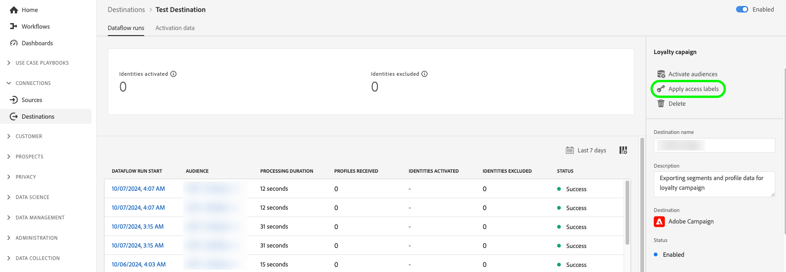

# Activeringsgegevens bewerken {#edit-activation-flows}

In Adobe Experience Platform kunt u verschillende componenten van bestaande activeringsgegevens configureren naar doelen, zoals:

* [ laat of maak ](#enable-disable-dataflows) activeringsdataflows toe onbruikbaar;
* [ voeg extra publiek en profielattributen ](#add-audiences) aan activeringsdataflows toe;
* [ voeg extra datasets ](#add-datasets) aan activeringswerkschema&#39;s toe;
* [ geef namen en beschrijvingen ](#edit-names-descriptions) voor uw activeringsdataflows uit;

<!-- * [Apply access labels](#apply-access-labels) to exported data; -->

## Bladeren door activeringsgegevens {#browse-activation-dataflows}

Voer de onderstaande stappen uit om door de bestaande activeringsgegevens te bladeren en de gegevens te identificeren die u wilt bewerken.

1. Login aan het [ Experience Platform UI ](https://platform.adobe.com/) en selecteert **[!UICONTROL Destinations]** van de linkernavigatiebar. Selecteer **[!UICONTROL Browse]** in de bovenste koptekst om de bestaande doelgegevens weer te geven.

   

2. Selecteer het filterpictogram  op de bovenkant verlaten om het soortpaneel te lanceren. Het deelvenster Sorteren bevat een lijst met al uw doelen. U kunt meer dan één bestemming van de lijst selecteren om een gefilterde selectie van gegevensstromen te zien verbonden aan de geselecteerde bestemming.

   

3. Selecteer de naam van de doelgegevensstroom die u wilt bewerken.

   

4. De pagina **[!UICONTROL Dataflow runs]** voor het doel wordt weergegeven en de beschikbare besturingselementen worden weergegeven. Afhankelijk van het bestemmingstype, kunt u diverse dataflow verrichtingen uitvoeren. Zie de volgende secties voor elke gesteunde gegevensstroomverrichting.

## Activeringsgegevensstromen in- of uitschakelen {#enable-disable-dataflows}

Met de schakeloptie **[!UICONTROL Enabled]/[!UICONTROL Disabled]** kunt u alle gegevens die u exporteert naar het doel starten of pauzeren.

{het beeld van 0} Experience Platform UI tonend Toegelaten/Gehandicapte dataflow looppas knevel.](../assets/ui/edit-activation/enable-toggle.png)![

## Soorten publiek toevoegen aan een activeringsgegevensstroom {#add-audiences}

Selecteer **[!UICONTROL Activate audiences]** in het rechterspoor om te wijzigen welk publiek of welke profielkenmerken naar de bestemming moeten worden verzonden. Hiermee gaat u naar de activeringsworkflow, die afhankelijk is van het doeltype.

{het beeld van 0} Experience Platform UI tonend de Activate optie van het publiek dataflow.](../assets/ui/edit-activation/activate-audiences.png) (bijvoorbeeld, Facebook of Twitter);
* [ activeer publiek aan de uitvoerbestemmingen van het partijprofiel ](./activate-batch-profile-destinations.md) (bijvoorbeeld, Amazon S3 of Oracle Eloqua);
* [ activeer publiek aan het stromen van profieluitvoer bestemmingen ](./activate-streaming-profile-destinations.md) (bijvoorbeeld, HTTP API of Amazon Kinesis).

## Gegevenssets toevoegen aan een activeringsgegevensstroom {#add-datasets}

Selecteer **[!UICONTROL Export datasets]** in het rechterspoor om extra datasets te selecteren om naar uw bestemming uit te voeren. Deze optie neemt u aan het [ werkschema van de datasetuitvoer ](export-datasets.md).

>[!NOTE]
>
>Deze optie is slechts zichtbaar voor [ bestemmingen die datasetuitvoer ](export-datasets.md#supported-destinations) steunen.

{het beeld van 0} Experience Platform UI die de Datasets van de Uitvoer dataflow looppasoptie toont.](../assets/ui/edit-activation/export-datasets.png)![

<!-- ## Apply access labels {#apply-access-labels}

Select **[!UICONTROL Apply access labels]** to edit the data usage labels for the exported data. See the [data usage labels documentation](../../data-governance/labels/overview.md) to learn more.

 -->

## Namen en beschrijvingen van activeringsgegevens bewerken {#edit-names-descriptions}

Gebruik de velden **[!UICONTROL Destination name]** en **[!UICONTROL Description]** om de naam en beschrijving van de activeringsgegevens te bewerken.

## Volgende stappen {#next-steps}

Aan de hand van deze zelfstudie hebt u de **[!UICONTROL destinations]** -werkruimte gebruikt om bestaande doelgegevensstromen bij te werken.

Voor meer informatie over bestemmingen, verwijs naar het [ overzicht van bestemmingen ](../catalog/overview.md).
