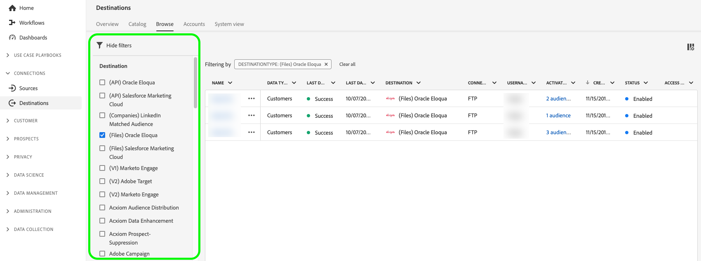
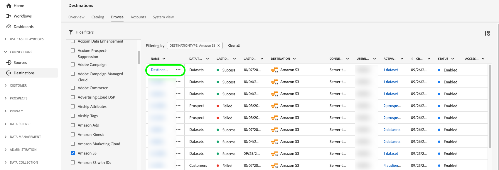
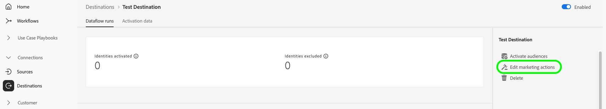

# Activeringsgegevens bewerken {#edit-activation-flows}

In Adobe Experience Platform kunt u verschillende componenten van bestaande activeringsgegevens configureren naar doelen, zoals:

* [&#x200B; laat of maakt &#x200B;](#enable-disable-dataflows) activeringsdataflows onbruikbaar
* [&#x200B; voeg extra publiek &#x200B;](#add-audiences) aan activeringsdataflows toe
* [Toegewezen kenmerken en identiteiten bewerken](#edit-mapped-attributes)
* [Het activeringsschema en de exportfrequentie bewerken](#edit-schedule-frequency)
* [&#x200B; voeg extra datasets &#x200B;](#add-datasets) aan activeringswerkschema toe
* [&#x200B; geef marketing acties &#x200B;](#edit-marketing-actions) voor uw activeringsdataflows uit
* [&#x200B; pas toegangslabels &#x200B;](#apply-access-labels) op uitgevoerde gegevens toe
* [&#x200B; geeft namen en beschrijvingen &#x200B;](#edit-names-descriptions) voor uw activeringsdataflows uit

## Bladeren door activeringsgegevens {#browse-activation-dataflows}

Voer de onderstaande stappen uit om door de bestaande activeringsgegevens te bladeren en de gegevens te identificeren die u wilt bewerken.

1. Login aan [&#x200B; UI van Experience Platform &#x200B;](https://platform.adobe.com/) en selecteer **[!UICONTROL Destinations]** van de linkernavigatiebar. Selecteer **[!UICONTROL Browse]** in de bovenste koptekst om de bestaande doelgegevens weer te geven.

   

2. Selecteer het filterpictogram  op de bovenkant verlaten om het soortpaneel te lanceren. Het deelvenster Sorteren bevat een lijst met al uw doelen. U kunt meer dan één bestemming van de lijst selecteren om een gefilterde selectie van gegevensstromen te zien verbonden aan de geselecteerde bestemming.

   

3. Selecteer de naam van de doelgegevensstroom die u wilt bewerken.

   

4. De pagina **[!UICONTROL Dataflow runs]** voor het doel wordt weergegeven en de beschikbare besturingselementen worden weergegeven. Afhankelijk van het bestemmingstype, kunt u diverse dataflow verrichtingen uitvoeren. Zie de volgende secties voor elke gesteunde gegevensstroomverrichting.

## Activeringsgegevensstromen in- of uitschakelen {#enable-disable-dataflows}

Met de schakeloptie **[!UICONTROL Enabled]/[!UICONTROL Disabled]** kunt u alle gegevens die u exporteert naar het doel starten of pauzeren.

{het beeld van 0} Experience Platform UI die toegelaten/Gehandicapte dataflow looppas tonen knevel.

## Soorten publiek toevoegen aan een activeringsgegevensstroom {#add-audiences}

Selecteer **[!UICONTROL Activate audiences]** in het rechterspoor om te wijzigen welk publiek naar het doel moet worden verzonden. Hiermee gaat u naar de activeringsworkflow.

{het beeld van 0} Experience Platform UI die de Activate de looppasoptie van het publiek toont dataflow.

In de stap **[!UICONTROL Select audiences]** van de activeringsworkflow kunt u bestaande doelgroepen verwijderen of nieuwe doelgroepen toevoegen aan de activeringsworkflow.

De activeringsworkflow verschilt enigszins afhankelijk van het doeltype. Lees de volgende hulplijnen voor meer informatie over de activeringsworkflows voor elk doeltype:

* [&#x200B; activeer publiek aan het stromen bestemmingen &#x200B;](./activate-segment-streaming-destinations.md) (bijvoorbeeld, Facebook of Twitter);
* [&#x200B; activeer publiek aan de uitvoerbestemmingen van het partijprofiel &#x200B;](./activate-batch-profile-destinations.md) (bijvoorbeeld, Amazon S3 of Oracle Eloqua);
* [&#x200B; activeer publiek aan het stromen van profieluitvoer bestemmingen &#x200B;](./activate-streaming-profile-destinations.md) (bijvoorbeeld, HTTP API of Amazon Kinesis).

## Het activeringsschema en de exportfrequentie bewerken {#edit-schedule-frequency}

Selecteer **[!UICONTROL Activate audiences]** in de rechtertrack. Hiermee gaat u naar de activeringsworkflow.

{het beeld van 0} Experience Platform UI die de Activate de looppasoptie van het publiek toont dataflow.

Selecteer de **[!UICONTROL Scheduling]** -stap in de activeringsworkflow om het activeringsschema en de exportfrequentie voor de gegevensstroom te bewerken. Deze stap staat u toe om te vormen hoe vaak de gegevens naar de bestemming worden uitgevoerd.

In de stap **[!UICONTROL Scheduling]** van de activeringsworkflow kunt u:

* Pas de exportfrequentie aan.
* Stel de begin- en einddatum voor de activeringsgegevensstroom in of wijzig deze.

De het plannen verrichtingen die u kunt uitvoeren variëren lichtjes afhankelijk van bestemmingstype. Lees de volgende hulplijnen voor meer informatie over de activeringsworkflows voor elk doeltype:

* [&#x200B; activeer publiek aan het stromen bestemmingen &#x200B;](./activate-segment-streaming-destinations.md) (bijvoorbeeld, Facebook of Twitter);
* [&#x200B; activeer publiek aan de uitvoerbestemmingen van het partijprofiel &#x200B;](./activate-batch-profile-destinations.md) (bijvoorbeeld, Amazon S3 of Oracle Eloqua);
* [&#x200B; activeer publiek aan het stromen van profieluitvoer bestemmingen &#x200B;](./activate-streaming-profile-destinations.md) (bijvoorbeeld, HTTP API of Amazon Kinesis).

## Toegewezen kenmerken en identiteiten bewerken {#edit-mapped-attributes}

Selecteer **[!UICONTROL Activate audiences]** in de rechtertrack. Hiermee gaat u naar de activeringsworkflow.

{het beeld van 0} Experience Platform UI die de Activate de looppasoptie van het publiek toont dataflow.

Selecteer de stap **[!UICONTROL Mapping]** in de activeringsworkflow om de toegewezen kenmerken en identiteiten voor de activeringsgegevensstroom te bewerken. Op deze manier kunt u aanpassen welke profielkenmerken en identiteiten naar de bestemming moeten worden geëxporteerd.

In de stap **[!UICONTROL Mapping]** van de activeringsworkflow kunt u:

* Voeg nieuwe kenmerken of identiteiten toe aan de toewijzing.
* Bestaande kenmerken of identiteiten verwijderen uit de toewijzing.
* Pas de volgorde van toewijzingen aan om de kolomvolgorde in geëxporteerde bestanden te definiëren.

De activeringsworkflow verschilt enigszins afhankelijk van het doeltype. Lees de volgende hulplijnen voor meer informatie over de activeringsworkflows voor elk doeltype:

* [&#x200B; activeer publiek aan het stromen bestemmingen &#x200B;](./activate-segment-streaming-destinations.md) (bijvoorbeeld, Facebook of Twitter);
* [&#x200B; activeer publiek aan de uitvoerbestemmingen van het partijprofiel &#x200B;](./activate-batch-profile-destinations.md) (bijvoorbeeld, Amazon S3 of Oracle Eloqua);
* [&#x200B; activeer publiek aan het stromen van profieluitvoer bestemmingen &#x200B;](./activate-streaming-profile-destinations.md) (bijvoorbeeld, HTTP API of Amazon Kinesis).

## Gegevenssets toevoegen aan een activeringsgegevensstroom {#add-datasets}

Selecteer **[!UICONTROL Export datasets]** in het rechterspoor om extra datasets te selecteren om naar uw bestemming uit te voeren. Deze optie neemt u aan het [&#x200B; werkschema van de datasetuitvoer &#x200B;](export-datasets.md).

>[!NOTE]
>
>Deze optie is slechts zichtbaar voor [&#x200B; bestemmingen die datasetuitvoer &#x200B;](export-datasets.md#supported-destinations) steunen.

{het beeld van 0} Experience Platform UI die de Datasets van de Uitvoer dataflow looppas optie toont.

## Marketingacties bewerken {#edit-marketing-actions}

>[!IMPORTANT]
>
>Om marketing acties uit te geven hebt u de **[!UICONTROL Activate Destinations]** en **[!UICONTROL Manage Destinations]** [&#x200B; toegangsbeheertoestemmingen &#x200B;](/help/access-control/home.md#permissions) nodig. Lees het [&#x200B; overzicht van de toegangscontrole &#x200B;](/help/access-control/ui/overview.md) of contacteer uw productbeheerder om de vereiste toestemmingen te verkrijgen.

U kunt marketingacties toevoegen of verwijderen die u instelt wanneer u aanvankelijk verbinding maakt met de bestemming.

Selecteer **[!UICONTROL Edit marketing actions]** in het rechterspoor om het selectiescherm voor marketingacties te openen.

Selecteer de toepasselijke marketingacties en selecteer vervolgens **[!UICONTROL Save]** om de wijzigingen toe te passen.

## Toegangslabels toepassen {#apply-access-labels}

Selecteer **[!UICONTROL Apply access labels]** om de labels voor gegevensgebruik voor de geëxporteerde gegevens te bewerken. Zie de [&#x200B; documentatie van de etiketten van het gegevensgebruik &#x200B;](../../data-governance/labels/overview.md) om meer te leren.

{het beeld van 0} Experience Platform UI die de Datasets van de Uitvoer dataflow looppas optie toont.

## Namen en beschrijvingen van activeringsgegevens bewerken {#edit-names-descriptions}

Gebruik de velden **[!UICONTROL Destination name]** en **[!UICONTROL Description]** om de naam en beschrijving van de activeringsgegevens te bewerken.

## Volgende stappen {#next-steps}

Aan de hand van deze zelfstudie hebt u de **[!UICONTROL destinations]** -werkruimte gebruikt om bestaande doelgegevensstromen bij te werken.

Voor meer informatie over bestemmingen, verwijs naar het [&#x200B; overzicht van bestemmingen &#x200B;](../catalog/overview.md).
