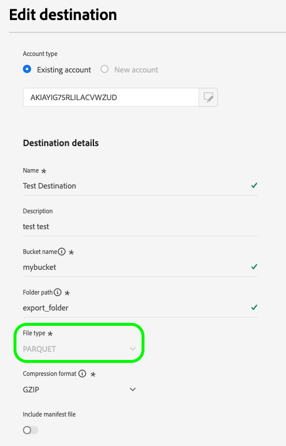

# Doelen bewerken

Leer hoe u verschillende componenten van een bestaande doelverbinding kunt bewerken, zoals het bijwerken van verificatiereferenties, de exportlocatie en meer met de gebruikersinterface van Experience Platform.

>[!NOTE]
>
> De bewerkingen die in deze zelfstudie worden beschreven, worden ook ondersteund via API-bewerkingen. Lees het leerprogramma op hoe te [&#x200B; bestemmingen in API &#x200B;](/help/destinations/api/edit-destination.md) voor meer informatie uitgeven.

## Vereisten {#prerequisites}

Om bestemmingsverbindingen uit te geven hebt u de **[!UICONTROL Manage Destinations]** [&#x200B; toegangsbeheertoestemming &#x200B;](/help/access-control/home.md#permissions) nodig. Lees het [&#x200B; overzicht van de toegangscontrole &#x200B;](/help/access-control/ui/overview.md) of contacteer uw productbeheerder om de vereiste toestemmingen te verkrijgen.

## Doelverbindingen bewerken {#edit}

Verschillende componenten van een bestaande doelverbinding bewerken:

1. Ga naar **[!UICONTROL Destinations]** > **[!UICONTROL Browse]**.
2. Selecteer het gewenste doel dat u wilt bewerken.
3. Selecteer de ellips (`...`) in de [!UICONTROL Name] kolom en gebruik **[!UICONTROL Edit destination]**&#x200B;controle om bestaande bestemmingsverbindingen uit te geven.
4. Bewerk de gewenste instellingen in het modale venster. Selecteer **[!UICONTROL Save]** wanneer gereed.

In het bewerkingsbestemmingsvenster, kunt u om het even welke montages bijwerken die u vormde toen u aanvankelijk met de bestemming verbond. Deze instellingen zijn anders op basis van het doelplatform dat u bijwerkt.

Afhankelijk van hoe de bestemming werd gevormd, zouden sommige gebieden read-only kunnen zijn en kunnen niet worden uitgegeven. Om de waarde van read-only gebieden te veranderen, moet u [&#x200B; een nieuwe bestemmingsverbinding &#x200B;](../ui/connect-destination.md) met de nieuwe gebiedswaarden tot stand brengen.

Hieronder zijn sommige voorbeelden van de montages die u voor [&#x200B; Amazon S3 &#x200B;](../catalog/cloud-storage/amazon-s3.md) kunt bijwerken, [&#x200B; Azure de Hubs van de Gebeurtenis &#x200B;](../catalog/cloud-storage/azure-event-hubs.md), en [&#x200B; Google Adds &#x200B;](../catalog/advertising/google-ads-destination.md) bestemmingen.

  
  
  

>[!SUCCESS]
>
>De instellingen voor de doelverbinding worden nu bijgewerkt.

## Andere bewerkingsopties

Met de Experience Platform UI of de Flow Service API kunt u verschillende doelconfiguraties bewerken, zoals in de onderstaande koppelingen wordt beschreven:

| De gebruikersinterface van Experience Platform gebruiken | De Flow Service API gebruiken |
|---------|----------|
| Doelverbindingen bewerken (deze pagina) | [&#x200B; geef de componenten van de doelverbinding (opslagplaats en andere componenten) uit &#x200B;](/help/destinations/api/edit-destination.md#patch-target-connection) |
| [&#x200B; geeft rekeningen &#x200B;](/help/destinations/ui/update-accounts.md) uit | [&#x200B; geeft de componenten van de basisverbinding (authentificatieparameters en andere componenten) uit &#x200B;](/help/destinations/api/edit-destination.md#patch-base-connection) |
| [&#x200B; geef activeringsgegevens &#x200B;](/help/destinations/ui/edit-activation.md) uit | [&#x200B; de bestemmingsgegevens van de Update &#x200B;](/help/destinations/api/update-destination-dataflows.md) |

## Volgende stappen

Aan de hand van deze zelfstudie hebt u de **[!UICONTROL destinations]** -werkruimte gebruikt om bestaande doelverbindingen bij te werken.

Voor meer informatie over bestemmingen, verwijs naar het [&#x200B; overzicht van bestemmingen &#x200B;](../catalog/overview.md).
