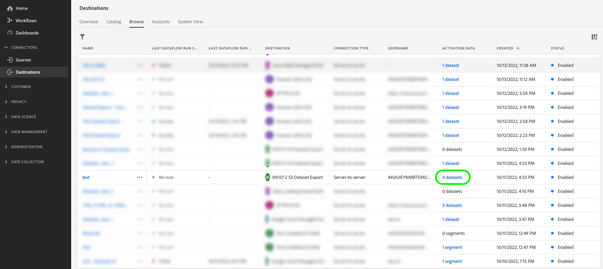

# Gegevenssets exporteren naar cloudopslagbestemmingen

>[!AVAILABILITY]
>
>* Deze functionaliteit is beschikbaar voor klanten die het Real-Time CDP Premiere of Ultimate-pakket, Adobe Journey Optimizer of Customer Journey Analytics hebben aangeschaft. Neem contact op met uw Adobe voor meer informatie.

Dit artikel verklaart het werkschema dat wordt vereist om [ datasets ](/help/catalog/datasets/overview.md) van Adobe Experience Platform naar uw aangewezen plaats van de wolkenopslag, zoals [!DNL Amazon S3], plaatsen SFTP, of [!DNL Google Cloud Storage] uit te voeren door het Experience Platform UI te gebruiken.

U kunt de Experience Platform APIs ook gebruiken om datasets uit te voeren. Lees de [ leerprogramma&#39;s van de uitvoerdatasets API ](/help/destinations/api/export-datasets.md) voor meer informatie.

## Beschikbare gegevensbestanden voor exporteren {#datasets-to-export}

De gegevenssets die u kunt exporteren, variëren op basis van de toepassing van het Experience Platform (Real-Time CDP, Adobe Journey Optimizer), de laag (Premier of Ultimate) en alle invoegtoepassingen die u hebt aangeschaft (bijvoorbeeld Data Distiller).

Gebruik de onderstaande tabel om te begrijpen welke gegevenstypen u kunt exporteren, afhankelijk van uw toepassing, productlaag en eventuele aangeschafte invoegtoepassingen:

<table>
<thead>
  <tr>
    <th>Toepassing/invoegtoepassing</th>
    <th>Tier</th>
    <th>Beschikbare gegevens voor exporteren</th>
  </tr>
</thead>
<tbody>
  <tr>
    <td rowspan="2">Real-Time CDP</td>
    <td>Eerste</td>
    <td>De datasets van de Gebeurtenis van het profiel en van de Ervaring die in de Experience Platform UI na het opnemen van of het verzamelen van gegevens door Bronnen, Web SDK, Mobiele SDK, de Schakelaar van Gegevens van de Analyse, en Audience Manager worden gecreeerd.</td>
  </tr>
  <tr>
    <td>Ultieme</td>
    <td><ul><li>De datasets van de Gebeurtenis van het profiel en van de Ervaring die in de Experience Platform UI na het opnemen van of het verzamelen van gegevens door Bronnen, Web SDK, Mobiele SDK, de Schakelaar van Gegevens van de Analyse, en Audience Manager worden gecreeerd.</li><li> <a href="https://experienceleague.adobe.com/docs/experience-platform/dashboards/query.html#profile-attribute-datasets"> systeem-geproduceerde dataset van de Momentopname van het Profiel </a>.</li></td>
  </tr>
  <tr>
    <td rowspan="2">Adobe Journey Optimizer</td>
    <td>Eerste</td>
    <td>Raadpleeg de <a href="https://experienceleague.adobe.com/docs/journey-optimizer/using/data-management/datasets/export-datasets.html#datasets"> documentatie van Adobe Journey Optimizer </a> .</td>
  </tr>
  <tr>
    <td>Ultieme</td>
    <td>Raadpleeg de <a href="https://experienceleague.adobe.com/docs/journey-optimizer/using/data-management/datasets/export-datasets.html#datasets"> documentatie van Adobe Journey Optimizer </a> .</td>
  </tr>
  <tr>
    <td>Customer Journey Analytics</td>
    <td>Alles</td>
    <td> De datasets van de Gebeurtenis van het profiel en van de Ervaring die in de Experience Platform UI na het opnemen van of het verzamelen van gegevens door Bronnen, Web SDK, Mobiele SDK, de Schakelaar van Gegevens van de Analyse, en Audience Manager worden gecreeerd.</td>
  </tr>
  <tr>
    <td>Data Distiller</td>
    <td>Distiller-gegevens (invoegtoepassing)</td>
    <td>Voortgekomen datasets die door de Dienst van de Vraag worden gecreeerd.</td>
  </tr>
</tbody>
</table>

## Videotutorial {#video-tutorial}

Bekijk de onderstaande video voor een end-to-end uitleg van de workflow die op deze pagina wordt beschreven, de voordelen van het gebruik van de functie voor het exporteren van gegevenssets en enkele gebruiksscenario&#39;s.

>[!VIDEO](https://video.tv.adobe.com/v/3424392/)

## Ondersteunde doelen {#supported-destinations}

Momenteel, kunt u datasets naar de bestemmingen van de wolkenopslag uitvoeren die in het schermafbeelding worden benadrukt en hieronder worden vermeld.

* [[!DNL Azure Data Lake Storage Gen2]](../../destinations/catalog/cloud-storage/adls-gen2.md)
* [[!DNL Data Landing Zone]](../../destinations/catalog/cloud-storage/data-landing-zone.md)
* [[!DNL Google Cloud Storage]](../../destinations/catalog/cloud-storage/google-cloud-storage.md)
* [[!DNL Amazon S3]](../../destinations/catalog/cloud-storage/amazon-s3.md#changelog)
* [[!DNL Azure Blob]](../../destinations/catalog/cloud-storage/azure-blob.md#changelog)
* [[!DNL SFTP]](../../destinations/catalog/cloud-storage/sftp.md#changelog)

## Wanneer moet u het publiek activeren of gegevenssets exporteren {#when-to-activate-audiences-or-activate-datasets}

Sommige op dossier-gebaseerde bestemmingen in de catalogus van het Experience Platform steunen zowel publieksactivering als dataset de uitvoer.

* U kunt doelgroepen activeren als u uw gegevens wilt indelen in profielen die zijn gegroepeerd op belangen of kwalificaties van het publiek.
* U kunt ook overwegen gegevenssets te exporteren wanneer u onbewerkte datasets wilt exporteren, die niet zijn gegroepeerd of gestructureerd op doelgroepinteresses of -kwalificaties. Je zou deze data kunnen gebruiken voor rapportage, datawetenschapsworkflows en vele andere gebruiksscenario’s. Als beheerder, dataengineer of analist kun je bijvoorbeeld data uit Experience Platform exporteren om te synchroniseren met je datawarehouse, gebruik in BI-analysetools, externe cloud ML-tools of opslag in je systeem voor langetermijnopslagbehoeften.

Dit document bevat alle informatie die nodig is om gegevenssets te exporteren. Als u *doelgroepen* aan cloudopslag of e-mailmarketingbestemmingen wilt activeren, lees [ doelgroepgegevens activeren om de uitvoerbestemmingen van het batchprofiel te activeren ](/help/destinations/ui/activate-batch-profile-destinations.md).

## Vereisten {#prerequisites}

Om datasets naar de bestemmingen van de cloudopslag uit te voeren, moet u met succes [ verbonden aan een bestemming ](./connect-destination.md) hebben. Als u dit niet reeds hebt gedaan, ga naar de [ catalogus van bestemmingen ](../catalog/overview.md), doorblader de gesteunde bestemmingen, en vorm de bestemming die u wilt gebruiken.

### Vereiste machtigingen {#permissions}

Om datasets uit te voeren, hebt u **[!UICONTROL View Destinations]**, **[!UICONTROL View Datasets]**, en **[!UICONTROL Manage and Activate Dataset Destinations]** [ toegangsbeheertoestemmingen ](/help/access-control/home.md#permissions) nodig. Lees het [ overzicht van de toegangscontrole ](/help/access-control/ui/overview.md) of contacteer uw productbeheerder om de vereiste toestemmingen te verkrijgen.

Om ervoor te zorgen dat u de noodzakelijke toestemmingen hebt om datasets uit te voeren en dat de bestemming het uitvoeren van datasets steunt, doorblader de bestemmingscatalogus. Als een doel een **[!UICONTROL Activate]** - of **[!UICONTROL Export datasets]** -besturingselement heeft, hebt u de juiste machtigingen.

## Kies uw bestemming {#select-destination}

Volg de instructies om een bestemming te selecteren waar u uw datasets kunt uitvoeren:

1. Ga naar **[!UICONTROL Connections > Destinations]** en selecteer de tab **[!UICONTROL Catalog]** .

   

1. Selecteer **[!UICONTROL Activate]** of **[!UICONTROL Export datasets]** op de kaart die overeenkomt met het doel waarnaar u gegevenssets wilt exporteren.

   

1. Selecteer **[!UICONTROL Data type Datasets]** en selecteer de doelverbinding waarnaar u gegevenssets wilt exporteren, en selecteer vervolgens **[!UICONTROL Next]** .

>[!TIP]
> 
>Als u opstelling een nieuwe bestemming wilt om datasets uit te voeren, uitgezocht **[!UICONTROL Configure new destination]** om [ te teweegbrengen verbind met bestemmings ](/help/destinations/ui/connect-destination.md) werkschema.

1. De weergave **[!UICONTROL Select datasets]** wordt weergegeven. Ga aan de volgende sectie te werk aan [ selecteer uw datasets ](#select-datasets) voor de uitvoer.

## Uw gegevenssets selecteren {#select-datasets}

Gebruik de controlevakjes links van de datasetnamen om de datasets te selecteren die u naar de bestemming wilt uitvoeren, dan uitgezocht **[!UICONTROL Next]**.

## Gegevensexport voor schema {#scheduling}

>[!CONTEXTUALHELP]
>id="platform_destinations_activate_datasets_exportoptions"
>title="Exportopties voor bestanden voor gegevenssets"
>abstract="Selecteer **de stijgende dossiers van de Uitvoer** om slechts de gegevens uit te voeren die aan de dataset sinds de laatste uitvoer werden toegevoegd.   De eerste incrementele bestandsuitvoer bevat alle gegevens in de gegevensset, die fungeren als backfill. Toekomstige incrementele bestanden bevatten alleen de gegevens die sinds de eerste export aan de gegevensset zijn toegevoegd.   Uitgezochte **Uitvoer volledige dossiers** om het volledige lidmaatschap van elke dataset op elke uitvoer uit te voeren. "

>[!CONTEXTUALHELP]
>id="dataset_dataflow_needs_schedule_end_date_header"
>title="De einddatum voor deze gegevensstroom bijwerken"
>abstract="De einddatum voor deze gegevensstroom bijwerken"

>[!CONTEXTUALHELP]
>id="dataset_dataflow_needs_schedule_end_date_body"
>title="De einddatum voor deze gegevensstroominhoud bijwerken"
>abstract="Vanwege recente updates voor deze bestemming is voor de gegevensstroom nu een einddatum vereist. Adobe heeft een standaardeinddatum ingesteld op 1 mei 2025. Werk de gegevens bij naar de gewenste einddatum. Anders worden de gegevens niet meer geëxporteerd op de standaarddatum."

Met de stap **[!UICONTROL Scheduling]** kunt u:

* Plaats een begindatum en een einddatum, evenals een uitvoerkadentie voor uw datasetuitvoer.
* Vorm als de uitgevoerde datasetdossiers het volledige lidmaatschap van de dataset of enkel stijgende veranderingen in het lidmaatschap op elk uitvoervoorval zouden moeten uitvoeren.
* Pas het mappad aan in uw opslaglocatie waar gegevenssets moeten worden geëxporteerd. Lees meer over hoe te [ de weg van de uitvoeromslag ](#edit-folder-path) uitgeven.

Gebruik het besturingselement **[!UICONTROL Edit schedule]** op de pagina om de exportsnelheid van exportbewerkingen te bewerken en om te bepalen of volledige of incrementele bestanden moeten worden geëxporteerd.

De optie **[!UICONTROL Export incremental files]** is standaard geselecteerd. Dit brengt de uitvoer van één of veelvoudige dossiers teweeg die een volledige momentopname van de dataset vertegenwoordigen. De volgende dossiers zijn stijgende toevoegingen aan de dataset sinds de vorige uitvoer. U kunt ook **[!UICONTROL Export full files]** selecteren. Selecteer in dit geval de frequentie **[!UICONTROL Once]** voor een eenmalige volledige uitvoer van de dataset.

>[!IMPORTANT]
>
>De eerste incrementele bestandsuitvoer bevat alle bestaande gegevens in de dataset, die als backfill werken. Het exporteren kan een of meerdere bestanden bevatten.

1. Gebruik de kiezer **[!UICONTROL Frequency]** om de exportfrequentie te selecteren:

   * **[!UICONTROL Daily]**: Plan de incrementele bestandsexport eenmaal per dag, elke dag, op het opgegeven tijdstip.
   * **[!UICONTROL Hourly]**: Plan het incrementele bestand om de 3, 6, 8 of 12 uur.

2. Gebruik de kiezer van **[!UICONTROL Time]** om in [!DNL UTC] -indeling de tijd van de dag te kiezen waarop het exporteren moet plaatsvinden.

3. Gebruik de kiezer van **[!UICONTROL Date]** om het interval te kiezen waarin het exporteren moet plaatsvinden.

4. Selecteer **[!UICONTROL Save]** om het schema op te slaan en door te gaan naar de stap **[!UICONTROL Review]** .

>[!NOTE]
> 
>Voor het exporteren van gegevenssets hebben de bestandsnamen een vooraf ingestelde standaardindeling, die niet kan worden gewijzigd. Zie de sectie [ de succesvolle uitvoer van de dataset ](#verify) voor meer informatie en voorbeelden van uitgevoerde dossiers verifiëren.

## Mappad bewerken {#edit-folder-path}

>[!CONTEXTUALHELP]
>id="destinations_folder_name_template"
>title="Mappad bewerken"
>abstract="Gebruik verschillende beschikbare macro&#39;s om het mappad aan te passen waarin de gegevensset wordt geëxporteerd."

>[!CONTEXTUALHELP]
>id="destinations_folder_name_template_preview"
>title="Padvoorvertoning gegevensmap"
>abstract="Bekijk een voorvertoning van de mapstructuur die op uw opslaglocatie wordt gemaakt op basis van de macro&#39;s die u in dit venster hebt toegevoegd."

Selecteer **[!UICONTROL Edit folder path]** om de mappenstructuur in uw opslagplaats aan te passen waar de uitgevoerde datasets worden gedeponeerd.

U kunt verschillende beschikbare macro&#39;s gebruiken om een gewenste mapnaam aan te passen. Dubbelklik op een macro om deze toe te voegen aan het mappad en gebruik `/` tussen de macro&#39;s om de mappen te scheiden.

Nadat u de gewenste macro&#39;s hebt geselecteerd, ziet u een voorvertoning van de mapstructuur die op uw opslaglocatie wordt gemaakt. Het eerste niveau in de omslagstructuur vertegenwoordigt **[!UICONTROL Folder path]** dat u wanneer u [ met de bestemming ](/help/destinations/ui/connect-destination.md##set-up-connection-parameters) verbond om datasets uit te voeren.

## Controleren {#review}

Op de pagina **[!UICONTROL Review]** ziet u een overzicht van uw selectie. Selecteer **[!UICONTROL Cancel]** om de stroom te verbreken, **[!UICONTROL Back]** om uw montages te wijzigen, of **[!UICONTROL Finish]** om uw selectie te bevestigen en datasets aan de bestemming te beginnen uitvoeren.

## Controleren of gegevensset is geëxporteerd {#verify}

Bij het exporteren van gegevenssets maakt Experience Platform een of meerdere `.json` - of `.parquet` -bestanden op de opslaglocatie die u hebt opgegeven. Nieuwe bestanden worden naar verwachting op uw opslaglocatie gedeponeerd volgens het exportschema dat u hebt opgegeven.

Experience Platform leidt tot een omslagstructuur in de opslagplaats u specificeerde, waar het de uitgevoerde datasetdossiers bewaart. Het standaardpatroon van de omslaguitvoer wordt getoond hieronder, maar u kunt [ de omslagstructuur met uw aangewezen macro&#39;s ](#edit-folder-path) aanpassen.

>[!TIP]
> 
>Het eerste niveau in deze omslagstructuur - `folder-name-you-provided` - vertegenwoordigt **[!UICONTROL Folder path]** die u wanneer u [ met de bestemming ](/help/destinations/ui/connect-destination.md##set-up-connection-parameters) verbonden om datasets uit te voeren.

`folder-name-you-provided/datasetID/exportTime=YYYYMMDDHHMM`

De standaardbestandsnaam wordt willekeurig gegenereerd en zorgt ervoor dat geëxporteerde bestandsnamen uniek zijn.

### Voorbeeldgegevenssetbestanden {#sample-files}

De aanwezigheid van deze bestanden op uw opslaglocatie is een bevestiging van een geslaagde export. Om te begrijpen hoe de uitgevoerde dossiers gestructureerd zijn, kunt u een steekproef [.parquet dossier ](../assets/common/part-00000-tid-253136349007858095-a93bcf2e-d8c5-4dd6-8619-5c662e261097-672704-1-c000.parquet) of [ .json dossier ](../assets/common/part-00000-tid-4172098795867639101-0b8c5520-9999-4cff-bdf5-1f32c8c47cb9-451986-1-c000.json) downloaden.

#### Gecomprimeerde gegevensbestanden {#compressed-dataset-files}

In [ verbind met bestemmingswerkschema ](/help/destinations/ui/connect-destination.md#file-formatting-and-compression-options), kunt u de uitgevoerde datasetdossiers selecteren om worden samengeperst, zoals hieronder getoond:

Houd rekening met het verschil in bestandsindeling tussen de twee bestandstypen bij het comprimeren:

* Bij het exporteren van gecomprimeerde JSON-bestanden is de geëxporteerde bestandsindeling `json.gz`
* Bij het exporteren van gecomprimeerde parketbestanden is de geëxporteerde bestandsindeling `gz.parquet`

De uitvoer naar JSON- dossiers wordt gesteund *op een samengeperste slechts wijze*. Exporteren naar Parquet-bestanden wordt ondersteund in een gecomprimeerde en niet-gecomprimeerde modus.

## Gegevenssets verwijderen uit doelen {#remove-dataset}

Om datasets uit een bestaande gegevensstroom te verwijderen, volg de stappen hieronder:

1. Login aan het [ Experience Platform UI ](https://experience.adobe.com/platform/) en selecteert **[!UICONTROL Destinations]** van de linkernavigatiebar. Selecteer **[!UICONTROL Browse]** in de bovenste koptekst om de bestaande doelgegevens weer te geven.

   

   >[!TIP]
   > 
   >Selecteer het filterpictogram  op de bovenkant verlaten om het soortpaneel te lanceren. Het deelvenster Sorteren bevat een lijst met al uw doelen. U kunt meer dan één bestemming van de lijst selecteren om een gefilterde selectie van gegevensstromen te zien verbonden aan de geselecteerde bestemming.

2. Van de **[!UICONTROL Activation data]** kolom, selecteer de datasetcontrole om alle datasets te bekijken die aan dit de uitvoerdataflow in kaart worden gebracht.

   

3. De pagina **[!UICONTROL Activation data]** voor het doel wordt weergegeven. Gebruik de selectievakjes aan de linkerkant van de lijst met gegevenssets om de gegevenssets te selecteren die u wilt verwijderen en selecteer vervolgens **[!UICONTROL Remove datasets]** in de rechterrail om het dialoogvenster voor het bevestigen van gegevenssets te openen.

   

4. Selecteer in het bevestigingsdialoogvenster **[!UICONTROL Remove]** om de gegevensset direct te verwijderen uit het exporteren naar het doel.

   

## Uitvoerrechten gegevensset {#licensing-entitlement}

Raadpleeg de productbeschrijvingsdocumenten om te begrijpen hoeveel gegevens u per jaar voor elke Experience Platform-toepassing mag exporteren. Bijvoorbeeld, kunt u de Beschrijving van het Product van Real-Time CDP [ hier ](https://helpx.adobe.com/legal/product-descriptions/real-time-customer-data-platform-b2c-edition-prime-and-ultimate-packages.html) bekijken.

De gegevensuitvoerrechten voor verschillende aanvragen zijn niet additief. Dit betekent bijvoorbeeld dat als u Real-Time CDP Ultimate en Adobe Journey Optimizer Ultimate koopt, de uitvoerrechten voor profielen de hoogste van de twee rechten zijn, zoals beschreven in de productbeschrijvingen. Uw volumeregelingen worden berekend door het totale aantal gelicentieerde profielen te nemen en te vermenigvuldigen met 500 kB voor Real-Time CDP Premium of 700 kB voor Real-Time CDP Ultimate om te bepalen hoeveel gegevensvolume u hebt.

Anderzijds, als u toe:voegen-ons zoals Gegevens Distiller kocht, vertegenwoordigt de grens van de gegevensuitvoer die u gerechtigd bent om te zijn de som van de productrij en de toe:voegen-op.

U kunt uw profieluitvoer tegen uw contractuele grenzen in het [ dashboard van het vergunningsgebruik bekijken en volgen ](/help/landing/license-usage-and-guardrails/license-usage-dashboard.md).

## Bekende beperkingen {#known-limitations}

Houd in mening de volgende beperkingen voor de algemene beschikbaarheidsversie van de uitvoer van datasets:

* Momenteel, kunt u stijgende dossiers slechts uitvoeren en een einddatum kan niet voor uw datasetuitvoer worden geselecteerd.
* Experience Platform kan meerdere bestanden exporteren, zelfs voor kleine datasets. Dataset exporteren is ontworpen voor systeemintegratie en geoptimaliseerd voor prestaties. Daarom kan het aantal geëxporteerde bestanden niet worden aangepast.
* De geëxporteerde bestandsnamen kunnen momenteel niet worden aangepast.
* Datasets die via een API zijn gemaakt, zijn momenteel niet beschikbaar voor export.
* UI blokkeert momenteel u niet om een dataset te schrappen die naar een bestemming wordt uitgevoerd. Verwijder geen datasets die naar bestemmingen worden geëxporteerd. [ verwijder de dataset ](#remove-dataset) uit een bestemmingsdataflow alvorens het te schrappen.
* De controlemetrieken voor de uitvoer van datasets worden momenteel gemengd met aantallen voor profielexporten zodat zij niet de ware uitvoeraantallen weerspiegelen.
* Gegevens met een tijdstempel ouder dan 365 dagen worden niet geëxporteerd naar gegevenssets. Voor meer informatie, bekijk de [ gidsen voor de geplande datasetuitvoer ](/help/destinations/guardrails.md#guardrails-for-scheduled-dataset-exports)

## Veelgestelde vragen {#faq}

**Kunnen wij een dossier zonder een omslag produceren als wij enkel sparen bij `/` als omslagweg? Ook, als wij geen omslagweg vereisen, hoe dossiers met dubbele namen in een omslag of een plaats worden geproduceerd?**

+++
Vanaf de release van september 2024 kunt u de mapnaam aanpassen en zelfs `/` gebruiken voor het exporteren van bestanden voor alle gegevenssets in dezelfde map. De Adobe adviseert dit niet voor bestemmingen die veelvoudige datasets uitvoeren, aangezien de systeem-geproduceerde filenames die tot verschillende datasets behoren in de zelfde omslag zullen worden gemengd.
+++

**kunt u het manifestdossier aan één omslag en gegevensdossiers in een andere omslag leiden?**

+++
Nee, het manifestbestand kan niet naar een andere locatie worden gekopieerd.
+++

**kunnen wij het rangschikken of timing van dossierlevering controleren?**

+++
Er zijn opties voor het plannen van het exporteren. Er zijn geen opties om de kopie van de bestanden te vertragen of in volgorde te zetten. Ze worden naar de opslaglocatie gekopieerd zodra ze worden gegenereerd.
+++

**Welke formaten zijn beschikbaar voor het manifestdossier?**

+++
Het manifestbestand heeft de indeling .json.
+++

**is er API beschikbaarheid voor het duidelijke dossier?**

+++
Er is geen API beschikbaar voor het manifestbestand, maar het bevat wel een lijst met bestanden die de export omvatten.
+++

**kunnen wij extra details aan het manifestdossier (d.w.z., verslagtelling) toevoegen? Zo ja, hoe?**

+++
Er is geen mogelijkheid om aanvullende informatie aan het manifestbestand toe te voegen. Het aantal records is beschikbaar via de entiteit `flowRun` (kan worden opgevraagd via de API). Lees meer in bestemmingen controle.
+++

**Hoe worden gegevensbestanden gesplitst? Hoeveel verslagen per dossier?**

+++
Gegevensbestanden worden gesplitst volgens de standaardpartitionering in het gegevenspeer van het Experience Platform. Grotere datasets hebben een hoger aantal verdelingen. Standaard het verdelen is niet configureerbaar door de gebruiker aangezien het voor lezing wordt geoptimaliseerd.
+++

**kunnen wij een drempel (aantal verslagen per dossier) plaatsen?**

+++
Nee, dat is niet mogelijk.
+++

**hoe wij opnieuw een gegevensreeks in de gebeurtenis sturen dat de aanvankelijke verzendt slecht is?**

+++
Voor de meeste typen systeemfouten worden automatisch opnieuw opgestart.
+++