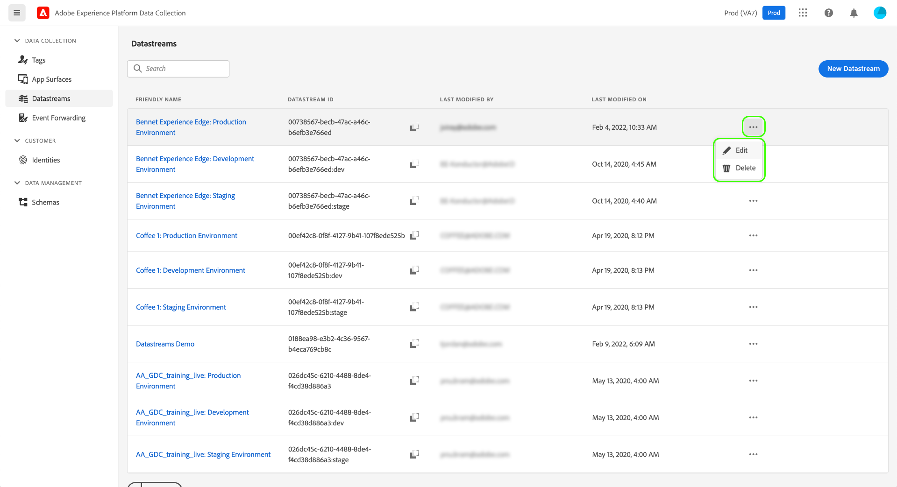

# Een gegevensstroom configureren

Een gegevensstroom vertegenwoordigt de server-zijconfiguratie wanneer het uitvoeren van het Web van Adobe Experience Platform en Mobile SDKs. Terwijl de [configureren, opdracht](configuring-the-sdk.md) in SDK controleert dingen die op de cliënt (zoals moeten worden behandeld `edgeDomain`), worden in gegevensstreams alle andere configuraties voor de SDK afgehandeld. Wanneer een aanvraag naar het Adobe Experience Platform Edge-netwerk wordt verzonden, `edgeConfigId` wordt gebruikt om naar de gegevensstroom te verwijzen. Hierdoor kunt u de serverconfiguratie bijwerken zonder dat u codewijzigingen hoeft aan te brengen op uw website.

In dit document worden de stappen beschreven voor het configureren van een gegevensstroom in de gebruikersinterface voor gegevensverzameling.

>[!NOTE]
>
>Uw organisatie moet voor deze eigenschap worden voorzien om tot het in UI toegang te hebben. Vul het volgende in [formulier](https://adobe.ly/websdkaccess) om de nodige toegang te vragen.

## Toegang krijgen tot [!UICONTROL Datastreams] werkruimte

U kunt gegevensstromen in de UI van de Inzameling van Gegevens tot stand brengen en beheren door te selecteren **[!UICONTROL Datastreams]** in de linkernavigatie.


>[!NOTE]
>
>Terwijl u toegang hebt tot [!UICONTROL Datastreams] , ongeacht of u de mogelijkheden voor tagbeheer van Platform gebruikt, hebt u ontwikkelaarmachtigingen nodig om gegevensstromen zelf te beheren. Zie de [gebruikersmachtigingen](../../tags/ui/administration/user-permissions.md) artikel in de tagdocumentatie voor meer informatie.

De [!UICONTROL Datastreams] wordt een lijst weergegeven met bestaande gegevensstromen, inclusief de vriendelijke naam, id en datum die als laatste is gewijzigd. Selecteer de naam van een gegevensstroom die u wilt [zijn details bekijken en de diensten vormen](#view-details).

Selecteer het pictogram Meer (**...**) voor een bepaalde gegevensstroom om meer opties weer te geven. Selecteren **[!UICONTROL Edit]** om de [basisconfiguratie](#configure) voor de gegevensstroom, of selecteer **[!UICONTROL Delete]** om de gegevensstroom te verwijderen.



## Een nieuwe gegevensstroom maken {#create}

Als u een gegevensstroom wilt maken, selecteert u **[!UICONTROL New Datastream]**.


### [!UICONTROL Configure] {#configure}

De workflow voor het maken van de gegevensstroom wordt weergegeven, te beginnen bij de configuratiestap. Van hier, moet u een naam en een facultatieve beschrijving voor de gegevensstroom verstrekken.

Als u deze gegevensstroom voor gebruik in Experience Platform vormt en SDK van het Web van het Platform gebruikt, moet u ook selecteren [op gebeurtenissen gebaseerd XDM-schema (Experience Data Model)](../../xdm/classes/experienceevent.md) om de gegevens te vertegenwoordigen u bij het opnemen bent.


Selecteren **[!UICONTROL Advanced Options]** om extra controles te openbaren om de gegevensstroom te vormen.


| Instelling | Beschrijving |
| --- | --- |
| [!UICONTROL Geo Location] | Hiermee bepaalt u of GPS-opzoekingen worden uitgevoerd op basis van het IP-adres van de gebruiker. De standaardinstelling **[!UICONTROL None]** schakelt GPS-opzoekingen uit terwijl de **[!UICONTROL City]** Met deze instelling krijgt u GPS-coördinaten met twee decimalen. |
| [!UICONTROL First Party ID Cookie] | Als deze instelling is ingeschakeld, geeft het Edge Network de opdracht naar een opgegeven cookie te verwijzen wanneer u een [apparaat-id van eerste partij](../identity/first-party-device-ids.md)in plaats van deze waarde op te zoeken in het identiteitsoverzicht.<br><br>Als u deze instelling inschakelt, moet u de naam opgeven van het cookie waarop de id moet worden opgeslagen. |
| [!UICONTROL Third Party ID Sync] | De syncs van identiteitskaart kunnen in containers worden gegroepeerd om verschillende syncs van identiteitskaart toe te laten om op verschillende tijden worden in werking gesteld. Als deze instelling is ingeschakeld, kunt u opgeven welke container met id-syncs wordt uitgevoerd voor deze gegevensstroom. |

De rest van deze sectie concentreert zich op de stappen om gegevens aan een geselecteerd Platform gebeurtenisschema in kaart te brengen. Als u de SDK van Mobile gebruikt of uw gegevensstroom voor Platform anders niet configureert, selecteert u **[!UICONTROL Save]** voordat u doorgaat naar de volgende sectie over [services toevoegen aan de gegevensstroom](#add-services).

### Gegevensvoorvoegsel voor gegevensverzameling {#data-prep}

>[!IMPORTANT]
>
>Data Prep voor gegevensverzameling wordt momenteel niet ondersteund voor mobiele SDK-implementaties.

De Prep van gegevens is de dienst van het Experience Platform die u toestaat om, gegevens aan en van het Model van Gegevens van de Ervaring in kaart te brengen om te zetten en te bevestigen (XDM). Wanneer het vormen van een Platform-toegelaten gegevensstroom, kunt u de mogelijkheden van de Prep van Gegevens gebruiken om uw brongegevens aan XDM in kaart te brengen wanneer het verzenden van het naar het Netwerk van de Rand van het Platform.

>[!NOTE]
>
>Raadpleeg de volgende documentatie voor uitgebreide informatie over alle mogelijkheden van Data Prep, inclusief transformatiefuncties voor berekende velden:
>
>* [Overzicht van Data Prep](../../data-prep/home.md)
>* [Toewijzingsfuncties van Data Prep](../../data-prep/functions.md)
>* [Gegevensindelingen verwerken met Data Prep](../../data-prep/data-handling.md)


De subsecties hieronder behandelen de basisstappen voor het in kaart brengen van uw gegevens binnen de UI van de Inzameling van Gegevens. Bekijk de volgende video voor een snelle demonstratie van deze stappen:

>[!VIDEO](https://video.tv.adobe.com/v/342120?quality=12&enable10seconds=on&speedcontrol=on)

#### [!UICONTROL Select data]

Selecteren **[!UICONTROL Save and Add Mapping]** nadat de [basisconfiguratiestap](#configure)en de **[!UICONTROL Select data]** wordt weergegeven. Van hier, moet u een steekproefJSON voorwerp verstrekken dat de structuur van de gegevens vertegenwoordigt u bij het verzenden naar Platform van plan bent.

U moet dit JSON-object maken, zodat u het object kunt toewijzen aan de eigenschappen in uw gegevenslaag die u wilt vastleggen. Selecteer de onderstaande sectie om een voorbeeld van een JSON-object met de juiste indeling weer te geven.

+++JSON-voorbeeldbestand

```json
{
  "data": {
    "eventMergeId": "cce1b53c-571f-4f36-b3c1-153d85be6602",
    "eventType": "view:load",
    "timestamp": "2021-09-30T14:50:09.604Z",
    "web": {
      "webPageDetails": {
        "siteSection": "Product section",
        "server": "example.com",
        "name": "product home",
        "URL": "https://www.example.com"
      },
      "webReferrer": {
        "URL": "https://www.adobe.com/index2.html",
        "type": "external"
      }
    },
    "commerce": {
      "purchase": 1,
      "order": {
        "orderID": "1234"
      }
    },
    "product": [
      {
        "productInfo": {
          "productID": "123"
        }
      },
      {
        "productInfo": {
          "productID": "1234"
        }
      }
    ],
    "reservation": {
      "id": "anc45123xlm",
      "name": "Embassy Suits",
      "SKU": "12345-L",
      "skuVariant": "12345-LG-R",
      "priceTotal": "112.99",
      "currencyCode": "USD",
      "adults": 2,
      "children": 3,
      "productAddMethod": "PDP",
      "_namespace": {
        "test": 1,
        "priceTotal": "112.99",
        "category": "Overnight Stay"
      },
      "freeCancellation": false,
      "cancellationFee": 20,
      "refundable": true
    }
  }
}
```

+++

>[!IMPORTANT]
>
>Het JSON-object moet één hoofdknooppunt hebben `data` om de validatie te doorstaan.

U kunt de optie selecteren om het object als een bestand te uploaden of het onbewerkte object in het tekstvak dat wordt weergegeven plakken. Als de JSON geldig is, wordt een voorvertoningsschema weergegeven in het rechterdeelvenster. Selecteren **[!UICONTROL Next]** om door te gaan.


#### [!UICONTROL Mapping]

De **[!UICONTROL Mapping]** wordt weergegeven, zodat u de velden in uw brongegevens kunt toewijzen aan die van het doelgebeurtenisschema in Platform. Selecteer **[!UICONTROL Add new mapping]** om een nieuwe toewijzingsrij te maken.


Selecteer het bronpictogram () en selecteert u in het dialoogvenster dat wordt weergegeven het bronveld dat u wilt toewijzen in het beschikbare canvas. Als u een veld hebt gekozen, gebruikt u de opdracht **[!UICONTROL Select]** om door te gaan.


Selecteer vervolgens het schemapictogram () om een vergelijkbaar dialoogvenster voor het doelgebeurtenisschema te openen. Kies het veld waaraan u de gegevens wilt toewijzen voordat u bevestigt met **[!UICONTROL Select]**.


De toewijzingspagina wordt opnieuw weergegeven met de voltooide veldtoewijzing weergegeven. De **[!UICONTROL Mapping progress]** sectie wordt bijgewerkt met het totale aantal velden dat is toegewezen.


>[!TIP]
>
>Als u een array van objecten (in het bronveld) wilt toewijzen aan een array van verschillende objecten (in het doelveld), voegt u `[*]` na de arraynaam in de bron- en doelveldpaden, zoals hieronder wordt weergegeven.
>
>

Ga verder met de bovenstaande stappen om de overige velden toe te wijzen aan het doelschema. Hoewel u niet alle beschikbare brongebieden moet in kaart brengen, om het even welke gebieden in het doelschema die zoals vereist worden geplaatst moeten worden in kaart gebracht om deze stap te voltooien. De **[!UICONTROL Required fields]** teller geeft aan hoeveel vereiste velden nog niet zijn toegewezen in de huidige configuratie.

Als het aantal vereiste velden nul bereikt en u tevreden bent met de toewijzing, selecteert u **[!UICONTROL Save]** om uw wijzigingen te voltooien.


## Gegevens gegevensstroom weergeven {#view-details}

Nadat u een nieuwe gegevensstroom hebt geconfigureerd of een bestaande gegevensstroom hebt geselecteerd, wordt de detailpagina voor die gegevensstroom weergegeven. Hier vindt u meer informatie over de gegevensstroom, inclusief de bijbehorende id.


Vanuit het scherm met gegevensstroomdetails kunt u [toevoegen, services](#add-services) om functies in te schakelen van de Adobe Experience Cloud-producten waartoe u toegang hebt.

## Services toevoegen aan een gegevensstroom {#add-services}

Selecteer op de detailpagina van een gegevensstroom de optie **[!UICONTROL Add Service]** om de beschikbare services voor die gegevensstroom toe te voegen.


Voor het volgende scherm, gebruik dropdown menu om de dienst te selecteren voor deze gegevensstroom te vormen. Alleen de services waartoe u toegang hebt, worden in deze lijst weergegeven.


Selecteer de gewenste service, vul de configuratieopties in die worden weergegeven en selecteer **[!UICONTROL Save]** om de dienst aan de datastream toe te voegen. Alle toegevoegde diensten verschijnen in de detailmening voor de gegevensstroom.


In de onderstaande subsecties worden de configuratieopties voor elke service beschreven.

>[!NOTE]
>
>Elke de dienstconfiguratie bevat **[!UICONTROL Enabled]** schakelt die automatisch wordt geactiveerd wanneer de service wordt geselecteerd. Als u de geselecteerde service voor deze gegevensstroom wilt uitschakelen, selecteert u de optie **[!UICONTROL Enabled]** weer schakelen.

### Adobe Analytics-instellingen

Deze service bepaalt of en hoe gegevens naar Adobe Analytics worden verzonden. Meer informatie vindt u in de handleiding op [gegevens verzenden naar Analytics](../data-collection/adobe-analytics/analytics-overview.md).


| Instelling | Beschrijving |
| --- | --- |
| [!UICONTROL Report Suite ID] | **(Vereist)** De id van de Analytics-rapportsuite waarnaar u gegevens wilt verzenden. Deze id is te vinden in de gebruikersinterface van Adobe Analytics onder [!UICONTROL Admin] > [!UICONTROL ReportSuites]. Als de veelvoudige rapportreeksen worden gespecificeerd, dan worden de gegevens gekopieerd aan elke rapportreeks. |

### Adobe Audience Manager-instellingen

Deze service bepaalt of en hoe gegevens naar Adobe Audience Manager worden verzonden. Alles wat nodig is om gegevens naar de Audience Manager te verzenden, moet deze sectie inschakelen. De andere instellingen zijn optioneel, maar worden aangemoedigd.


| Instelling | Beschrijving |
| --- | --- |
| [!UICONTROL Cookie Destinations Enabled] | Staat SDK toe om segmentinformatie via te delen [koekjesbestemmingen](https://experienceleague.adobe.com/docs/audience-manager/user-guide/features/destinations/custom-destinations/create-cookie-destination.html) van [!DNL Audience Manager]. |
| [!UICONTROL URL Destinations Enabled] | Staat SDK toe om segmentinformatie via te delen [URL-doelen](https://experienceleague.adobe.com/docs/audience-manager/user-guide/features/destinations/custom-destinations/create-url-destination.html) van [!DNL Audience Manager]. |

### Adobe Experience Platform-instellingen

>[!IMPORTANT]
>
>Wanneer het toelaten van een gegevensstroom voor Platform, neem nota van de zandbak van het Platform die u momenteel gebruikt, zoals getoond in het hoogste lint van UI van de Inzameling van Gegevens.
>
>
>
>Sandboxen zijn virtuele partities in Adobe Experience Platform waarmee u uw gegevens en implementaties kunt isoleren van die in uw organisatie. Wanneer een gegevensstroom is gemaakt, kan de sandbox niet meer worden gewijzigd. Zie voor meer informatie over de rol van sandboxen in Experience Platform de klasse [sandboxdocumentatie](../../sandboxes/home.md).

Deze service bepaalt of en hoe gegevens naar Adobe Experience Platform worden verzonden.


| Instelling | Beschrijving |
| --- | --- |
| [!UICONTROL Event Dataset] | **(Vereist)** Selecteer de dataset van het Platform dat de gegevens van de klantengebeurtenis zullen worden gestroomd aan. Dit schema moet de [XDM ExperienceEvent, klasse](../../xdm/classes/experienceevent.md). |
| [!UICONTROL Profile Dataset] | Selecteer de dataset van het Platform dat de gegevens van de klantenattributen zullen worden verzonden naar. Dit schema moet de [Afzonderlijke XDM-profielklasse](../../xdm/classes/individual-profile.md). |
| [!UICONTROL Offer Decisioning] | Selecteer dit checkbox om Offer decisioning voor een implementatie van SDK van het Web van het Platform toe te laten. Zie de handleiding op [het gebruiken van Offer decisioning met het Web SDK van het Platform](../personalization/offer-decisioning/offer-decisioning-overview.md) voor meer details over de implementatie. Raadpleeg voor meer informatie over de mogelijkheden van Offer decisioning de [Adobe Journey Optimizer-documentatie](https://experienceleague.adobe.com/docs/journey-optimizer/using/offer-decisioniong/get-started/starting-offer-decisioning.html?lang=nl). |
| [!UICONTROL Edge Segmentation] | Schakel dit selectievakje in om in te schakelen [randsegmentatie](../../segmentation/ui/edge-segmentation.md) voor deze gegevensstroom. Wanneer de SDK gegevens via een voor edge-segmentatie ingeschakelde gegevensstroom verzendt, worden bijgewerkte segmentlidmaatschappen voor het profiel in kwestie teruggestuurd in de reactie.<br><br>Deze optie kan in combinatie met [!UICONTROL Personalization Destinations] for [gebruiksgevallen voor personalisatie op de volgende pagina](../../destinations/ui/configure-personalization-destinations.md). |
| [!UICONTROL Personalization Destinations] | Indien gebruikt in combinatie met [!UICONTROL Edge Segmentation] Schakel deze optie in om de datastream verbinding te laten maken met personaliseringsengines zoals Adobe Target. Raadpleeg de documentatie bij bestemmingen voor specifieke stappen over [het vormen verpersoonlijkingsbestemmingen](../../destinations/ui/configure-personalization-destinations.md). |

### Adobe Target-instellingen

Deze service bepaalt of en hoe gegevens naar Adobe Target worden verzonden.


| Instelling | Beschrijving |
| --- | --- |
| [!UICONTROL Property Token] | [!DNL Target] staat klanten toe om toestemmingen door het gebruik van eigenschappen te controleren. Zie de handleiding voor meer informatie over eigenschappen [configureren van bedrijfsmachtigingen](https://experienceleague.adobe.com/docs/target/using/administer/manage-users/enterprise/properties-overview.html) in de [!DNL Target] documentatie.<br><br>Het eigenschapstoken vindt u in de gebruikersinterface van Adobe Target onder [!UICONTROL Setup] > [!UICONTROL Properties]. |
| [!UICONTROL Target Environment ID] | [Milieu in Adobe Target](https://experienceleague.adobe.com/docs/target/using/administer/hosts.html) helpen u bij het beheren van uw implementatie in alle ontwikkelingsstadia. Deze instelling geeft aan welke omgeving u wilt gebruiken voor deze gegevensstroom.<br><br>U kunt dit het beste voor elk van uw `dev`, `stage`, en `prod` gegevensstroomomgevingen om dingen eenvoudig te houden. Als u echter al Adobe Target-omgevingen hebt gedefinieerd, kunt u deze gebruiken. |
| [!UICONTROL Target Third Party ID namespace] | De naamruimte voor de identiteit van de `mbox3rdPartyId` wilt gebruiken voor deze gegevensstroom. Zie de handleiding op [uitvoeren `mbox3rdPartyId` met de Web SDK](../personalization/adobe-target/using-mbox-3rdpartyid.md) voor meer informatie . |

### [!UICONTROL Event Forwarding] instellingen

Deze service bepaalt of en hoe gegevens worden verzonden naar [gebeurtenis doorsturen](../../tags/ui/event-forwarding/overview.md).


| Instelling | Beschrijving |
| --- | --- |
| [!UICONTROL Launch Property] | **(Vereist)** De gebeurtenis die bezit door:sturen dat u gegevens naar wilt verzenden. |
| [!UICONTROL Launch Environment] | **(Vereist)** De omgeving binnen de geselecteerde eigenschap waarnaar u gegevens wilt verzenden. |

>[!NOTE]
>
>U kunt **[!UICONTROL Manually enter IDs]** om in de bezit en omgevingsnamen in plaats van het gebruiken van dropdown menu&#39;s te typen.

## Volgende stappen

Deze gids behandelde hoe te om een gegevensstroom in de Inzameling UI van Gegevens te vormen. Voor meer informatie over om SDK van het Web na vestiging een gegevensstroom te installeren en te vormen, verwijs naar [E2E-handleiding voor gegevensverzameling](../../collection/e2e.md#install).
