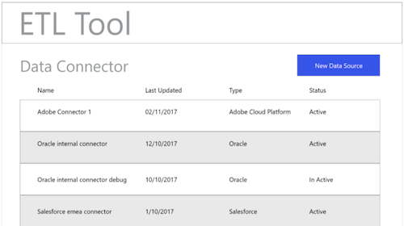

# ETL-workflow

Verschillende extractie-, transformatie- en laadprogramma&#39;s (ETL) verschillen mogelijk in indeling, maar de meeste van deze gereedschappen bieden vergelijkbare functionaliteit als hulpmiddel bij het combineren van meerdere gegevensbronnen.

## Voorbeeld van het gereedschap ETL

De volgende diagrammen verstrekken mock-ups van gemeenschappelijke acties ETL en een generische gebruikerservaring die op standaardinteractie wordt gebaseerd. Deze afbeeldingen kunnen eenvoudig worden aangepast voor een specifieke ETL-gebruikerservaring.

De hieronder weergegeven acties worden beschreven in de stappen die worden beschreven in de [ETL Integration Guide](home.md). In sommige stappen wordt verwezen naar specifieke figuren, in andere worden vergelijkbare acties beschreven als in de hier weergegeven workflow.

### Afbeelding 1 - Nieuwe Adobe Experience Platform-aansluiting configureren:

### Afbeelding 2 - Experience Platform Connector geactiveerd:

### Afbeelding 3 - Gebruikersinterface voor ETL-transformatiebeheer:

### Afbeelding 4 - Nieuwe transformatie-interface, selecteren Verbinding met ervaringsplatform:

### Figuur 5 - het doorbladeren voor de Datasets van het Platform van de bronErvaring:

### Figuur 6 - Metagegevens en steekproefgegevens van de Dataset in ETL UI:

### Figuur 7 - het bekijken van de informatie van het gebiedsschema van Datasets:

### Figuur 8 - het voorvertonen van gegevens van Datasets:

### Figuur 9 - De parameters van de gegevenssynchronisatie voor de verrichting van de transformatie bepalen:

### Figuur 10 - het bepalen van de het doelDataset van de Gegevens van de Ervings van het Model (XDM):

### Afbeelding 11 - De hiërarchische XDM-schema&#39;s en -metagegevens weergeven voor ondersteuning van toewijzingen/transformaties:

### Afbeelding 12 - De transformaties opslaan en uitvoeren/plannen:

