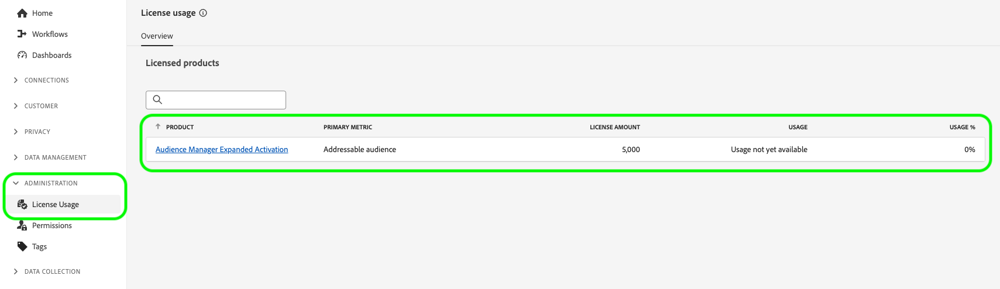

# Accountbeheer

Als u een publiek van de Audience Manager wilt innemen en dit wilt activeren naar sociale en advertentiedoelen, moet u eerst een uitgebreide gebruikersaccount voor activering maken en het account toewijzen aan de juiste machtigingsrol.

Op deze pagina wordt uitgelegd hoe u een gebruikersaccount in de Admin Console maakt en de juiste machtigingen voor Uitgebreide activering toewijst.

## Gebruikersaccounts maken {#create-users}

Voordat u [!DNL Audience Manager Expanded Activation] kunt gebruiken, moet u een gebruikersaccount maken.

Om een gebruikersrekening voor [!DNL Expanded Activation] tot stand te brengen, volg de instructies op het leiden van gebruikers van de [&#x200B; Adobe Admin Console &#x200B;](https://helpx.adobe.com/nl/enterprise/using/manage-users-individually.html) documentatie.

## Gebruikers toevoegen aan machtigingsrol {#permissions}

Nadat u een gebruikersaccount hebt gemaakt, moet u deze toevoegen aan de machtigingsrol [!DNL Expanded Activation] in de gebruikersinterface van [!DNL Expanded Activation] .

Ga naar **[!UICONTROL Administration]** -> **[!UICONTROL Permissions]** -> **[!UICONTROL Roles]** en selecteer de **[!UICONTROL Expanded Activation Default Role]** .

Ga naar de tab **[!UICONTROL Users]** en selecteer **[!UICONTROL Add Users]** .

Selecteer de nieuwe gebruiker in de beschikbare lijst en selecteer **[!UICONTROL Save]** .

De gebruikersaccount wordt nu gemaakt en toegewezen aan de juiste rol. Het is nu klaar om de gebruikersinterface van **[!UICONTROL Expanded Activation]** te openen.

## Licentiegebruik controleren {#license-usage}

Uw [!DNL Audience Manager Expanded Activation] -contract geeft het maximum aantal gehashte e-mails aan dat u kunt invoeren voor uw account.

U vindt deze informatie op de pagina **[!UICONTROL Administration]** -> **[!UICONTROL License Usage]** .

Op deze pagina kunt u de volgende informatie vinden:

* **[!UICONTROL Product]**: Het Adobe product waarvoor u een licentie hebt. Dit zal altijd **[!UICONTROL Audience Manager Expanded Activation]** zijn.
* **[!UICONTROL Primary metric]**: De naam van de metrische waarde die voor gebruik wordt bijgehouden. Dit zal altijd **[!UICONTROL Addressable audience]** zijn.
* **[!UICONTROL License amount]**: Het maximumaantal gehashte e-mails dat u mag invoeren.

  >[!TIP]
  >
  >U neemt gehakte e-mails door de [&#x200B; bronschakelaar van de Audience Manager &#x200B;](../sources/connectors/adobe-applications/audience-manager.md) op. Zie de documentatie op [&#x200B; hoe te om publiek &#x200B;](activate-audiences.md) voor meer details te activeren.

* **[!UICONTROL Usage]**: het aantal gehakte e-mails dat u hebt gegeten.
* **[!UICONTROL Usage %]**: het percentage van het licentiebedrag dat u hebt gebruikt.

Meer over vergunningsgebruik in Experience Platform leren, zie de [&#x200B; documentatie van het vergunningsgebruik &#x200B;](../dashboards/guides/license-usage.md).

## Volgende stappen {#next-steps}

Nu u minstens één gebruikersrekening met de correcte toegang tot Uitgebreide Activering hebt gevormd, kunt u beginnen de rekening te gebruiken om publiek [&#128279;](activate-audiences.md) te activeren.
