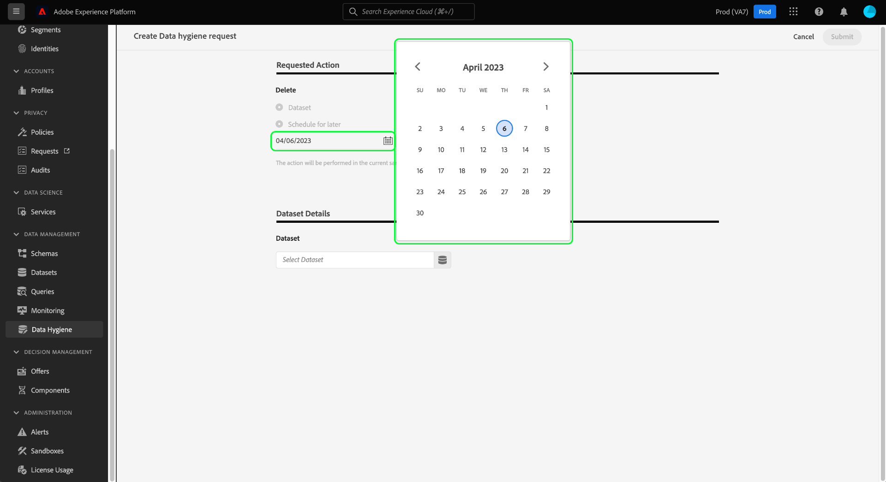

# Verlopen gegevenssets beheren

>[!IMPORTANT]
>
>De mogelijkheden voor gegevenshygiëne in Adobe Experience Platform zijn momenteel alleen beschikbaar voor organisaties die een gezondheidsschild hebben aangeschaft.

De [[!UICONTROL Data Hygiene] werkruimte](./overview.md) in Adobe Experience Platform UI staat u toe om een datasetvervaldatum te plannen. Wanneer een dataset zijn vervaldatum bereikt, beginnen het gegevens meer, de Dienst van de Identiteit, en het Profiel van de Klant in real time afzonderlijke processen om de inhoud van de dataset uit hun respectieve diensten te verwijderen. Zodra de gegevens van alle drie de diensten worden geschrapt, wordt de vervaldatum duidelijk volledig.

>[!WARNING]
>
>Als een dataset wordt geplaatst om te verlopen, moet u om het even welke gegevensstromen manueel veranderen die gegevens in die dataset kunnen opnemen zodat uw stroomafwaartse werkschema&#39;s niet negatief worden beïnvloed.

Dit document behandelt hoe te om datasettermijnen in de UI van het Platform te plannen en te beheren.

## Een gegevensset plannen die vervalt

Als u een nieuwe aanvraag wilt maken, selecteert u **[!UICONTROL Create request]** van de hoofdpagina in de werkruimte.

![Afbeelding die de [!UICONTROL Create request] knop die wordt geselecteerd](../images/ui/ttl/create-request-button.png)

<!-- The request creation dialog appears. Under the **[!UICONTROL Action]** section, select **[!UICONTROL Dataset]** to update the available controls for dataset expiration scheduling-->

### Selecteer een datum en een dataset

Het dialoogvenster Aanvragen wordt geopend. Onder de **[!UICONTROL Action]** selecteert u een datum waarop de gegevensset moet worden verwijderd. U kunt de datum handmatig invoeren (in de notatie `mm/dd/yyyy`) of selecteer het kalenderpictogram () om de datum in een dialoogvenster te selecteren.

Volgende, onder **[!UICONTROL Dataset Details]**, selecteert u het databasepictogram () om een dialoogvenster voor de selectie van gegevenssets te openen. Kies een dataset in de lijst waarop u de vervaldatum wilt toepassen en selecteer **[!UICONTROL Done]**.

>[!NOTE]
>
>Alleen gegevenssets die tot de huidige sandbox behoren, worden weergegeven.

### De aanvraag verzenden

Nadat u een gegevensset en een vervaldatum hebt geselecteerd, selecteert u **[!UICONTROL Submit]**.

![Afbeelding die de [!UICONTROL Submit] knop die wordt geselecteerd](../images/ui/ttl/submit.png)

U wordt gevraagd de datum te bevestigen dat de dataset door zal worden geschrapt. Selecteren **[!UICONTROL Submit]** om door te gaan.

Nadat het verzoek is verzonden, wordt een werkorder gemaakt en wordt deze weergegeven op het hoofdtabblad van het dialoogvenster [!UICONTROL Data Hygiene] werkruimte. Van hier, kunt u de status van de het werkorde controleren aangezien het het verzoek verwerkt.

## Een gegevensset bewerken of annuleren

Als u een gegevensset wilt bewerken of annuleren, selecteert u **[!UICONTROL Dataset]** op de belangrijkste pagina van de werkruimte, en selecteer de datasetvervaldatum van de lijst.

Op de detailspagina van de datasetvervaldatum, toont de juiste spoorstaaf controles om de geplande schrapping uit te geven of te annuleren.

## Volgende stappen

Dit document behandelde hoe te om datasettermijnen in Experience Platform UI te plannen. Om te leren hoe te om datasettermijnen te plannen gebruikend de Hygiene API van Gegevens, verwijs naar [eindpuntgids gegevensset](../api/dataset-expiration.md).
