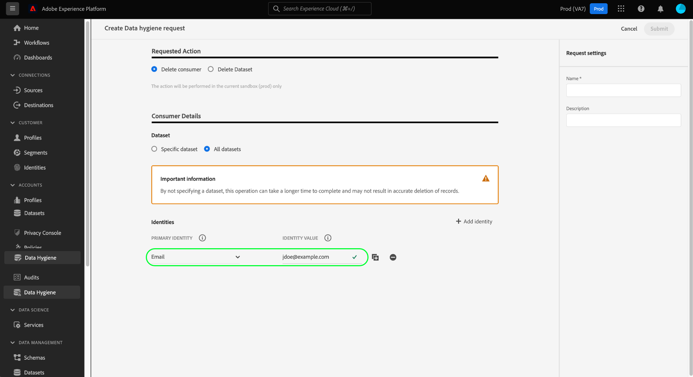

# Aanvragen voor het verwijderen van records (gebruikersinterface-workflow) {#record-delete}

Gebruik de [[!UICONTROL Data Lifecycle] werkruimte ](./overview.md) om records in Adobe Experience Platform te verwijderen op basis van hun primaire identiteit. Deze gegevens kunnen worden gekoppeld aan individuele consumenten of aan elke andere entiteit die in de identiteitsgrafiek is opgenomen.

>[!IMPORTANT]
>
>Recordverwijderingen moeten worden gebruikt voor het opschonen van gegevens, het verwijderen van anonieme gegevens of het minimaliseren van gegevens. Zij zijn **niet** om voor de verzoeken van de rechten van gegevenssubject (naleving) zoals met betrekking tot privacyverordeningen zoals de Algemene Verordening van de Bescherming van Gegevens (GDPR) te worden gebruikt. Voor alle gevallen van het nalevingsgebruik, gebruik [ Adobe Experience Platform Privacy Service ](../../privacy-service/home.md) in plaats daarvan.

## Vereisten {#prerequisites}

Voor het verwijderen van records moet u goed begrijpen hoe identiteitsvelden in Experience Platform werken. Specifiek, moet u de waarden van identiteitsnamespace van de entiteiten kennen waarvan verslagen u wilt schrappen, afhankelijk van de dataset (of datasets) u hen van schrapt.

Raadpleeg de volgende documentatie voor meer informatie over identiteiten in Experience Platform:

* [ Dienst van de Identiteit van Adobe Experience Platform ](../../identity-service/home.md): Brugshanden identiteiten over apparaten en systemen, die datasets verbinden samen op de identiteitsgebieden worden gebaseerd die door de schema&#39;s XDM worden bepaald zij met in overeenstemming zijn.
* [ Identiteit namespaces ](../../identity-service/features/namespaces.md): Identiteitsnaamruimten bepalen de verschillende soorten identiteitsinformatie die op één enkele persoon kunnen betrekking hebben, en een vereiste component voor elk identiteitsgebied zijn.
* [ Real-Time Profiel van de Klant ](../../profile/home.md): Gebruikt identiteitsgrafieken om verenigde consumentenprofielen te verstrekken die op samengevoegde gegevens van veelvoudige bronnen worden gebaseerd, in bijna-real-time wordt bijgewerkt.
* [ Model van de Gegevens van de Ervaring (XDM) ](../../xdm/home.md): Verstrekt standaarddefinities en structuren voor de gegevens van Experience Platform door het gebruik van schema&#39;s. Alle Experience Platform-gegevenssets voldoen aan een specifiek XDM-schema en het schema definieert welke velden id&#39;s zijn.
* [ de gebieden van de Identiteit ](../../xdm/ui/fields/identity.md): Leer hoe een identiteitsgebied in een XDM schema wordt bepaald.

## Een aanvraag maken {#create-request}

Selecteer **[!UICONTROL Data Lifecycle]** in de linkernavigatie van de gebruikersinterface van Experience Platform om het proces te starten. De werkruimte van [!UICONTROL Data lifecycle requests] wordt weergegeven. Selecteer vervolgens **[!UICONTROL Create request]** op de hoofdpagina in de werkruimte.

![ de [!UICONTROL Data lifecycle requests] werkruimte met [!UICONTROL Create request] geselecteerd.](../images/ui/record-delete/create-request-button.png)

De workflow voor het maken van aanvragen wordt weergegeven. Standaard is de optie **[!UICONTROL Delete record]** geselecteerd onder de sectie **[!UICONTROL Requested Action]** . Laat deze optie ingeschakeld.

>[!IMPORTANT]
> 
>Om de efficiency te verbeteren en datasetverrichtingen minder duur te maken, kunnen de organisaties die naar het formaat van Delta zijn verplaatst gegevens van de Dienst van de Identiteit, het Profiel van de Klant in real time, en het gegevenspeer schrappen. Dit type gebruiker wordt aangeduid als delta-migrated. De gebruikers van organisaties die delta-gemigreerd zijn geweest kunnen verkiezen om verslagen van of één of alle datasets te schrappen. Gebruikers van organisaties die geen delta-migratie hebben ondergaan, kunnen niet selectief records uit één gegevensset of alle gegevenssets verwijderen, zoals in de onderstaande afbeelding wordt getoond. In dit geval, blijf aan [ verstrekken identiteiten ](#provide-identities) sectie van de gids.

![ het werkschema van de verzoekverwezenlijking met de [!UICONTROL Delete record] geselecteerde en benadrukte optie.](../images/ui/record-delete/delete-record.png)

## Gegevenssets selecteren {#select-dataset}

De volgende stap is te bepalen of u verslagen van één enkele dataset of alle datasets wilt schrappen. Afhankelijk van de configuratie van uw organisatie, kan de optie van de datasetselectie niet beschikbaar zijn. Als u deze optie niet ziet, blijf aan [ verstrekken identiteiten ](#provide-identities) sectie van de gids.

Selecteer in de sectie **[!UICONTROL Record Details]** een keuzerondje om een specifieke gegevensset of alle gegevenssets te kiezen.

Om van een specifieke dataset te schrappen, selecteer **[!UICONTROL Select dataset]**, dan het gegevensbestandpictogram (). Kies in het dialoogvenster dat wordt weergegeven een gegevensset en selecteer **[!UICONTROL Done]** om te bevestigen.

![ de [!UICONTROL Select dataset] dialoog met een geselecteerde dataset en [!UICONTROL Done] benadrukte.](../images/ui/record-delete/select-dataset.png)

Selecteer **[!UICONTROL All datasets]** als u gegevens uit alle gegevenssets wilt verwijderen. Met deze optie vergroot u het bereik van de bewerking en moet u alle relevante identiteitstypen opgeven.

![ de [!UICONTROL Select dataset] dialoog met de [!UICONTROL All datasets] geselecteerde optie.](../images/ui/record-delete/all-datasets.png)

>[!WARNING]
>
>Als u **[!UICONTROL All datasets]** selecteert, wordt de bewerking uitgebreid naar alle gegevenssets in uw organisatie. Elke dataset kan een verschillend primair identiteitstype gebruiken. U moet **alle vereiste identiteitstypes** verstrekken om nauwkeurige aanpassing te verzekeren.
>
>Als een identiteitstype ontbreekt, kunnen sommige records tijdens het verwijderen worden overgeslagen. Dit kan verwerking vertragen en tot **gedeeltelijke resultaten** leiden.

Elke dataset in Experience Platform ondersteunt slechts één primair identiteitstype.

* Wanneer het schrappen van a **enige dataset**, moeten alle identiteiten in uw verzoek het **zelfde type** gebruiken.
* Wanneer het schrappen van **alle datasets**, kunt u **veelvoudige identiteitstypes** omvatten, aangezien de verschillende datasets op verschillende primaire identiteiten kunnen vertrouwen.&quot;

## Identiteiten opgeven {#provide-identities}

>[!CONTEXTUALHELP]
>id="platform_hygiene_primaryidentity"
>title="Naamruimte identiteit"
>abstract="Een naamruimte voor identiteiten is een attribuut dat een record koppelt aan het profiel van een consument in Experience Platform. Het naamruimtegebied van de identiteit voor een dataset wordt bepaald door het schema dat de dataset op gebaseerd is. In deze kolom moet u het type (of de naamruimte) opgeven voor de naamruimte van de naam van de record, zoals `email` voor e-mailadressen en `ecid` voor Experience Cloud-id&#39;s. Raadpleeg de gebruikershandleiding bij de levenscyclus van gegevens voor meer informatie."

>[!CONTEXTUALHELP]
>id="platform_hygiene_identityvalue"
>title="Primaire identiteitswaarde"
>abstract="In deze kolom, moet u de waarde voor de identiteitsnamespace van het verslag verstrekken, die met het identiteitstype moet beantwoorden dat in de linkerkolom wordt verstrekt. Als het naamruimtetype van de identiteit `email` is, moet de waarde het e-mailadres van de record zijn. Raadpleeg de gebruikershandleiding bij de gegevenslevenscyclus voor meer informatie."

Wanneer het schrappen van verslagen, moet u identiteitsinformatie verstrekken zodat kan het systeem bepalen welke verslagen moeten worden geschrapt. Voor om het even welke dataset in Experience Platform, worden de verslagen geschrapt gebaseerd op het **identiteit namespace** gebied dat door het schema van de dataset wordt bepaald.

Zoals alle identiteitsgebieden in Experience Platform, wordt een identiteit namespace samengesteld uit twee dingen: a **type** (soms bedoeld als identiteit namespace) en a **waarde**. Het identiteitstype biedt context voor de manier waarop een record in het veld wordt geïdentificeerd (bijvoorbeeld een e-mailadres). De waarde vertegenwoordigt de specifieke identiteit van een record voor dat type (bijvoorbeeld `jdoe@example.com` voor het `email` identiteitstype). Veelvoorkomende velden die als identiteiten worden gebruikt, zijn accountgegevens, apparaat-id&#39;s en cookie-id&#39;s.

>[!TIP]
>
>Als u de naamruimte voor een bepaalde gegevensset niet kent, kunt u deze vinden in de gebruikersinterface van Experience Platform. Selecteer in de werkruimte **[!UICONTROL Datasets]** de desbetreffende gegevensset in de lijst. Op de detailspagina voor de dataset, houd over de naam van het schema van de dataset in het juiste spoor. De naamruimte voor identiteit wordt samen met de naam en beschrijving van het schema weergegeven.
>
>

Er zijn twee opties om id&#39;s op te geven wanneer u records verwijdert:

* [Een JSON-bestand uploaden](#upload-json)
* [Voer handmatig primaire identiteitswaarden in](#manual-identity)

### Een JSON-bestand uploaden {#upload-json}

Als u een JSON-bestand wilt uploaden, kunt u het bestand naar het opgegeven gebied slepen. U kunt ook **[!UICONTROL Choose files]** selecteren om in de lokale map te bladeren en een bestand te selecteren.


Het JSON-bestand moet zijn opgemaakt als een array van objecten, elk object dat een identiteit vertegenwoordigt.

```json
[
  {
    "namespaceCode": "email",
    "value": "jdoe@example.com"
  },
  {
    "namespaceCode": "email",
    "value": "san.gray@example.com"
  }
]
```

| Eigenschap | Beschrijving |
| --- | --- |
| `namespaceCode` | Het identiteitstype. |
| `value` | De primaire identiteitswaarde zoals die door het type wordt aangegeven. |

Zodra het dossier wordt geupload, kunt u het verzoek [ blijven voorleggen ](#submit).

### Voer identiteiten handmatig in {#manual-identity}

Selecteer **[!UICONTROL Add identity]** als u identiteiten handmatig wilt invoeren.

![ het werkschema van de verzoekverwezenlijking met de [!UICONTROL Add identity] benadrukte optie.](../images/ui/record-delete/add-identity.png)

Er worden besturingselementen weergegeven waarmee u de identiteiten een voor een kunt invoeren. Selecteer het identiteitstype in het keuzemenu onder **[!UICONTROL identity namespace]** . Geef onder **[!UICONTROL Primary Identity Value]** de naamruimtewaarde van de identiteit op voor de record.



Om meer identiteiten toe te voegen, selecteer het plusteken ( ) naast een van de rijen of selecteer **[!UICONTROL Add identity]** .


## Quoten en verwerkingstijdlijnen {#quotas}

Aanvragen voor het verwijderen van records zijn onderworpen aan dagelijkse en maandelijkse indieningslimieten voor id&#39;s, die worden bepaald door de licentierechten van uw organisatie. Deze limieten gelden voor verwijderingsaanvragen voor zowel de gebruikersinterface als de API.

>[!NOTE]
>
>U kunt tot **1.000.000 herkenningstekens per dag** voorleggen, maar slechts als uw resterende maandquotum het toestaat. Als uw maandelijks maximum minder dan 1 miljoen bedraagt, kan uw dagelijkse inzending die limiet niet overschrijden.

### Maandelijkse indieningstoeslagrechten per product {#quota-limits}

In de onderstaande tabel worden de indieningslimieten voor id&#39;s per product en machtigingsniveau weergegeven. Voor elk product is de maandelijkse limiet de laagste van twee waarden: een vast identificatieplafond of een op percentage gebaseerde drempel die is gekoppeld aan uw gelicentieerde gegevensvolume.

| Product | Beschrijving van rechten | Maandelijkse limiet (Welke lager is) |
|----------|-------------------------|---------------------------------|
| Real-Time CDP of Adobe Journey Optimizer | Zonder &#39;Privacy and Security Shield&#39; of &#39;Healthcare Shield Add-on&#39; | 2.000.000 ID&#39;s of 5% van het adresseerbare publiek |
| Real-Time CDP of Adobe Journey Optimizer | Met privacy- en beveiligingsschild of de invoegtoepassing Gezondheidsschild | 15.000.000 id&#39;s of 10% van het adresseerbare publiek |
| Customer Journey Analytics | Zonder &#39;Privacy and Security Shield&#39; of &#39;Healthcare Shield Add-on&#39; | 2.000.000 ID&#39;s of 100 ID&#39;s per miljoen CJA rijen met rechten |
| Customer Journey Analytics | Met privacy- en beveiligingsschild of de invoegtoepassing Gezondheidsschild | 15.000.000 ID&#39;s of 200 ID&#39;s per miljoen CJA rijen met rechten |

>[!NOTE]
>
> De meeste organisaties zullen lagere maandelijkse grenzen hebben die op hun werkelijk adresseerbare publiek of de rijaanspraken van CJA worden gebaseerd.

De quota zijn opnieuw ingesteld op de eerste dag van elke kalendermaand. Ongebruikte quota **niet** draagt over.

>[!NOTE]
>
>De quota&#39;s zijn gebaseerd op de vergunning gegeven maandelijkse bevoegdheid van uw organisatie voor **voorgelegde herkenningstekens**. Deze worden niet afgedwongen door systeemtrails, maar kunnen worden gecontroleerd en herzien.
>
>De Schrapping van het verslag is a **gedeelde dienst**. Uw maandelijkse limiet weerspiegelt de hoogste rechten voor Real-Time CDP, Adobe Journey Optimizer, Customer Journey Analytics en alle toepasselijke add-ons voor schild.

### Tijdlijnen verwerken voor id-verzending {#sla-processing-timelines}

Na verzending worden aanvragen voor het verwijderen van records in de wachtrij geplaatst en verwerkt op basis van uw machtigingsniveau.

| Beschrijving van product en rechten | Duur wachtrij | Maximale verwerkingstijd (SLA) |
|------------------------------------------------------------------------------------|---------------------|-------------------------------|
| Zonder &#39;Privacy and Security Shield&#39; of &#39;Healthcare Shield Add-on&#39; | Tot 15 dagen | 30 dagen |
| Met privacy- en beveiligingsschild of de invoegtoepassing Gezondheidsschild | Doorgaans 24 uur | 15 dagen |

Als uw organisatie hogere limieten nodig heeft, neemt u contact op met uw Adobe-vertegenwoordiger voor een beoordeling van uw rechten.

>[!TIP]
>
>Om uw huidige quotagebruik of machtigingsrij te controleren, zie de [ gids van de de verwijzingsverwijzing van de Quota ](../api/quota.md).

## De aanvraag verzenden {#submit}

Nadat u de gewenste id&#39;s aan de aanvraag hebt toegevoegd, voert u onder **[!UICONTROL Request settings]** een naam en een optionele beschrijving voor de aanvraag in voordat u **[!UICONTROL Submit]** selecteert.

>[!TIP]
>
>U kunt maximaal 10.000 identiteiten per verzoek indienen via de interface. Om grotere volumes (tot 100.000 IDs per verzoek) voor te leggen, gebruik de [ API methode ](../api/workorder.md#create).

![ het verzoek plaatst [!UICONTROL Name] en [!UICONTROL Description] gebieden met [!UICONTROL Submit] benadrukt.](../images/ui/record-delete/submit.png)

Er wordt een dialoogvenster [!UICONTROL Confirm request] weergegeven waarin wordt aangegeven dat de identiteiten niet kunnen worden hersteld nadat ze zijn verwijderd. Selecteer **[!UICONTROL Submit]** om de lijst met identiteiten te bevestigen waarvan u de gegevens wilt verwijderen.

![ de [!UICONTROL Confirm request] dialoog.](../images/ui/record-delete/confirm-request.png)

Nadat de aanvraag is verzonden, wordt een werkorder gemaakt en wordt deze weergegeven op het tabblad [!UICONTROL Record] van de werkruimte van [!UICONTROL Data Lifecycle] . Van hier, kunt u de status van de het werkorde controleren aangezien het het verzoek verwerkt.

>[!NOTE]
>
>Verwijs naar de overzichtssectie op [ chronologie en transparantie ](../home.md#record-delete-transparency) voor details op hoe het verslag schrapt wordt verwerkt zodra zij worden uitgevoerd.

![ het [!UICONTROL Record] lusje van de [!UICONTROL Data Lifecycle] werkruimte met het nieuwe benadrukte verzoek.](../images/ui/record-delete/request-log.png)

## Gegevens verwijderen uit gegevenssets die zijn gebaseerd op relationele schema&#39;s {#relational-record-delete}

Als de dataset u van schrapt op een relationeel schema gebaseerd is, herzie de volgende overwegingen om ervoor te zorgen de verslagen correct worden verwijderd en niet opnieuw worden opgenomen wegens wanverhoudingen tussen Experience Platform en uw bronsysteem.

### gedrag voor verwijderen van records

In de volgende tabel wordt beschreven hoe recordverwijderingen zich gedragen in Experience Platform en bronsystemen, afhankelijk van de innamemethode en de configuratie voor het vastleggen van gegevens.

| Verhouding | Gedrag |
|---------------------|--------------------------------------------------------------------------|
| Platformverwijdering | Records worden verwijderd uit de dataset en het data-meer van Experience Platform. |
| Bewaartermijn Source | De verslagen blijven in het bronsysteem tenzij uitdrukkelijk geschrapt daar. |
| Volledige vernieuwingsinvloed | Als u volledig vernieuwt gebruikt, kunnen verwijderde records opnieuw worden ingepakt, tenzij ze uit de bron zijn verwijderd of uitgesloten. |
| Gedrag voor gegevensvastlegging wijzigen | Records die zijn gemarkeerd met `_change_request_type = 'd'` , worden tijdens de opname verwijderd. U kunt records zonder vlag opnieuw invoegen. |

Als u wilt voorkomen dat bestanden opnieuw worden ingevoerd, past u dezelfde verwijderingsmethode toe in zowel uw bronsysteem als Experience Platform, door records van beide systemen te verwijderen of door `_change_request_type = 'd'` op te nemen voor records die u wilt verwijderen.

### Kolommen voor vastleggen en besturen van gegevens wijzigen

Relationele schema&#39;s die Bronnen gebruiken met de vangst van veranderingsgegevens kunnen de `_change_request_type` controlekolom gebruiken wanneer het onderscheiden schrapt van upserts. Tijdens opname worden records die zijn gemarkeerd met `d` verwijderd uit de gegevensset, terwijl records die zijn gemarkeerd met `u` of zonder kolom, worden behandeld als invoegtoepassingen. De kolom `_change_request_type` wordt alleen gelezen bij invoer en wordt niet opgeslagen in het doelschema of toegewezen aan XDM-velden.

>[!NOTE]
>
>Het verwijderen van records via de interface van de gegevenslevenscyclus heeft geen invloed op het bronsysteem. Als u gegevens van beide locaties wilt verwijderen, verwijdert u deze zowel in Experience Platform als in de bron.

### Aanvullende verwijderingsmethoden voor relationele schema&#39;s

Naast de standaard werkstroom voor het verwijderen van records ondersteunen relationele schema&#39;s aanvullende methoden voor specifieke gebruiksgevallen:

* **Veilige-exemplaardatasetbenadering**: Dupliceer de productieset en pas schrappingen op het exemplaar voor gecontroleerd testen of verzoening toe alvorens veranderingen op productiegegevens toe te passen.
* **schrapt-slechts partijupload**: Upload een dossier dat slechts schrappingsverrichtingen voor gerichte hygiëne bevat wanneer u specifieke verslagen moet verwijderen zonder andere gegevens te beïnvloeden.

### Beschrijvende steun voor hygiënische activiteiten {#descriptor-support}

Relationele schemabeschrijvingen verstrekken essentiële meta-gegevens voor nauwkeurige hygiëneverrichtingen:

* **Primaire zeer belangrijke beschrijver**: Identificeert verslagen uniek voor gerichte updates of schrapt, die ervoor zorgen dat de correcte verslagen worden beïnvloed.
* **beschrijver van de Versie**: Verzekert schrapt en de updates zijn van toepassing in de correcte chronologische orde, die uit-van-opeenvolgingsverrichtingen verhinderen.
* **de beschrijver van de tijdstempel (tijd-reeksen schema&#39;s)**: Lijnt schrapt verrichtingen met de tijden van gebeurtenisvoorkomen eerder dan ingangstijden uit.

>[!NOTE]
>
>Hygiëne-processen werken op het niveau van de gegevensset. Voor voor profielen geschikte datasets, kunnen de extra profielwerkschema&#39;s worden vereist om consistentie over het profiel van de Klant in real time te handhaven.

### Geplande retentie voor relationele schema&#39;s

Voor geautomatiseerde hygiëne die op gegevensleeftijd eerder dan specifieke identiteiten wordt gebaseerd, zie [ het behoud van de dataset van de Gebeurtenis van de Ervaring beheren (TTL) ](../../catalog/datasets/experience-event-dataset-retention-ttl-guide.md) voor geplande rij-vlakke behoud in het gegevensmeer.

>[!NOTE]
>
>Vervaldatum op rijniveau wordt alleen ondersteund voor gegevenssets die het gedrag van tijdreeksen gebruiken.

### Aanbevolen procedures voor het verwijderen van relationele records

Om onbedoelde heropname te voorkomen en de consistentie van de gegevens in de verschillende systemen te handhaven, volgt u de volgende aanbevolen procedures:

* **Coördinaat schrappingen**: Lijn verslagschrappingen met uw configuratie van de vangst van veranderingsgegevens en brongegevensbeheerstrategie uit.
* **de veranderingsgegevens van de Monitor vangen stromen**: Na het schrappen van verslagen in Platform, controleert dataflows en bevestigt dat het bronsysteem of de zelfde verslagen verwijdert of hen met `_change_request_type = 'd'` omvat.
* **Schoon de bron** op: Voor bronnen die volledig gebruiken verfrist opname of die die niet steunen schrapt door veranderingsgegevens vangen, schrapt direct verslagen van het bronsysteem om re-ingestie te vermijden.

Voor meer details op schemavereisten, zie [ vereisten van de relationele schemabeschrijver ](../../xdm/schema/relational.md#relational-schemas).

Leren hoe de veranderingsgegevens werken met bronnen vangen, zie [ veranderingsgegevens toelaten vangen in bronnen ](../../sources/tutorials/api/change-data-capture.md#using-change-data-capture-with-relational-schemas).

## Volgende stappen

In dit document wordt beschreven hoe records in de gebruikersinterface van Experience Platform kunnen worden verwijderd. Voor informatie over hoe te om andere het beheerstaken van de gegevenslevenscyclus in UI uit te voeren, verwijs naar het [ overzicht UI van de Levenscyclus van Gegevens ](./overview.md).

Leren hoe te om verslagen te schrappen gebruikend de Hygiëne API van Gegevens, verwijs naar de [ gids van het het ordeeindpunt van het werk ](../api/workorder.md).
