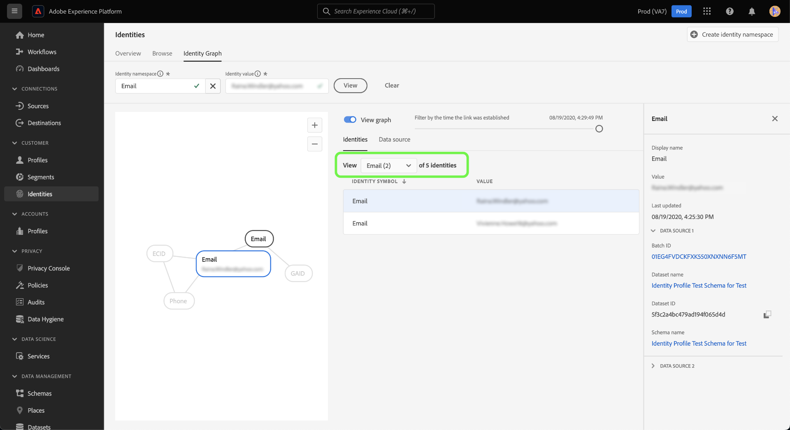
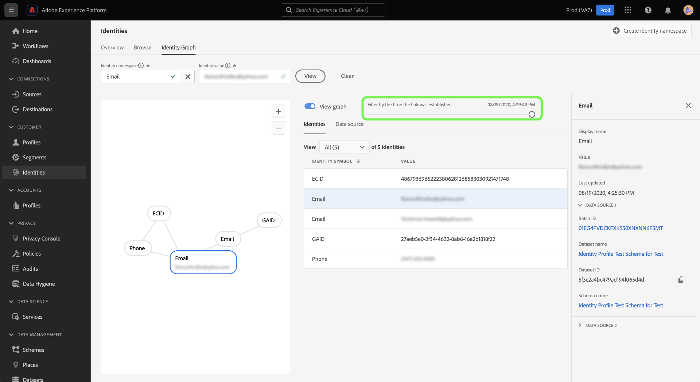

# Naamgrafiekviewer

Een identiteitsgrafiek is een kaart van verhoudingen tussen verschillende identiteiten voor een bepaalde klant, die u van een visuele vertegenwoordiging van voorziet hoe uw klant met uw merk over verschillende kanalen interactie aangaat. Alle grafieken van de klantenidentiteit worden collectief beheerd en door de Dienst van de Identiteit van Adobe Experience Platform in bijna real time bijgewerkt, in antwoord op klantenactiviteit.

Met de viewer voor identiteitsgrafieken in de gebruikersinterface van Platform kunt u visualiseren en beter begrijpen welke klantenidentiteiten aan elkaar zijn gekoppeld en op welke manieren. Met de viewer kunt u naar verschillende delen van de grafiek slepen en hiermee communiceren, zodat u complexe identiteitsrelaties kunt onderzoeken, efficiënter kunt werken en kunt profiteren van meer transparantie bij het gebruik van informatie.

In het volgende document worden stappen beschreven voor het openen en gebruiken van de viewer voor identiteitsgrafieken in de interface van het platform.

## Video over zelfstudie

De volgende video is bedoeld als ondersteuning voor uw begrip van de viewer voor identiteitsgrafieken.

>[!VIDEO](https://video.tv.adobe.com/v/331030/?quality=12&learn=on)

## Aan de slag

Als u met de viewer voor identiteitsgrafieken werkt, moet u de verschillende betrokken Adobe Experience Platform-services begrijpen. Voordat u begint te werken met de identiteitsgrafiekviewer, raadpleegt u de documentatie voor de volgende services:

- [[!DNL Identity Service]](../home.md): verbeter een beter beeld van individuele klanten en hun gedrag door identiteiten over apparaten en systemen te overbruggen.
- [ Real-Time Profiel van de Klant ](../../profile/home.md): De grafieken van de Identiteit worden leveraged door het Profiel van de Klant in real time om een uitvoerige en enige mening van uw klantenattributen en gedrag tot stand te brengen.

### Terminologie

- **Identiteit (knoop):** Een identiteit of een knoop is gegevens uniek aan een entiteit, typisch een persoon. Een identiteit bestaat uit een naamruimte voor identiteiten en een identiteitswaarde. Bijvoorbeeld, zou een volledig gekwalificeerde identiteit uit een identiteit kunnen bestaan namespace voor **E-mail**, gecombineerd met een identiteitswaarde van **beroeps @email.com**.
- **Verbinding (rand):** Een verbinding of een rand vertegenwoordigt de verbinding tussen identiteiten. Identiteitskoppelingen bevatten eigenschappen zoals voor het eerst ingestelde en laatst bijgewerkte tijdstempels. De eerste vastgestelde tijdstempel definieert de datum en het tijdstip waarop een nieuwe identiteit aan een bestaande identiteit is gekoppeld. De laatste bijgewerkte tijdstempel definieert de datum en tijd waarop een bestaande identiteitskoppeling voor het laatst is bijgewerkt.
- **Grafiek (cluster):** Een grafiek of een cluster is een groep identiteiten en verbindingen die een persoon vertegenwoordigen.

## De viewer voor identiteitsgrafieken openen {#access-identity-graph-viewer}

Selecteer in de gebruikersinterface van het platform **[!UICONTROL Identities]** in de linkernavigatie en selecteer vervolgens **[!UICONTROL Identity Graph]** in de lijst met tabbladen in de koptekst.

Als u een identiteitsgrafiek wilt weergeven, geeft u een naamruimte en de bijbehorende waarde op en selecteert u **[!UICONTROL View]** .

>[!TIP]
>
>Selecteer het lijstpictogram  om een paneel met een lijst van alle identiteit te zien namespaces beschikbaar in uw organisatie. U kunt alle naamruimten gebruiken zolang er een geldige identiteitswaarde aan is gekoppeld. Voor meer informatie, lees de [ gids van de identiteitsnaamruimte ](./namespaces.md).

## De interface van de identiteitsgrafiekviewer

De interface van de identiteitsgrafiekviewer bestaat uit verschillende elementen die u kunt gebruiken om te communiceren met en uw identiteitsgegevens beter te begrijpen.

In de identiteitsgrafiek worden alle identiteiten weergegeven die zijn gekoppeld aan de naamruimte en de waardecombinatie die u hebt ingevoerd. Elk knooppunt bestaat uit een naamruimte van een identiteit en de bijbehorende waarde. U kunt elk knooppunt selecteren, vasthouden en slepen om te communiceren met de grafiek. Alternatief, kunt u over een knoop bewegen om informatie over zijn overeenkomstige identiteitswaarde te zien. Selecteer **[!UICONTROL View graph]** om de grafiek te verbergen of weer te geven.

>[!IMPORTANT]
>
>Voor een identiteitsgrafiek moeten minimaal twee gekoppelde identiteiten worden gegenereerd en moet een geldige naamruimte en waardecombinatie worden gegenereerd. Het maximumaantal identiteiten dat de grafiekviewer kan weergeven, is 50. Zie de [ bijlage ](#appendix) sectie hieronder voor meer informatie.

Selecteer een koppeling in de grafiek om de gegevensset en batch-id weer te geven die bijdragen aan die koppeling. Als u een koppeling selecteert, wordt ook het rechterspoor bijgewerkt en krijgt u meer informatie over de gegevensbrondetails en over eigenschappen zoals de eerste vastgestelde en laatst bijgewerkte tijdstempels.

De tabel [!UICONTROL Identities] biedt een andere weergave van uw identiteitsgegevens, waarin de naamruimte en de combinatie van identiteitswaarden in een tabelindeling worden weergegeven. Als u een knooppunt in de grafiek selecteert, wordt het gemarkeerde regelitem in de tabel [!UICONTROL Identities] bijgewerkt.

Gebruik het vervolgkeuzemenu om de grafiekgegevens te sorteren en informatie over een specifieke naamruimte te markeren. Selecteer bijvoorbeeld **[!UICONTROL Email]** in het menu om gegevens weer te geven die specifiek zijn voor de naamruimte van de e-mailidentiteit.

In de rechtertrack wordt informatie over een geselecteerde identiteit weergegeven, inclusief de laatste bijgewerkte tijdstempel. De juiste spoorstaaf toont ook informatie over de gegevensbron die met de geselecteerde identiteit, met inbegrip van zijn partij ID, datasetnaam, dataset identiteitskaart, en schemanaam beantwoordt.

De volgende tabel bevat aanvullende informatie over de eigenschappen van de gegevensbron die in de rechterspoorstaaf worden weergegeven:

| Gegevensbron | Beschrijving |
| --- | --- | 
| Batch-id | De automatisch gegenereerde id die overeenkomt met uw batchgegevens. |
| Dataset-id | De automatisch gegenereerde id die overeenkomt met uw gegevensset. |
| Naam gegevensset | De naam van de dataset die uw partijgegevens bevat. |
| Schemanaam | De naam van het schema. Het schema biedt een set regels die de structuur en indeling van gegevens vertegenwoordigen en valideren. |

U kunt de *[!UICONTROL Data source]* ook gebruiken om een lijst met gegevensbronnen weer te geven die een bijdrage leveren aan uw identiteiten. Selecteer [!UICONTROL Data source] voor een tabelweergave van uw gegevenssets en batch-id&#39;s.

Gebruik de schuifregelaar om grafiekgegevens te filteren op het tijdstip waarop de identiteiten voor het eerst zijn vastgesteld. Standaard worden in de viewer voor identiteitsgrafieken alle identiteiten weergegeven die in de grafiek zijn gekoppeld. Houd de schuifregelaar ingedrukt en sleep deze om de tijd aan te passen aan de laatste tijdstempel waarbij een nieuwe identiteit aan de grafiek is gekoppeld. In het onderstaande voorbeeld wordt in de grafiek weergegeven dat de meest recente identiteitskoppeling (GAID) is ingesteld op **[!UICONTROL 08/19/2020, 4:29:29 PM]** .

Pas de schuifregelaar aan om te zien of er een andere identiteitskoppeling (e-mail) is gemaakt op **[!UICONTROL 08/19/2020, 4:25:30 PM]** .

U kunt de schuifregelaar ook aanpassen om de oudste herhaling van de grafiek te zien. In het onderstaande voorbeeld wordt in de viewer voor identiteitsgrafieken weergegeven dat de grafiek voor het eerst is gemaakt op **[!UICONTROL 08/19/2020, 4:11:49 PM]** . De eerste koppelingen zijn ECID, Email en Phone.

## Bijlage

In de volgende sectie vindt u aanvullende informatie over het werken met de viewer voor identiteitsgrafieken.

### Foutberichten begrijpen

Er kunnen fouten optreden wanneer u de viewer voor identiteitsgrafieken opent. Hieronder volgt een lijst met voorwaarden en beperkingen waarmee u rekening kunt houden wanneer u werkt met de viewer voor identiteitsgrafieken.

- De geselecteerde naamruimte moet een identiteitswaarde bevatten.
- Voor het genereren van de identiteitsgrafiekviewer zijn minimaal twee gekoppelde identiteiten vereist. Het is mogelijk dat er slechts één identiteitswaarde en geen verbonden identiteiten zijn, en in dit geval, zou de waarde slechts in [!DNL Profile] kijker bestaan.
- De viewer voor identiteitsgrafieken kan het maximum van 50 identiteiten niet overschrijden.

### Toegang tot de kijker van de identiteitsgrafiek van datasets

U kunt tot de kijker van de identiteitsgrafiek ook toegang hebben gebruikend de datasetinterface. Selecteer op de pagina datasets [!UICONTROL Browse] een dataset waarmee u wilt communiceren en selecteer vervolgens **[!UICONTROL Preview dataset]**

Selecteer in het voorvertoningsvenster een vingerafdrukpictogram om de identiteiten weer te geven die door de viewer voor identiteitsgrafieken worden weergegeven.

>[!TIP]
>
>Het vingerafdrukpictogram wordt alleen weergegeven als de gegevensset twee of meer identiteiten heeft.

## Volgende stappen

Door dit document te lezen, hebt u geleerd hoe u de identiteitsgrafieken van uw klanten in de interface van het Platform kunt verkennen. Voor meer informatie over identiteiten in Platform, gelieve te verwijzen naar het [ overzicht van de Dienst van de Identiteit ](../home.md)

## Changelog

| Datum | Actie |
| ---- | ------ |
| 01-2021 | <ul><li>Toegevoegde ondersteuning voor het streamen van ingesloten gegevens en niet-productiesandbox.</li><li>Kleine oplossingen voor problemen.</li></ul> |
| 02-2021 | <ul><li>De de grafiekkijker van de identiteit wordt toegankelijk gemaakt door datasetvoorproef.</li><li>Kleine oplossingen voor problemen.</li><li>De viewer voor identiteitsgrafieken is algemeen beschikbaar.</li></ul> |
| 2023-01 | <ul><li>UI-updates.</li></ul> |
