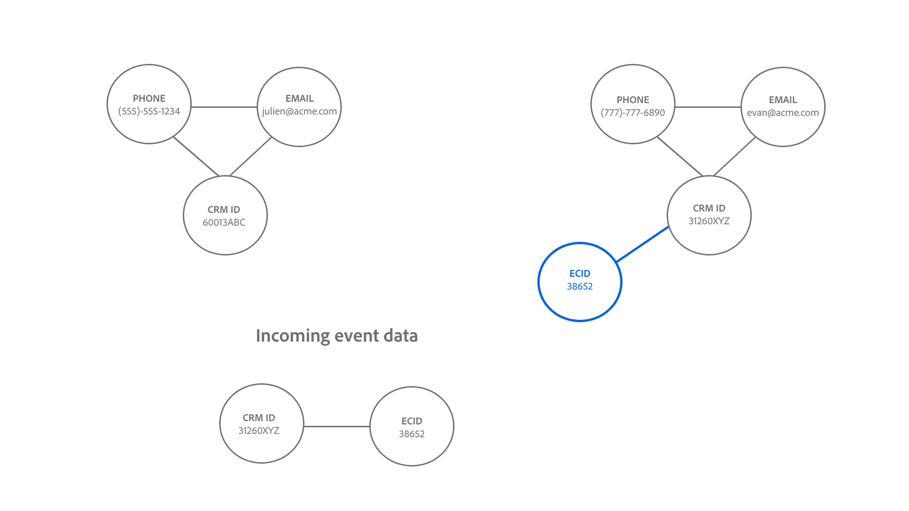

# Identity Service linking-logica

Er wordt een koppeling tussen twee identiteiten tot stand gebracht wanneer de naamruimte van de identiteit en de identiteitswaarden overeenkomen.

Er zijn twee soorten identiteiten die aan elkaar worden gekoppeld:

* **verslagen van het Profiel**: Deze identiteiten komen gewoonlijk van de systemen van CRM.
* **Gebeurtenissen van de Ervaring**: Deze identiteiten komen gewoonlijk uit implementatie WebSDK of de bron van Adobe Analytics.

## Semantische betekenis van het tot stand brengen van verbindingen

Een identiteit vertegenwoordigt een echte entiteit. Als er een verband tussen twee identiteiten is vastgesteld, betekent dit dat de twee identiteiten aan elkaar zijn gekoppeld. Hieronder volgen enkele voorbeelden die dit concept illustreren:

| Actie | Koppelingen tot stand gebracht | Betekenis |
| --- | --- | --- |
| Een eindgebruiker meldt zich aan gebruikend een computer. | CRMID en ECID zijn aan elkaar gekoppeld. | Een persoon (CRMID) heeft een apparaat met een browser (ECID). |
| Een eindgebruiker bladert anoniem met een iPhone. | IDFA is gekoppeld aan ECID. | Het Apple-hardwareapparaat (IDFA), zoals een iPhone, is gekoppeld aan de browser (ECID). |
| Een eindgebruiker meldt zich aan gebruikend Google Chrome, en toen Firefox. | CRMID is gekoppeld aan twee verschillende ECID&#39;s. | Een persoon (CRMID) wordt geassocieerd aan 2 Webbrowsers (**Nota**: Elke browser zal zijn eigen ECID hebben). |
| Een gegevensingenieur neemt een verslag van CRM op dat twee gebieden duidelijk als identiteit omvat: CRMID en E-mail. | CRMID en e-mail zijn gekoppeld. | Een persoon (CRMID) is gekoppeld aan het e-mailadres. |

## Understanding the Identity Service linking logic

Een identiteit bestaat uit een naamruimte van een identiteit en een identiteitswaarde.

* Een naamruimte voor identiteit is de context van een bepaalde identiteitswaarde die moet worden gebruikt. Veelvoorkomende voorbeelden van naamruimten zijn CRMID, Email en Phone.
* Een identiteitswaarde is de tekenreeks die een echte entiteit vertegenwoordigt. Bijvoorbeeld: &quot;julien @acme.com&quot;kan een identiteitswaarde voor een E-mailnamespace en 555-555-1234 kunnen een overeenkomstige identiteitswaarde voor een Telefoon namespace zijn.

>[!TIP]
>
>Naamruimte is belangrijk omdat zonder naamruimte de identiteitswaarde zijn context verliest en niet genoeg informatie heeft om identiteiten met succes aan te passen.

Zie de volgende diagrammen voor een visuele vertegenwoordiging van hoe de Dienst die van de Identiteit verbindt logica werkt:

>[!BEGINTABS]

>[!TAB  Bestaande grafiek ]

Stel dat u een bestaande identiteitsgrafiek hebt met drie gekoppelde identiteiten:

* PHONE:(555)-555-1234
* E-MAIL:julien@acme.com
* CRMID:60013ABC

>[!TAB  Binnenkomende gegevens ]

Een paar identiteiten worden opgenomen in uw grafiek en dit paar bevat:

* CRMID:60013ABC
* ECID:100066526

>[!TAB  Bijgewerkte grafiek ]

De Dienst van de identiteit erkent dat CRMID:60013ABC reeds binnen uw grafiek bestaat, en zo slechts verbindt nieuwe ECID

>[!ENDTABS]

## Klantenscenario

U bent gegevensingenieur en u neemt de volgende dataset van CRM (het verslag van het Profiel) aan Experience Platform op.

| CRMID* | Telefoon* | E-mail* | Voornaam | Achternaam |
| --- | --- | --- | --- | --- |
| 60013ABC | 555-555-1234 | julien@acme.com | Julien | Smith |
| 31260XYZ | 777-777-6890 | evan@acme.com | Evan | Smith |

>[!NOTE]
>
>* `**` - Denotes-veld dat is gemarkeerd als primaire identiteit.
>* `*` - Denotes-veld dat is gemarkeerd als secundaire identiteit.
>
>Identiteitsdienst maakt geen onderscheid tussen primaire en secundaire identiteit. Zolang een veld is gemarkeerd als een identiteit, wordt het veld ingesloten bij Identiteitsservice.

U hebt WebSDK ook uitgevoerd en een dataset WebSDK (de Gebeurtenis van de Ervaring) met de volgende gegevenslijsten opgenomen:

| Tijdstempel | Identiteiten van de gebeurtenis* | Gebeurtenis |
| --- | --- | --- |
| `t=1` | ECID:38652 | Homepage weergeven |
| `t=2` | ECID:38652, CRMID:31260XYZ | Zoeken naar schoenen |
| `t=3` | ECID:44675 | Homepage weergeven |
| `t=4` | ECID:44675, CRMID: 31260XYZ | Aankoopgeschiedenis weergeven |

De primaire identiteit voor elke gebeurtenis zal worden bepaald gebaseerd op [ hoe u de types van gegevenselement ](../../tags/extensions/client/web-sdk/data-element-types.md) vormt.

>[!NOTE]
>
>* Als u de CRMID als primair selecteert, dan zullen de voor authentiek verklaarde gebeurtenissen (gebeurtenissen met identiteitskaart die CRMID en ECID bevatten) een primaire identiteit van CRMID hebben. Voor niet-geverifieerde gebeurtenissen (gebeurtenissen met alleen de ECID in het identiteitsoverzicht) heeft de primaire identiteit van ECID. Adobe raadt deze optie aan.
>
>* Als u de ECID als primaire id selecteert, ongeacht de verificatiestatus, wordt de ECID de primaire identiteit.

In dit voorbeeld:

* `t=1` gebruikt op een desktopcomputer (ECID:38652) en om de homepage anoniem te bekijken.
* `t=2` gebruikt dezelfde bureaubladcomputer, heeft zich aangemeld (CRMID:31260XYZ) en vervolgens naar schoenen gezocht.
   * Nadat een gebruiker is aangemeld, verzendt de gebeurtenis zowel ECID als CRMID naar Identity Service.
* `t=3` gebruikt een laptopcomputer (ECID:44675) en anoniem gebladerd.
* `t=4` gebruikte dezelfde laptopcomputer, meldde zich aan (CRMID: 31260XYZ) en bekeek vervolgens de aankoopgeschiedenis.

>[!BEGINTABS]

>[!TAB  timestamp=0 ]

Bij `timestamp=0` hebt u twee identiteitsgrafieken voor twee verschillende klanten. Beide zijn elk vertegenwoordigd door drie verbonden identiteiten.

| | CRMID | Email | Telefoon |
| --- | --- | --- | --- |
| Klant één | 60013ABC | julien@acme.com | 555-555-1234 |
| Klant twee | 31260XYZ | evan@acme.com | 777-777-6890 |

>[!TAB  timestamp=1 ]

Bij `timestamp=1` gebruikt een klant een laptop om uw e-commercewebsite te bezoeken, uw homepage te bekijken en anoniem te bladeren. Deze anonieme browsergebeurtenis wordt ECID:38652 genoemd. Omdat de Dienst van de Identiteit slechts gebeurtenissen met minstens twee identiteiten opslaat, wordt deze informatie niet opgeslagen.

>[!TAB  timestamp=2 ]

Bij `timestamp=2` gebruikt een klant dezelfde laptop om uw e-commercewebsite te bezoeken. Ze melden zich aan met hun gebruikersnaam en wachtwoord en zoeken naar schoenen. Identiteitsdienst identificeert de rekening van de klant wanneer zij login omdat het aan hun CRMID beantwoordt: 31260XYZ. Daarnaast heeft Identity Service ECID:38562 betrekking op CRMID:31260XYZ omdat beide dezelfde browser gebruiken op hetzelfde apparaat.

>[!TAB  timestamp=3 ]

Bij `timestamp=3` gebruikt een klant een tablet om uw e-commercewebsite te bezoeken en anoniem te bladeren. Deze anonieme browsergebeurtenis wordt aangeduid als ECID:44675. Omdat de Dienst van de Identiteit slechts gebeurtenissen met minstens twee identiteiten opslaat, wordt deze informatie niet opgeslagen.

>[!TAB  timestamp=4 ]

Bij `timestamp=4` gebruikt een klant dezelfde tablet, meldt u zich aan bij zijn account (CRMID:31260XYZ) en bekijkt u de aankoopgeschiedenis. Deze gebeurtenis koppelt hun CRMID:31260XYZ aan de cookie-id die is toegewezen aan anonieme browseractiviteit, ECID:44675 en koppelt ECID:44675 aan de identiteitsgrafiek van klant twee.

>[!ENDTABS]
