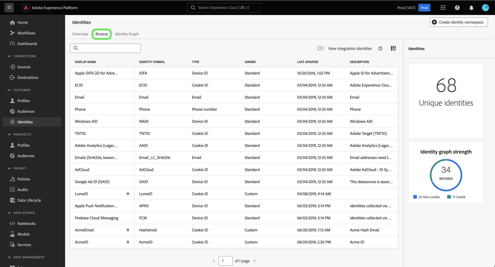

# Overzicht naamruimte identiteit

Lees het volgende document voor meer informatie over wat u kunt doen met naamruimten in Adobe Experience Platform Identity Service.

## Aan de slag

Naamruimten vereisen inzicht in verschillende Adobe Experience Platform-services. Voordat u begint te werken met naamruimten, raadpleegt u de documentatie voor de volgende services:

* [[!DNL Real-Time Customer Profile]](../../profile/home.md): Verstrekt een verenigd, klantenprofiel in echt - tijd die op bijeengevoegde gegevens van veelvoudige bronnen wordt gebaseerd.
* [[!DNL Identity Service]](../home.md): Verbeter een beter beeld van individuele klanten en hun gedrag door identiteiten over apparaten en systemen te overbruggen.
* [[!DNL Privacy Service]](../../privacy-service/home.md): Identiteitsnaamruimten worden gebruikt in nalevingsverzoeken voor wettelijke privacyregels zoals de algemene gegevensbeschermingsverordening (GDPR). Elk privacyverzoek wordt ingediend met betrekking tot een naamruimte om te bepalen welke gegevens van de consument moeten worden beïnvloed.

## Naamruimten voor identiteiten {#understanding-identity-namespaces}

>[!CONTEXTUALHELP]
>id="platform_identity_namespace"
>title="Identiteitsnaamruimten"
>abstract="Een naamruimte voor identiteiten is de context van een bepaalde identiteit. Bijvoorbeeld een naamruimte van `Email` kan overeenkomen met **name@acme.com**. Een naamruimte van `Phone` kan overeenkomen met `555-555-1234`."
>text="Learn more in documentation"

>[!CONTEXTUALHELP]
>id="platform_identity_value"
>title="Identiteitsinstellingen"
>abstract="Een identiteitswaarde is een herkenningsteken die een uniek individu, een organisatie, of een middel vertegenwoordigt. De context of het type van identiteit die de waarde vertegenwoordigt wordt bepaald door een overeenkomstige identiteitsnaamruimte. Wanneer recordgegevens worden vergeleken met profielfragmenten, moeten de naamruimte en de identiteitswaarde overeenkomen. Wanneer recordgegevens worden vergeleken met profielfragmenten, moeten de naamruimte en de identiteitswaarde overeenkomen."
>text="Learn more in documentation"

Een volledig gekwalificeerde identiteit omvat twee componenten: en **identiteitswaarde** en **naamruimte identity**. Als de waarde van een identiteit bijvoorbeeld `scott@acme.com`, dan verstrekt een namespace context aan deze waarde door het als e-mailadres te onderscheiden. Een naamruimte kan ook een onderscheid maken `555-123-456` als telefoonnummer, en `3126ABC` als CRM-ID. Hoofdzakelijk **een naamruimte biedt context aan een bepaalde identiteit**. Bij het afstemmen van recordgegevens over profielfragmenten, zoals wanneer [!DNL Real-Time Customer Profile] Hiermee worden profielgegevens samengevoegd. Zowel de identiteitswaarde als de naamruimte moeten overeenkomen.

Twee profielfragmenten kunnen bijvoorbeeld verschillende primaire id&#39;s bevatten, maar ze hebben dezelfde waarde voor de naamruimte E-mail, zodat Experience Platform kan zien dat deze fragmenten in feite dezelfde persoon zijn en de gegevens samenbrengt in de identiteitsgrafiek voor de persoon.

>[!BEGINSHADEBOX]

**Naamnaamruimte verklaard**

Een andere manier om het concept van naamruimte beter te begrijpen, is het overwegen van echte wereldvoorbeelden zoals steden en hun overeenkomstige staten. Portland, Maine en Portland, Oregon zijn bijvoorbeeld twee verschillende plaatsen in de Verenigde Staten. Terwijl de steden dezelfde naam hebben, werkt de staat als naamruimte en biedt de noodzakelijke context die de twee steden van elkaar onderscheidt.

Dezelfde logica toepassen op Identity Service:

* In één oogopslag, de identiteitswaarde van: `1-234-567-8900` kan eruit zien als een telefoonnummer. Nochtans, vanuit een systeemperspectief, kon deze waarde als identiteitskaart van CRM worden gevormd. De Dienst van de identiteit zou geen manier hebben om de noodzakelijke context op deze identiteitswaarde zonder overeenkomstige namespace toe te passen.
* Een ander voorbeeld is de identiteitswaarde van: `john@gmail.com`. Terwijl deze identiteitswaarde gemakkelijk kan worden verondersteld om een E-mail te zijn, is het volledig mogelijk dat het als identiteitskaart van douane namespace CRM wordt gevormd. Met naamruimte kunt u onderscheid maken `Email:john@gmail.com` van `CRM ID:john@gmail.com`.

>[!ENDSHADEBOX]

### Componenten van een naamruimte

Een naamruimte bestaat uit de volgende componenten:

* **Weergavenaam**: De gebruikersvriendelijke naam voor een bepaalde naamruimte.
* **Identiteitssymbool**: Een code die intern door de Dienst van de Identiteit wordt gebruikt om een namespace te vertegenwoordigen.
* **Identiteitstype**: De classificatie van een bepaalde naamruimte.
* **Beschrijving**: (Optioneel) Eventuele aanvullende informatie die u met betrekking tot een bepaalde naamruimte kunt opgeven.

### Identiteitstype {#identity-type}

>[!CONTEXTUALHELP]
>id="platform_identity_create_namespace"
>title="Identificatietype opgeven"
>abstract="Het identiteitstype bepaalt of gegevens worden opgeslagen in de identiteitsgrafiek. Identiteitsgrafieken worden niet gegenereerd voor de volgende identiteitstypen: niet-persoonlijke id&#39;s en partner-id."
>text="Learn more in documentation"

Eén element van een naamruimte van een identiteit is de **identiteitstype**. Het identiteitstype bepaalt:

* Of een identiteitsgrafiek zal worden geproduceerd:
   * Identiteitsgrafieken worden niet gegenereerd voor de volgende identiteitstypen: niet-persoonlijke id&#39;s en partner-id.
   * Identiteitsgrafieken worden gegenereerd voor alle andere identiteitstypen.
* Welke identiteiten worden verwijderd uit de identiteitsgrafiek wanneer de systeemgrenzen worden bereikt. Lees voor meer informatie de [handleidingen voor identiteitsgegevens](../guardrails.md).

De volgende identiteitstypen zijn beschikbaar in het Experience Platform:

| Identiteitstype | Beschrijving |
| --- | --- |
| Cookie-id | Cookie-id&#39;s identificeren webbrowsers. Deze identiteiten zijn essentieel voor uitbreiding en vormen het grootste deel van de identiteitsgrafiek. Maar door de natuur verval ze snel en verliezen hun waarde in de loop der tijd. |
| Apparaatoverschrijdende id | Apparaatoverschrijdende id&#39;s identificeren een individu en koppelen gewoonlijk andere id&#39;s aan elkaar. Voorbeelden zijn een aanmeldings-id, CRM-id en een loyale-id. Dit is een indicatie voor [!DNL Identity Service] om de waarde gevoelig af te handelen. |
| Apparaat-id | Apparaat-id&#39;s identificeren hardwareapparaten, zoals IDFA (iPhone en iPad), GAID (Android) en RIDA (Roku), en kunnen door meerdere personen in huishoudens worden gedeeld. |
| E-mailadres | E-mailadressen zijn vaak gekoppeld aan één persoon en kunnen daarom worden gebruikt om die persoon op verschillende kanalen te identificeren. Tot dit type identiteiten behoren ook PII&#39;s (Persoonlijke identificeerbare informatie). Dit is een indicatie voor [!DNL Identity Service] om de waarde gevoelig af te handelen. |
| Id van niet-personen | Niet-persoonlijke id&#39;s worden gebruikt voor het opslaan van id&#39;s die naamruimten vereisen maar niet zijn verbonden met een personencluster. Bijvoorbeeld een product-SKU, gegevens met betrekking tot producten, organisaties of winkels. |
| Partner-id | <ul><li>Identiteitskaart van de partner is herkenningstekens die door gegevenspartners worden gebruikt om mensen te vertegenwoordigen. Identiteitskaart van de partner is vaak pseudoniem zodat om de ware identiteit van een persoon niet te onthullen, en kan probabilistisch zijn. In Real-time Customer Data Platform, worden de Partner IDs gebruikt hoofdzakelijk voor uitgebreide publieksactivering en gegevensverrijking, en niet voor de verbindingen van de de grafiekgrafiek van de bouwidentiteit.</li><li>Identiteitsgrafieken worden niet geproduceerd wanneer het opnemen van een identiteit die een identiteitsnamespace omvat die als type van identiteitskaart van de Partner wordt gespecificeerd.</li><li>Het nalaten om partnergegevens op te nemen die het identiteitstype van identiteitskaart van de Partner gebruiken kon in het bereiken van de beperkingen van de systeemgrafiek op de Dienst van de Identiteit, evenals ongewenste samenvoeging van profielen resulteren.</li><ul> |
| Telefoonnummer | Telefoonnummers zijn vaak gekoppeld aan één persoon en kunnen daarom worden gebruikt om die persoon via verschillende kanalen te identificeren. Tot dit type identiteiten behoren PII. Dit is een indicatie voor [!DNL Identity Service] om de waarde gevoelig af te handelen. |

{style="table-layout:auto"}

### Standaardnaamruimten {#standard}

Experience Platform biedt verschillende naamruimten die beschikbaar zijn voor alle organisaties. Deze worden standaardnaamruimten genoemd en zijn zichtbaar met de [!DNL Identity Service] API of via de interface van het platform.

De volgende standaardnaamruimten zijn beschikbaar voor gebruik door alle organisaties in het platform:

| Weergavenaam | Beschrijving |
| ------------ | ----------- |
| AdCloud | Een naamruimte die Adobe AdCloud vertegenwoordigt. |
| Adobe Analytics (verouderd ID) | Een naamruimte die Adobe Analytics vertegenwoordigt. Zie het volgende document op [Adobe Analytics-naamruimten](https://experienceleague.adobe.com/docs/analytics/admin/data-governance/gdpr-namespaces.html#namespaces) voor meer informatie . |
| Apple IDFA (ID voor adverteerders) | Een naamruimte die Apple-id voor adverteerders vertegenwoordigt. Zie het volgende document op [op rente gebaseerde advertenties](https://support.apple.com/en-us/HT202074) voor meer informatie . |
| Apple Push Notification-service | Een naamruimte die identiteiten vertegenwoordigt die zijn verzameld met de Apple Push Notification-service. Zie het volgende document op [Apple Push Notification-service](https://developer.apple.com/library/archive/documentation/NetworkingInternet/Conceptual/RemoteNotificationsPG/APNSOverview.html#//apple_ref/doc/uid/TP40008194-CH8-SW1) voor meer informatie . |
| CORE | Een naamruimte die Adobe Audience Manager vertegenwoordigt. Naar deze naamruimte kan ook worden verwezen met de oudere naam: &quot;Adobe AudienceManager&quot;. Zie het volgende document op [Audience Manager-id&#39;s](https://experienceleague.adobe.com/docs/audience-manager/user-guide/overview/data-privacy/data-privacy-reference/data-privacy-ids.html#aam-ids) voor meer informatie . |
| ECID | Een naamruimte die ECID vertegenwoordigt. Deze naamruimte kan ook worden aangeduid met de volgende aliassen: &quot;Adobe Marketing Cloud ID&quot;, &quot;Adobe Experience Cloud ID&quot;, &quot;Adobe Experience Platform ID&quot;. Zie het volgende document op [ECID](./ecid.md) voor meer informatie . |
| Email | Een naamruimte die een e-mailadres vertegenwoordigt. Dit type naamruimte is vaak gekoppeld aan één persoon en kan daarom worden gebruikt om die persoon op verschillende kanalen te identificeren. |
| E-mails (SHA256, verlaagd) | A namespace for pre-hashed email address. Waarden die in deze naamruimte worden opgegeven, worden omgezet in kleine letters voordat er een hash plaatsvindt met SHA256. De spaties aan het begin en aan het einde moeten worden bijgesneden alvorens een e-mailadres wordt genormaliseerd. Deze instelling kan niet met terugwerkende kracht worden gewijzigd. Zie het volgende document op [SHA256-hashingondersteuning](https://experienceleague.adobe.com/docs/id-service/using/reference/hashing-support.html#hashing-support) voor meer informatie . |
| Firebase Cloud Messaging | Een naamruimte die identiteiten vertegenwoordigt die zijn verzameld met Google Firebase Cloud Messaging voor pushberichten. Zie het volgende document op [Google Firebase Cloud Messaging](https://firebase.google.com/docs/cloud-messaging) voor meer informatie . |
| Google-advertentie-ID (GAID) | A namespace that represents a Google Advertising ID. Zie het volgende document op [Google-advertentie-id](https://support.google.com/googleplay/android-developer/answer/6048248?hl=en) voor meer informatie . |
| Google Click ID | Een naamruimte die een Google Click-id vertegenwoordigt. Zie het volgende document op [Klik op bijhouden in Google-advertenties](https://developers.google.com/adwords/api/docs/guides/click-tracking) voor meer informatie . |
| Telefoon | Een naamruimte die een telefoonnummer vertegenwoordigt. Dit type naamruimte is vaak gekoppeld aan één persoon en kan daarom worden gebruikt om die persoon op verschillende kanalen te identificeren. |
| Telefoon (E.164) | A namespace that represents raw phone numbers that need to be hashed in E.164 format. De indeling E.164 bevat een plusteken (`+`), een internationaal land dat code, een lokale gebiedscode, en een telefoonaantal oproept. Bijvoorbeeld: `(+)(country code)(area code)(phone number)`. |
| Telefoon (SHA256) | Een naamruimte die telefoonnummers vertegenwoordigt die moeten worden gehasht met behulp van SHA256. U moet symbolen, letters en voorloopnullen verwijderen. U moet ook het land toevoegen dat code als prefix roept. |
| Telefoon (SHA256_E.164) | A namespace that represents raw phone numbers that need to be hashed using both SHA256 and E.164 format. |
| TNTID | Een naamruimte die Adobe Target vertegenwoordigt. Zie het volgende document op [Doel](https://experienceleague.adobe.com/docs/target/using/target-home.html) voor meer informatie . |
| Windows-ID | A namespace that represents a Windows Advertising ID. Zie het volgende document op [Windows-advertentie-id](https://docs.microsoft.com/en-us/uwp/api/windows.system.userprofile.advertisingmanager.advertisingid?view=winrt-19041) voor meer informatie . |

### Identiteitsnaamruimten weergeven {#view-identity-namespaces}

>[!CONTEXTUALHELP]
>id="platform_identity_view_integration_identities"
>title="Integratie-id&#39;s weergeven"
>abstract="Integratie-id&#39;s zijn naamruimten die worden gebruikt om verbinding te maken met andere systemen en die niet worden gebruikt in identiteitsresolutie of om identiteiten aan te sluiten.   Deze identiteiten zijn standaard verborgen. Met de schakeloptie kunt u integratienaamruimten weergeven."

Als u naamruimten in de gebruikersinterface wilt weergeven, selecteert u **[!UICONTROL Identities]** in de linkernavigatie en selecteer vervolgens **[!UICONTROL Browse]**.

Er wordt een map met naamruimten in uw organisatie weergegeven met informatie over de namen, identiteitssymbolen, laatst bijgewerkte datums, overeenkomende identiteitstypen en beschrijving.

## Aangepaste naamruimten maken {#create-namespaces}

Afhankelijk van uw organisatorische gegevens en gebruiksgevallen hebt u mogelijk aangepaste naamruimten nodig. U kunt aangepaste naamruimten maken met de opdracht [[!DNL Identity Service]](../api/create-custom-namespace.md) API of via de interface.

Als u een aangepaste naamruimte wilt maken, selecteert u **[!UICONTROL Create identity namespace]**.

De [!UICONTROL Create identity namespace] wordt weergegeven. Eerst moet u een weergavenaam en een identiteitssymbool opgeven voor de aangepaste naamruimte die u wilt maken. U kunt desgewenst ook een beschrijving opgeven om meer context toe te voegen aan de aangepaste naamruimte die u maakt.

Selecteer vervolgens het identiteitstype dat u wilt toewijzen aan de aangepaste naamruimte. Selecteer **[!UICONTROL Create]**.

>[!IMPORTANT]
>
>* De naamruimten die u definieert, zijn persoonlijk voor uw organisatie en vereisen een uniek identiteitssymbool om te kunnen worden gemaakt.
>
>* Nadat een naamruimte is gemaakt, kan deze niet worden verwijderd en kunnen het identiteitssymbool en het type van de naamruimte niet worden gewijzigd.
>
>* Dubbele naamruimten worden niet ondersteund. U kunt een bestaande weergavenaam en identiteitssymbool niet gebruiken wanneer u een nieuwe naamruimte maakt.

## Naamruimten in identiteitsgegevens

Het leveren van de naamruimte voor een identiteit is afhankelijk van de methode die u gebruikt voor het opgeven van identiteitsgegevens. Lees voor meer informatie over het opgeven van identiteitsgegevens de [[!DNL Identity Service] implementatiehandleiding](../implementation.md).

## Volgende stappen

Nu u de belangrijkste concepten van naamruimten begrijpt, kunt u beginnen te leren hoe te met uw identiteitsgrafiek te werken gebruikend [identiteitsgrafiekviewer](../features/identity-graph-viewer.md).
