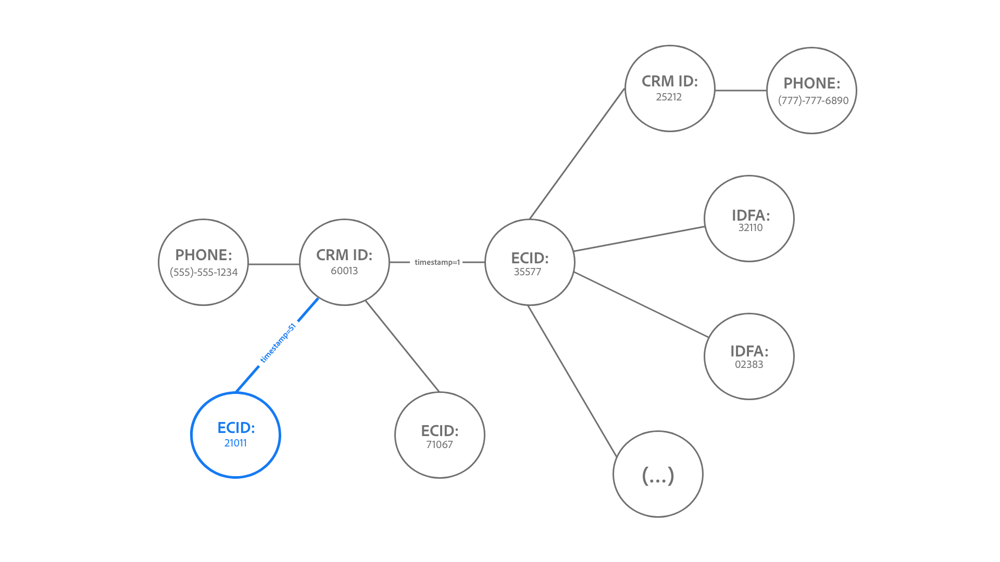

# Guardrails voor [!DNL Identity Service] data

Dit document bevat informatie over het gebruik en de tarieflimieten voor [!DNL Identity Service] gegevens die u helpen het gebruik van de identiteitsgrafiek te optimaliseren. Bij het bekijken van de volgende instructies wordt aangenomen dat u de gegevens correct hebt gemodelleerd. Als u vragen hebt over het modelleren van uw gegevens, neemt u contact op met uw medewerker van de klantenservice.

## Aan de slag

De volgende diensten van het Experience Platform zijn betrokken bij het modelleren van de Gegevens van de Identiteit:

* [Identiteiten](home.md): Bridge-id&#39;s van verschillende gegevensbronnen worden opgenomen in Platform.
* [[!DNL Real-Time Customer Profile]](../profile/home.md): Maak geharmoniseerde consumentenprofielen met behulp van gegevens uit meerdere bronnen.

## Gegevensmodellimieten

In de onderstaande tabellen vindt u richtlijnen voor het gebruik van statische limieten en validatieregels voor naamruimten.

### Statische grenswaarden

In de volgende tabel worden de statische limieten weergegeven die worden toegepast op identiteitsgegevens.

| Guardrail | Limiet | Notities |
| --- | --- | --- |
| Aantal identiteiten in een grafiek | 50 | Wanneer een grafiek met 50 verbonden identiteiten wordt bijgewerkt, zal de Dienst van de Identiteit een &quot;eerste-binnen, eerste-uit&quot;mechanisme toepassen en de oudste identiteit schrapt om ruimte voor de nieuwste identiteit te maken. Verwijderen is gebaseerd op het type identiteit en het tijdstempel. De limiet wordt toegepast op sandboxniveau. Lees voor meer informatie de sectie over [begrip van de verwijderingslogica](#deletion-logic). |
| Aantal koppelingen naar een identiteit voor één batch-opname | 50 | Eén batch kan afwijkende identiteiten bevatten die tot ongewenste samenvoegingen van grafieken leiden. Om dit te voorkomen, zal de Identiteitsdienst geen identiteiten opnemen die reeds met 50 of meer identiteiten verbonden zijn. |
| Aantal identiteiten in een XDM-record | 20 | Het minimum aantal vereiste XDM-records is twee. |
| Aantal aangepaste naamruimten | Geen | Het aantal aangepaste naamruimten dat u kunt maken, is niet beperkt. |
| Aantal tekens voor een naamruimte, weergavenaam of identiteitssymbool | Geen | Er zijn geen limieten aan het aantal tekens van een naamruimte, weergavenaam of identiteitssymbool. |

### Validatie van identiteitswaarden

In de volgende tabel worden de bestaande regels beschreven die u moet volgen om ervoor te zorgen dat uw identiteitswaarde correct wordt gevalideerd.

| Naamruimte | Validatieregel | Systeemgedrag wanneer regel wordt overtreden |
| --- | --- | --- |
| ECID | <ul><li>De identiteitswaarde van een ECID moet precies 38 tekens zijn.</li><li>De identiteitswaarde van een ECID mag alleen uit getallen bestaan.</li><li>Identiteitswaarden mogen niet &#39;null&#39;, &#39;anoniem&#39;, &#39;invalid&#39; of een lege tekenreeks zijn (bijvoorbeeld: &#39;&quot;, &#39;&#39;, &#39;&#39;).</li></ul> | <ul><li>Als de identiteitswaarde van ECID niet precies 38 tekens is, wordt de record overgeslagen.</li><li>Als de identiteitswaarde van ECID niet-numerieke tekens bevat, wordt de record overgeslagen.</li><li>De identiteit wordt geblokkeerd.</li></ul> |
| Niet-ECID | De identiteitswaarde mag niet langer zijn dan 1024 tekens. | Als de identiteitswaarde meer dan 1024 tekens bevat, wordt de record overgeslagen. |

### Naamnaamruimte-opname

Vanaf 31 maart 2023 blokkeert Identity Service de inname van Adobe Analytics ID (AID) voor nieuwe klanten. Deze identiteit wordt doorgaans opgenomen via het dialoogvenster [Adobe Analytics-bron](../sources/connectors/adobe-applications/analytics.md) en de [Adobe Audience Manager-bron](../sources//connectors/adobe-applications/audience-manager.md) en is overbodig omdat de ECID dezelfde webbrowser vertegenwoordigt. Neem contact op met het accountteam van de Adobe als u deze standaardconfiguratie wilt wijzigen.

## Begrijpen met de verwijderingslogica wanneer een identiteitsgrafiek op capaciteit wordt bijgewerkt {#deletion-logic}

Wanneer een volledige identiteitsgrafiek wordt bijgewerkt, schrapt de Dienst van de Identiteit de oudste identiteit in de grafiek alvorens de recentste identiteit toe te voegen. Dit is om de juistheid en relevantie van identiteitsgegevens te behouden. Dit proces van schrapping volgt twee primaire regels:

### Regel 1 schrapping wordt geprioriteerd gebaseerd op het identiteitstype van een namespace

De schrappingsprioriteit is als volgt:

1. Cookie-id
2. Apparaat-id
3. Apparaatoverschrijdende id, e-mail en telefoon

### Regel nr. 2 schrapping is gebaseerd op timestamp die op de identiteit wordt opgeslagen

Elke identiteit die in een grafiek is gekoppeld, heeft een eigen corresponderende tijdstempel. Wanneer een volledige grafiek wordt bijgewerkt, verwijdert Identiteitsservice de identiteit met de oudste tijdstempel.

Wanneer een volledige grafiek met een nieuwe identiteit wordt bijgewerkt, werken deze twee regels samen om aan te geven welke oudere identiteit wordt verwijderd. De Dienst van de identiteit schrapt eerst de oudste identiteitskaart van het Koekje, dan de oudste identiteitskaart van het Apparaat, en tenslotte de oudste identiteitskaart van het dwars-Apparaat/E-mail/Telefoon.

>[!NOTE]
>
>Als de identiteit die u wilt verwijderen aan meerdere andere identiteiten in de grafiek is gekoppeld, worden de koppelingen die deze identiteit verbinden ook verwijderd.

### Gevolgen voor de uitvoering

De volgende secties schetsen de implicaties die de schrappingslogica aan de Dienst van de Identiteit, het Profiel van de Klant in real time, en WebSDK heeft.

#### Identity Service: Custom namespace identity type changes

Neem contact op met het accountteam van uw Adobe om een wijziging in het type identiteit aan te vragen als uw productiessandbox het volgende bevat:

* Een aangepaste naamruimte waarin de personen-id&#39;s (zoals CRM-id&#39;s) zijn geconfigureerd als cookie-/apparaatidentiteitstype.
* Een aangepaste naamruimte waarin cookie-/apparaat-id&#39;s zijn geconfigureerd als identiteitstype voor verschillende apparaten.

Als deze functie eenmaal beschikbaar is, worden grafieken die de limiet van 50 identiteiten overschrijden, verkleind tot maximaal 50 identiteiten. Voor Real-Time CDP B2C Edition kan dit resulteren in een minimale toename van het aantal profielen dat in aanmerking komt voor een publiek, aangezien deze profielen voorheen werden genegeerd door Segmentering en Activering.

#### Klantprofiel in realtime: impact op adresseerbare doelgroepen

Verwijderen gebeurt alleen met gegevens in de Identiteitsservice en niet in realtime klantprofiel.

* Hierdoor kunnen er meer profielen met één ECID worden gemaakt, omdat de ECID geen deel meer uitmaakt van de identiteitsgrafiek.
* Om binnen uw adresseerbare aantallen van de publieksrechten te blijven, wordt het geadviseerd om toe te laten [vervaldatum van pseudoniem profielgegevens](../profile/pseudonymous-profiles.md) om uw oude profielen te verwijderen.

#### Real-Time profiel en WebSDK van klant: primaire identiteitsverwijdering

Als u uw voor authentiek verklaarde gebeurtenissen tegen identiteitskaart van CRM wilt bewaren, dan wordt geadviseerd dat u uw primaire IDs van ECID in identiteitskaart van CRM verandert. Lees de volgende documenten voor stappen over hoe te om deze verandering uit te voeren:

* [Identiteitskaart voor Experience Platform-tags configureren](../tags/extensions/client/web-sdk/data-element-types.md#identity-map).
* [Identiteitsgegevens in het Web SDK van het Experience Platform](../edge/identity/overview.md#using-identitymap)

### Voorbeeldscenario&#39;s

#### Voorbeeld één: standaard grote grafiek

*Opmerkingen bij het diagram:*

* `t` = timestamp.
* De waarde van een tijdstempel komt overeen met de frequentie van een bepaalde identiteit. Bijvoorbeeld: `t1` de eerste gekoppelde identiteit (oudste) vertegenwoordigt en `t51` zou de nieuwste gekoppelde identiteit vertegenwoordigen.

In dit voorbeeld verwijdert Identiteitsservice eerst de bestaande identiteit met de oudste tijdstempel voordat de grafiek aan de linkerkant kan worden bijgewerkt. Nochtans, omdat de oudste identiteit een apparatenidentiteitskaart is, slaat de Dienst van de Identiteit die identiteit over tot het aan namespace met een type krijgt dat hoger op de schrappingspriorlijst is, die in dit geval is `ecid-3`. Zodra de oudste identiteit met een hoger type van schrappingsprioriteit wordt verwijderd, wordt de grafiek dan bijgewerkt met een nieuwe verbinding, `ecid-51`.

* In het zeldzame geval dat er twee identiteiten met het zelfde timestamp en identiteitstype zijn, zal de Dienst van de Identiteit de identiteitskaart sorteren op [XID](./api/list-native-id.md) en het schrappen van regels uitvoeren.

#### Voorbeeld twee: &quot;grafieksplitsing&quot;

>[!BEGINTABS]

>[!TAB Binnenkomende gebeurtenis]

*Opmerkingen bij het diagram:*

* In het volgende diagram wordt ervan uitgegaan dat bij `timestamp=50`, 50 identiteiten bestaan in de identiteitsgrafiek.
* `(...)` Hiermee worden de andere identiteiten aangegeven die al zijn gekoppeld in de grafiek.

In dit voorbeeld wordt ECID:32110 opgenomen en gekoppeld aan een grote grafiek bij `timestamp=51`, waardoor de limiet van 50 identiteiten wordt overschreden.

>[!TAB Verwijderingsproces]

Dientengevolge, schrapt de Dienst van de Identiteit de oudste identiteit die op timestamp en identiteitstype wordt gebaseerd. In dit geval wordt ECID:35577 verwijderd.

>[!TAB Grafiekuitvoer]

Als gevolg van het verwijderen van ECID:35577 worden ook de randen die aan CRM-id:60013 en CRM-id:25212 zijn gekoppeld met de nu verwijderde ECID:35577 verwijderd. Door dit verwijderingsproces wordt de grafiek opgesplitst in twee kleinere grafieken.

>[!ENDTABS]

#### Voorbeeld drie: &quot;hub-and-speak&quot;

>[!BEGINTABS]

>[!TAB Binnenkomende gebeurtenis]

*Opmerkingen bij het diagram:*

* In het volgende diagram wordt ervan uitgegaan dat bij `timestamp=50`, 50 identiteiten bestaan in de identiteitsgrafiek.
* `(...)` Hiermee worden de andere identiteiten aangegeven die al zijn gekoppeld in de grafiek.

Door middel van de verwijderingslogica kunnen sommige &quot;hub&quot;-identiteiten ook worden verwijderd. Deze hubidentiteiten verwijzen naar knopen die aan verscheidene individuele identiteiten verbonden zijn die anders losgemaakt zouden zijn.

In het onderstaande voorbeeld wordt ECID:21011 opgenomen en gekoppeld aan de grafiek op `timestamp=51`, waardoor de limiet van 50 identiteiten wordt overschreden.

>[!TAB Verwijderingsproces]

Dientengevolge, schrapt de Dienst van de Identiteit de oudste identiteit, die in dit geval ECID:35577 is. De schrapping van ECID:35577 leidt ook tot de schrapping van het volgende:

* Het verband tussen CRM-ID: 60013 en de nu verwijderde ECID:35577, wat resulteert in een grafieksplitsingsscenario.
* IDFA: 32110, IDFA: 02383, en de overige identiteiten vertegenwoordigd door `(...)`. Deze identiteiten worden verwijderd omdat ze individueel niet aan andere identiteiten zijn gekoppeld en daarom niet in een grafiek kunnen worden weergegeven.

>[!TAB Grafiekuitvoer]

Ten slotte levert het verwijderingsproces twee kleinere grafieken op.

>[!ENDTABS]

## Volgende stappen

Zie de volgende documentatie voor meer informatie over [!DNL Identity Service]:

* [[!DNL Identity Service]-overzicht](home.md)
* [Naamgrafiekviewer](ui/identity-graph-viewer.md)

Raadpleeg de volgende documentatie voor meer informatie over andere Experience Platforms services guardrails, over end-to-end latentie-informatie en licentiegegevens uit Real-Time CDP Product Description-documenten:

* [Real-Time CDP guardrails](/help/rtcdp/guardrails/overview.md)
* [Diagrammen met latentie van begin tot eind](https://experienceleague.adobe.com/docs/blueprints-learn/architecture/architecture-overview/deployment/guardrails.html?lang=en#end-to-end-latency-diagrams) voor verschillende diensten van de Experience Platform.
* [Real-time Customer Data Platform (B2C Edition - Premiere en Ultimate Packages)](https://helpx.adobe.com/legal/product-descriptions/real-time-customer-data-platform-b2c-edition-prime-and-ultimate-packages.html)
* [Real-time Customer Data Platform (B2P - Premiere en Ultimate Packages)](https://helpx.adobe.com/legal/product-descriptions/real-time-customer-data-platform-b2p-edition-prime-and-ultimate-packages.html)
* [Real-time Customer Data Platform (B2B - Premiere en Ultimate Packages)](https://helpx.adobe.com/legal/product-descriptions/real-time-customer-data-platform-b2b-edition-prime-and-ultimate-packages.html)
