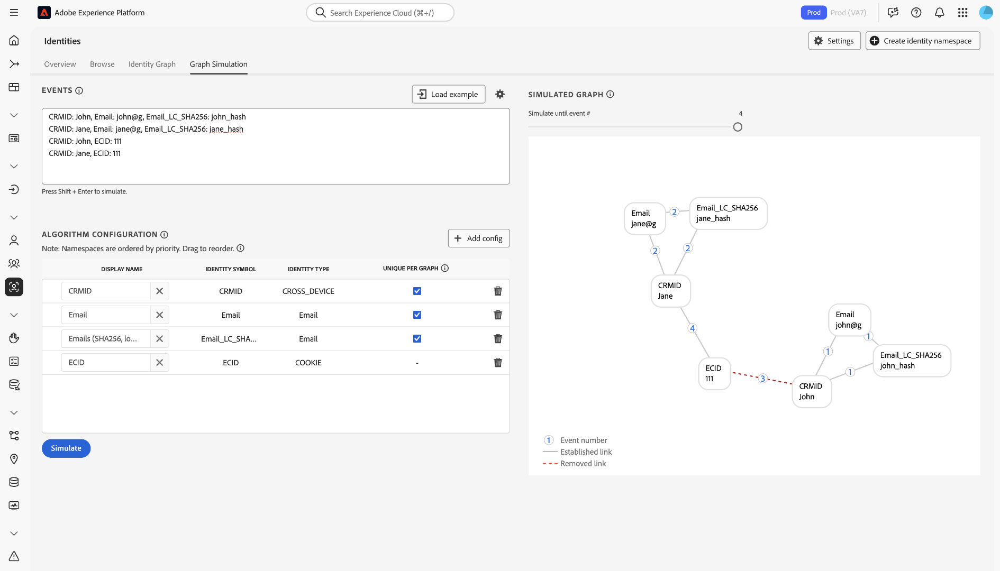

# [!DNL Identity Graph Linking Rules] -configuratiegids {#configurations-guide}

>[!CONTEXTUALHELP]
>id="platform_identities_algorithmconfiguration"
>title="Algorithm Configuration"
>abstract="Vorm unieke namespace en namespace prioriteit die aan uw ingebedde identiteiten wordt aangepast."

Lees dit document voor meer informatie over verschillende implementatietypen die u kunt configureren met [!DNL Identity Graph Linking Rules] .

De de grafiekscenario&#39;s van de klant kunnen in drie verschillende categorieën worden gegroepeerd.

* **Basis**: [ Basisimplementaties ](#basic-implementations) omvatten grafieken die het vaakst eenvoudige implementaties omvatten. Deze implementaties draaien doorgaans rond één apparaatnaamruimte (bijvoorbeeld CRMID). Terwijl de basisimplementaties vrij ongecompliceerd zijn, kan de grafiekondergang nog voorkomen, vaak toe te schrijven aan **gedeelde apparaat** scenario&#39;s.
* **Middelen**: [ Tussenliggende implementaties ](#intermediate-implementations) omvatten verscheidene variabelen zoals **veelvoudige dwars-apparaat namespaces**, **niet-unieke identiteiten**, en **veelvoudige unieke namespaces**.
* **Geavanceerd**: [ Geavanceerde implementaties ](#advanced-implementations) impliceren complexe en multi-layered grafiekscenario&#39;s. Voor geavanceerde implementaties is het van essentieel belang dat de juiste naamruimte-prioriteitsvolgorde wordt ingesteld om ervoor te zorgen dat de juiste koppelingen worden verwijderd, zodat de grafiek niet wordt samengevouwen.

## Aan de slag

Voordat u gaat induiken in het volgende document, moet u zich vertrouwd maken met verschillende belangrijke concepten Identiteitsservice en [!DNL Identity Graph Linking Rules] .

* [Overzicht van identiteitsservice](../home.md)
* [[!DNL Identity Graph Linking Rules]-overzicht](../identity-graph-linking-rules/namespace-priority.md)
* [Prioriteit naamruimte](namespace-priority.md)
* [Unieke naamruimte](overview.md#unique-namespace)
* [Grafieksimulatie](graph-simulation.md)

## Basisimplementaties {#basic-implementations}

>[!NOTE]
>
>Als u de onderstaande implementaties wilt voltooien, moet u een aangepaste naamruimte maken met het identiteitssymbool (hoofdlettergevoelig): `CRMID` .

Lees deze sectie voor basisimplementaties van [!DNL Identity Graph Linking Rules].

### Hoofdlettergebruik: eenvoudige implementatie die gebruikmaakt van één naamruimte tussen apparaten

Over het algemeen hebben Adobe-klanten één apparaatoverschrijdende naamruimte die wordt gebruikt voor al hun eigenschappen, zoals het web, mobiele apparaten en toepassingen. Dit systeem is zowel industrie als geografisch agnostisch aangezien de klanten in kleinhandel, telecommunicatie, en de financiële diensten dit type van implementatie gebruiken.

Doorgaans wordt een eindgebruiker vertegenwoordigd door een apparaatoverschrijdende naamruimte (vaak een CRMID). Daarom moet de CRMID worden geclassificeerd als een unieke naamruimte. Een eindgebruiker die eigenaar is van een computer en een [!DNL iPhone] en zijn apparaat niet deelt, kan een identiteitsgrafiek als deze hebben.

Veronderstel dat u een gegevensarchitect bij een e-commercebedrijf genoemd **ACME** bent. John en Jane zijn uw klanten. Het zijn eindgebruikers die samenwonen in San Jose, Californië. Ze delen een desktopcomputer en gebruiken deze computer om door uw website te bladeren. Op dezelfde manier delen John en Jane ook een [!DNL iPad] en gebruiken ze dit [!DNL iPad] soms om op internet te surfen, inclusief uw website.

**wijze van de Tekst**

```json
CRMID: John, ECID: 123
CRMID: John, ECID: 999, IDFA: a-b-c
```

**de configuratie van het Algoritme (de Montages van de Identiteit)**

Vorm de volgende montages in de interface van de Simulatie van de Grafiek alvorens u uw grafiek simuleert.

| Weergavenaam | Identiteitssymbool | Identiteitstype | Uniek per grafiek | Prioriteit naamruimte |
| --- | --- | --- | --- | --- |
| CRMID | CRMID | CROSS_DEVICE | ✔️ | 1 |
| ECID | ECID | COOKIE | | 2 |
| IDFA | IDFA | APPARAAT | | 3 |

**Gesimuleerde grafiek**

In deze grafiek wordt John (de eindgebruiker) vertegenwoordigd door CRMID. `{ECID: 123}` vertegenwoordigt Webbrowser die John op zijn personal computer gebruikte om uw e-commerceplatform te bezoeken. `{ECID: 999}` vertegenwoordigt de browser die hij op zijn [!DNL iPhone] en `{IDFA: a-b-c}` gebruikt vertegenwoordigt zijn [!DNL iPhone].


**Uitoefening**

Simuleer de volgende configuratie in de Simulatie van de Grafiek. U kunt uw eigen gebeurtenissen maken of kopiëren en plakken met de tekstmodus.

>[!BEGINTABS]

>[!TAB  Gedeeld apparaat (PC) ]

**Gedeeld apparaat (PC)**

**wijze van de Tekst**

```json
CRMID: John, ECID: 111
CRMID: Jane, ECID: 111
```

**Gesimuleerde grafiek**

In deze grafiek worden John en Jane vertegenwoordigd door hun eigen respectieve CRMID&#39;s:

* `{CRMID: John}`
* `{CRMID: Jane}`

De browser op de bureaubladcomputer die beide gebruiken om uw e-commerceplatform te bezoeken, wordt aangeduid met `{ECID: 111}` . In dit grafiekscenario is Jane de laatst geverifieerde eindgebruiker en daarom wordt de koppeling tussen `{ECID: 111}` en `{CRMID: John}` verwijderd.


>[!TAB  Gedeeld apparaat (mobiel) ]

**Gedeeld apparaat (mobiel)**

**wijze van de Tekst**

```json
CRMID: John, ECID: 111, IDFA: a-b-c
CRMID: Jane, ECID: 111, IDFA: a-b-c
```

**Gesimuleerde grafiek**

In deze grafiek worden John en Jane allebei vertegenwoordigd door hun eigen respectieve CRMIDs. De browser die ze gebruiken, wordt aangeduid met `{ECID: 111}` en de [!DNL iPad] die ze delen, wordt aangeduid met `{IDFA: a-b-c}` . In dit grafiekscenario is Jane de laatst geverifieerde eindgebruiker en daarom worden de koppelingen van `{ECID: 111}` en `{IDFA: a-b-c}` naar `{CRMID: John}` verwijderd.


>[!ENDTABS]

## Tussentijdse implementaties {#intermediate-implementations}

>[!TIP]
>
>A **niet-unieke identiteit** is een identiteit verbonden aan een niet-unieke namespace.

Lees deze sectie voor tussentijdse implementaties van [!DNL Identity Graph Linking Rules].

### Hoofdlettergebruik: uw gegevens bevatten niet-unieke identiteiten

>[!NOTE]
>
>Als u de onderstaande implementaties wilt voltooien, moet u de volgende aangepaste naamruimten maken met de identiteitssymbolen (hoofdlettergevoelig):
>* `CRMID`
>* `CChash` (Dit is een aangepaste naamruimte die een gehasht creditcardnummer vertegenwoordigt.)

Stel je voor dat je een gegevensarchitect bent die werkt voor een commerciële bank die creditcards uitgeeft. Uw marketingteam heeft aangegeven dat zij de transactiegeschiedenis van creditcardtransacties in het verleden aan een profiel willen toevoegen. Deze identiteitsgrafiek kan er als volgt uitzien.

**wijze van de Tekst**

```json
CRMID: John, CChash: 1111-2222 
CRMID: John, CChash: 3333-4444 
CRMID: John, ECID: 123 
CRMID: John, ECID: 999, IDFA: a-b-c
```

**de configuratie van het Algoritme (de Montages van de Identiteit)**

Vorm de volgende montages in de interface van de Simulatie van de Grafiek alvorens u uw grafiek simuleert.

| Weergavenaam | Identiteitssymbool | Identiteitstype | Uniek per grafiek | Prioriteit naamruimte |
| --- | --- | --- | --- | --- |
| CRMID | CRMID | CROSS_DEVICE | ✔️ | 1 |
| Uitknippen | Uitknippen | CROSS_DEVICE | | 2 |
| ECID | ECID | COOKIE | | 3 |
| IDFA | IDFA | APPARAAT | | 4 |

**Gesimuleerde grafiek**


Er zijn geen garanties dat deze creditcardnummers of andere niet-unieke naamruimten altijd aan één eindgebruiker worden gekoppeld. Twee eindgebruikers kunnen zich registreren bij dezelfde creditcard. Er kunnen niet-unieke plaatsaanduidingswaarden zijn die ten onrechte zijn ingevoerd. Eenvoudig gezegd, er is geen garantie dat niet-unieke naamruimten geen grafiek doen samenvouwen.

Om deze kwestie op te lossen, verwijdert de Dienst van de Identiteit de oudste verbindingen en behoudt de meest recente verbindingen. Zo voorkomt u dat er maar één CRMID in een grafiek voorkomt.

**Uitoefening**

Simuleer de volgende configuraties in de Simulatie van de Grafiek. U kunt uw eigen gebeurtenissen maken of kopiëren en plakken met de tekstmodus.

>[!BEGINTABS]

>[!TAB  Gedeeld apparaat ]

**wijze van de Tekst**

```json
CRMID: John, CChash: 1111-2222
CRMID: Jane, CChash: 3333-4444
CRMID: John, ECID: 123
CRMID: Jane, ECID:123
```

**Gesimuleerde grafiek**


>[!TAB  twee eind-gebruikers met de zelfde creditcard ]

Twee verschillende eindgebruikers melden zich aan voor uw e-commercewebsite met dezelfde creditcard. Uw marketingteam wil het samenvouwen van grafieken voorkomen door ervoor te zorgen dat de creditcard aan slechts één profiel is gekoppeld.

**wijze van de Tekst**

```json
CRMID: John, CChash: 1111-2222
CRMID: Jane, CChash: 1111-2222
CRMID: John, ECID: 123
CRMID: Jane, ECID:456
```

**Gesimuleerde grafiek**


>[!TAB  Ongeldig creditcardaantal ]

Als gevolg van onzuivere gegevens wordt een ongeldig creditcardnummer in Experience Platform ingevoerd.

**wijze van de Tekst**

```json
CRMID: John, CChash: undefined
CRMID: Jane, CChash: undefined
CRMID: Jack, CChash: undefined
CRMID: Jill, CChash: undefined
```

**Gesimuleerde grafiek**


>[!ENDTABS]

### Hoofdlettergebruik: uw gegevens bevatten zowel gehashte als niet-gehashte CRMID&#39;s

>[!NOTE]
>
>Als u de onderstaande implementaties wilt voltooien, moet u aangepaste naamruimten maken met de identiteitssymbolen (hoofdlettergevoelig):
>* `CRMID`
>* `CRMIDhash`

U gebruikt zowel een niet-gehakte (offline) CRMID als een gehashte (online) CRMID. De verwachting is dat er een direct verband tussen zowel unhashed als hashed CRMIDs is. Wanneer een eindgebruiker met een voor authentiek verklaarde rekening doorbladert, wordt gehakt CRMID verzonden samen met apparatenidentiteitskaart (die op de Dienst van de Identiteit als ECID wordt vertegenwoordigd).

**de configuratie van het Algoritme (de Montages van de Identiteit)**

Vorm de volgende montages in de interface van de Simulatie van de Grafiek alvorens u uw grafiek simuleert.

| Weergavenaam | Identiteitssymbool | Identiteitstype | Uniek per grafiek | Prioriteit naamruimte |
| --- | --- | --- | --- | --- | 
| CRMID | CRMID | CROSS_DEVICE | ✔️ | 1 |
| CRMIDhash | CRMIDhash | CROSS_DEVICE | ✔️ | 2 |
| ECID | ECID | COOKIE | | 3 |


**Uitoefening**

Simuleer de volgende configuraties in de Simulatie van de Grafiek. U kunt uw eigen gebeurtenissen maken of kopiëren en plakken met de tekstmodus.

>[!BEGINTABS]

>[!TAB  Gedeeld apparaat ]

John en Jane delen een apparaat.

**wijze van de Tekst**

```json
CRMID: John, CRMIDhash: John
CRMID: Jane, CRMIDhash: Jane
CRMIDhash: John, ECID: 111 
CRMIDhash: Jane, ECID: 111
```


>[!TAB  Onjuiste gegevens ]

Als gevolg van fouten in het hashingproces wordt een niet-unieke gehashte CRMID gegenereerd en naar de identiteitsservice verzonden.

**wijze van de Tekst**

```json
CRMID: John, CRMIDhash: aaaa
CRMID: Jane, CRMIDhash: aaaa
```


>[!ENDTABS]
<!-- 
### Use case: You are using Real-Time CDP and Adobe Commerce

You have two types of end-users:

* **Members**: An end-user who is assigned a CRMID and has an email account registered to your system.
* **Guests**: An end-user who is not a member. They do not have an assigned CRMID and their email accounts are not registered to your system.

In this scenario, your customers are sending data from Adobe Commerce to Real-Time CDP.

**Exercise**

Simulate the following configurations in the graph simulation tool. You can either create your own events, or copy and paste using text mode.

>[!BEGINTABS]

>[!TAB Shared device between two members]

In this scenario, two members share the same device to browse an e-commerce website.

**Text mode**

```json
CRMID: John, Email: john@g
CRMID: Jane, Email: jane@g
CRMID: John, ECID: 111
CRMID: Jane, ECID: 111
```


>[!TAB Shared device between two guests]

In this scenario, two guests share the same device to browse an e-commerce website.

**Text mode**

```json
Email: john@g, ECID: 111
Email: jane@g, ECID: 111
```


>[!TAB Shared device between a member and a guest]

In this scenario, a member and a guest share the same device to browse an e-commerce website.

**Text mode**

```json
CRMID: John, Email: john@g
CRMID: John, ECID: 111
Email: jane@g, ECID: 111
```


>[!ENDTABS] -->

### Hoofdlettergebruik: uw gegevens bevatten drie unieke naamruimten

>[!NOTE]
>
>Als u de onderstaande implementaties wilt voltooien, moet u een aangepaste naamruimte maken met het identiteitssymbool (hoofdlettergevoelig): `CRMID` .

Uw klant definieert als volgt een entiteit van één persoon:

* Een eindgebruiker met toegewezen CRMID.
* Een eindgebruiker die aan een gehasht e-mailadres wordt geassocieerd, zodat de profielen aan bestemmingen kunnen worden geactiveerd die gehashte e-mail (bijvoorbeeld, [!DNL Facebook]) steunen.
* Een eindgebruiker die aan een e-mailadres is gekoppeld, zodat ondersteuningspersoneel hun profiel op Real-Time CDP kan opzoeken aan de hand van het opgegeven e-mailadres.

| Weergavenaam | Identiteitssymbool | Identiteitstype | Uniek per grafiek | Prioriteit naamruimte |
| --- | --- | --- | --- | --- |
| CRMID | CRMID | CROSS_DEVICE | ✔️ | 1 |
| Email | Email | Email | ✔️ | 2 |
| Email_LC_SHA256 | Email_LC_SHA256 | Email | ✔️ | 3 |
| ECID | ECID | COOKIE | | 4 |

Simuleer de volgende configuraties in het gereedschap voor grafieksimulatie. U kunt uw eigen gebeurtenissen maken of kopiëren en plakken met de tekstmodus.

>[!BEGINTABS]

>[!TAB  Gedeeld apparaat ]

In dit scenario, login John en Jane allebei aan een e-commercewebsite.

**wijze van de Tekst**

```json
CRMID: John, Email: john@g, Email_LC_SHA256: john_hash 
CRMID: Jane, Email: jane@g, Email_LC_SHA256: jane_hash 
CRMID: John, ECID: 111 
CRMID: Jane, ECID: 111
```



>[!TAB  een eindgebruiker verandert hun e-mail ]

**wijze van de Tekst**

```json
CRMID: John, Email: john@g, Email_LC_SHA256: john_hash
CRMID: John, Email: john@y, Email_LC_SHA256: john_y_hash
```


>[!ENDTABS]

## Geavanceerde implementaties {#advanced-implementations}

Geavanceerde implementaties omvatten complexe en gelaagde grafiekscenario&#39;s. Deze types van implementaties omvatten het gebruik van **namespace prioriteit** om de correcte verbindingen te identificeren die moeten worden verwijderd om grafiekineenstorting te verhinderen.

**prioriteit Namespace** is meta-gegevens die van namespaces door hun belang rangschikt. Als een grafiek twee identiteiten bevat, elk met verschillende unieke naamruimten, gebruikt de Dienst van de Identiteit namespace prioriteit om te beslissen welke verbindingen om te verwijderen. Voor meer informatie, lees de [ documentatie over namespace prioriteit ](../identity-graph-linking-rules/namespace-priority.md).

De prioriteit Namespace speelt een kritieke rol in complexe grafiekscenario&#39;s. Grafieken kunnen veelvoudige lagen hebben - een eindgebruiker kan met veelvoudige login IDs worden geassocieerd, en deze login IDs kon worden gehakt. Bovendien kunnen verschillende ECID&#39;s worden gekoppeld aan verschillende aanmeldings-id&#39;s. Om ervoor te zorgen dat de juiste verbinding, in de juiste laag wordt verwijderd, moeten uw configuraties van de namespaceprioriteit correct zijn.

Lees deze sectie voor geavanceerde implementaties van [!DNL Identity Graph Linking Rules].

### Gebruik hoofdletters/kleine letters: u hebt ondersteuning nodig voor meerdere bedrijfsregels

>[!NOTE]
>
>Als u de onderstaande implementaties wilt voltooien, moet u aangepaste naamruimten maken met de identiteitssymbolen (hoofdlettergevoelig):
>* `CRMID`
>* `loginID`

Uw eindgebruikers hebben twee verschillende accounts: een persoonlijke account en een zakelijke account. Elk account wordt geïdentificeerd door een andere id. In dit scenario ziet een grafiek er als volgt uit:

**wijze van de Tekst**

```json
CRMID: John, loginID: JohnPersonal
CRMID: John, loginID: JohnBusiness
loginID: JohnPersonal, ECID: 111
loginID: JohnPersonal, ECID: 222
loginID: JohnBusiness, ECID: 222
```

**de configuratie van het Algoritme (de Montages van de Identiteit)**

Vorm de volgende montages in de interface van de Simulatie van de Grafiek alvorens u uw grafiek simuleert.

| Weergavenaam | Identiteitssymbool | Identiteitstype | Uniek per grafiek | Prioriteit naamruimte |
| --- | --- | --- | --- | --- |
| CRMID | CRMID | CROSS_DEVICE | ✔️ | 1 |
| loginID | loginID | CROSS_DEVICE | | 2 |
| ECID | ECID | COOKIE | | 3 |

**Gesimuleerde grafiek**


**Uitoefening**

Simuleer de volgende configuratie in de Simulatie van de Grafiek. U kunt uw eigen gebeurtenissen maken of kopiëren en plakken met de tekstmodus.

>[!BEGINTABS]

>[!TAB  Gedeeld apparaat ]

**wijze van de Tekst**

```json
CRMID: John, loginID: JohnPersonal
CRMID: John, loginID: JohnBusiness
CRMID: Jane, loginID: JanePersonal
CRMID: Jane, loginID: JaneBusiness
loginID: JohnPersonal, ECID: 111
loginID: JanePersonal, ECID: 111
```


>[!TAB  het Onjuiste gegeven wordt verzonden naar Real-Time CDP ]

**wijze van de Tekst**

```json
CRMID: John, loginID: JohnPersonal
CRMID: John, loginID: error
CRMID: Jane, loginID: JanePersonal
CRMID: Jane, loginID: error
loginID: JohnPersonal, ECID: 111
loginID: JanePersonal, ECID: 222
```


>[!ENDTABS]

### Hoofdlettergebruik: u hebt complexe implementaties die meerdere naamruimten vereisen

>[!NOTE]
>
>Als u de onderstaande implementaties wilt voltooien, moet u aangepaste naamruimten maken met de identiteitssymbolen (hoofdlettergevoelig):
>* `CRMID`
>* `loyaltyID`
>* `thirdPartyID`
>* `orderID`

U bent een bedrijf voor media en entertainment en uw eindgebruikers hebben het volgende:

* EEN CRMID
* Een loyaal-id

Bovendien kunnen eindgebruikers een aankoop doen op de e-commercewebsite en deze gegevens zijn gekoppeld aan hun e-mailadres. Gebruikersgegevens worden ook verrijkt door een externe databaseleverancier en worden in batches naar Experience Platform verzonden.

**wijze van de Tekst**

```json
CRMID: John, loyaltyID: John, Email: john@g
Email: john@g, orderID: aaa
CRMID: John, thirdPartyID: xyz
CRMID: John, ECID: 111
```

**de configuratie van het Algoritme (de Montages van de Identiteit)**

Vorm de volgende montages in de interface van de Simulatie van de Grafiek alvorens u uw grafiek simuleert.

| Weergavenaam | Identiteitssymbool | Identiteitstype | Uniek per grafiek | Prioriteit naamruimte |
| --- | --- | --- | --- | --- |
| CRMID | CRMID | CROSS_DEVICE | ✔️ | 1 |
| loyaltyID | loyaltyID | CROSS_DEVICE | ✔️ | 2 |
| Email | Email | Email | ✔️ | 3 |
| thirdPartyID | thirdPartyID | CROSS_DEVICE | | 4 |
| orderID | orderID | CROSS_DEVICE | | 5 |
| ECID | ECID | COOKIE | | 6 |

**Uitoefening**

Simuleer de volgende configuratie in de Simulatie van de Grafiek. U kunt uw eigen gebeurtenissen maken of kopiëren en plakken met de tekstmodus.

>[!BEGINTABS]

>[!TAB  Gedeeld apparaat ]

**wijze van de Tekst**

```json
CRMID: John, loyaltyID: John, Email: john@g
CRMID: Jane, loyaltyID: Jane, Email: jane@g
Email: john@g, orderID: aaa 
CRMID: John, thirdPartyID: xyz 
CRMID: John, ECID: 111
CRMID: Jane, ECID: 111
```


>[!TAB  Eind-gebruiker verandert hun e-mailadres ]

**wijze van de Tekst**

```json
CRMID: John, loyaltyID: John, Email: john@g
CRMID: John, loyaltyID: John, Email: john@y
```


>[!TAB  de derdePartyID verenigingsveranderingen ]

**wijze van de Tekst**

```json
CRMID: John, loyaltyID: John, Email: john@g
CRMID: Jane, loyaltyID: Jane, Email: jane@g
CRMID: John, thirdPartyID: xyz
CRMID: Jane, thirdPartyID: xyz
```


>[!TAB  Niet-unieke orderID ]

**wijze van de Tekst**

```json
CRMID: John, loyaltyID: John, Email: john@g
CRMID: Jane, loyaltyID: Jane, Email: jane@g
Email: john@g, orderID: aaa
Email: jane@g, orderID: aaa
```


>[!TAB  Onjuiste loyaltyID ]

**wijze van de Tekst**

```json
CRMID: John, loyaltyID: aaa, Email: john@g
CRMID: Jane, loyaltyID: aaa, Email: jane@g
```


>[!ENDTABS]

## Volgende stappen

Lees de volgende documentatie voor meer informatie over [!DNL Identity Graph Linking Rules] :

* [[!DNL Identity Graph Linking Rules]-overzicht](./overview.md)
* [Algoritme voor identiteitsoptimalisatie](./identity-optimization-algorithm.md)
* [Implementatiehandleiding](./implementation-guide.md)
* [Problemen oplossen en veelgestelde vragen](./troubleshooting.md)
* [Prioriteit naamruimte](./namespace-priority.md)
* [UI voor grafieksimulatie](./graph-simulation.md)
* [Gebruikersinterface voor identiteitsinstellingen](./identity-settings-ui.md)