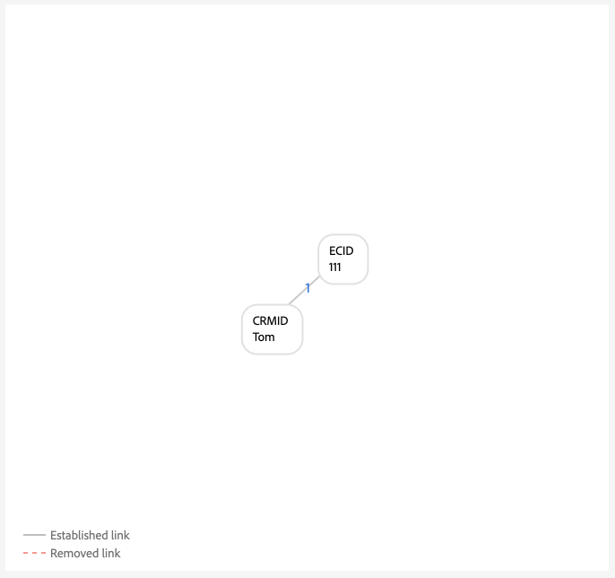
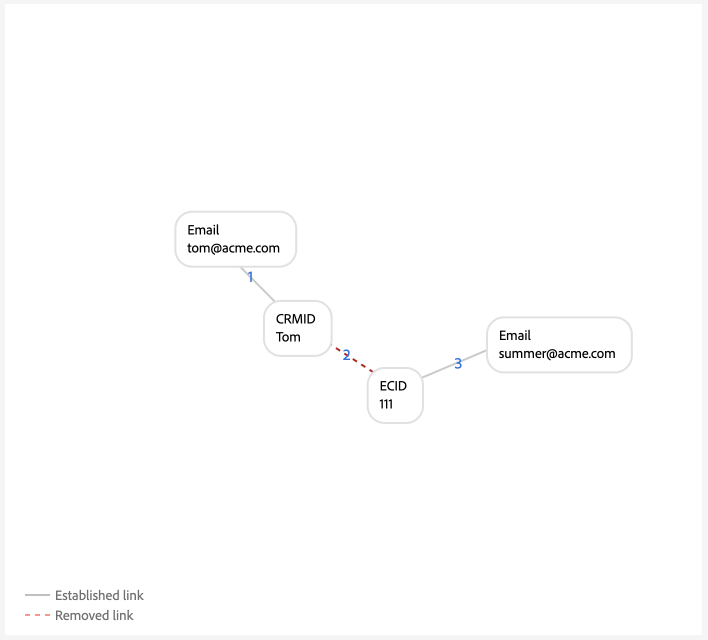

# Voorbeelden van grafiekconfiguraties

>[!AVAILABILITY]
>
>De regels voor identiteitsgrafiekkoppelingen staan momenteel in bèta. Neem contact op met het accountteam van de Adobe voor meer informatie over de deelnemingscriteria. De functie en documentatie kunnen worden gewijzigd.

>[!NOTE]
>
>* &#39;CRMID&#39; en &#39;loginID&#39; zijn aangepaste naamruimten. In dit document is &#39;CRMID&#39; een persoon-id en is &#39;loginID&#39; een aanmeldings-id die aan een bepaalde persoon is gekoppeld.
>* Als u de voorbeeldgrafiekscenario&#39;s wilt simuleren die in dit document worden beschreven, moet u eerst twee aangepaste naamruimten maken, een met het identiteitssymbool &quot;CRMID&quot; en een ander met het identiteitssymbool &quot;loginID&quot;. Identiteitssymbolen zijn hoofdlettergevoelig.


Dit document schetst de voorbeelden van de grafiekconfiguratie van gemeenschappelijke scenario&#39;s die u zou kunnen ontmoeten wanneer het werken met identiteitsgrafiek die regels en identiteitsgegevens verbindt.

## alleen CRMID

Dit is een voorbeeld van een eenvoudig implementatiescenario waarbij online gebeurtenissen (CRMID en ECID) worden opgenomen en offlinegebeurtenissen (profielrecords) alleen tegen de CRMID worden opgeslagen.

**Implementatie:**

| Gebruikte naamruimten | Webgedragsverzamelingsmethode |
| --- | --- |
| CRMID, ECID | Web SDK |

**Gebeurtenissen:**

U kunt dit scenario in grafieksimulatie tot stand brengen door de volgende gebeurtenissen aan tekstwijze te kopiëren:

```shell
CRMID: Tom, ECID: 111
```

**configuratie van het Algoritme:**

U kunt dit scenario in grafieksimulatie tot stand brengen door de volgende opstelling voor uw algoritmeconfiguratie te vormen:

| Prioriteit | Weergavenaam | Identiteitstype | Uniek per grafiek |
| ---| --- | --- | --- |
| 1 | CRMID | CROSS_DEVICE | Ja |
| 2 | ECID | COOKIE | Nee |

**Primaire identiteitsselectie voor Real-Time Profiel van de Klant:**

Binnen de context van deze configuratie, zal de primaire identiteit als volgt worden bepaald:

| Verificatiestatus | Naamruimte(s) in gebeurtenissen | Primaire identiteit |
| --- | --- | --- |
| Geverifieerd | CRMID, ECID | CRMID |
| Niet geverifieerd | ECID | ECID |

**Voorbeelden van de Grafiek**

>[!BEGINTABS]

>[!TAB  Ideale single-person grafiek ]

Hieronder ziet u een voorbeeld van een ideale eenpersoonsgrafiek, waarbij CRMID uniek is en de hoogste prioriteit krijgt.



>[!TAB  Multi-person grafiek ]

Hier volgt een voorbeeld van een grafiek met meerdere personen. Dit voorbeeld toont een &quot;gedeeld apparaat&quot;scenario, waar er twee CRMIDs zijn en met de oudere gevestigde verbinding wordt verwijderd.


**de simulatiegebeurtenissen van de Grafiek input**

```shell
CRMID: Tom, ECID: 111
CRMID: Summer, ECID: 111
```

>[!ENDTABS]

## CRMID met gehashte e-mail

In dit scenario wordt een CRMID opgenomen die zowel online (ervaringsgebeurtenis) als offline (profielrecord) gegevens vertegenwoordigt. Dit scenario impliceert ook de opname van een gehakt e-mail, die een andere namespace vertegenwoordigt die in de het recorddataset van CRM samen met CRMID wordt verzonden.

>[!IMPORTANT]
>
>**het is cruciaal dat CRMID altijd voor elke gebruiker** wordt verzonden. Als u dit niet doet, kan dit leiden tot een &quot;gevaarlijk&quot; login-id-scenario, waarbij één individuele persoon wordt verondersteld een apparaat met een andere persoon te delen.

**Implementatie:**

| Gebruikte naamruimten | Webgedragsverzamelingsmethode |
| --- | --- |
| CRMID, Email_LC_SHA256, ECID | Web SDK |

**Gebeurtenissen:**

U kunt dit scenario in grafieksimulatie tot stand brengen door de volgende gebeurtenissen aan tekstwijze te kopiëren:

```shell
CRMID: Tom, Email_LC_SHA256: tom<span>@acme.com
CRMID: Tom, ECID: 111
CRMID: Summer, Email_LC_SHA256: summer<span>@acme.com
CRMID: Summer, ECID: 222
```

**configuratie van het Algoritme:**

U kunt dit scenario in grafieksimulatie tot stand brengen door de volgende opstelling voor uw algoritmeconfiguratie te vormen:

| Prioriteit | Weergavenaam | Identiteitstype | Uniek per grafiek |
| ---| --- | --- | --- |
| 1 | CRMID | CROSS_DEVICE | Ja |
| 2 | E-mails (SHA256, verlaagd) | Email | Nee |
| 3 | ECID | COOKIE | Nee |

**Primaire identiteitsselectie voor Profiel:**

Binnen de context van deze configuratie, zal de primaire identiteit als volgt worden bepaald:

| Verificatiestatus | Naamruimte(s) in gebeurtenissen | Primaire identiteit |
| --- | --- | --- |
| Geverifieerd | CRMID, ECID | CRMID |
| Niet geverifieerd | ECID | ECID |

**Voorbeelden van de Grafiek**

>[!BEGINTABS]

>[!TAB  Ideale single-person grafiek ]

Hieronder volgen voorbeelden van ideale eenpersoonsgrafieken, waarbij elke CRMID is gekoppeld aan hun respectievelijke gehashte e-mailnaamruimte en ECID.


>[!TAB  multi-persoongrafiek: gedeeld apparaat ]

Hieronder ziet u een voorbeeld van een grafiekscenario met meerdere personen waarbij een apparaat door twee personen wordt gedeeld.


**de simulatiegebeurtenissen van de Grafiek input**

```shell
CRMID: Tom, Email_LC_SHA256: aabbcc
CRMID: Tom, ECID: 111
CRMID: Summer, Email_LC_SHA256: ddeeff
CRMID: Summer, ECID: 222
CRMID: Summer, ECID: 111
```

>[!TAB  Multi-person grafiek: niet-unieke e-mail ]

Hieronder ziet u een voorbeeld van een grafiekscenario met meerdere personen waarbij e-mail niet uniek is en aan twee verschillende CRMID&#39;s is gekoppeld.


**de simulatiegebeurtenissen van de Grafiek input**

```shell
CRMID: Tom, Email_LC_SHA256: aabbcc
CRMID: Tom, ECID: 111
CRMID: Summer, Email_LC_SHA256: ddeeff
CRMID: Summer, ECID: 222
CRMID: Summer, Email_LC_SHA256: aabbcc
```

>[!ENDTABS]

## CRMID met gehashte e-mail, gehashte telefoon, GAID, en IDFA

Dit scenario is vergelijkbaar met het vorige scenario. In dit scenario worden gehashte e-mail en telefoon echter gemarkeerd als identiteiten die moeten worden gebruikt in [[!DNL Segment Match]](../../segmentation/ui/segment-match/overview.md) .

>[!IMPORTANT]
>
>**het is cruciaal dat CRMID altijd voor elke gebruiker** wordt verzonden. Als u dit niet doet, kan dit leiden tot een &quot;gevaarlijk&quot; login-id-scenario, waarbij één individuele persoon wordt verondersteld een apparaat met een andere persoon te delen.

**Implementatie:**

| Gebruikte naamruimten | Webgedragsverzamelingsmethode |
| --- | --- |
| CRMID, Email_LC_SHA256, Phone_SHA256, GAID, IDFA, ECID | Web SDK |

**Gebeurtenissen:**

U kunt dit scenario in grafieksimulatie tot stand brengen door de volgende gebeurtenissen aan tekstwijze te kopiëren:

```shell
CRMID: Tom, Email_LC_SHA256: aabbcc, Phone_SHA256: 123-4567
CRMID: Tom, ECID: 111
CRMID: Tom, ECID: 222, IDFA: A-A-A
CRMID: Summer, Email_LC_SHA256: ddeeff, Phone_SHA256: 765-4321
CRMID: Summer, ECID: 333
CRMID: Summer, ECID: 444, GAID:B-B-B
```

**configuratie van het Algoritme:**

U kunt dit scenario in grafieksimulatie tot stand brengen door de volgende opstelling voor uw algoritmeconfiguratie te vormen:

| Prioriteit | Weergavenaam | Identiteitstype | Uniek per grafiek |
| ---| --- | --- | --- |
| 1 | CRMID | CROSS_DEVICE | Ja |
| 2 | E-mails (SHA256, verlaagd) | Email | Nee |
| 3 | Telefoon (SHA256) | Telefoon | Nee |
| 4 | Google-advertentie-ID (GAID) | APPARAAT | Nee |
| 5 | Apple IDFA (ID voor Apple) | APPARAAT | Nee |
| 6 | ECID | COOKIE | Nee |

**Primaire identiteitsselectie voor Profiel:**

Binnen de context van deze configuratie, zal de primaire identiteit als volgt worden bepaald:

| Verificatiestatus | Naamruimte(s) in gebeurtenissen | Primaire identiteit |
| --- | --- | --- |
| Geverifieerd | CRMID, IDFA, ECID | CRMID |
| Geverifieerd | CRMID, GAID, ECID | CRMID |
| Geverifieerd | CRMID, ECID | CRMID |
| Niet geverifieerd | GAID, ECID | GAID |
| Niet geverifieerd | IDFA, ECID | IDFA |
| Niet geverifieerd | ECID | ECID |

**Voorbeelden van de Grafiek**

>[!BEGINTABS]

>[!TAB  Ideale single-person grafiek ]

Hieronder ziet u een ideaal grafiekscenario voor één persoon waarbij gehashte e-mail en gehashte telefoon worden gemarkeerd als identiteiten voor gebruik in [!DNL Segment Match] . In dit scenario worden de grafieken in tweeën gesplitst om de entiteiten van verschillende personen te vertegenwoordigen.


>[!TAB  multi-persoongrafiek: gedeeld apparaat, gedeelde computer ]

Hieronder volgt een grafiekscenario met meerdere personen waarbij een apparaat (computer) door twee personen wordt gedeeld. In dit scenario wordt de gedeelde computer vertegenwoordigd door `{ECID: 111}` en is deze gekoppeld aan `{CRMID: Summer}` , omdat die koppeling de laatst ingestelde koppeling is. `{CRMID: Tom}` wordt verwijderd omdat de koppeling tussen `{CRMID: Tom}` en `{ECID: 111}` ouder is en omdat CRMID de toegewezen unieke naamruimte in deze configuratie is.


**de simulatiegebeurtenissen van de Grafiek input**

```shell
CRMID: Tom, Email_LC_SHA256: aabbcc, Phone_SHA256: 123-4567
CRMID: Tom, ECID: 111
CRMID: Tom, ECID: 222, IDFA: A-A-A
CRMID: Summer, Email_LC_SHA256: ddeeff, Phone_SHA256: 765-4321
CRMID: Summer, ECID: 333
CRMID: Summer, ECID: 444, GAID:B-B-B
CRMID: Summer, ECID: 111
```

>[!TAB  multi-persoongrafiek: gedeeld apparaat, Android mobiel apparaat ]

Het volgende is een multi-persoongrafiekscenario waar een android apparaat door twee mensen wordt gedeeld. In dit scenario wordt CRMID geconfigureerd als een unieke naamruimte en daarom vervangt de nieuwere koppeling van `{CRMID: Tom, GAID: B-B-B, ECID:444}` de oudere `{CRMID: Summer, GAID: B-B-B, ECID:444}` .


**de simulatiegebeurtenissen van de Grafiek input**

```shell
CRMID: Tom, Email_LC_SHA256: aabbcc, Phone_SHA256: 123-4567
CRMID: Tom, ECID: 111
CRMID: Tom, ECID: 222, IDFA: A-A-A
CRMID: Summer, Email_LC_SHA256: ddeeff, Phone_SHA256: 765-4321
CRMID: Summer, ECID: 333
CRMID: Summer, ECID: 444, GAID: B-B-B
CRMID: Tom, ECID: 444, GAID: B-B-B
```

>[!TAB  Multi-person grafiek: gedeeld apparaat, appel mobiel apparaat, geen ECID terugstellen ]

Hieronder volgt een grafiekscenario met meerdere personen waarbij een Apple-apparaat door twee personen wordt gedeeld. In dit scenario wordt de IDFA gedeeld, maar wordt de ECID niet opnieuw ingesteld.


**de simulatiegebeurtenissen van de Grafiek input**

```shell
CRMID: Tom, Email_LC_SHA256: aabbcc, Phone_SHA256: 123-4567
CRMID: Tom, ECID: 111
CRMID: Tom, ECID: 222, IDFA: A-A-A
CRMID: Summer, Email_LC_SHA256: ddeeff, Phone_SHA256: 765-4321
CRMID: Summer, ECID: 333
CRMID: Summer, ECID: 444, GAID: B-B-B
CRMID: Summer, ECID: 222, IDFA: A-A-A
```

>[!TAB  Multi-person grafiek: het gedeelde apparaat, appel, ECID stelt terug ]

Hieronder volgt een grafiekscenario met meerdere personen waarbij een Apple-apparaat door twee personen wordt gedeeld. In dit scenario wordt de ECID opnieuw ingesteld, maar de IDFA blijft hetzelfde.


**de simulatiegebeurtenissen van de Grafiek input**

```shell
CRMID: Tom, Email_LC_SHA256: aabbcc, Phone_SHA256: 123-4567
CRMID: Tom, ECID: 111
CRMID: Tom, ECID: 222, IDFA: A-A-A
CRMID: Summer, Email_LC_SHA256: ddeeff, Phone_SHA256: 765-4321
CRMID: Summer, ECID: 333
CRMID: Summer, ECID: 444, GAID: B-B-B
CRMID: Summer, ECID: 555, IDFA: A-A-A
```

>[!TAB  multi-persoongrafiek: Niet-unieke telefoon ]

Het volgende is een multi-persoongrafiekscenario waar het zelfde telefoonaantal door twee mensen wordt gedeeld.


**de simulatiegebeurtenissen van de Grafiek input**

```shell
CRMID: Tom, Email_LC_SHA256: aabbcc, Phone_SHA256: 123-4567
CRMID: Tom, ECID: 111
CRMID: Tom, ECID: 222, IDFA: A-A-A
CRMID: Summer, Email_LC_SHA256: ddeeff, Phone_SHA256: 765-4321
CRMID: Summer, ECID: 333
CRMID: Summer, ECID: 444, GAID: B-B-B
CRMID: Summer, Phone_SHA256: 123-4567
```

In dit voorbeeld wordt `{Phone_SHA256}` ook gemarkeerd als een unieke naamruimte. Een grafiek kan daarom niet meer dan één identiteit hebben met de naamruimte `{Phone_SHA256}` . In dit scenario is `{Phone_SHA256: 765-4321}` niet gekoppeld aan `{CRMID: Summer}` en `{Email_LC_SHA256: ddeeff}` omdat het de oudere koppeling is,


>[!TAB  Multi-person grafiek: Niet-unieke e-mail ]

Het volgende is een grafiekscenario met meerdere personen waarbij e-mail wordt gedeeld door twee personen.


**de simulatiegebeurtenissen van de Grafiek input**

```shell
CRMID: Tom, Email_LC_SHA256: aabbcc, Phone_SHA256: 123-4567
CRMID: Tom, ECID: 111
CRMID: Tom, ECID: 222, IDFA: A-A-A
CRMID: Summer, Email_LC_SHA256: ddeeff, Phone_SHA256: 765-4321
CRMID: Summer, ECID: 333
CRMID: Summer, ECID: 444, GAID: B-B-B
CRMID: Summer, Email_LC_SHA256: aabbcc
```

>[!ENDTABS]

## Eén CRMID met meerdere aanmeldings-id&#39;s (eenvoudige versie)

In dit scenario is er één CRMID die een persoonentiteit vertegenwoordigt. Een personenentiteit kan echter meerdere aanmeldings-id&#39;s hebben:

* Een bepaalde persoon kan verschillende accounttypen hebben (persoonlijk of zakelijk, account per staat, account per merk, enz.)
* Een bepaalde persoon mag voor elk willekeurig aantal accounts verschillende e-mailadressen gebruiken.

>[!IMPORTANT]
>
>**het is cruciaal dat CRMID altijd voor elke gebruiker** wordt verzonden. Als u dit niet doet, kan dit leiden tot een &quot;gevaarlijk&quot; login-id-scenario, waarbij één individuele persoon wordt verondersteld een apparaat met een andere persoon te delen.

**Implementatie:**

| Gebruikte naamruimten | Webgedragsverzamelingsmethode |
| --- | --- |
| CRMID, loginID, ECID | Web SDK |

**Gebeurtenissen:**

U kunt dit scenario in grafieksimulatie tot stand brengen door de volgende gebeurtenissen aan tekstwijze te kopiëren:

```shell
CRMID: Tom, loginID: ID_A
CRMID: Tom, loginID: ID_B
loginID: ID_A, ECID: 111
CRMID: Summer, loginID: ID_C
CRMID: Summer, loginID: ID_D
loginID: ID_C, ECID: 222
```

**configuratie van het Algoritme:**

U kunt dit scenario in grafieksimulatie tot stand brengen door de volgende opstelling voor uw algoritmeconfiguratie te vormen:

| Prioriteit | Weergavenaam | Identiteitstype | Uniek per grafiek |
| ---| --- | --- | --- |
| 1 | CRMID | CROSS_DEVICE | Ja |
| 2 | loginID | CROSS_DEVICE | Nee |
| 3 | ECID | COOKIE | Nee |

**Primaire identiteitsselectie voor Profiel:**

Binnen de context van deze configuratie, zal de primaire identiteit als volgt worden bepaald:

| Verificatiestatus | Naamruimte(s) in gebeurtenissen | Primaire identiteit |
| --- | --- | --- |
| Geverifieerd | loginID, ECID | loginID |
| Geverifieerd | loginID, ECID | loginID |
| Geverifieerd | CRMID, loginID, ECID | CRMID |
| Geverifieerd | CRMID, ECID | CRMID |
| Niet geverifieerd | ECID | ECID |

**Voorbeelden van de Grafiek**

>[!BEGINTABS]

>[!TAB  Ideaal single-person scenario ]

Het volgende is een single-person grafiekscenario met één enkele CRMID en veelvoudige loginIDs.


>[!TAB  Multi-person grafiekscenario: gedeeld apparaat ]

Het volgende is een grafiekscenario met meerdere personen waarbij een apparaat door twee personen wordt gedeeld. In dit scenario is `{ECID:111}` gekoppeld aan zowel `{loginID:ID_A}` als `{loginID:ID_C}` en wordt de oudere, gevestigde koppeling van `{ECID:111, loginID:ID_A}` verwijderd.


**de simulatiegebeurtenissen van de Grafiek input**

```shell
CRMID: Tom, loginID: ID_A
CRMID: Tom, loginID: ID_B
loginID: ID_A, ECID: 111
CRMID: Summer, loginID: ID_C
CRMID: Summer, loginID: ID_D
loginID: ID_C, ECID: 222
loginID: ID_C, ECID: 111
```

>[!TAB  Multi-person grafiekscenario: slechte gegevens ]

Het volgende is een multi-persoongrafiekscenario dat slechte gegevens impliceert. In dit scenario is `{loginID:ID_D}` ten onrechte gekoppeld aan twee verschillende gebruikers en wordt de koppeling met de oudere tijdstempel verwijderd, ten gunste van de meer recent ingestelde koppeling.


**de simulatiegebeurtenissen van de Grafiek input**

```shell
CRMID: Tom, loginID: ID_A
CRMID: Tom, loginID: ID_B
loginID: ID_A, ECID: 111
CRMID: Summer, loginID: ID_C
CRMID: Summer, loginID: ID_D
loginID: ID_C, ECID: 222
CRMID: Tom, loginID: ID_D
```

>[!TAB  &#39;Dangling&#39; loginID ]

De volgende grafiek simuleert een &quot;gevaarlijk&quot;loginID scenario. In dit voorbeeld zijn twee verschillende loginID&#39;s gebonden aan dezelfde ECID. `{loginID:ID_C}` is echter niet gekoppeld aan de CRMID. Daarom is er geen manier voor de Dienst van de Identiteit om te ontdekken dat deze twee loginIDs twee verschillende entiteiten vertegenwoordigen.


**de simulatiegebeurtenissen van de Grafiek input**

```shell
CRMID: Tom, loginID: ID_A
CRMID: Tom, loginID: ID_B
loginID: ID_A, ECID: 111
loginID: ID_C, ECID: 111
```

>[!ENDTABS]

## Eén CRMID met meerdere aanmeldings-id&#39;s (complexe versie)

In dit scenario is er één CRMID die een persoonentiteit vertegenwoordigt. Een personenentiteit kan echter meerdere aanmeldings-id&#39;s hebben:

* Een bepaalde persoon kan verschillende accounttypen hebben (persoonlijk of zakelijk, account per staat, account per merk, enz.)
* Een bepaalde persoon mag voor elk willekeurig aantal accounts verschillende e-mailadressen gebruiken.

>[!IMPORTANT]
>
>**het is cruciaal dat CRMID altijd voor elke gebruiker** wordt verzonden. Als u dit niet doet, kan dit leiden tot een &quot;gevaarlijk&quot; login-id-scenario, waarbij één individuele persoon wordt verondersteld een apparaat met een andere persoon te delen.

**Implementatie:**

| Gebruikte naamruimten | Webgedragsverzamelingsmethode |
| --- | --- |
| CRMID, Email_LC_SHA256, Phone_SHA256, loginID, ECID | Adobe Analytics-bronaansluiting. <br> **Nota:** Door gebrek, wordt AIDs geblokkeerd in de Dienst van de Identiteit, daarom moet u een hogere prioriteit op uw ECIDs plaatsen dan AIDs, wanneer het gebruiken van de bron van Analytics. Lees de [ implementatiegids ](./implementation-guide.md#ingest-your-data) voor meer informatie.</br> |

**Gebeurtenissen:**

U kunt dit scenario in grafieksimulatie tot stand brengen door de volgende gebeurtenissen aan tekstwijze te kopiëren:

```shell
CRMID: Tom, Email_LC_SHA256: aabbcc, Phone_SHA256: 123-4567
CRMID: Tom, loginID: ID_A
CRMID: Tom, loginID: ID_B
loginID: ID_A, ECID: 111
CRMID: Summer, Email_LC_SHA256: ddeeff, Phone_SHA256: 765-4321
CRMID: Summer, loginID: ID_C
CRMID: Summer, loginID: ID_D
loginID: ID_C, ECID: 222
```

**configuratie van het Algoritme:**

U kunt dit scenario in grafieksimulatie tot stand brengen door de volgende opstelling voor uw algoritmeconfiguratie te vormen:

| Prioriteit | Weergavenaam | Identiteitstype | Uniek per grafiek |
| ---| --- | --- | --- | 
| 1 | CRMID | CROSS_DEVICE | Ja |
| 2 | Email_LC_SHA256 | Email | Nee |
| 3 | Phone_SHA256 | Telefoon | Nee |
| 4 | loginID | CROSS_DEVICE | Nee |
| 5 | ECID | COOKIE | Nee |
| 6 | STEUN | COOKIE | Nee |

**Primaire identiteitsselectie voor Profiel:**

Binnen de context van deze configuratie, zal de primaire identiteit als volgt worden bepaald:

| Verificatiestatus | Naamruimte(s) in gebeurtenissen | Primaire identiteit |
| --- | --- | --- |
| Geverifieerd | loginID, ECID | loginID |
| Geverifieerd | loginID, ECID | loginID |
| Geverifieerd | CRMID, loginID, ECID | CRMID |
| Geverifieerd | CRMID, ECID | CRMID |
| Niet geverifieerd | ECID | ECID |

**Voorbeelden van de Grafiek**

>[!BEGINTABS]

>[!TAB  Ideale single-person grafiek ]

Hieronder ziet u een voorbeeld van twee single-person-grafieken met elk één CRMID en meerdere login-id&#39;s.

 impliceert

>[!TAB  multi-persoongrafiek: gedeeld apparaat 1 ]

Hieronder ziet u een gezamenlijk apparaatscenario voor meerdere personen waarbij `{ECID:111}` is gekoppeld aan zowel `{loginID:ID_A}` als `{loginID:ID_C}` . In dit geval worden de oudere, gevestigde koppelingen verwijderd ten gunste van de meer recent gevestigde koppelingen.


**de simulatiegebeurtenissen van de Grafiek input**

```shell
CRMID: Tom, Email_LC_SHA256: aabbcc, Phone_SHA256: 123-4567
CRMID: Tom, loginID: ID_A
CRMID: Tom, loginID: ID_B
loginID: ID_A, ECID: 111
CRMID: Summer, Email_LC_SHA256: ddeeff, Phone_SHA256: 765-4321
CRMID: Summer, loginID: ID_C
CRMID: Summer, loginID: ID_D
loginID: ID_C, ECID: 222
loginID: ID_C, ECID: 111
```

>[!TAB  multi-persoongrafiek: gedeeld apparaat 2 ]

In dit scenario, in plaats van slechts loginID te verzenden, zowel worden loginID als CRMID verzonden als ervaringsgebeurtenissen.


**de simulatiegebeurtenissen van de Grafiek input**

```shell
CRMID: Tom, Email_LC_SHA256: aabbcc, Phone_SHA256: 123-4567
CRMID: Tom, loginID: ID_A
CRMID: Tom, loginID: ID_B
loginID: ID_A, ECID: 111
CRMID: Summer, Email_LC_SHA256: ddeeff, Phone_SHA256: 765-4321
CRMID: Summer, loginID: ID_C
CRMID: Summer, loginID: ID_D
loginID: ID_C, ECID: 222
CRMID: Summer, loginID: ID_C, ECID: 111
loginID: ID_A, ECID: 111
```

>[!TAB  Multi-person grafiek: slechte loginID gegevens ]

In dit scenario is `{loginID:ID_C}` gekoppeld aan zowel `{CRMID:Tom}` als `{CRMID:Summer}` en wordt het daarom als ongeldige gegevens beschouwd, omdat ideale grafiekscenario&#39;s niet dezelfde loginID&#39;s moeten koppelen aan twee verschillende gebruikers. In dit geval worden de oudere gevestigde koppelingen verwijderd ten gunste van de meer recent opgerichte koppelingen.


**de simulatiegebeurtenissen van de Grafiek input**

```shell
CRMID: Tom, Email_LC_SHA256: aabbcc, Phone_SHA256: 123-4567
CRMID: Tom, loginID: ID_A
CRMID: Tom, loginID: ID_B
loginID: ID_A, ECID: 111
CRMID: Summer, Email_LC_SHA256: ddeeff, Phone_SHA256: 765-4321
CRMID: Summer, loginID: ID_C
CRMID: Summer, loginID: ID_D
loginID: ID_C, ECID: 222
CRMID: Tom, loginID: ID_C
```

>[!TAB  Multi-person grafiek: niet-unieke e-mail ]

In dit scenario wordt een niet-unieke e-mail gekoppeld aan twee verschillende CRMID&#39;s, zodat de oudere gevestigde koppelingen worden verwijderd ten gunste van de meer recent gevestigde koppelingen.


**de simulatiegebeurtenissen van de Grafiek input**

```shell
CRMID: Tom, Email_LC_SHA256: aabbcc, Phone_SHA256: 123-4567
CRMID: Tom, loginID: ID_A
CRMID: Tom, loginID: ID_B
loginID: ID_A, ECID: 111
CRMID: Summer, Email_LC_SHA256: ddeeff, Phone_SHA256: 765-4321
CRMID: Summer, loginID: ID_C
CRMID: Summer, loginID: ID_D
loginID: ID_C, ECID: 222
CRMID: Summer, Email_LC_SHA256: aabbcc
```

>[!TAB  multi-persoongrafiek: niet-unieke telefoon ]

In dit scenario, wordt een niet-uniek telefoonaantal verbonden met twee verschillende CRMIDs, worden de oudere gevestigde verbindingen verwijderd ten gunste van de recentere gevestigde verbindingen.


**de simulatiegebeurtenissen van de Grafiek input**

```shell
CRMID: Tom, Email_LC_SHA256: aabbcc, Phone_SHA256: 123-4567
CRMID: Tom, loginID: ID_A
CRMID: Tom, loginID: ID_B
loginID: ID_A, ECID: 111
CRMID: Summer, Email_LC_SHA256: ddeeff, Phone_SHA256: 765-4321
CRMID: Summer, loginID: ID_C
CRMID: Summer, loginID: ID_D
loginID: ID_C, ECID: 222
CRMID: Tom, Phone_SHA256: 111-1111
CRMID: Summer, Phone_SHA256: 111-1111
```

>[!ENDTABS]

## Gebruik in andere Adobe Commerce

In de voorbeelden van grafiekconfiguratie in deze sectie worden gebruiksscenario&#39;s voor Adobe Commerce beschreven. De voorbeelden hieronder zijn gericht op retailklanten met twee gebruikerstypen:

* Geregistreerde gebruiker (gebruikers die een account hebben gemaakt)
* Gastgebruikers (gebruikers die alleen een e-mailadres hebben)

>[!IMPORTANT]
>
>**het is cruciaal dat CRMID altijd voor elke gebruiker** wordt verzonden. Als u dit niet doet, kan dit leiden tot een &quot;gevaarlijk&quot; login-id-scenario, waarbij één individuele persoon wordt verondersteld een apparaat met een andere persoon te delen.

**Implementatie:**

| Gebruikte naamruimten | Webgedragsverzamelingsmethode |
| --- | --- |
| CRMID, E-mail, ECID | Web SDK |

**Gebeurtenissen:**

U kunt dit scenario in grafieksimulatie tot stand brengen door de volgende gebeurtenissen aan tekstwijze te kopiëren:

```shell
CRMID: Tom, Email: tom@acme.com
CRMID: Tom, ECID: 111
```

**configuratie van het Algoritme:**

U kunt dit scenario in grafieksimulatie tot stand brengen door de volgende opstelling voor uw algoritmeconfiguratie te vormen:

| Prioriteit | Weergavenaam | Identiteitstype | Uniek per grafiek |
| ---| --- | --- | --- | 
| 1 | CRMID | CROSS_DEVICE | Ja |
| 2 | Email | Email | Ja |
| 5 | ECID | COOKIE | Nee |

**Primaire identiteitsselectie voor Profiel:**

Binnen de context van deze configuratie, zal de primaire identiteit als volgt worden bepaald:

| Gebruikersactiviteit | Naamruimte(s) in gebeurtenissen | Primaire identiteit |
| --- | --- | --- |
| Geverifieerd bladeren | CRMID, ECID | CRMID |
| Uitchecken door gast | E-mail, ECID | Email |
| Niet-geverifieerd bladeren | ECID | ECID |

>[!WARNING]
>
>Geregistreerde gebruikers moeten zowel CRMID als e-mail in hun profielen opnemen, zodat de volgende grafiekscenario&#39;s werken.

**Voorbeelden van de Grafiek**

>[!BEGINTABS]

>[!TAB  Ideale single-person grafiek ]

Hieronder ziet u een voorbeeld van een ideale eenpersoonsgrafiek.


>[!TAB  Multi-person grafieken ]

Hieronder ziet u een voorbeeld van een grafiek met meerdere personen waarin twee geregistreerde gebruikers met hetzelfde apparaat bladeren.


**de simulatiegebeurtenissen van de Grafiek input**

```shell
CRMID: Tom, Email: tom@acme.com
CRMID: Summer, Email: summer@acme.com
CRMID: Tom, ECID: 111
CRMID: Summer, ECID: 111
```

In dit scenario, delen een geregistreerde gebruiker en een gastgebruiker het zelfde apparaat.



**de simulatiegebeurtenissen van de Grafiek input**

```shell
CRMID: Tom, Email: tom@acme.com
CRMID: Tom, ECID: 111
Email: summer@acme.com, ECID: 111
```

In dit scenario, delen een geregistreerde gebruiker en een gastgebruiker een apparaat. Er treedt echter een implementatiefout op omdat de CRMID geen overeenkomstige e-mailnaamruimte bevat. In dit scenario is Tom de geregistreerde gebruiker, en Summer is de gastgebruiker. In tegenstelling tot het vorige scenario worden de twee entiteiten samengevoegd omdat er geen gemeenschappelijke e-mailnaamruimten over de twee persoonentiteiten zijn.


**de simulatiegebeurtenissen van de Grafiek input**

```shell
CRMID: Tom, ECID: 111
Email: summer@acme.com, ECID: 111
```

In dit scenario, delen twee gastgebruikers het zelfde apparaat.


**de simulatiegebeurtenissen van de Grafiek input**

```shell
Email: tom@acme.com, ECID: 111
Email: summer@acme.com, ECID: 111
```

In dit scenario, controleert een gastgebruiker een punt en registreert dan gebruikend het zelfde apparaat.


**de simulatiegebeurtenissen van de Grafiek input**

```shell
Email: tom@acme.com, ECID: 111
Email: tom@acme.com, CRMID: Tom
CRMID: Tom, ECID: 111
```

>[!ENDTABS]

## Volgende stappen

Lees de volgende documentatie voor meer informatie over koppelingsregels voor identiteitsgrafieken:

* [Overzicht van regels voor identiteitsgrafiek](./overview.md)
* [Algoritme voor identiteitsoptimalisatie](./identity-optimization-algorithm.md)
* [Implementatiehandleiding](./implementation-guide.md)
* [Problemen oplossen en veelgestelde vragen](./troubleshooting.md)
* [Prioriteit naamruimte](./namespace-priority.md)
* [UI voor grafieksimulatie](./graph-simulation.md)
* [Gebruikersinterface voor identiteitsinstellingen](./identity-settings-ui.md)