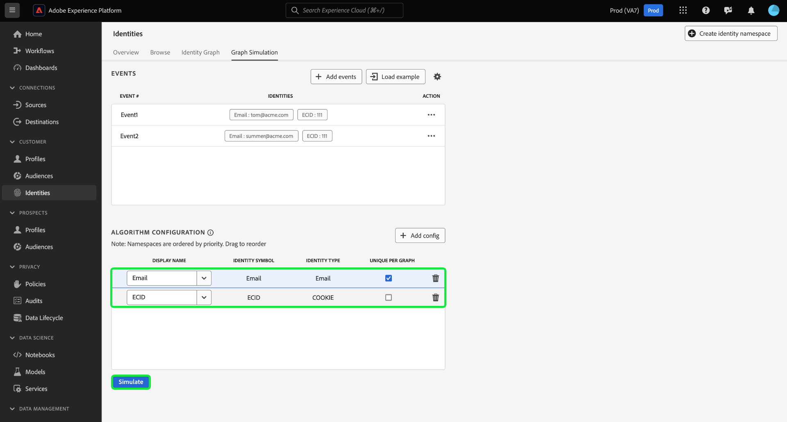

# [!DNL Graph Simulation] UI-hulplijn {#graph-simulation}

>[!CONTEXTUALHELP]
>id="platform_identities_graphsimulation"
>title="Grafieksimulatie"
>abstract="Simuleer grafieken om te begrijpen hoe Identiteitsdienst identiteiten verbindt, en hoe het algoritme van de identiteitsoptimalisering werkt."

>[!AVAILABILITY]
>
>* Identiteitsgrafiek die regels verbindt is momenteel in Beperkte Beschikbaarheid. Neem contact op met uw Adobe-accountteam voor informatie over hoe u toegang kunt krijgen tot de functie in ontwikkelingssandboxen.
>
>* Uw rekening moet met de **toestemming van de Grafiek van de Identiteit van de Mening** worden provisioned om tot het [!DNL Graph Simulation] hulpmiddel toegang te hebben. Voor meer informatie, lees de [ gids op toestemmingen in op attributen-gebaseerde toegangscontrole ](../../access-control/abac/ui/permissions.md).

[!DNL Graph Simulation] is een hulpmiddel in de Dienst UI van de Identiteit die u kunt gebruiken om te simuleren hoe een identiteitsgrafiek zich op een bepaalde combinatie van identiteiten gedraagt en hoe u het [ algoritme van de identiteitsoptimalisering ](./identity-optimization-algorithm.md) vormt.

Bekijk de volgende video voor aanvullende informatie over het gebruik van de interface [!DNL Graph Simulation] in de gebruikersinterface van de identiteitsservice:

>[!VIDEO](https://video.tv.adobe.com/v/3444032/?learn=on&enablevpops)

Lees dit document om te leren hoe u [!DNL Graph Simulation] kunt gebruiken om het gedrag van identiteitsgrafieken en hoe het grafiekalgoritme werkt beter te begrijpen.

## Krijg kennis van de [!DNL Graph Simulation] interface {#interface}

U kunt [!DNL Graph Simulation] openen in de gebruikersinterface van Adobe Experience Platform. Selecteer **[!UICONTROL Identities]** in de linkernavigatie en selecteer vervolgens **[!UICONTROL Graph Simulation]** in de bovenste koptekst.

De interface van [!DNL Graph Simulation] kan in drie secties worden verdeeld:

>[!BEGINTABS]

>[!TAB Gebeurtenissen]

Gebeurtenissen: gebruik het deelvenster **[!UICONTROL Events]** om identiteiten toe te voegen om een grafiek te simuleren. Een volledig gekwalificeerde identiteit moet een naamruimte voor de identiteit en de bijbehorende identiteitswaarde hebben. U moet ten minste twee identiteiten toevoegen om een grafiek te simuleren. U kunt ook **[!UICONTROL Load Example]** selecteren om een vooraf geconfigureerde gebeurtenis en algoritme-instelling in te voeren.

>[!TAB  configuratie van het Algoritme ]

Algoritmconfiguratie: gebruik het deelvenster **[!UICONTROL Algorithm configuration]** om het optimalisatiealgoritme voor uw naamruimten toe te voegen en te configureren. U kunt een naamruimte slepen en neerzetten om de respectievelijke prioriteitsvolgorde te wijzigen. U kunt ook **[!UICONTROL Unique Per Graph]** selecteren om te bepalen of een naamruimte uniek is.

>[!TAB  Gesimuleerde grafiekkijker ]

Gesimuleerde grafiekviewer: de gesimuleerde grafiekviewer geeft de resulterende grafiek weer op basis van de gebeurtenissen die u hebt toegevoegd en het algoritme dat u hebt geconfigureerd. Een rechte lijn tussen twee identiteiten betekent dat er een koppeling tot stand wordt gebracht. Een stippellijn geeft aan dat een koppeling is verwijderd.

>[!ENDTABS]

## Gebeurtenissen toevoegen {#add-events}

Selecteer eerst **[!UICONTROL Add events]** .

Er wordt een pop-upvenster weergegeven voor [!UICONTROL Event #1] . Voer van hieruit de naamruimte en de combinatie van identiteitswaarden in. U kunt het vervolgkeuzemenu gebruiken om een naamruimte voor identiteit te selecteren. U kunt ook in de eerste paar letters van een naamruimte typen en vervolgens de opties selecteren die in het vervolgkeuzemenu zijn opgegeven. Nadat u de naamruimte hebt geselecteerd, geeft u een identiteitswaarde op die overeenkomt met de naamruimte.

>[!TIP]
>
>De identiteitswaarde die u invoert tijdens [!DNL Graph Simulation] -oefeningen hoeven geen echte identiteitswaarden te zijn en kunnen eenvoudige plaatsaanduidingen zijn.

Zodra uw eerste identiteit volledig is, selecteer toevoegen pictogram (**`+`**) om een tweede identiteit toe te voegen.

Herhaal vervolgens dezelfde stappen en voeg een tweede identiteit toe. Twee volledig gekwalificeerde identiteiten zijn vereist om een identiteitsgrafiek te produceren. In het onderstaande voorbeeld wordt een ECID toegevoegd als een naamruimte en krijgt deze de waarde `111` . Selecteer **[!UICONTROL Save]** als u klaar bent.

De interface van [!UICONTROL Events] wordt bijgewerkt om uw eerste gebeurtenis weer te geven, in dit geval: `{Email: tom@acme.com, ECID: 111}` .

Herhaal vervolgens dezelfde stappen om een tweede gebeurtenis toe te voegen. Voeg bij Gebeurtenis nr. 2 `{Email: summer@acme.com}` toe als uw eerste identiteit en voeg vervolgens hetzelfde `{ECID: 111}` toe als de tweede identiteit, zodat een tweede gebeurtenis van: `{Email: summer@acme.com}, {ECID: 111}` wordt gemaakt. Als u klaar bent, hebt u twee gebeurtenissen nodig: een voor `{Email: tom@acme.com, ECID: 111}` en een voor `{Email: summer@acme.com}, {ECID: 111}` .

### Voorbeeld laden {#load-example}

Selecteer **[!UICONTROL Load example]** om een voorbeeldgrafiek met een vooraf ingestelde algoritme en gebeurtenisconfiguratie op te zetten.

Er verschijnt een pop-upvenster met beschikbare grafiekscenario&#39;s waaruit u kunt kiezen:

| Voorbeeldgrafiek | Beschrijving | Voorbeeld |
| --- | --- | --- |
| Gedeeld apparaat | Het gedeelde apparaat verwijst naar scenario&#39;s waar twee verschillende gebruikers login aan het zelfde enige apparaat. | Een man en vrouw delen een iPad voor internetsurfen en e-commerce. |
| Ongeldige (niet-unieke) telefoon | Ongeldige of niet-unieke telefoon verwijst naar scenario&#39;s waar twee verschillende gebruikers het zelfde telefoonaantal gebruiken om een rekening tot stand te brengen. | Een moeder en haar dochter gebruiken hun gedeelde huistelefoonnummer om zich aan te melden voor e-commerceaccounts. |
| Ongeldige identiteitswaarden | De &quot;slechte&quot;identiteitswaarden verwijzen naar scenario&#39;s waar de Dienst van de Identiteit niet-unieke IDFAs wegens onjuiste implementatie produceert. | WebSDK verzendt ten onrechte een `user_null` -waarde voor elke gebeurtenis vanwege problemen met de implementatie van code. |

Selecteer een van de opties om [!DNL Graph Simulation] te laden met vooraf geconfigureerde gebeurtenissen en algoritme. U kunt nog verdere configuraties aan om het even welke vooraf geladen voorbeelden van grafiekscenario&#39;s maken.

Selecteer **[!UICONTROL Simulate]** als u klaar bent.

### Tekstversie gebruiken {#use-text-version}

U kunt de tekstmodus ook gebruiken om gebeurtenissen te configureren. Als u de tekstmodus wilt gebruiken, selecteert u het instellingspictogram en selecteert u vervolgens **[!UICONTROL Text (Advanced users)]** .

U kunt uw identiteiten handmatig invoeren in de tekstmodus. Gebruik een dubbele punt (`:`) om de identiteitswaarde te onderscheiden die met namespace beantwoordt die u invoert, en dan een komma (`,`) gebruikt om uw identiteiten te scheiden. Als u verschillende gebeurtenissen van elkaar wilt onderscheiden, gebruikt u een nieuwe regel voor elke gebeurtenis.

### Gebeurtenis Edit {#edit-event}

Als u een gebeurtenis wilt bewerken, selecteert u de ovalen (`...`) naast een bepaalde gebeurtenis en selecteert u vervolgens **[!UICONTROL Edit]** .

### Gebeurtenis delete {#delete-event}

Als u een gebeurtenis wilt verwijderen, selecteert u de ovalen (`...`) naast een bepaalde gebeurtenis en selecteert u vervolgens **[!UICONTROL Delete]** .

## Algoritme configureren {#configure-algorithm}

>[!IMPORTANT]
>
>Het algoritme dat u vormt bepaalt hoe de Dienst van de Identiteit de namespaces behandelt die u in uw gebeurtenissen invoerde. Configuratie die u in de [!DNL Graph Simulation UI] samenstelt, wordt niet opgeslagen in identiteitsinstellingen.

Nadat u de gebeurtenissen hebt toegevoegd, kunt u nu het algoritme configureren dat wordt gebruikt om de grafiek te simuleren. Selecteer eerst **[!UICONTROL Add config]** .

Er wordt een lege configuratieregel weergegeven. Voer eerst dezelfde naamruimte in als u hebt gebruikt voor uw gebeurtenissen. In dit geval voert u eerst e-mail in. Nadat u de naamruimte hebt ingevoerd, worden de kolommen voor [!UICONTROL Identity Symbol] en [!UICONTROL Identity Type] automatisch ingevuld.

Herhaal vervolgens dezelfde stappen en voeg uw tweede naamruimte toe, in dit geval de ECID. Zodra al uw namespaces zijn ingegaan, kunt u beginnen hun prioriteiten en uniciteit te vormen.

* **prioriteit Namespace**: De prioriteit van een namespace bepaalt zijn relatieve belang vergeleken met andere namespaces in een bepaalde identiteitsgrafiek. Als uw identiteitsgrafiek bijvoorbeeld vier verschillende naamruimten heeft: CRMID, ECID, Email en Apple IDFA, kunt u prioriteiten configureren om een volgorde van belang voor de vier naamruimten te bepalen.
* **Unieke namespace**: Als een namespace als uniek wordt aangewezen, dan zal de Dienst van de Identiteit grafieken met het geheim produceren dat slechts één identiteit met bepaalde unieke namespace kan bestaan. Als de naamruimte E-mail bijvoorbeeld is aangewezen als een unieke naamruimte, kan een grafiek slechts één identiteit hebben met e-mail. Als er meer dan één identiteit is met de naamruimte E-mail, wordt de oudste koppeling verwijderd.

Om namespace prioriteit te vormen, selecteer en sleep de namespace rijen aan de prioritaire orde die u wilt, met de hoogste rij die hogere prioriteit vertegenwoordigt en de onderste rij die lagere prioriteit vertegenwoordigt. Als u een naamruimte als uniek wilt aanmerken, schakelt u het selectievakje **[!UICONTROL Unique Per Graph]** in.

Selecteer **[!UICONTROL Simulate]** als u klaar bent.

## Gesimuleerde grafiek weergeven

In de sectie [!UICONTROL Simulated Graph] worden de gemaakte identiteitsgrafiek(en) weergegeven op basis van de gebeurtenissen die u hebt toegevoegd en het algoritme dat u hebt geconfigureerd.

| Grafiekpictogrammen | Beschrijving |
| --- | --- |
| Effen lijn | Een solide lijn vormt een vaststaand verband tussen twee identiteiten. |
| Stippellijn | Een stippellijn vertegenwoordigt een verwijderde koppeling tussen twee identiteiten. |
| Aantal op regel | Een getal op een regel geeft de tijdstempel aan van wanneer die bepaalde koppeling is gegenereerd. Het laagste getal (1) geeft de oudste ingestelde koppeling aan. |

In de onderstaande voorbeeldgrafiek bestaat een stippellijn tussen `{Email: tom@acme.com}` en `{ECID: 111}` vanwege de volgende redenen:

* De e-mail is als uniek aangewezen tijdens de stap van de algoritmeconfiguratie. Daarom kan er slechts één identiteit met een naamruimte E-mail in een grafiek bestaan.
* De koppeling tussen `{Email: tom@acme.com}` en `{ECID: 111}` was de eerste bestaande identiteit (gebeurtenis nr. 1). Het is de oudste schakel en wordt daarom verwijderd.

## Volgende stappen

Door dit document te lezen, weet u nu hoe u het gereedschap [!DNL Graph Simulation] kunt gebruiken om beter te begrijpen hoe uw identiteitsgegevens worden behandeld op basis van een bepaalde set regels en configuraties. Lees de volgende documenten voor meer informatie:

* [Overzicht van regels voor identiteitsgrafiek](./overview.md)
* [Algoritme voor identiteitsoptimalisatie](./identity-optimization-algorithm.md)
* [Implementatiehandleiding](./implementation-guide.md)
* [Problemen oplossen en veelgestelde vragen](./troubleshooting.md)
* [Voorbeelden van grafiekconfiguraties](./example-configurations.md)
* [Prioriteit naamruimte](./namespace-priority.md)
* [Gebruikersinterface voor identiteitsinstellingen](./identity-settings-ui.md)
