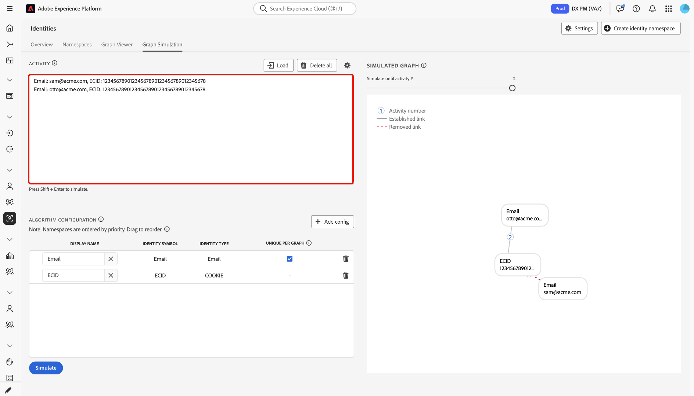

# [!DNL Graph Simulation] UI-hulplijn {#graph-simulation}

>[!CONTEXTUALHELP]
>id="platform_identities_graphsimulation"
>title="Grafieksimulatie"
>abstract="Simuleer grafieken om te begrijpen hoe de Dienst van de Identiteit identiteiten verbindt, en hoe het Algoritme van de Optimalisering van de Identiteit werkt."

[!DNL Graph Simulation] is een hulpmiddel in de Dienst UI van de Identiteit die u kunt gebruiken om te simuleren hoe een identiteitsgrafiek zich gedraagt gebaseerd op de identiteiten u verstrekt en hoe u het [ Algorithm van de Optimalisering van de Identiteit ](./identity-optimization-algorithm.md) vormt.

Gebruik deze optie om het grafiekgedrag veilig te testen voordat u [!DNL Identity Graph Linking Rules] toepast op productiegegevens. Door voorbeeldgebeurtenissen te bepalen en het Algoritme van de Optimalisering van de Identiteit te vormen, met inbegrip van namespace prioriteiten en &quot;uniek per grafiek&quot;montages, kunt u zien of de identiteiten in één grafiek samenvoegen of afzonderlijk blijven, dan uw configuratie aanpassen zoals nodig. Gebruik deze mogelijkheid om:

* Voorkomen dat de grafiek samenvalt (bijvoorbeeld wanneer meerdere personen een apparaat of een telefoonnummer delen)
* Prioriteiten voor naamruimte afstemmen (bijvoorbeeld of E-MAIL of CRM_ID dominant moet zijn)
* Bepaal hoe de lage kwaliteit of hergebruikte herkenningstekens het stitching in uw milieu zouden kunnen beïnvloeden.

U kunt configuratieveranderingen ook herhalen en identiteitskwesties zuiveren die in stroomafwaartse toepassingen verschijnen. Als de publieksgrootten of samengevoegde profielen er bijvoorbeeld niet goed uitzien, kunt u de relevante gebeurtenissen in [!DNL Graph Simulation] opnieuw samenstellen om te zien hoe de grafiek er in de huidige regels uitziet en veiliger alternatieven proberen.

De ingebouwde voorbeeldscenario&#39;s helpen u identiteitsgedrag en grafiek-ineenstorting risico aan belanghebbenden verklaren en steun binnen voor gegevenskwaliteit en identiteitsbeheer.

## De interface [!DNL Graph Simulation]

Als u [!DNL Graph Simulation] wilt openen, navigeert u naar de werkruimte Identiteitsservice in de Adobe Experience Platform-gebruikersinterface en selecteert u **[!UICONTROL Graph Simulation]** .

De interface is ingedeeld in drie hoofdsecties:

>[!BEGINTABS]

>[!TAB  Activiteit ]

Gebruik het deelvenster **[!UICONTROL Activity]** om identiteiten toe te voegen om een grafiek te simuleren. Elke identiteit heeft een naamruimte en een waarde nodig. U moet minstens twee identiteiten toevoegen om een simulatie in werking te stellen. U kunt ook **[!UICONTROL Load]** selecteren om een vooraf geconfigureerde gebeurtenis en algoritme-instelling te importeren of om een bestaande grafiek te openen.

>[!TAB  configuratie van het Algoritme ]

Gebruik het deelvenster **[!UICONTROL Algorithm configuration]** om het optimalisatiealgoritme voor uw naamruimten toe te voegen en te configureren. Sleep naamruimte-rijen en zet deze neer om de prioriteitsvolgorde te wijzigen. U kunt ook **[!UICONTROL Unique Per Graph]** selecteren om aan te geven of een naamruimte uniek moet zijn in de grafiek.

>[!TAB  Gesimuleerde grafiek ]

Gebruik de weergave van **[!UICONTROL Simulated graph]** om de grafiek te bekijken die is gemaakt op basis van uw activiteiten en algoritme-instellingen. Een effen lijn tussen twee identiteiten betekent dat de koppeling behouden blijft; een stippellijn betekent dat het algoritme die koppeling heeft verwijderd.

>[!ENDTABS]

## [!DNL Graph Simulation] workflow

### Activiteiten toevoegen

Selecteer **[!UICONTROL Add Activity]** om identiteitsgrafieken te simuleren.

Wanneer het pop-upvenster voor [!UICONTROL Activity #1] wordt weergegeven, kiest u een naamruimte en voert u de waarde ervan in. U kunt een naamruimte kiezen in het vervolgkeuzemenu of een paar letters typen om de lijst te filteren. Nadat u een naamruimte hebt geselecteerd, voert u de overeenkomende identiteitswaarde in.

>[!TIP]
>
>U hoeft geen echte identiteitswaarden te gebruiken wanneer u [!DNL Graph Simulation] gebruikt.

De interface van [!UICONTROL Activity] wordt bijgewerkt om uw eerste activiteit te tonen.

Selecteer nogmaals **[!UICONTROL Add Activity]** en voer een tweede activiteit uit. U hebt minstens twee volledig gekwalificeerde identiteiten (naamruimte plus waarde) nodig om een grafiek te genereren.

### Algoritme configureren

>[!IMPORTANT]
>
>Het algoritme u vormt controleert hoe de Dienst van de Identiteit de namespaces in uw activiteiten behandelt. Er wordt niets in de [!DNL Graph Simulation UI] -instellingen opgeslagen bij Identiteitsinstellingen van Identiteitsservice.

Nadat uw activiteiten op zijn plaats zijn, vorm het algoritme voor de simulatie. Selecteer **[!UICONTROL Add config]**.

Voeg elke naamruimte toe waar het algoritme rekening mee moet houden. Gebruik de vervolgkeuzelijst om te zoeken of typ de eerste paar letters om de lijst te verfijnen.

* **prioriteit Namespace**: U controleert de orde van belang voor elke namespace binnen uw identiteitsgrafiek. Als uw grafiek bijvoorbeeld CRMID, ECID, Email en Apple IDFA gebruikt, kunt u hun prioriteit instellen op weerspiegelen welke als eerste moet worden beschouwd bij het koppelen van identiteiten. De naamruimte boven aan de lijst heeft de hoogste prioriteit.
* **Unieke namespace**: Wanneer een namespace als uniek wordt gemerkt, zorgt de Dienst van de Identiteit ervoor dat slechts één identiteit met die namespace in een grafiek verschijnt. Als E-mail bijvoorbeeld is ingesteld als uniek, bevat elke grafiek slechts één e-mailidentiteit. Als er meerdere identiteiten met dezelfde e-mail aanwezig zijn, wordt de oudste verbinding verwijderd om de uniciteit te behouden.

Sleep naamruimterijen naar de prioriteitsvolgorde: de bovenste rij heeft de hoogste prioriteit en de onderste rij de laagste. Als u een naamruimte als uniek wilt behandelen binnen de grafiek, schakelt u het selectievakje **[!UICONTROL Unique Per Graph]** ervan in.

Wanneer u klaar bent, selecteert u **[!UICONTROL Simulate]** .

### Gesimuleerde grafiek weergeven

In de sectie [!UICONTROL Simulated Graph] worden de grafiek of grafieken weergegeven die zijn gemaakt op basis van uw activiteiten en algoritmeconfiguratie.

| Grafiekpictogrammen | Beschrijving |
| --- | --- |
| Effen lijn | Een solide lijn vormt een vaststaand verband tussen twee identiteiten. |
| Stippellijn | Een stippellijn vertegenwoordigt een verwijderde koppeling tussen twee identiteiten. |
| Aantal op regel | Een getal op een regel geeft aan wanneer die koppeling is gemaakt ten opzichte van de andere koppelingen. Het laagste getal (1) is de oudste koppeling. |

## Extra functies

U kunt activiteiten ook bewerken of verwijderen, activiteiten invoeren in de tekstmodus, een voorbeeldscenario laden of een bestaande grafiek ophalen van de identiteitsservice.

### Activiteit bewerken {#edit-activity}

Als u een activiteit wilt bewerken, selecteert u de ovalen (`...`) naast een bepaalde activiteit en selecteert u vervolgens **[!UICONTROL Edit]** .

### Activiteiten verwijderen {#delete-activity}

Als u een activiteit wilt verwijderen, selecteert u de ovalen (`...`) naast een bepaalde activiteit en selecteert u vervolgens **[!UICONTROL Delete]** .

### Tekstmodus gebruiken {#use-text-mode}

U kunt tekstmodus gebruiken om uw activiteiten te configureren. Als u de tekstmodus wilt gebruiken, selecteert u het instellingspictogram en selecteert u vervolgens **[!UICONTROL Text (Advanced users)]** .

Typ in de tekstmodus elke identiteit als `namespace:value` . Scheid veelvoudige identiteiten in de zelfde gebeurtenis met een komma (`,`). Start een nieuwe regel voor elke gebeurtenis.

### Voorbeeld laden {#load-example}

Selecteer **[!UICONTROL Load example]** om een kant-en-klare grafiek met vooraf ingestelde activiteiten en algoritme-instellingen te laden.

In een dialoogvenster worden de scenario&#39;s weergegeven die u kunt openen:

| Voorbeeldgrafiek | Beschrijving | Voorbeeld |
| --- | --- | --- |
| Gedeeld apparaat | Twee verschillende gebruikers melden zich aan op hetzelfde apparaat. | Een man en vrouw delen een iPad voor bladeren en e-commerce. |
| Ongeldige (niet-unieke) telefoon | Twee verschillende gebruikers registreren zich met het zelfde telefoonaantal. | Een moeder en dochter gebruiken een gedeeld huistelefoonnummer om zich aan te melden voor e-commerceaccounts. |
| Ongeldige identiteitswaarden | Implementatiefouten verzenden dubbele id&#39;s of plaatsaanduidings-id&#39;s (bijvoorbeeld dezelfde IDFA voor veel gebruikers). | Web SDK verzendt een `user_null` -waarde op elke activiteit als gevolg van een codefout. |

Kies een scenario om [!DNL Graph Simulation] te laden met overeenkomende activiteiten en algoritme-instellingen. U kunt het resultaat op dezelfde manier bewerken als elke andere simulatie.

### Bestaande grafiek laden {#load-existing-graph}

U kunt [!DNL Graph Simulation] gebruiken om een bestaande grafiek te laden en zijn activiteiten, algoritmeconfiguratie, en grafiek te bekijken.

Selecteer **[!UICONTROL Load]** en selecteer vervolgens **[!UICONTROL Existing graph]** .

Voer in het dialoogvenster een naamruimte en identiteitswaarde in die horen bij de grafiek die u wilt inspecteren.

Wanneer het laden is voltooid, geeft [!DNL Graph Simulation] de grafiek weer die die identiteit bevat.

>[!TIP]
>
>Nadat u uw montages op het eerste [ scherm van de Montages van de Identiteit ](./identity-settings-ui.md) vormt, kunt u de **laden bestaande grafieken** optie om uw grafiek te simuleren die op die nauwkeurige montages wordt gebaseerd. De simulatie zal de configuratie gebruiken u bepaalde.

## Volgende stappen

Met [!DNL Graph Simulation] kunt u zien hoe Identiteitsservice identiteiten aan verschillende regels koppelt voordat u de productie-instellingen wijzigt. Raadpleeg de volgende documentatie voor meer informatie:

* [[!DNL Identity Graph Linking Rules]-overzicht](./overview.md)
* [Algoritme voor identiteitsoptimalisatie](./identity-optimization-algorithm.md)
* [Implementatiehandleiding](./implementation-guide.md)
* [Problemen oplossen en veelgestelde vragen](./troubleshooting.md)
* [Voorbeelden van grafiekconfiguraties](./example-configurations.md)
* [Prioriteit naamruimte](./namespace-priority.md)
* [Gebruikersinterface voor identiteitsinstellingen](./identity-settings-ui.md)
