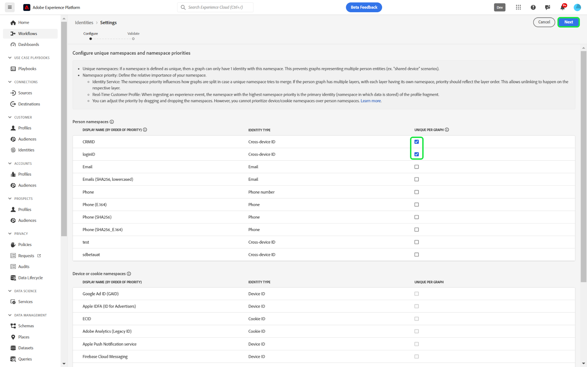
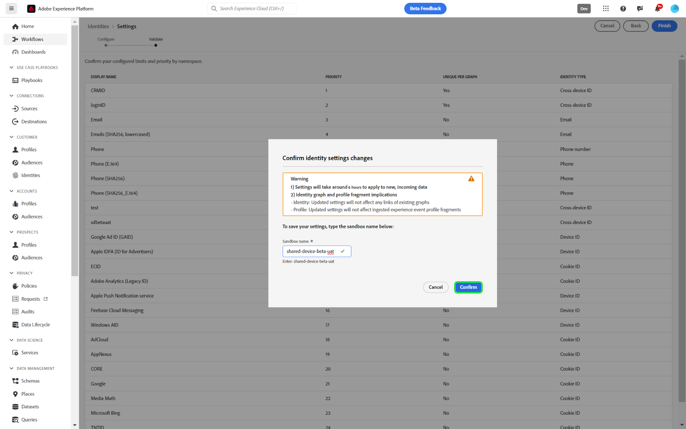

# Gebruikersinterface voor identiteitsinstellingen

>[!AVAILABILITY]
>
>Deze functie is nog niet beschikbaar. Het bètaprogramma voor koppelingsregels voor identiteitsgrafieken zal naar verwachting in juli van start gaan voor ontwikkelingssandboxen. Neem contact op met het accountteam van de Adobe voor meer informatie over de deelnemingscriteria.

Identiteitsinstellingen zijn een functie in de gebruikersinterface van de Adobe Experience Platform Identity Service die u kunt gebruiken om unieke naamruimten aan te wijzen en naamruimteprioriteit te configureren.

Lees deze gids om te leren hoe te om uw identiteitsmontages in UI te vormen.

## Vereisten

Lees de volgende documenten voordat u begint te werken met identiteitsinstellingen:

* [Configuratie-hulplijn voor identiteitsgrafiek met koppelingsregels](./configuration.md)
* [Algoritme voor identiteitsoptimalisatie](./identity-optimization-algorithm.md)
* [Prioriteit naamruimte](./namespace-priority.md)
* [Grafieksimulatie](./graph-simulation.md)

## Uw identiteitsinstellingen configureren

Als u identiteitsinstellingen wilt openen, navigeert u naar de werkruimte Identiteitsservice in de gebruikersinterface van Adobe Experience Platform en selecteert u **[!UICONTROL Settings]** .

De pagina met identiteitsinstellingen bestaat uit twee gedeelten: [!UICONTROL Person namespaces] en [!UICONTROL Device or cookie namespaces] . Personnaamruimten zijn id&#39;s voor afzonderlijke personen. Dit kunnen apparaat-id&#39;s, e-mailadressen en telefoonnummers zijn. Apparaat- of cookie-naamruimten zijn id&#39;s voor apparaten en webbrowsers en kunnen geen hogere prioriteit krijgen dan naamruimten van personen. U kunt een apparaat- of cookie-naamruimte ook niet toewijzen als een unieke naamruimte.

### Naamruimteprioriteit configureren

Om namespace prioriteit te vormen, selecteer een namespace in het menu van identiteitsinstellingen en sleep dan en laat vallen die namespace aan de orde van uw houden. Plaats een naamruimte hoger in de lijst om deze een hogere prioriteit te geven en plaats een naamruimte lager in de lijst om deze een lagere prioriteit te geven. De naamruimte met de hoogste prioriteit moet ook als een unieke naamruimte worden opgegeven.

### Geef uw unieke naamruimte op

Als u een unieke naamruimte wilt toewijzen, schakelt u het selectievakje [!UICONTROL Unique per graph] in dat overeenkomt met die naamruimte. U kunt meer dan één unieke naamruimte selecteren voor de configuratie van uw identiteitsinstellingen.

Wanneer uw unieke naamruimten zijn ingesteld, kunnen grafieken niet langer meerdere identiteiten hebben die een unieke naamruimte bevatten. Als u bijvoorbeeld CRM-id hebt aangewezen als een unieke naamruimte, kan een grafiek slechts één identiteit hebben met de naamruimte CRM-id. Voor meer informatie, lees het [ overzicht van het algoritme van de identiteitsoptimalisering ](./identity-optimization-algorithm.md#unique-namespace).

Wanneer u klaar bent met uw configuraties, selecteert u **[!UICONTROL Next]** . Er wordt een bevestigingsbericht weergegeven. Gebruik deze gelegenheid om te controleren of uw configuraties correct zijn en selecteer vervolgens **[!UICONTROL Finish]** .

Er wordt een waarschuwing weergegeven dat uw nieuwe instellingen geen gevolgen hebben voor bestaande koppelingen in een identiteitsgrafiek en dat er gebeurtenisprofielfragmenten optreden die al zijn opgenomen. Bovendien, wordt u meegedeeld dat het tot zes uren zal duren voor uw nieuwe montages in het systeem worden weerspiegeld. Voer de naam van de sandbox in en selecteer vervolgens **[!UICONTROL Confirm]** om dit te bevestigen.

## Volgende stappen

U hebt nu de naamruimteprioriteiten geconfigureerd en uw unieke naamruimten toegewezen met behulp van de gebruikersinterface voor identiteitsinstellingen. Voor meer informatie, lees de [ identiteitsgrafiek die regels verbindt overzicht ](./overview.md).