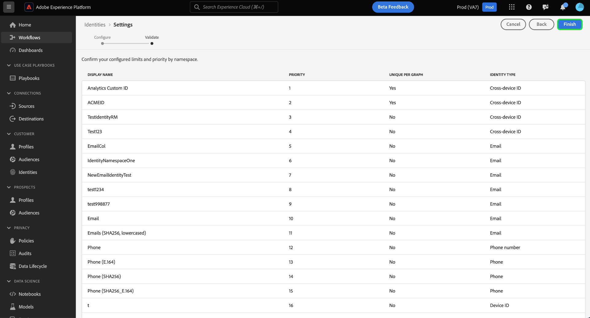

# Gebruikersinterface voor identiteitsinstellingen

>[!AVAILABILITY]
>
>Deze functie is nog niet beschikbaar. Het bètaprogramma voor koppelingsregels voor identiteitsgrafieken zal naar verwachting in juli van start gaan voor ontwikkelingssandboxen. Neem contact op met het accountteam van de Adobe voor meer informatie over de deelnemingscriteria.

Identiteitsinstellingen zijn een functie in de gebruikersinterface van de Adobe Experience Platform Identity Service die u kunt gebruiken om unieke naamruimten aan te wijzen en naamruimteprioriteit te configureren.

Lees deze handleiding voor meer informatie over het gebruik van het gereedschap Identiteitsinstellingen.

## Voorwaarde

Lees de volgende documenten voordat u begint te werken met identiteitsinstellingen:

* [Algoritme voor identiteitsoptimalisatie](./identity-optimization-algorithm.md)
* [Prioriteit naamruimte](./namespace-priority.md)
* [Grafieksimulatie](./graph-simulation.md)

## Uw identiteitsinstellingen configureren

Als u identiteitsinstellingen wilt openen, navigeert u naar de werkruimte Identiteitsservice in de gebruikersinterface van Adobe Experience Platform en selecteert u **[!UICONTROL Settings]**.

De pagina met identiteitsinstellingen wordt weergegeven en u wordt begroet met een bevestigingsbericht om u eraan te herinneren uw identiteitsinstellingen in een ontwikkelingssandbox eerst te testen en te valideren voordat u de configuraties in een productiesandbox voltooit.

De pagina met identiteitsinstellingen bestaat uit twee gedeelten: [!UICONTROL Person namespaces] en [!UICONTROL Device or cookie namespaces]. Personnaamruimten zijn id&#39;s voor afzonderlijke personen. Dit kunnen apparaat-id&#39;s, e-mailadressen en telefoonnummers zijn. Apparaat- of cookie-naamruimten zijn id&#39;s voor apparaten en webbrowsers en kunnen geen hogere prioriteit krijgen dan naamruimten van personen. U kunt een apparaat- of cookie-naamruimte ook niet toewijzen als een unieke naamruimte.

### Geef uw unieke naamruimte op

Als u een unieke naamruimte wilt toewijzen, selecteert u de optie [!UICONTROL Unique per graph] selectievakje dat overeenkomt met die naamruimte. U kunt meer dan één unieke naamruimte selecteren voor de configuratie van uw identiteitsinstellingen.

Wanneer uw unieke naamruimten zijn ingesteld, kunnen grafieken niet langer meerdere identiteiten hebben die een unieke naamruimte bevatten. Als u bijvoorbeeld Aangepaste id voor Analytics hebt aangewezen als een unieke naamruimte, kan een grafiek slechts één identiteit hebben met de naamruimte Aangepaste id voor Analytics. Lees voor meer informatie de [Overzicht van algoritme voor identiteitsoptimalisatie](./identity-optimization-algorithm.md#unique-namespace).

### Naamruimteprioriteit configureren

Om namespace prioriteit te vormen, selecteer een namespace in het menu van identiteitsinstellingen en sleep dan en laat vallen die namespace aan de orde van uw houden. Plaats een naamruimte hoger in de lijst om deze een hogere prioriteit te geven en plaats een naamruimte lager in de lijst om deze een lagere prioriteit te geven. De naamruimte met de hoogste prioriteit moet ook als een unieke naamruimte worden opgegeven.

Wanneer u klaar bent met uw configuraties, selecteert u **[!UICONTROL Next]**. Er wordt een bevestigingsbericht weergegeven. Gebruik deze gelegenheid om te controleren of uw configuraties correct zijn en selecteer vervolgens **[!UICONTROL Finish]**.

Er wordt een waarschuwing weergegeven dat uw nieuwe instellingen geen gevolgen hebben voor bestaande koppelingen in een identiteitsgrafiek en dat er gebeurtenisprofielfragmenten optreden die al zijn opgenomen. Voer uw naam van de sandbox in en selecteer **[!UICONTROL Confirm]**.

