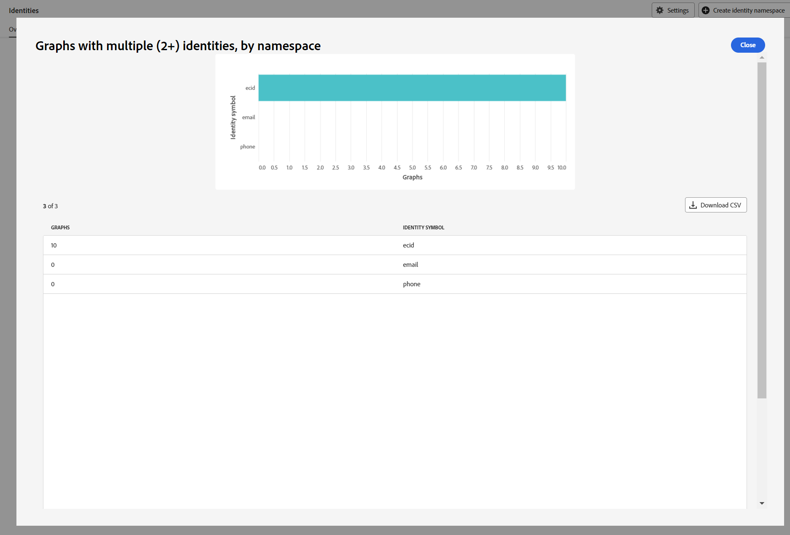

# Implementatiehandleiding voor [!DNL Identity Graph Linking Rules]

>[!IMPORTANT]
>
>In dit document wordt ervan uitgegaan dat u de implementatie start in een nieuwe sandbox zonder gegevens.

Lees dit document voor een stapsgewijze uitleg die u kunt volgen bij het implementeren van uw gegevens met Adobe Experience Platform Identity Service.

Stapsgewijze omtrek:

1. [Volledige voorwaarden voor implementatie](#prerequisites-for-implementation)
2. [De benodigde naamruimten maken](#namespace)
3. [Gebruik het hulpmiddel van de grafieksimulatie om zich met het Algoritme van de Optimalisering van de Identiteit vertrouwd te maken](#graph-simulation)
4. [Gebruik de interface voor identiteitsinstellingen om uw unieke naamruimten aan te wijzen en prioriteitscijfers voor uw naamruimten te configureren](#identity-settings)
5. [Een XDM-schema (Experience Data Model) maken](#schema)
6. [Een gegevensset maken](#dataset)
7. [Gegevens aan Experience Platform toevoegen](#ingest)

## Vereisten voor de implementatie {#prerequisites-for-implementation}

In deze sectie worden de vereiste stappen beschreven die u moet uitvoeren voordat u [!DNL Identity Graph Linking Rules] aan uw gegevens kunt implementeren.

### Unieke naamruimte

#### Naamruimtevereiste voor één persoon {#single-person-namespace-requirement}

U moet ervoor zorgen dat de unieke naamruimte met de hoogste prioriteit altijd aanwezig is in elk bekend profiel. Hierdoor kan de identiteitsdienst de juiste persoon-id in een bepaalde grafiek detecteren.

+++Selecteren om een voorbeeld weer te geven van een grafiek zonder naamruimte voor één persoon

Zonder een unieke naamruimte die uw persoon-id vertegenwoordigt, kunt u eindigen met een grafiek die een koppeling bevat naar verschillende personen-id&#39;s voor dezelfde ECID. In dit voorbeeld zijn zowel B2BCRM als B2CCRM tegelijkertijd gekoppeld aan dezelfde ECID. Deze grafiek suggereert dat Tom, met zijn B2C-aanmeldingsaccount, een apparaat deelde met Summer, met haar B2B-aanmeldingsaccount. Het systeem herkent echter dat dit één profiel is (grafiek samenvouwen).

{zoomable="yes"}

+++

+++Selecteren om een voorbeeld weer te geven van een grafiek met naamruimte voor één persoon-id

Op basis van een unieke naamruimte (in dit geval een CRMID in plaats van twee verschillende naamruimten) kan de identiteitsdienst de persoon-id zien die het laatst aan de ECID is gekoppeld. In dit voorbeeld, omdat een unieke CRMID bestaat, kan de Dienst van de Identiteit een &quot;gedeeld apparaat&quot;scenario erkennen, waar twee entiteiten het zelfde apparaat delen.

{zoomable="yes"}

+++

### Prioriteitsconfiguratie naamruimte

Als u [&#x200B; Adobe Analytics bronschakelaar &#x200B;](../../sources/tutorials/ui/create/adobe-applications/analytics.md) gebruikt om gegevens in te voeren, dan moet u uw ECIDs een hogere prioriteit geven dan identiteitskaart van Adobe Analytics (HULP) omdat de Dienst van de Identiteit HULP blokkeert. Door ECID een prioriteit te geven, kunt u Real-Time Klantprofiel de opdracht geven om niet-geverifieerde gebeurtenissen op te slaan naar ECID in plaats van naar HULP.

### XDM Experience-gebeurtenissen {#xdm-experience-events}

>[!CONTEXTUALHELP]
>id="platform_identities_linkingrules_xdm"
>title="Zorg ervoor dat u één persoon-id hebt"
>abstract="Tijdens uw pre-implementatieproces, moet u ervoor zorgen dat de voor authentiek verklaarde gebeurtenissen die uw systeem naar Experience Platform zal verzenden altijd a **enige** persoonsidentificatie, zoals een CRMID bevatten."

Tijdens uw pre-implementatieproces, moet u ervoor zorgen dat de voor authentiek verklaarde gebeurtenissen die uw systeem naar Experience Platform zal verzenden altijd a **enige** persoonsidentificatie, zoals een CRMID bevatten.

* (Aanbevolen) Voor authentiek verklaarde gebeurtenissen met één uniek persoonsidentificatie.
* (Niet geadviseerd) Voor authentiek verklaarde gebeurtenissen met twee unieke persoonsidentificatiecodes. Als u meer dan één unieke persoon-id hebt, kan het zijn dat u een ongewenste grafiekinstorting tegenkomt.
* (Niet geadviseerd) Voor authentiek verklaarde gebeurtenissen zonder enige unieke persoonsidentificatiecodes. Als u geen unieke persoon-id hebt, worden zowel niet-geverifieerde als geverifieerde gebeurtenissen opgeslagen op basis van de ECID.

>[!BEGINTABS]

>[!TAB  Voor authentiek verklaarde gebeurtenissen met één persoonsidentificatie ]

```json
{
  "_id": "test_id",
  "identityMap": {
      "ECID": [
          {
              "id": "62486695051193343923965772747993477018",
              "primary": false
          }
      ],
      "CRMID": [
          {
              "id": "John",
              "primary": true
          }
      ]
  },
  "timestamp": "2024-09-24T15:02:32+00:00",
  "web": {
      "webPageDetails": {
          "URL": "https://business.adobe.com/",
          "name": "Adobe Business"
      }
  }
}
```

>[!TAB  Voor authentiek verklaarde gebeurtenissen met twee persoonherkenningstekens ]

Als uw systeem twee persoonsidentificators verzendt, kan de implementatie de single-person namespace vereiste ontbreken. Bijvoorbeeld, als identityMap in uw webSDK implementatie CRMID, een customerID, en een ECID namespace bevat, dan is er geen garantie dat elke enige gebeurtenis zowel CRMID als customerID zal bevatten.

U zou **niet** een nuttige lading als hieronder moeten verzenden:

```json
{
  "_id": "test_id",
  "identityMap": {
      "ECID": [
          {
              "id": "62486695051193343923965772747993477018",
              "primary": false
          }
      ],
      "CRMID": [
          {
              "id": "John",
              "primary": true
          }
      ],
      "customerID": [
          {
            "id": "Jane",
            "primary": false
          }
      ],
  },
  "timestamp": "2024-09-24T15:02:32+00:00",
  "web": {
      "webPageDetails": {
          "URL": "https://business.adobe.com/",
          "name": "Adobe Business"
      }
  }
}
```

Het is echter belangrijk om op te merken dat u twee personen-id&#39;s kunt verzenden, maar er is geen garantie dat een ongewenste grafiekinstorting wordt voorkomen als gevolg van implementatiefouten of gegevensfouten. Overweeg het volgende scenario:

* `timestamp1` = John Log in -> system capture `CRMID: John, ECID: 111` . `customerID: John` is echter niet aanwezig in deze gebeurtenislading.
* `timestamp2` = Jane login -> systeem vangt `customerID: Jane, ECID: 111`. `CRMID: Jane` is echter niet aanwezig in deze gebeurtenislading.

Daarom is het aan te raden slechts één persoon-id met uw geverifieerde gebeurtenissen te verzenden.

In grafieksimulatie kan deze opname er als volgt uitzien:

{zoomable="yes"}

>[!TAB  Voor authentiek verklaarde gebeurtenissen zonder enige persoonherkenningstekens ]

In dit voorbeeld kunt u ervan uitgaan dat de volgende gebeurtenis naar Experience Platform is verzonden terwijl John (de eindgebruiker) tijdens de verificatie door uw website bladert. Hoewel Experience Platform wel geautoriseerd is, kan het John niet identificeren vanwege het gebrek aan persoonsidentificatoren in de gebeurtenis. Daarom wordt deze gebeurtenis geïnterpreteerd als een anonieme gebruiker die door de Adobe Business-website bladert, in plaats van deze te herkennen als een onlineactiviteit die specifiek aan John is gekoppeld.

```json
{
    "_id": "test_id",
    "identityMap": {
        "ECID": [
            {
                "id": "62486695051193343923965772747993477018",
                "primary": false
            }
        ]
    },
    "timestamp": "2024-09-24T15:02:32+00:00",
    "web": {
        "webPageDetails": {
            "URL": "https://business.adobe.com/",
            "name": "Adobe Business"
        }
    }
}
```

>[!ENDTABS]

## Machtigingen instellen {#set-permissions}

De eerste stap in het implementatieproces voor Identity Service is ervoor te zorgen dat uw Experience Platform-account wordt toegevoegd aan een rol die is voorzien van de vereiste machtigingen. Uw beheerder kan machtigingen voor uw account configureren door naar de gebruikersinterface voor machtigingen in Adobe Experience Cloud te navigeren. Van daar, moet uw rekening aan een rol met de volgende toestemmingen worden toegevoegd:

* [!UICONTROL View Identity Settings]: pas deze machtiging toe om unieke naamruimten en naamruimtenprioriteit weer te geven in de pagina Bladeren naar naamruimte voor identiteiten.
* [!UICONTROL Edit Identity Settings]: pas deze machtiging toe om uw identiteitsinstellingen te kunnen bewerken en opslaan.

Voor meer informatie over toestemmingen, lees de [&#x200B; gids van toestemmingen &#x200B;](../../access-control/abac/ui/permissions.md).

## Uw naamruimten maken {#namespace}

Als dit voor uw gegevens nodig is, moet u eerst de juiste naamruimten voor uw organisatie maken. Voor stappen op hoe te om tot een douane te leiden namespace, lees de gids bij [&#x200B; creërend een douanespatie in UI &#x200B;](../features/namespaces.md#create-custom-namespaces).

## Het gereedschap Grafieksimulatie gebruiken {#graph-simulation}

Daarna, navigeer aan het [&#x200B; hulpmiddel van de grafieksimulatie &#x200B;](./graph-simulation.md) in de werkruimte UI van de Dienst van de Identiteit. U kunt het hulpmiddel van de grafieksimulatie gebruiken om identiteitsgrafieken te simuleren, die met een verscheidenheid van verschillende unieke namespace en namespace prioritaire configuraties worden gebouwd.

Door verschillende configuraties te creëren, kunt u het hulpmiddel van de grafieksimulatie gebruiken om te leren en beter te begrijpen hoe het Algoritme van de Optimalisering van de Identiteit en bepaalde configuraties kunnen beïnvloeden hoe uw grafiek zich gedraagt.

## Identiteitsinstellingen configureren {#identity-settings}

Zodra u een beter idee van hebt hoe u uw grafiek wilt gedragen, navigeer aan de [&#x200B; montages UI van de Identiteit &#x200B;](./identity-settings-ui.md) in de werkruimte UI van de Dienst van de Identiteit. Als u de gebruikersinterface voor identiteitsinstellingen wilt openen, selecteert u **[!UICONTROL Identities]** in de navigatie links en selecteert u **[!UICONTROL Settings]** .

{zoomable="yes"}

Gebruik de interface voor identiteitsinstellingen om uw unieke naamruimten aan te wijzen en uw naamruimten op volgorde van prioriteit te configureren.

>[!IMPORTANT]
>
>Zodra u met het toepassen van uw montages wordt gebeëindigd, moet u minstens 24 uren wachten alvorens u aan ingeste gegevens kunt te werk gaan, aangezien het minstens 24 uren voor nieuwe montages vergt om in de Dienst van de Identiteit worden weerspiegeld.

Voor meer informatie, lees de [&#x200B; gids UI van de identiteitsmontages &#x200B;](./identity-settings-ui.md).

## Een XDM-schema maken {#schema}

Wanneer uw unieke naamruimten en naamruimteprioriteiten zijn ingesteld, kunt u nu doorgaan naar de vereiste instelling om uw gegevens in te voeren. Eerst moet u een XDM-schema maken. Afhankelijk van uw gegevens moet u mogelijk een schema maken voor zowel XDM Individual Profile als XDM ExperienceEvent.

Om gegevens in het Profiel van de Klant in real time in te voeren, moet u ervoor zorgen dat uw schema minstens één gebied bevat dat als primaire identiteit is aangewezen. Door een primaire identiteit in te stellen, kunt u een bepaald schema inschakelen voor profielopname.

Voor instructies op hoe te om een schema tot stand te brengen, lees de gids bij [&#x200B; creërend een schema XDM in UI &#x200B;](../../xdm/tutorials/create-schema-ui.md).

## Een gegevensset maken {#dataset}

Daarna, creeer een dataset om een structuur voor de gegevens te verstrekken die u gaat opnemen. Een dataset is een opslag en beheersconstructie voor een inzameling van gegevens, typisch een lijst, die een schema (kolommen) en gebieden (rijen) bevat. Datasets werken in combinatie met schema&#39;s en om gegevens in te voeren in het Real-Time Klantprofiel, moet uw gegevensset zijn ingeschakeld voor het opnemen van profielen. Opdat uw dataset voor Profiel wordt toegelaten, moet het een schema van verwijzingen voorzien dat voor de opname van het Profiel wordt toegelaten.

Voor instructies op hoe te om een dataset tot stand te brengen, lees de [&#x200B; gids UI van de dataset &#x200B;](../../catalog/datasets/user-guide.md).

## Gegevens verzamelen {#ingest}

Op dit punt, zou u het volgende moeten hebben:

* De noodzakelijke toestemmingen om tot de eigenschappen van de Dienst van de Identiteit toegang te hebben.
* Naamruimten voor uw gegevens.
* Aangewezen unieke naamruimten en geconfigureerde prioriteiten voor uw naamruimten.
* Minstens één XDM-schema. (Afhankelijk van uw gegevens en het specifieke gebruiksgeval, kunt u zowel profiel als ervaringsschema&#39;s moeten tot stand brengen.)
* Een dataset die van uw schema gebaseerd is.

Als je alle hierboven vermelde objecten hebt, kun je je gegevens aan Experience Platform doorgeven. U kunt gegevensinvoer op verschillende manieren uitvoeren. U kunt de volgende services gebruiken om uw gegevens over te brengen naar Experience Platform:

* [&#x200B; Partij en het stromen opname &#x200B;](../../ingestion/home.md)
* [Gegevensverzameling in Experience Platform](../../collection/home.md)
* [Experience Platform-bronnen](../../sources/home.md)

>[!TIP]
>
>Als uw gegevens eenmaal zijn ingevoerd, verandert de XDM Raw-gegevenslading niet meer. U kunt uw primaire identiteitsconfiguraties in UI nog zien. Deze configuraties worden echter overschreven door identiteitsinstellingen.

Gebruik voor alle feedback de optie **[!UICONTROL Beta feedback]** in de gebruikersinterface van de identiteitsservice.

## Grafieken valideren {#validate}

Gebruik het identiteitsdashboard voor inzicht in de staat van uw identiteitsgrafieken, zoals uw algemene identiteitstelling en tendensen van het grafiekaantal, identiteitstelling door namespace, en grafiektelling door grafiekgrootte. U kunt het identiteitsdashboard ook gebruiken om trends weer te geven op grafieken met twee of meer identiteiten, ingedeeld in naamruimte.

Selecteer de ellipsen (`...`) en selecteer vervolgens **[!UICONTROL View more]** voor meer informatie en om te controleren of er geen samengevouwen grafieken zijn.

{zoomable="yes"}

Gebruik het venster dat verschijnt om informatie over uw samengevouwen grafieken te bekijken. In dit voorbeeld zijn zowel e-mail als telefoon gemarkeerd als unieke naamruimte. Er zijn daarom geen samengevouwen grafieken in uw sandbox.

{zoomable="yes"}

## Bijlage {#appendix}

Lees deze sectie voor extra informatie die u kunt verwijzen wanneer het uitvoeren van uw identiteitsmontages en unieke namespaces.

### LoginID-scenario van Dangling {#dangling-loginid-scenario}

De volgende grafiek simuleert een &quot;gevaarlijk&quot;loginID scenario. In dit voorbeeld zijn twee verschillende loginID&#39;s gebonden aan dezelfde ECID. `{loginID: ID_C}` is echter niet gekoppeld aan de CRMID. Daarom is er geen manier voor de Dienst van de Identiteit om te ontdekken dat deze twee loginIDs twee verschillende entiteiten vertegenwoordigen.

>[!BEGINTABS]

>[!TAB  Ambiguous loginID ]

In dit voorbeeld blijft `{loginID: ID_C}` gevaarlijk en is het niet gekoppeld aan een CRMID. Aldus, wordt de persoonentiteit waaraan deze loginID zou moeten worden geassocieerd dubbelzinnig verlaten.

{zoomable="yes"}

>[!TAB  loginID is verbonden met een CRMID ]

In dit voorbeeld is `{loginID: ID_C}` gekoppeld aan `{CRMID: Tom}` . Daarom kan het systeem vaststellen dat deze loginID aan Tom is gekoppeld.

{zoomable="yes"}

>[!TAB  loginID is verbonden met een andere CRMID ]

In dit voorbeeld is `{loginID: ID_C}` gekoppeld aan `{CRMID: Summer}` . Daarom kan het systeem opmerken dat deze loginID met een andere persoonentiteit, in dit geval, Summer wordt geassocieerd.

In dit voorbeeld wordt ook getoond dat Tom en Summer verschillende persoonentiteiten moeten hebben die een apparaat delen, dat wordt vertegenwoordigd door `{ECID: 111}` .

{zoomable="yes"}

>[!ENDTABS]

## Volgende stappen

Lees de volgende documentatie voor meer informatie over [!DNL Identity Graph Linking Rules] :

* [[!DNL Identity Graph Linking Rules]-overzicht](./overview.md)
* [Algoritme voor identiteitsoptimalisatie](./identity-optimization-algorithm.md)
* [Voorbeelden van grafiekconfiguraties](./example-configurations.md)
* [Problemen oplossen en veelgestelde vragen](./troubleshooting.md)
* [Prioriteit naamruimte](./namespace-priority.md)
* [UI voor grafieksimulatie](./graph-simulation.md)
* [Gebruikersinterface voor identiteitsinstellingen](./identity-settings-ui.md)
