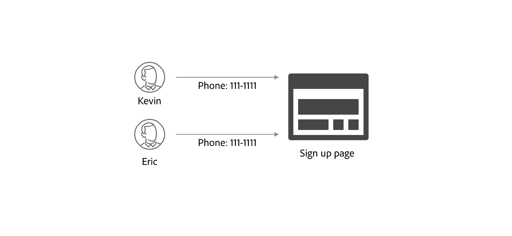

# Overzicht van regels voor identiteitsgrafiek

>[!AVAILABILITY]
>
>Identiteitsgrafiek die regels verbindt is momenteel in Beperkte Beschikbaarheid. Neem contact op met het accountteam van de Adobe voor informatie over de toegang tot de functie in ontwikkelsandboxen.

Met Adobe Experience Platform Identity Service en Real-Time Customer Profile is het eenvoudig om aan te nemen dat uw gegevens perfect zijn opgenomen en dat alle samengevoegde profielen één persoon vertegenwoordigen via een personenteken, zoals een CRMID. Er zijn echter scenario&#39;s waarin bepaalde gegevens kunnen proberen meerdere verschillende profielen samen te voegen tot één profiel (grafiek samenvouwen). Om deze ongewenste samenvoegingen te verhinderen, kunt u configuraties gebruiken die door identiteitsgrafiek worden verstrekt die regels verbindt en voor nauwkeurige verpersoonlijking voor uw gebruikers toestaan.

## Aan de slag

De volgende documenten zijn essentieel voor het begrijpen van identiteitsgrafiek die regels met elkaar verbindt.

* [Algoritme voor identiteitsoptimalisatie](./identity-optimization-algorithm.md)
* [Implementatiehandleiding](./implementation-guide.md)
* [Voorbeelden van grafiekconfiguraties](./example-configurations.md)
* [Problemen oplossen en veelgestelde vragen](./troubleshooting.md)
* [Prioriteit naamruimte](./namespace-priority.md)
* [UI voor grafieksimulatie](./graph-simulation.md)
* [Gebruikersinterface voor identiteitsinstellingen](./identity-settings-ui.md)

## Voorbeeldscenario&#39;s waarbij een grafiek kan samenvouwen {#example-scenarios-where-graph-collapse-could-happen}

Deze sectie schetst voorbeeldscenario&#39;s die u kunt overwegen wanneer het vormen van identiteitsgrafiek die regels verbindt.

### Gedeeld apparaat {#shared-device}

>[!CONTEXTUALHELP]
>id="platform_identities_graphcollapsescenarios"
>title="Grafiek vouwscenario&#39;s"
>abstract="Er zijn meerdere redenen waarom grafieken kunnen &#39;samenvouwen&#39; of meerdere personen-entiteiten kunnen vertegenwoordigen."
>additional-url="https://experienceleague.adobe.com/en/docs/experience-platform/identity/features/identity-graph-linking-rules/overview" text="Meer informatie"

Er zijn gevallen waarin meerdere aanmeldingen op één apparaat kunnen plaatsvinden:

| Gedeeld apparaat | Beschrijving |
| --- | --- |
| Familiecomputers en -tablets | Echtgenoot en echtgenote melden zich beide aan bij hun bankrekening. |
| Openbare kiosk | Reizigers op een luchthaven melden zich aan met hun loyaliteitsidentiteitskaart om zakken in te checken en instapkaarten af te drukken. |
| Bellen | Het personeel van het centrum van de vraag login op één enkel apparaat namens klanten die klantensteun roepen om kwesties op te lossen. |

In deze gevallen, vanuit grafiekstandpunt, zonder toegelaten grenzen, zal één enkele ECID met veelvoudige CRMIDs worden verbonden.

Met de regels voor identiteitsgrafieken kunt u:

* Vorm identiteitskaart die voor login als uniek herkenningsteken wordt gebruikt. U kunt bijvoorbeeld een grafiek beperken tot het opslaan van slechts één identiteit met een CRMID-naamruimte en zo die CRMID definiëren als de unieke id van een gedeeld apparaat.
   * Op deze manier kunt u ervoor zorgen dat CRMID&#39;s niet worden samengevoegd met de ECID.

### Ongeldige scenario&#39;s voor e-mail/telefoon

Er zijn ook instanties van gebruikers die valse waarden als telefoonaantallen en/of e-mailadressen verstrekken wanneer het registreren. In deze gevallen, als de grenzen niet worden toegelaten, dan zal telefoon/e-mail verwante identiteiten uiteindelijk worden verbonden met veelvoudige verschillende CRMIDs.

Met de regels voor identiteitsgrafieken kunt u:

* Configureer de CRMID, het telefoonnummer of het e-mailadres als de unieke id en beperkt zo één persoon tot slechts één CRMID, telefoonnummer en/of e-mailadres dat aan zijn account is gekoppeld.

### Onjuiste of onjuiste identiteitswaarden

Er zijn gevallen waarin niet-unieke, onjuiste identiteitswaarden in het systeem worden opgenomen, ongeacht de naamruimte. Voorbeelden zijn:

* IDFA-naamruimte met de identiteitswaarde &quot;user_null&quot;.
   * IDFA-identiteitswaarden moeten uit 36 tekens bestaan: 32 alfanumerieke tekens en vier afbreekstreepjes.
* Naamruimte voor telefoonnummers met de identiteitswaarde &quot;not-specified&quot;.
   * Telefoonnummers mogen geen alfabet bevatten.

Deze identiteiten zouden in de volgende grafieken kunnen resulteren, waar veelvoudige CRMIDs samen met de &quot;slechte&quot;identiteit worden samengevoegd:

Met identiteitsgrafiek die regels verbindt kunt u CRMID als unieke herkenningsteken vormen om ongewenste profiel te verhinderen die als gevolg van dit type gegevens ineenstorten.

## Koppelingsregels voor identiteitsgrafiek {#identity-graph-linking-rules}

Met de regels voor identiteitsgrafiek kunt u:

* Maak één identiteitsgrafiek/samengevoegd profiel voor elke gebruiker door unieke naamruimten te configureren, waardoor twee verschillende personen-id&#39;s niet in één identiteitsgrafiek kunnen worden samengevoegd.
* Online geverifieerde gebeurtenissen aan de persoon koppelen door prioriteiten te configureren

### Terminologie {#terminology}

| Terminologie | Beschrijving |
| --- | --- |
| Unieke naamruimte | Een unieke naamruimte is een naamruimte voor identiteiten die is ingesteld op scheiding binnen de context van een identiteitsgrafiek. U kunt een naamruimte zo configureren dat deze uniek is met behulp van de gebruikersinterface. Zodra een naamruimte als uniek is gedefinieerd, kan een grafiek slechts één identiteit hebben die die naamruimte bevat. |
| Prioriteit naamruimte | De prioriteit Namespace verwijst naar het relatieve belang van namespaces in vergelijking met elkaar. De prioriteit van Namespace is configureerbaar door UI. U kunt naamruimten in een bepaalde identiteitsgrafiek rangschikken. Zodra toegelaten, zal de namenprioriteit in diverse scenario&#39;s, zoals input voor het algoritme van de identiteitsoptimalisering en het bepalen van primaire identiteit voor de fragmenten van de ervaringsgebeurtenis worden gebruikt. |
| Algoritme voor identiteitsoptimalisatie | Het algoritme van de identiteitsoptimalisering zorgt ervoor dat de richtlijnen door unieke namespace en namespaceprioriteiten worden gecreeerd in een bepaalde identiteitsgrafiek worden afgedwongen. |

### Unieke naamruimte {#unique-namespace}

U kunt een naamruimte zo configureren dat deze uniek is met behulp van de gebruikersinterface voor identiteitsinstellingen. Hiermee wordt het algoritme voor identiteitsoptimalisatie aangegeven dat een bepaalde grafiek slechts één identiteit mag hebben die die unieke naamruimte bevat. Zo voorkomt u dat twee verschillende personen-id&#39;s in dezelfde grafiek worden samengevoegd.

Overweeg het volgende scenario:

* Scott gebruikt een tablet en opent zijn browser van Google Chrome om naar acme .com te gaan, waar hij binnen ondertekent en voor nieuwe basketbalschoenen doorbladert.
   * In dit scenario worden achter de schermen de volgende identiteiten geregistreerd:
      * Een ECID-naamruimte en -waarde die het gebruik van de browser vertegenwoordigen
      * Een CRMID-naamruimte en -waarde die de geverifieerde gebruiker vertegenwoordigen (Scott is aangemeld met zijn combinatie van gebruikersnaam en wachtwoord).
* Zijn zoon Peter gebruikt dan hetzelfde tablet en gebruikt ook Google Chrome om naar acme .com te gaan, waar hij zich aanmeldt voor zijn eigen rekening om naar voetbalapparatuur te zoeken.
   * In dit scenario worden achter de schermen de volgende identiteiten geregistreerd:
      * Dezelfde ECID-naamruimte en -waarde die de browser vertegenwoordigen.
      * Een nieuwe CRMID-naamruimte en -waarde die de geverifieerde gebruiker vertegenwoordigen.

Als CRMID als unieke namespace werd gevormd, dan verdeelt het algoritme van de identiteitsoptimalisering CRMIDs afzonderlijk in twee afzonderlijke identiteitsgrafieken, in plaats van hen samen te voegen.

Als u geen unieke naamruimte configureert, kan het gebeuren dat er ongewenste grafieksamenvoegingen plaatsvinden, zoals twee identiteiten met dezelfde CRMID-naamruimte, maar verschillende identiteitswaarden (scenario&#39;s zoals deze vertegenwoordigen vaak twee verschillende persoonentiteiten in dezelfde grafiek).

U moet een unieke naamruimte configureren om het algoritme voor identiteitsoptimalisatie te informeren en beperkingen in te stellen op de identiteitsgegevens die in een bepaalde identiteitsgrafiek worden opgenomen.

### Prioriteit naamruimte {#namespace-priority}

De prioriteit Namespace verwijst naar het relatieve belang van namespaces in vergelijking met elkaar. De prioriteit Namespace is configureerbaar door UI en u kunt namespaces in een bepaalde identiteitsgrafiek rangschikken.

Één manier waarin namespace prioriteit wordt gebruikt is in het bepalen van de primaire identiteit van de fragmenten van de ervaringsgebeurtenis (gebruikersgedrag) in het Profiel van de Klant in real time. Als prioritaire montages worden gevormd, dan zal het primaire identiteitsplaatsen op Web SDK niet meer worden gebruikt om te bepalen welke profielfragmenten worden opgeslagen.

Unieke naamruimten en naamruimteprioriteiten kunnen beide worden geconfigureerd in de gebruikersinterface voor identiteitsinstellingen. De effecten van hun configuraties zijn echter anders:

| | Identiteitsservice | Realtime-klantenprofiel |
| --- | --- | --- |
| Unieke naamruimte | In de Dienst van de Identiteit, verwijst het algoritme van de identiteitsoptimalisering naar unieke namespaces om de identiteitsgegevens te bepalen die aan een bepaalde identiteitsgrafiek worden opgenomen. | Unieke naamruimten zijn niet van invloed op het realtime klantprofiel. |
| Prioriteit naamruimte | In de Dienst van de Identiteit, voor grafieken die veelvoudige lagen hebben, zal namespace prioriteit bepalen dat de aangewezen verbindingen worden verwijderd. | Wanneer een ervaringsgebeurtenis in Profiel wordt opgenomen, wordt namespace met de hoogste prioriteit de primaire identiteit van het profielfragment. |

* De prioriteit Namespace heeft geen invloed op het grafiekgedrag wanneer de limiet van 50 identiteiten per grafiek wordt bereikt.
* **de prioriteit van Namespace is een numerieke waarde** die aan namespace wordt toegewezen die op zijn relatieve belang wijst. Dit is een eigenschap van een naamruimte.
* **Primaire identiteit is de identiteit waarin een profielfragment tegen** wordt opgeslagen. Een profielfragment is een record met gegevens waarin informatie over een bepaalde gebruiker wordt opgeslagen: kenmerken (gewoonlijk opgenomen via CRM-records) of gebeurtenissen (gewoonlijk opgenomen via ervaringsgebeurtenissen of online gegevens).
* De prioriteit Namespace bepaalt de primaire identiteit voor de fragmenten van de ervaringsgebeurtenis.
   * Voor profielverslagen, kunt u de schemawerkruimte in de UI van het Experience Platform gebruiken om identiteitsgebieden, met inbegrip van de primaire identiteit te bepalen. Lees de gids op [ bepalend identiteitsgebieden in UI ](../../xdm/ui/fields/identity.md) voor meer informatie.
* Als een ervaringsgebeurtenis twee of meer identiteiten van de hoogste namespace prioriteit in identityMap heeft, zal het van opname worden verworpen omdat het als &quot;slechte gegevens&quot;zal worden beschouwd. Als identityMap bijvoorbeeld `{ECID: 111, CRMID: John, CRMID: Jane}` bevat, wordt de gehele gebeurtenis als ongeldige gegevens afgewezen, omdat dit betekent dat de gebeurtenis tegelijkertijd aan zowel `CRMID: John` als `CRMID: Jane` wordt gekoppeld.

Voor meer informatie, lees de gids over [ namespace prioriteit ](./namespace-priority.md).

## Volgende stappen

Lees de volgende documentatie voor meer informatie over koppelingsregels voor identiteitsgrafieken:

* [Algoritme voor identiteitsoptimalisatie](./identity-optimization-algorithm.md)
* [Implementatiehandleiding](./implementation-guide.md)
* [Voorbeelden van grafiekconfiguraties](./example-configurations.md)
* [Problemen oplossen en veelgestelde vragen](./troubleshooting.md)
* [Prioriteit naamruimte](./namespace-priority.md)
* [UI voor grafieksimulatie](./graph-simulation.md)
* [Gebruikersinterface voor identiteitsinstellingen](./identity-settings-ui.md)